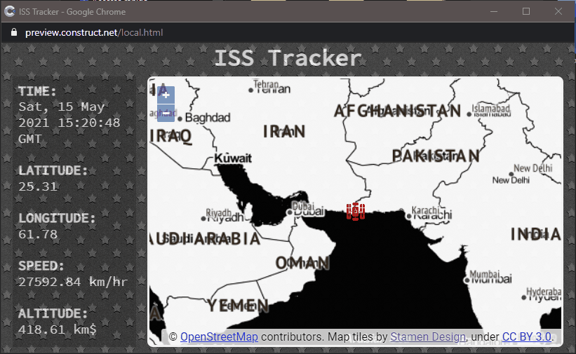

During this week I started experimenting with [Svelte](https://svelte.dev/), a JavaScript compiler. I will most likely use it very often in the future. At the moment, however, I am only at the beginning, and I still have to understand a few things. I would like to use Electron, TypeScript, Svelte and Construct 3 together. But it is still early, at the moment they are still being studied. So I turn to the project of the week, an application to show the position of the International Space Station (ISS) in real time:



The idea is not mine (also because there are various implementations of this project). But I have to thank [etowner](https://etowner.itch.io/), the input came from him. In short, it is a map on which to show the position of the Space Station in real time. Since the station is in orbit, and because its speed relative to the earth is high, the station icon will noticeably move.

I've already talked about how to [integrate maps into Construct 3](https://www.patreon.com/posts/maps-in-3-49027372), I won't repeat myself. But I want to point out the system I used to get the location of the station on how I put the icon on the map.

```js
export default async function findISS() {
	const issAPI = await fetch("https://api.wheretheiss.at/v1/satellites/25544");
	const data = await issAPI.json();
	
	const lat = data.latitude.toFixed(2);
	const long = data.longitude.toFixed(2);
	const timestamp = new Date(data.timestamp * 1000).toUTCString();
  const speed = data.velocity.toFixed(2);
  const altitude = data.altitude.toFixed(2);
	
	const result = { lat, long, timestamp, speed, altitude };
	return result;
}
```

I used the [**Fetch API**](https://developer.mozilla.org/en-US/docs/Web/API/Fetch_API/Using_Fetch) to request the location of the ISS. After obtaining the result I extracted the data that interest me (position, speed, distance from the ground) and the time of detection of the position. Having the location you can add a layer to the map. On GitHub you can see the [createMap.js file](https://github.com/el3um4s/construct-demo/blob/master/mini-template/006-iss-tracker/source/files/scripts/createmap.js), here I report only the part I'm talking about.

```js
const issPosition = await findISS();
const { lat, long } = issPosition;
		
Globals.iss = new ol.geom.Point(ol.proj.fromLonLat([long, lat]))
	
const feature = new ol.Feature({geometry: Globals.iss})

const vectorSource = new ol.source.Vector({
	features: [feature]
});

const vectorLayer = new ol.layer.Vector({
  source: vectorSource,
});

Globals.map = new ol.Map({
  target: id,
  layers: [
    new ol.layer.Tile({	
      source: new ol.source.OSM()
    }),
    vectorLayer
  ],
  view: new ol.View({
        center: ol.proj.fromLonLat([long, lat]),
        zoom: 1
      })
});
```

Basically I create a point on the map and use it as a base to create a layer to overlap the OpenStreetMap tiles. I saved the reference to the map and point in a global variable (in the [globals.js file](https://github.com/el3um4s/construct-demo/blob/master/mini-template/006-iss-tracker/source/files/scripts/globals.js)) so that you can change the location of the point and the center of the map later.

But having a point is not enough, I also had to add a style to be able to visualize the station graphically. To do this, I imported an image (png, 64x64) into the project to use as a marker. After that I got the URL of the image itself with the function:

```js
const iconURL = await g_runtime.assets.getProjectFileUrl(iconName);
```

Now I have everything I need to assign a custom style to the point on the map:

```js
feature.setStyle(
  new ol.style.Style({
    image: new ol.style.Icon({
      color: 'rgba(250, 0, 0, 0.9)',
      crossOrigin: 'anonymous',
      src: iconURL,
      scale: 0.4
    })
  })
)
```

I just have to create a map where to show the position of the space station:

```js
await createMap("mapid");
```

But the position remains fixed, I am interested in updating it in real time. To do this I need a new function:

```js
async function updateISSposition() {
	const issPosition = await findISS();
	const { lat, long } = issPosition;
	
  Globals.iss.setCoordinates(ol.proj.fromLonLat([long, lat]));

	const view = Globals.map.getView();
	view.setCenter(ol.proj.fromLonLat([long, lat]));
}
```

With `setCoordinates()` I move the point on the map and with `setCenter()` I make sure that the map is always centered on the space station. Finally i use `setInterval()` to update the ISS position every 2 seconds.

```js
setInterval(updateISSposition, 2000);
```

That's all, for the moment. I uploaded the complete file to GitHub, you can download it and see the original code.

- [the project on GitHub](https://github.com/el3um4s/construct-demo)
- [the online demo](https://c3demo.stranianelli.com/mini-template/006-iss-tracker/demo/)
- [Patreon](https://www.patreon.com/el3um4s)