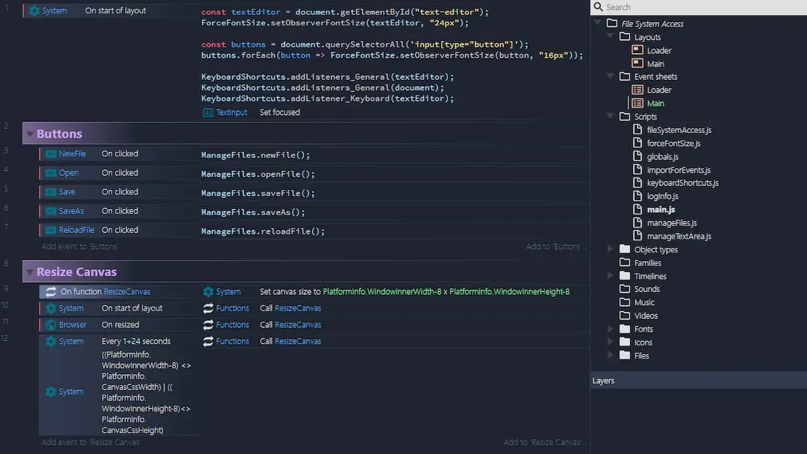

This week I played with the `File System Access API`: this feature allow you to create web apps that can interact with files on the user's local device. After a user grants a web app access, this API allows them to read or save changes directly to files and folders on the user's device.

I want to reproduce with Construct 3 a text editor with similar functionality to the one developed by the [Google Chrome Labs](https://github.com/GoogleChromeLabs) ([text editor](https://googlechromelabs.github.io/text-editor/)). I also followed this guide: _[The File System Access API: simplifying access to local files](https://web.dev/file-system-access/)_.

Of course I also shared the whole thing on GitHub:

- [the project](https://github.com/el3um4s/construct-demo)
- [the online demo](https://c3demo.stranianelli.com/javascript/008-text-editor/demo/)

In the next days I will publish this article also on [Patreon](https://www.patreon.com/el3um4s).

Let's start:



For now, I leave out some "marginal" aspects to using the `File System Access API` and focus on two modules: [`manageFiles.js`](https://github.com/el3um4s/construct-demo/blob/master/javascript/008-text-editor/source/files/scripts/managefiles.js) and [`fileSystemAccess.js`](https://github.com/el3um4s/construct-demo/blob/master/javascript/008-text-editor/source/files/scripts/filesystemaccess.js). In the last you can find some functions:

- openFile
- write
- saveAs
- saveFile
- loadFromFile
- getNewFileHandle

### openFile

```js
export async function openFile({
  description = "Text Files",
  accept = { "text/plain": [".txt", ".md"] },
} = {}) {
  const options = { types: [{ description, accept }] };
  try {
    [Globals.fileHandle] = await window.showOpenFilePicker(options);
    const filePicked = await Globals.fileHandle.getFile();
    const contents = await filePicked.text();
    return { ok: true, filePicked: filePicked, contents: contents };
  } catch (err) {
    return { ok: false, filePicked: null, contents: null };
  }
}
```

For simplicity, I leave out the explanation of error handling. The entry point is [`window.showOpenFilePicker()`](https://wicg.github.io/file-system-access/#api-showopenfilepicker). When called, it shows a file picker dialog box, and prompts the user to select a file. After they select a file, the API returns an array of file handles. An optional parameter lets you influence the behavior of the file picker, for example, by allowing the user to select multiple files, or directories, or different file types. Without any option specified, the file picker allows the user to select a single file.

```js
[Globals.fileHandle] = await window.showOpenFilePicker(options);
```

I assign an array of [`FileSystemFileHandle`](https://wicg.github.io/file-system-access/#filesystemfilehandle) to `Globals.fileHandle`. In this case it's a one-element array that contains the properties and methods needed to interact with the file.

Note: I haven't implemented yet a method to keep track of all open files, but only one. However, doing so would allow you to implement a list of _recent files_ to use as a shortcut to open the latest files you worked on.

Now from the handle you can access the [`file`](https://w3c.github.io/FileAPI/) itself via

```js
const filePicked = await Globals.fileHandle.getFile();
```

and then you can read its contents.

```js
const contents = await filePicked.text();
```
### write

```js
export async function write(contents) {
  try {
    const writable = await Globals.fileHandle.createWritable();
    await writable.write(contents);
    await writable.close();
    return { ok: true };
  } catch (err) {
    return { ok: false };
  }
}
```

The second function, `write`, allows you to save text changes directly to the file. To do this you use the [`FileSystemWritableFileStream`](https://wicg.github.io/file-system-access/#api-filesystemwritablefilestream) interface. Then you can create the stream by calling

```js
const writable = await Globals.fileHandle.createWritable();
```

Now you can write the contents of the file to the stream.

```js
await writable.write(contents);
```

At the end you can close the file and write the contents to disk: `await writable.close()`.

**Caution**: Changes are not written to disk until the stream is closed.

### saveAs

```js
export async function saveAs(
  contents,
  {
    description = "Text Files",
    accept = { "text/plain": [".txt", ".md"] },
  } = {}
) {
  const handle = await getNewFileHandle({ description, accept });
  if (handle.ok) {
    Globals.fileHandle = handle.handle;
    try {
      const writable = write(contents);
      return { ok: writable.ok };
    } catch (err) {
      return { ok: false };
    }
  } else {
    return { ok: false };
  }
}
```

Everything is simpler from now on. _saveAs_ uses `getNewFileHandle()` to get the name and location to save the file to. Then you can call `write()` to... write the file.

### saveFile

```js
export async function saveFile(
  contents,
  {
    description = "Text Files",
    accept = { "text/plain": [".txt", ".md"] },
  } = {}
) {
  if (Globals.fileHandle == null) {
    await saveAs(contents, { description, accept });
  } else {
    await write(contents);
  }
}
```

`saveFile` is even simpler. If you are editing a file it's call `write`. If you are working on a new file, it's call `saveAs`.

### loadFromFile

```js
export async function loadFromFile() {
  try {
    const filePicked = await Globals.fileHandle.getFile();
    const contents = await filePicked.text();
    return { ok: true, filePicked: filePicked, contents: contents };
  } catch (err) {
    return { ok: false, filePicked: null, contents: null };
  }
}
```

Finally `loadFromFile` reloads the file to the state prior to the last save.

With this I completed the basic structure. However, there is no simple way to integrate all this with our editor. To do this you need a new module: `manageFiles.js`.

### ManageFiles.js

```js
import Globals from "./globals.js";
import * as FileSystemAccess from "./fileSystemAccess.js";

function insertText(text = "") {
  g_runtime.objects.TextInput.getFirstInstance().text = text;
}

function getText() {
  return g_runtime.objects.TextInput.getFirstInstance().text;
}

export function newFile() {
  insertText("");
  Globals.fileHandle = null;
}

export async function openFile() {
  const contents = await FileSystemAccess.openFile();
  if (contents.ok) {
    const text = contents.contents;
    insertText(text);
  }
}

export async function saveFile() {
  const text = getText();
  await FileSystemAccess.saveFile(text);
}

export async function saveAs() {
  const text = getText();
  await FileSystemAccess.saveAs(text);
}

export async function reloadFile() {
  const contents = await FileSystemAccess.loadFromFile();
  if (contents.ok) {
    const text = contents.contents;
    insertText(text);
  }
}
```

I only focus on two functions, `insertText` and `getText`. They both use

```js
g_runtime.objects.TextInput.getFirstInstance().text;
```

This code allows you to access the Construct 3 text box. The first modifies the text contained, the second reads it. This is necessary to allow C3 to correctly display the content of the element.

The following functions do nothing but call those of the `FileSystemAccess` module by connecting them to the actual editor.

That said, it's time for links:

- [the project on github](https://github.com/el3um4s/construct-demo)
- [the online demo](https://c3demo.stranianelli.com/javascript/007-youtube/demo/)
- [my Patreon](https://www.patreon.com/el3um4s)
