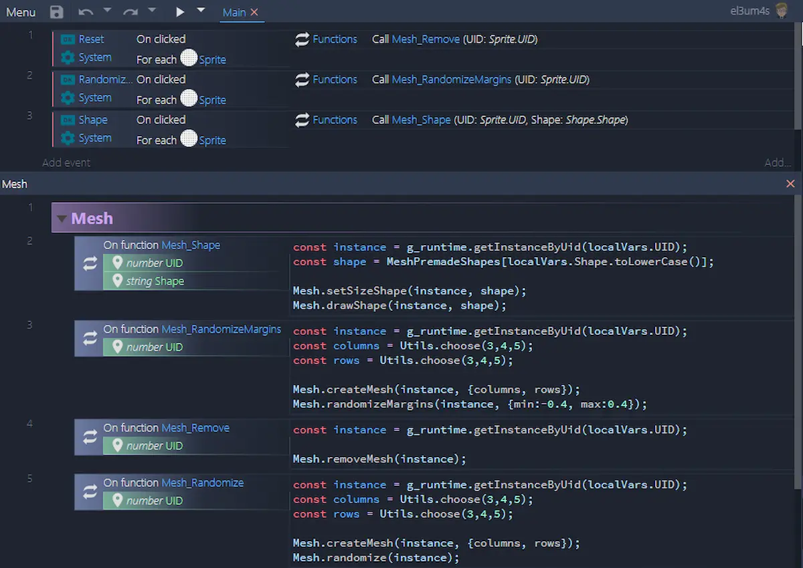
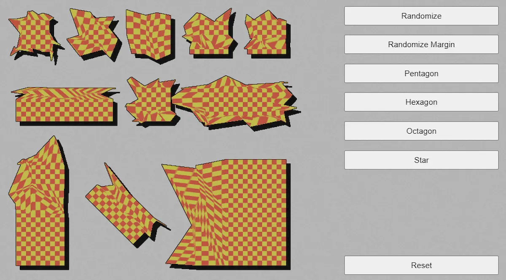

I waited for the release of Construct 3 beta [r235](https://www.construct.net/en/make-games/releases/beta/r235)) before publishing this post. I needed the `IWorldInstance.getMeshSize()` function to be able to randomly change the shape of objects in C3. _Mesh Distorsion_ and JavaScript allow you to get nice effects with just a few lines of code:



To create this template I used only one module, [`mesh.js`](https://github.com/el3um4s/construct-demo/blob/master/javascript/009-mesh-and-shapes/source/files/scripts/mesh.js), and a json object, [`MeshPremadeShapes`](https://github.com/el3um4s/construct-demo/blob/master/javascript/009-mesh-and-shapes/source/files/scripts/meshpremadeshapes.js). The template's core are these two functions:

- `setMeshPointAbsolute`
- `drawShape`

```js
function setMeshPointAbsolute(instance,
    { col = 0, row = 0, x = 0.5, y = 0.5} = {})
{ instance.setMeshPoint(col, row, {mode: "absolute", x, y}); }
```

The first alter a point in a mesh. The coordinates _x_ and _y_ are determined in _absolute_ mode, in normalized co-ordinates [0, 1] across the object size. The left up angle is the point (0;0), the right down is (1;1). The object's center is the point (0.5;0.5).

Starting from this function I can write the `drawShape` function

```js
function drawShape(instance, shape) {
	const points = shape.points;
	points.forEach(point => setMeshPointAbsolute(instance, point));
}
```

This function moves each point of the mesh to the position indicated by the shape.  The shape is defined in the [`MeshPremadeShapes`](https://github.com/el3um4s/construct-demo/blob/master/javascript/009-mesh-and-shapes/source/files/scripts/meshpremadeshapes.js) object

```js
pentagon: {
	meshSize: {
		columns: 3,
		rows: 2
	},
	points: [
		{col: 0, row: 0, x: 0.00, y: 0.39},
		{col: 1, row: 0, x: 0.50, y: 0.00},
		{col: 2, row: 0, x: 1.00, y: 0.39},
		{col: 0, row: 1, x: 0.20, y: 1.00},
		{col: 1, row: 1, x: 0.50, y: 1.00},
		{col: 2, row: 1, x: 0.80, y: 1.00},
	]
}

```

It's an object with only two properties: `meshSize` and `points`. The latter contains an array of points in the format `{col, row, x, y}`. Starting from this array, `drawShape` scrolls the various items and places them on the mesh.

Starting from the same object it is possible to use a `setSizeShape` function to automatically generate a mesh in C3.

```js
function setSizeShape(instance, shape){
	const columns = shape.meshSize.columns;
	const rows = shape.meshSize.rows;
	createMesh(instance, { columns, rows });
}
```

### How to create random shapes

To make the template more interesting, I created a function to create random shapes

```js
function randomize(instance, { min = -0.5, max = 0.5 } = {}) {
	const { rows } = getMeshSize(instance);
	for (let row = 0; row < rows; row++){
		randomizeRow(instance, {row, min, max});
	}
}
```

`getMeshSize` allows you to get the mesh size. `randomizeRow` changes the position of individual points randomly

```js
function randomizeRow(instance, {row = 0, min = -0.5, max = 0.5 } = {}) {
	const { columns } = getMeshSize(instance);
	for (let col = 0; col < columns; col++) {
  		const value = getRandomArbitraryXY(min, max);
		setMeshPointRelative(instance, {col, row, ...value});
	}
	return instance;
}
```

I modify the points in _relative_ mode: I think it allows to obtain a harmonic effect.

You can see interesting shapes even modifying only the margins

```js
function randomizeMargins(instance, { min = -0.5, max = 0.5 } = {}){
	const { lastRow, lastColumn } = getMeshSize(instance);
	randomizeRow(instance, {row: 0, min, max});
	randomizeRow(instance, {row: lastRow, min, max});
	randomizeColumn(instance, {col: 0, min, max});
	randomizeColumn(instance, {col: lastColumn, min, max});
}
```

`randomizeMargins` keeps the center of the object fixed but changes its margins.

Finally, you can also use this module to modify the shape of other plugins, such as `TiledBackground` and` Text`.



That said, it's time for links:

- [the project on github](https://github.com/el3um4s/construct-demo)
- [the online demo](https://c3demo.stranianelli.com/javascript/009-mesh-and-shapes/demo/)
- [my Patreon](https://www.patreon.com/el3um4s)
