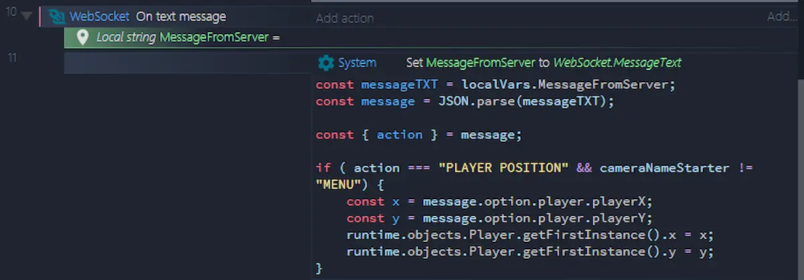

Today a quick thing about my latest experiment: a game on multiple windows. The repository on GitHub is still pretty bare, and the code is really "_spaghetti_". But the test was successful and there are a couple of things to say.


My idea is to create a game in which the player can freely move between the various windows of the application. The windows are classic Windows windows, created via [WebView2](https://blog.stranianelli.com/deno-c3-and-webview/). This could create different game mechanics than usual. Obviously the game engine is Construct 3.

The main problem is getting the various windows to communicate with each other. To achieve this I used [**WebSocket**](https://developer.mozilla.org/en-US/docs/Web/API/WebSocket):

> The WebSocket object provides the API for creating and managing a WebSocket connection to a server, as well as for sending and receiving data on the connection.

I used also a very handy [C3 plugin](https://www.construct.net/en/make-games/manuals/construct-3/plugin-reference/websocket) to simplify the code.




I don't focus on the code itself, I think I'll have to refractor it a little bit. But already in the prototype it is clear what happens:

1. every x seconds C3 sends the player's position to the server
2. the server takes the position and sends it back to the other windows
3. when C3 receives the message it changes the player's position in the various windows

How to create a local server on Windows? There are various methods, my favorite is to use [Deno](https://deno.land/) and the [standard ws library](https://deno.land/std/ws).

The code is quite simple:

```ts
for await (const req of serve(`:8090`)) {
  const { conn, r: bufReader, w: bufWriter, headers } = req;
  const sock: WebSocket = await acceptWebSocket({ conn, bufReader, bufWriter, headers });
  handleWs(sock);
}

async function handleWs(sock: WebSocket): Promise<void> {
...
    for await (const ev of sock) {
      if (typeof ev === "string") {
        const message:SOCKETMessage = convertMessageToObject(ev);
        await chooseAction(message, sock);
      }
    }
...
}

async function chooseAction(message:SOCKETMessage, sock: WebSocket) {
    const { action, target } = message;
...
  if (action === "PLAYER POSITION") {
    if (message?.option?.player) {
      const sendBack = JSON.stringify(message);
      listConnection.forEach( element => element.sock.send(sendBack));
    }
  }
...
}
```

There are three stages in this code.

1. I listen to the server on port `8090`
2. When a window connects I register the WebSocket and use it as an argument for the `handleWs` function
3. I check the socket and decide what to do (`chooseAction` function)

In this case, an `element.sock.send(message)` command to send the received message back.

There is also a command triggered by the "**PLAY**" message

```ts
if (action === "PLAY"){
  await Deno.run({ cmd: ["./webview/cameras/A/MultiWindows.exe"] });
  await Deno.run({ cmd: ["./webview/cameras/B/MultiWindows.exe"] });
  await Deno.run({ cmd: ["./webview/cameras/C/MultiWindows.exe"] });
  await Deno.run({ cmd: ["./webview/cameras/D/MultiWindows.exe"] });
}
```

I haven't found a better method yet. This command is used to open different instances of WebView2, each set to a different game scenario.

That is all for the moment. I report the address of the project and of my Patreon, remembering however that it is a prototype that is still very rough and not thoroughly tested. I will work on it in the next few days.

- [the project to GitHub](https://github.com/el3um4s/DenoC3MultiWindows)
- [Patreon](https://www.patreon.com/el3um4s)
