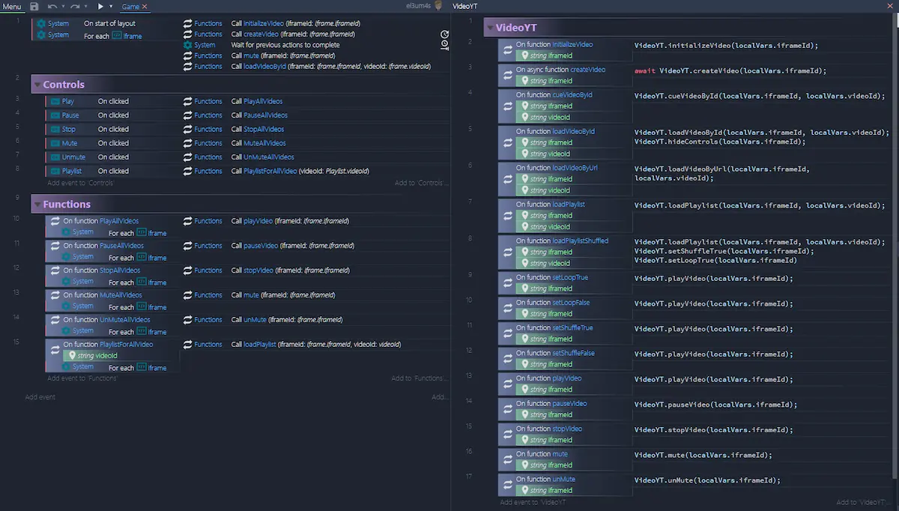

Today's template is about Construct 3 and YouTube. It's very simple, because I just want to test the integration between these two tools. The result is nice and allows you to do some interesting apps.

I'm still integrating the C3 "_event sheets_" with the "_js modules_" introduced in the [r226 release](https://www.construct.net/en/make-games/releases/beta/r226) of November 24, 2020. I like this: I can write clean code in js and use it in Construct 3 easily.



I have split the js code into multiple modules:
- [**main.js**](https://github.com/el3um4s/construct-demo/blob/master/javascript/007-youtube/source/files/scripts/main.js)
- [**globals.js**](https://github.com/el3um4s/construct-demo/blob/master/javascript/007-youtube/source/files/scripts/globals.js)
- [**youTube.js**](https://github.com/el3um4s/construct-demo/blob/master/javascript/007-youtube/source/files/scripts/youtube.js)
- [**videoYT.js**](https://github.com/el3um4s/construct-demo/blob/master/javascript/007-youtube/source/files/scripts/videoyt.js)
- [**importForEvents.js**](https://github.com/el3um4s/construct-demo/blob/master/javascript/007-youtube/source/files/scripts/importforevents.js)

The first, `main.js`, is very simple:

```js
runOnStartup(async runtime => {	globalThis.g_runtime = runtime; });
```

I think I never wrote about it. This is a trick that allows you to access the `runtime` from anywhere in Construct 3. I will be using `g_runtime` in basically all my scripts.

There is a possible variant for `main.js`:

```js
import * as YouTube from "./youTube.js";

runOnStartup(async runtime => {
  globalThis.g_runtime = runtime;
  await YouTube.LoadAPI();
});
```

In the GitHub example I launch `await YouTube.LoadAPI();` directly from the `Loader` sheet. No matter where it is performed, the important thing is to do it sooner or later. Why? Because it is used to load [the YouTube API](https://developers.google.com/youtube/iframe_api_reference).

The second file is `global.js`. I use this script to save, edit and access global project variables.

```js
const Globals = {
	ytPlayer: {},
	playlist: {
		askGamdev: ["k2-AfT0-V-c","JF404Smm4Og","MkNHQjBuCcE","F7j5h03W3CA","kFqpgqn1dEk","0V2d2S9j5Og","rzwJZC3cGlw", "oTm5cxZEdmU", "xkH5NemDPSY", "CxI-ptHu3rQ", "wxM7hsydzdQ", "onvs1ib98R"],
		extraCredits: ["z06QR-tz1_o","dHMNeNapL1E","UvCri1tqIxQ","qxsEimJ_3bM","2xfxx27HbM4","rDjrOaoHz9s"]
	}
};

export default Globals;
```

Look at `Globals.ytPlayers`: it's an empty object. I'll dynamically fill it later based on how many YouTube players I want to run.

The next js file is the one that allows you to link YouTube and C3. `youTube.js` contains two important functions: `LoadAPI` and `CreatePlayer`.

```js
export function LoadAPI()
{
	const scriptTag = document.createElement("script");
	scriptTag.src = "https://www.youtube.com/iframe_api";
	var firstScriptTag = document.getElementsByTagName('script')[0];
	firstScriptTag.parentNode.insertBefore(scriptTag, firstScriptTag);

	return new Promise(resolve =>
	{
		globalThis["onYouTubeIframeAPIReady"] = resolve;
	});
}

export function CreatePlayer(iframeId, eventHandlers)
{
	return new Promise(resolve =>
	{
		if (!eventHandlers)
			eventHandlers = {};		
		eventHandlers["onReady"] = (e => resolve(e.target));
		new globalThis["YT"]["Player"](iframeId, {
			"events": eventHandlers
		});
	});
}
```


`LoadAPI` inserts the YouTube link directly into the page header. It is an asynchronous function (returns a promise) and can be used in the loader to delay the start of the project.

`CreatePlayer` is also an asynchronous function. This piece of code links a YouTube player to an Iframe using the element ID as a reference.

After importing this code it is finally possible to implement the commands we need. I do this in the `videoYT.js` file:

```js
import * as YouTube from "./youTube.js";
import Globals from "./globals.js";

export function initializeVideo(iframeId){
	Globals.ytPlayer[iframeId] = {};
	Globals.ytPlayer[iframeId]["player"] = null;
}

export async function createVideo(iframeId) {
	Globals.ytPlayer[iframeId]["player"] = await YouTube.CreatePlayer(iframeId, {
		"onStateChange": e => { Globals.ytPlayer[iframeId]["state"] = e.data; },
		"onReady": e => {}
	});
	return true;
};

export function cueVideoById(iframeId, videoId) { Globals.ytPlayer[iframeId]["player"].cueVideoById(videoId); }
export function loadVideoById(iframeId, videoId) { Globals.ytPlayer[iframeId]["player"].loadVideoById(videoId); }
export function loadVideoByUrl(iframeId, videoId) {	Globals.ytPlayer[iframeId]["player"].loadVideoByUrl(videoId); }

export function loadPlaylist(iframeId, videoId) { Globals.ytPlayer[iframeId]["player"].loadPlaylist(Globals.playlist[videoId]); }

export function setLoopTrue(iframeId) {	Globals.ytPlayer[iframeId]["player"].setLoop(true); }
export function setLoopFalse(iframeId) { Globals.ytPlayer[iframeId]["player"].setLoop(false); }

export function setShuffleTrue(iframeId) {	Globals.ytPlayer[iframeId]["player"].setShuffle(true); }
export function setShuffleFalse(iframeId) { Globals.ytPlayer[iframeId]["player"].setShuffle(false); }

export function playVideo(iframeId) { Globals.ytPlayer[iframeId]["player"].playVideo(); }
export function pauseVideo(iframeId) { Globals.ytPlayer[iframeId]["player"].pauseVideo(); }
export function stopVideo(iframeId) { Globals.ytPlayer[iframeId]["player"].stopVideo(); }

export function setVolume(iframeId, volume) { Globals.ytPlayer[iframeId]["player"].setVolume(volume); }

export function mute(iframeId) { Globals.ytPlayer[iframeId]["player"].mute(); }
export function unMute(iframeId) { Globals.ytPlayer[iframeId]["player"].unMute(); }

export function lengthPlaylist(iframeId) { return Globals.ytPlayer[iframeId]["player"].getPlaylist().length; }
```

The `initializeVideo(iframeId)` function only needs to be executed once for each element. The function inserts a empty reference in `Globals`.

The `createVideo(iframeId)` function must also be executed once for each element. The function creates a YouTube player for each element and saves it in `Globals`.

Finally there are various functions. They're similar to the official ones but can be performed directly from C3. Or rather, they can only do this after creating the last file, `importForEvents.js`:

```js
import Globals from "./globals.js";
import * as YouTube from "./youTube.js";
import * as VideoYT from "./videoYT.js";
```

This script is the only one with the `Purpose` property set to` Imports for events`.

That said, it's time for links:

- [the project on github](https://github.com/el3um4s/construct-demo)
- [the online demo](https://c3demo.stranianelli.com/javascript/007-youtube/demo/)
- [my Patreon](https://www.patreon.com/el3um4s)