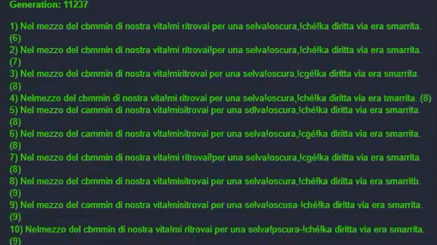

Last week was pretty complicated and I didn't have much time to experiment. But I managed to find the time to replicate a simple genetic algorithm to... write "_hello world_".



It's not spectacular. It looks like a monkey trying to write the Divine Comedy by pressing random letters. And that's right: a genetic algorithm tries more or less randomly to learn to write. It's the Hello World of machine learning. As usual on GitHub you will find both [the code](https://github.com/el3um4s/construct-demo) and the [online demo](https://c3demo.stranianelli.com/machine-learning/001-hello-world/demo/).

I don't know anything about ml, so I was inspired by a 2012 article by Burak Kanber: [Machine Learning: Introduction to Genetic Algorithms](https://burakkanber.com/blog/machine-learning-genetic-algorithms-part-1-javascript/). I recommend you to read it.

Today I will content myself with reporting what I understand.

### What is a Genetic Algorithm (GA)?

It is an algorithm that attempts to mimic the functioning of DNA to quickly obtain answers to general problems. In general, it follows these steps:

- we take a gene pool (random or not), that is a set of random solutions to our problem
- we estimate how correct the individual solutions are
- let's eliminate some of the wrong solutions
- we take the surviving solutions and use them to generate new solutions
- we redo everything until we find the best solution

In this way it's possible to test various hypotheses and gradually get closer to the solution sought.

### How are new solutions created?

There are some techniques:

- we take the best candidates and cross them by generating child candidates. Children share some of their parents' genetic material
- we randomly change the genetic code of the candidates
- we swap the position of two adjacent genes within a chromosome
- we add or delete a random gene from the chromosome

There are also other techniques, but the important thing is the underlying concept: we try to mimic the process of DNA mutation as a result of random mutations and reproduction.

### How do you get rid of the wrong solutions?

Just delete the definitely wrong solutions. The problem is to understand which candidates can be considered as too wrong. Also for this step there are [various techniques](https://en.wikipedia.org/wiki/Selection_(genetic_algorithm)):

- Roulette Wheel Selection: we randomly choose the solutions to "save". But it is a case driven by the fitness of each solution. What is "fitness"? It is the value that indicates how correct a solution is. The higher the fitness, the higher the chances for a solution to be "saved"
- Rank Selection: generally towards the end of a selection all candidate solutions have similar fitness. This makes the "roulette" selection a substantially random selection. To maintain the evolutionary pressure, then it is possible to decide to eliminate the solutions with the lowest ranking
- Steady State Selection: the idea behind it is to keep as many chromosomes as possible. We choose the best candidates, cross them with each other and insert the children in the place of the worst solutions. Chromosomes with average fitness, most of them, are not eliminated and can continue into the next generation


### How to calculate the fitness of a solution?

It depends. It depends on the problem, it depends on what we know, it depends.

### How does evolution end?

When we find a solution. But we don't always know if there is an optimal solution. A technique, I think quite simple and effective, is to decide to stop the execution of the algorithm after a few generations without mutations able to improve the fitness of the best solution. We can decide, for example, that after 1000 generations where the best solution has fitness X, then that solution is the "Solution".

It is not necessarily the best solution ever. But sometimes you don't need to find the perfect solution and an almost correct answer is fine.

### Ok, but the code?

Let's start with the problem. The problem is teaching an algorithm how to write "Hello World". Obviously this is a trivial problem, and the best method does not presuppose any genetic algorithm. But it is a good example to apply what we just talked about.

First we create the **Chromosome** class

```js
class Chromosome {
	constructor(code) {
		this.code = code ?? '';
		this.cost = 9999;
	}
}
```

Our _Cromosome_ has two properties:

- `code` : where to save the various genes
- `cost` : where to keep the fitness value of the chromosome itself.
 
We need a function to randomly fill a chromosome with genes:

```js
random(length) {
	while (length--) {
		this.code += String.fromCharCode(Math.floor(Math.random()*255));
	}
}
```

But what are the genes suitable to solve our problem? Simply the alphanumeric characters. In JavaScript we can represent any character as a number, and convert a number to a character. We can then fill the `code` with a string of random characters.

```js
calcCost(compareTO) {
  let total = 0;
  for (let i = 0; i < this.code.length; i++) {
    total += Math.pow(this.code.charCodeAt(i) - compareTO.charCodeAt(i), 2);
  }
  this.cost = total;
}
```

We also need a function that can calculate the fitness of a chromosome. The `calcCost` function does exactly that. We have a problem: the simplest way to understand how far a solution is from "Hello World" is to compare it to "Hello World". And if we already have the solution in hand then all this effort becomes useless. But we already knew this, and so let's get on with the exercise. We compare each character with the correct one and calculate the distance between the two numeric codes. Better yet: let's calculate the distance squared in order to avoid having negative numbers.

```js
crossover(chromosome) {
  const pivot = Math.round(this.code.length / 2) - 1;
  
  const child1 = this.code.substr(0, pivot) + chromosome.code.substr(pivot);
  const child2 = chromosome.code.substr(0, pivot) + this.code.substr(pivot);
  
  return [new Chromosome(child1), new Chromosome(child2)];
}
```

The `crossover` function allows us to "marry" two chromosomes and produce two children. The simplest technique is to split each chromosome in two, and swap them between them.

On the other hand, the function to generate a mutation is a little more complicated:

```js
mutate(chance) {
  if (Math.random() < chance) { return; }
  
  const index = Math.floor(Math.random()*this.code.length);
  const upOrDown = Math.random() <= 0.5 ? -1 : 1;
  const newChar = String.fromCharCode(this.code.charCodeAt(index) + upOrDown);
  let newString = '';
  
  for (let i = 0; i < this.code.length; i++) {
    if ( i == index ) {
      newString += newChar;
    } else {
      newString += this.code[i];
    }
  }
  this.code = newString;
}
```

`mutate (chance)` takes a number between 0 and 1 as an argument: it represents the probability of triggering a mutation. If the mutation is triggered, we randomly choose a gene within the chromosome and replace it with another one.

We have completed the `Chromosome` class. Now let's move on to the `Population` class to use as a basis for making the various generations "live":

```js
class Population {
	constructor (goal, size){
		this.members = [];
		this.goal = goal;
		this.generationNumber = 0;
		while (size--) {
			const chromo = new Chromosome();
			const lenght = this.goal.length;
			chromo.random(lenght);
			this.members.push(chromo);
		}
	}
}
```

**Population** has the following properties:

- `members` : an array where to insert all the individuals (chromosomes) alive at that moment
- `goal` : the sentence to be taught to the algorithm
- `generationNumber` : the number of the current generation

The constructor of the class generates random chromosome for each individual of the first generation.

We need a sorting function to make it easier to select the chromosomes closest to the correct solution:

```js
sort() {
	this.members.sort( (a,b) => a.cost - b.cost );
}
```

We also need two helper functions (`display` and `signalEndEvolution`) to allow the algorithm to communicate with Construct 3.

```js
display() {
  const textGeneration = g_runtime.objects.Generation.getFirstInstance();
  textGeneration.text = `Generation: ${this.generationNumber}`;
  
  const textPopulation = g_runtime.objects.Population.getFirstInstance();
  textPopulation.text = '';
  for (let i = 0; i < this.members.length; i++){
    textPopulation.text += `${i+1}) ${this.members[i].code} (${this.members[i].cost})\n`
  }
}

signalEndEvolution() {
  g_runtime.callFunction("EnableButton");
}
```

But most of all we need the `generation` function

```js
async generation() {		
  for (let i = 0; i < this.members.length; i++) {
    const goal = this.goal;
    this.members[i].calcCost(goal);
  }
  
  this.sort();
  this.display();
  const children = this.members[0].crossover(this.members[1]);
  this.members.splice(this.members.length-2, 2, children[0], children[1]);
  
  for (let i = 0; i < this.members.length; i++) {
    this.members[i].mutate(0.5);
    this.members[i].calcCost(this.goal);
    if(this.members[i].code == this.goal) {
      this.sort();
      this.display();
      this.signalEndEvolution();
      return true;
    }
  }
  
  this.generationNumber++;
  await new Promise(resolve => setTimeout(resolve, 10));
  this.generation();
}
```

This code is a little longer than the previous ones, better divide it into smaller pieces.

First we calculate the fitness of each chromosome:

```js
for (let i = 0; i < this.members.length; i++) {
  const goal = this.goal;
  this.members[i].calcCost(goal);
}
```

Then we order the chromosomes and use the first two to generate two "children":

```js
this.sort();
const children = this.members[0].crossover(this.members[1]);
this.members.splice(this.members.length-2, 2, children[0], children[1]);
```

We take all the chromosomes and apply a mutation to them:

```js
for (let i = 0; i < this.members.length; i++) {
  this.members[i].mutate(0.5);
  this.members[i].calcCost(this.goal);
}
```

So let's check if any solution coincides with the searched string. If so we can stop the algorithm.

```js
if(this.members[i].code == this.goal) {
  this.sort();
  return true;
}
```

Otherwise we move on to the next generation and rerun the previous steps:

```js
this.generationNumber++;
this.generation();
```

### But how do I use all of this?

Finally, just insert a simple script in the event sheet of the project:

```js
const population  = new Population("Hello World", 20);
population.generation();
```

In this way the algorithm generates a population of 20 candidates and will change them until it finds "Hello World".

That's all. The code for this project is available on GitHub:

- [the project to GitHub](https://github.com/el3um4s/construct-demo)
- [the online demo](https://c3demo.stranianelli.com/machine-learning/001-hello-world/demo/)
- [Patreon](https://www.patreon.com/el3um4s)
