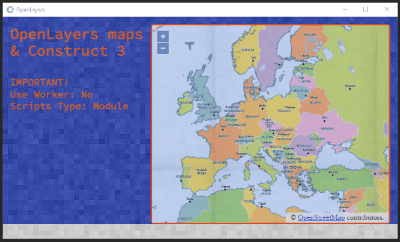

It's been a while since I played with maps. The last attempt dates back to a few years ago. This week, also thanks to some direct messages on Twitter, I picked up my old code. And I created two templates.


The first uses [Leaflet](https://leafletjs.com/), a fairly popular library for inserting maps into an html page. But how can we integrate Leaflet into Construct 3? In a simple way.

Let's start by downloading these 2 files:

- [leaflet.css](https://unpkg.com/leaflet@1.7.1/dist/leaflet.css)
- [leaflet.js](https://unpkg.com/leaflet@1.7.1/dist/leaflet.js)

Let's load these files immediately:


At the same time we also create CSS files to manage the position and style of the map. In my example it's simply:

```css
#mapid {
	position: absolute;
	left:304px;
	top:16px;
	right:16px;
	bottom:16px;
	border-style: solid;
	border-color: rgb(91, 31, 31);
	border-radius: 8px;
	opacity: 80%;
}
```

After that we can create a DIV (with ID `mapid`) where to insert our map:

```js
const myDiv = document.createElement("div");
myDiv.id = 'mapid';
document.body.appendChild(myDiv);
myDiv.style.position = "absolute";
```

From here on we can follow the [Leaflet Quick Start Guide](https://leafletjs.com/examples/quick-start/).

We set the position and zoom of the map with:

```js
let mymap = L.map('mapid').setView([51.505, -0.09], 13);
```

Then we add a layer to the map (in this case to show OpenStreetMap)

```js
L.tileLayer('https://{s}.tile.openstreetmap.org/{z}/{x}/{y}.png', {
    attribution: '&copy; <a href="https://www.openstreetmap.org/copyright">OpenStreetMap</a> contributors'
}).addTo(mymap);
```

Finally, if we need it, let's draw a circle and a triangle

```js
let circle = L.circle([51.508, -0.11], {
    color: 'red',
    fillColor: '#f03',
    fillOpacity: 0.5,
    radius: 500
}).addTo(mymap);

let polygon = L.polygon([
    [51.509, -0.08],
    [51.503, -0.06],
    [51.51, -0.047]
]).addTo(mymap);
```

All very nice, very simple and very fast. But there is a problem. I don't know why but Leaflet doesn't support Javascript ES6 modules. Which means we are forced to use `Scripts type: Classic` as the setting.


Which wouldn't even be a problem now. The problem will arise in the future when Classic Mode is no longer supported (see here: [Upgrading projects from classic scripts to modules](https://www.construct.net/en/tutorials/upgrading-projects-classic-2652))

> The old classic mode is deprecated and will soon be removed, so you should update your code soon.

Thankfully the internet has come to the rescue. Thanks to some tips on Twitter ([@laurentgontier](https://twitter.com/laurentgontier) and [@jmviglino](https://twitter.com/jmviglino)) I tried [OpenLayers] (https://openlayers.org/):




The process for integrating OpenLayers maps into Construct 3 is very similar to that with Leaflet. However, there are some small differences, starting with the 2 main files:

- [ol.css](https://cdn.jsdelivr.net/gh/openlayers/openlayers.github.io@master/en/v6.5.0/css/ol.css)
- [ol.js](https://cdn.jsdelivr.net/gh/openlayers/openlayers.github.io@master/en/v6.5.0/build/ol.js)

Obviously we upload the files immediately


and create the div for the map. From here on we can follow the guide [OpenLayers - Vector Layer](https://openlayers.org/en/latest/examples/vector-layer.html).

We can create an OSM map in this way, centering it on Milan and setting a zoom of 12:

```js
const mymap = new ol.Map({
	target: 'mapid',
	layers: [
		new ol.layer.Tile({
			source: new ol.source.OSM()
		})
	],
		view: new ol.View({
		center: ol.proj.fromLonLat([9.1892, 45.4641]),
		zoom: 12
	})
});
```

But there is another interesting aspect of OpenLayers: the ease with which we can import maps based on TileJSON and GeoJSON.

In the first case we can insert a layer by writing:

```js
new ol.layer.Tile({
	source: new ol.source.TileJSON({
		url: 'https://a.tiles.mapbox.com/v3/aj.1x1-degrees.json?secure=1',
		crossOrigin: 'anonymous',
	}),
}),
```

Using GeoJSON is slightly more complicated because we also need to determine the style to apply. But first of all we need to link the GeoJSON file

```js
const sourceGeoJSON = await runtime.assets.getProjectFileUrl("ds964_nil_wm.geojson");
```

In this example I use a file imported into the C3 project but if we want we can also use an online file.

After obtaining the geographic data we can create a layer in the map:

```js
new ol.layer.Vector({
	source: new ol.source.Vector({
		url: sourceGeoJSON,
		format: new ol.format.GeoJSON(),
	}),
	style: function (feature) {
		style.getText().setText(feature.get('NIL'));
		return style;
	},
})
```

The style is derived from the function:

```js
const style = new ol.style.Style({
  fill: new ol.style.Fill({
    color: 'rgba(255, 255, 255, 0.6)',
  }),
  stroke: new ol.style.Stroke({
    color: '#319FD3',
    width: 1,
  }),
  text: new ol.style.Text({
    font: '10px "SourceCodePro-Regular",Calibri,sans-serif',
    fill: new ol.style.Fill({
      color: '#000',
    }),
    stroke: new ol.style.Stroke({
      color: '#fff',
      width: 1,
    }),
  }),
});
```

Another interesting thing is the possibility of being able to manage events such as clicking the mouse on a particular area:

```js
const displayFeatureInfo = function (pixel) {
  const feature = mymap.forEachFeatureAtPixel(pixel, function (feature) {
    return feature;
  });

  const info = runtime.objects.NIL_MILAN.getFirstInstance();
  if (feature) {
    info.text = `${feature.get('ID_NIL')} - ${feature.get('NIL')}`;
  } else {
    info.text = '';
  }

  if (feature !== highlight) {
    if (highlight) {
      featureOverlay.getSource().removeFeature(highlight);
    }
    if (feature) {
      featureOverlay.getSource().addFeature(feature);
    }
    highlight = feature;
  }
};

mymap.on('click', function (evt) {
  displayFeatureInfo(evt.pixel);
});
```

I think there is a basis for experimenting a little with this method of integrating maps into Construct 3. But I'll stop here for the moment. I just remember that, as always, the code of this project is available on GitHub:

- [the project on GitHub](https://github.com/el3um4s/construct-demo)
- [the online demo: Leaflet](https://c3demo.stranianelli.com/mini-template/003-leaflet/demo/)
- [the online demo: OpenLayers](https://c3demo.stranianelli.com/mini-template/004-openlayers/demo/)
- [Patreon](https://www.patreon.com/el3um4s)
- [Leaflet](https://leafletjs.com/)
- [OpenLayers](https://openlayers.org/)
- [NIL Milano](https://dati.comune.milano.it/dataset/ds964-nil-vigenti-pgt-2030/resource/9c4e0776-56fc-4f3d-8a90-f4992a3be426)
