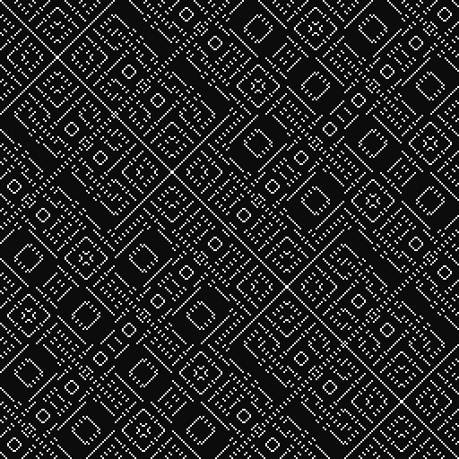
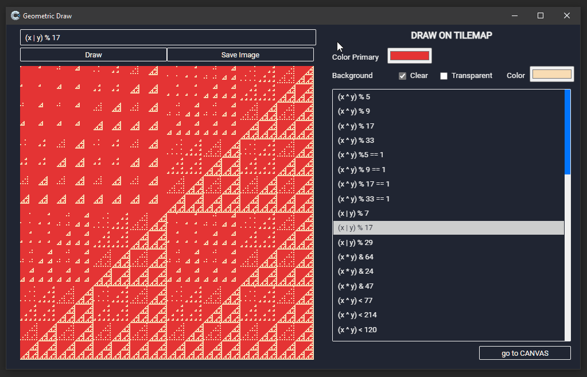
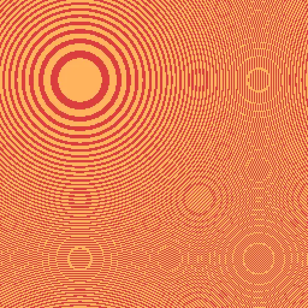
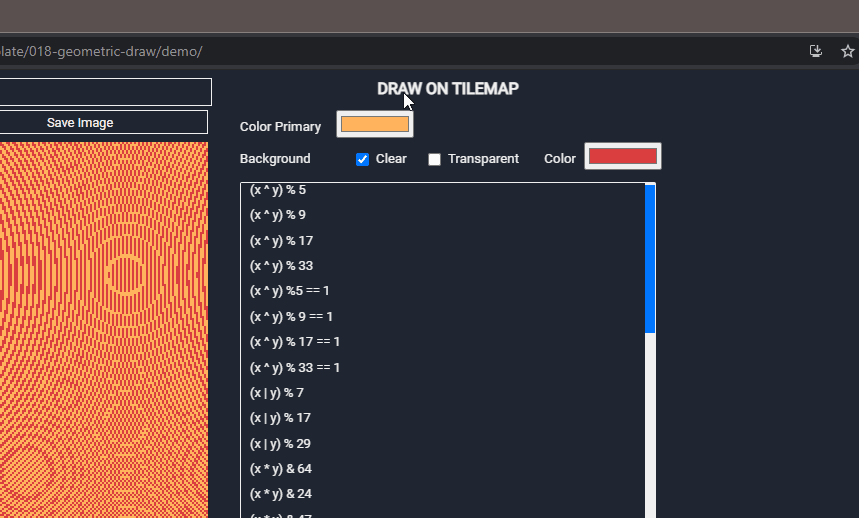
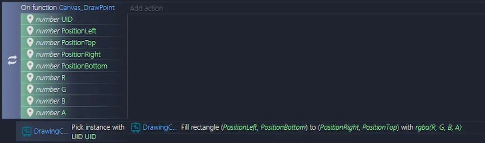

A few days I was intrigued by a tweet from [Martin Kleppe](https://twitter.com/aemkei/status/1378106731386040322): he explained how to draw geometric patterns starting from a simple formula: 

```
(x ^ y) % 9
```




The process is very simple. Just a function similar to this:

```js
const context = canvas.getContext('2d');
for (let x = 0; x < 256; x++) {
  for (let y = 0; y < 256; y++) {
    if ((x ^ y) % 9) {
      context.fillRect(x*4, y*4, 4, 4);
    }
  }
}
```

Starting from this idea I entered the mood _who knows if I can replicate this thing_. The result? This:



Obviously I uploaded the [code on GitHub](https://github.com/el3um4s/construct-demo) and a [online demo](https://c3demo.stranianelli.com/template/018-geometric-draw/demo/).

The template allows you to generate geometric designs starting from mathematical formulas. You can use the `x` and `y` variables to indicate coordinates on the canvas. If you want you can declare other variables and use them in formulas. It is also possible to combine different formulas. For example, you can use formulas such as:

```js
(x ^ y) % 9;
(x ^ y) % 17 == 1;
Math.sin(x/333)*12%Math.sin((y-228)/133)*12|0;
var r=66; ((r-x)*(r-x)+(r-y)*(r-y)) % (r*9) < r*5;
(x-y || y % 4) & (x+y % 4);
```

There is also the option to change the background color (by default it is transparent) and the foreground color.



Creating all this with Construct3 forced me to face some problems related to some limitations of C3:

1. it is not possible to write via JavaScript directly on the canvas
2. it is not possible to use colors in hexadecimal format (the `#FF00FF` one)
3. there is no `input type = "color"` control (who knows why...)

Let's start from this last point because it is the simplest one to solve.

### How to create a color picker



The workaround is to use another element of Construct 3, the [Text Input plugin](https://www.construct.net/en/make-games/manuals/construct-3/plugin-reference/text-input), and adding an element identifier `id`. After that, a line of JavaScript is enough:

```js
const colorBackground = document.getElementById("color-background");
colorBackground.type = "color";
```

### How to use HEX colors in Construct 3

This is a problem that I have already had to face and that in the past I solved with an ad hoc plugin ([ConverterColorJS - Aioute Gao](https://github.com/el3um4s/construct-plugins-and-addons)). But, I may have already talked about it, I am considering abandoning the development of specific plugins: by now C3 is mature enough to be able to directly use JavaScript code to solve most problems. And so I did: I created a simple function that accepts a hexadecimal color as input and returns it in the format required by C3.

I uploaded the full code of the [hexToRGBA function to GitHub](https://raw.githubusercontent.com/el3um4s/construct-demo/master/template/018-geometric-draw/source/files/scripts/colorshelper.js).

```js
function hexToRGBA(hex,
  {
    formatNumber = "0-1 Range", 
    formatReturn = "array" 
  } = {})
```

You can choose between 3 color formats:

* 0-1 Range
* Percentage
* 0-255 Range

and get the converted color as an `array` (`[r, g, b, a]`) or as an `object` (`{r, g, b, a}`).

### How to draw a point on the Canvas

The third aspect is quite easy, if you don't want to just use JS.

First I created a `Canvas_DrawPoint` function to draw a rectangle with 1 side point (which is actually a point)



This way I can call the function with the code from JavaScript:

```js
runtime.callFunction("Canvas_DrawPoint", uid, x, y, x+1, y+1, r, g, b, 100);
```

### Let's put the pieces together

Well, now it's just a matter of joining the pieces together in the `Canvas_DrawFromRules` function

```js
const uid = localVars.UID;
const canvas = runtime.getInstanceByUid(uid);
const hex = localVars.Color;
const {r, g, b } = hexToRGBA(hex, {formatNumber: "PERCENTAGE", formatReturn: "OBJECT" });

const width = canvas.surfaceDeviceWidth;
const height = canvas.surfaceDeviceHeight;

const rules = localVars.Rules;

for (let x = 0; x < width; x++) {
  for (let y = 0; y < height; y++) {

	const condition = eval(rules);
    if (condition) {
      runtime.callFunction("Canvas_DrawPoint", uid, x, y, x+1, y+1, r, g, b, 100);
    }

  }
}
```

But what is `condition = eval(rules)`? So, I used [`eval()`](https://developer.mozilla.org/en-US/docs/Web/JavaScript/Reference/Global_Objects/eval) to calculate the result of the drawing formula.

### Tilemap

It is not necessary to use a canvas for drawing. In the template I insert a second layout where I use two tilemaps instead of the canvas. This allows you to recreate everything in "pure" JavaScript without going through the Construct 3 event sheets. In this way the code becomes:

```js
const uid = localVars.UID;
const rules = localVars.Rules;
const hex = localVars.Color;
const tilemap = runtime.getInstanceByUid(uid);
const clearBackground = !!localVars.ClearBackground;

const color = hexToRGBA(hex, {formatNumber: "0-1 Range", formatReturn: "ARRAY" });
tilemap.colorRgb = color;

const width = tilemap.mapWidth;
const height = tilemap.mapHeight;

for (let x = 0; x < width; x++) {
  for (let y = 0; y < height; y++) {
	const condition = eval(rules);

    if (condition) {
		  tilemap.setTileAt(x, y, 1);
    } else if (clearBackground) {
		  tilemap.setTileAt(x, y, -1);
	  }
  }
}
```
That's it, remember that the code of this project is available on GitHub:

- [the project on GitHub](https://github.com/el3um4s/construct-demo)
- [the online demo](https://c3demo.stranianelli.com/template/018-geometric-draw/demo/)
- [Patreon](https://www.patreon.com/el3um4s)
