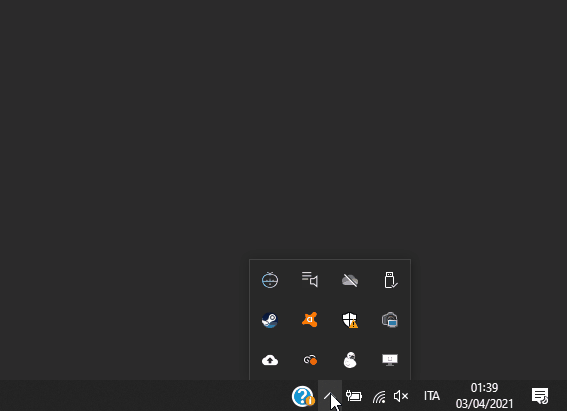

This week I present a "double project". It's a **Pomodoro Clock** living in the Windows taskbar. When the time runs out, a notification appears in the Windows notification bar. To achieve this I combined [**Electron**](https://www.electronjs.org/) and the WebApi [**Notifications**](https://developer.mozilla.org/en-US/docs/Web/API/Notifications_API).

### Notifications API


I start from the _Notification_ interface: it allows to show system notifications. The notifications are not linked to the browser, so we can see them even while we are using a different application, or while viewing a different tab. The necessary code is very simple:

```js
new Notification("Title");
```

We can set some parameters to customize the appearance of the notification:

```js
const title = "Pomodoro c3";
const icon = await g_runtime.assets.getProjectFileUrl("icon-notification.png");

const options = {
	body: "Pomodoro Finished",
	icon: icon
}

const notification = new Notification(title, options);
```

Obviously we cannot show system notifications without first asking for permission:

```js
const permission = await Notification.requestPermission();
```

The user's response to our request can be positive, and then we can show the notification:

```js
if (permission === "granted") {
  new Notification(title, options);
}
```

Or we can receive a negative answer: in this case we will not see any notification.

We don't need to ask for permission every time, just once and check before showing the notification:

```js
if (Notification.permission === "granted") {
	new Notification(title, options);
}
```

If instead `(Notification.permission === "denied")` it is better not to ask for permission again and simply not to show the notification.

By combining all the pieces we get a code similar to this:

```js
async function webApiNotification() {

	const icon = await g_runtime.assets.getProjectFileUrl("icon-notification.png");
	const title = "Pomodoro c3";

	const options = {
		body: "Pomodoro Finished",
		icon: icon
	}

	if (!("Notification" in globalThis)) {
    	alert("This browser does not support desktop notification");
  	} else if (Notification.permission === "granted") {
		new Notification(title, options);
	} else if (Notification.permission !== "denied") {
		const permission = await Notification.requestPermission();
		if (permission === "granted") {
     	new Notification(title, options);
    }
	}
}
```

### ipcRenderer

For a web app this function is enough. But my idea is to show notifications starting from the operating system taskbar. And I'd like to show the app by clicking on the notification. To achieve this we listen to the [**Notification.onclick**](https://developer.mozilla.org/en-US/docs/Web/API/Notification/onclick) action. This default event highlights the window that generated the notification. But working with Electron we need an extra step:

```js
const notification = new Notification(title, options);
const { ipcRenderer } = require('electron');

notification.onclick = (event) => {
  event.preventDefault();
  ipcRenderer.send("show-pomodoro-clock");
}
```

The [**ipcRenderer**](https://www.electronjs.org/docs/api/ipc-renderer) is part of the Electron world and allows we to send and receive messages from the web page to the main process. In this case it's sufficient to send the command _show-pomodoro-clock_ and set the API [**ipcMain**](https://www.electronjs.org/docs/api/ipc-main) to intercept it:

```js
ipcMain.on('show-pomodoro-clock', (event) =>{
    mainWindow.show();
});
```
But here we are already a step beyond just viewing notifications. It's time to switch to Electron and let the app "live" in the taskbar.

### Taskbar App in ElectronJs



First we import `electron` into the project via the command

> npm i -D electron@latest

Then we set up the main file of the app (in my project it is the `indes.jx` file) by importing the modules we will use:

```js
const path = require('path');

const electron = require('electron');
const { app, BrowserWindow, Tray, Menu, ipcMain } = electron;
```

Let's create two variables external to the app:

```js
let mainWindow = null;
let tray = null;
```

We will use **mainWindow** to create the application window. **tray**, on the other hand, will be used to manage the behavior of the taskbar. We wait for the app to be ready to run and then create the main window:

```js
app.on('ready', () => {
  mainWindow = new BrowserWindow({
        height: 180,
        width: 320,
        frame: false,
        resizable: false,
        show: false,
        alwaysOnTop: true,
        webPreferences: {
            pageVisibility: true, 
            backgroundThrottling: false,
            nodeIntegration: true,
            contextIsolation: false,
            enableRemoteModule: true
        }
    });
})
```

The **pageVisibility: true** and **backgroundThrottling: false** properties are important because they allow the app to stay active in the background. Instead **frame:false** and **resizable: false** are used to not show the border and the title of the window.

After creating the main window we can load the web part of the application:

```js
mainWindow.loadURL(`file://${__dirname}/www/index.html`);
```

So far we have all created a classic electron app. But it's time to make an icon appear in the taskbar:

```js
const iconPath = path.join(__dirname, 'www' , 'icons', '/icon-32.png');
tray = new Tray(iconPath);
```

**tray** allows us to manage the behavior of the icon. We can add a listener for the _click_ event to use to show the main window:

```js
tray.on('click', (event) => {
  mainWindow.show();
});
```

This is enough, but it's not exactly what I want. I'd like to show the main window exactly above the taskbar icon. To achieve this we need to use a slightly different function:

```js
tray.on('click', (event,bounds) => {
  mainWindow.show();
});
```

In this way we can access the position of the icon in the taskbar and use it as a reference point to position the application window:

```js
const { x, y } = bounds;
const { height, width } =  mainWindow.getBounds();
mainWindow.setBounds({
    x: x - width/2,
    y: y - height,
    height,
    width
});
```

Combining all this we get:

```js
tray.on('click', (event, bounds) => {
    const { x, y } = bounds;
    const { height, width } =  mainWindow.getBounds();

    if (mainWindow.isVisible()) {
        mainWindow.hide();
    } else {
        mainWindow.setBounds({
            x: x - width/2,
            y: y - height,
            height,
            width
        });
        mainWindow.show();
    }
});
```

### Context Menu

There is still one thing missing to make the application usable: the ability to close it. So let's add a menu that can be called up with the right mouse button on the icon in the taskbar:

```js
const menu = Menu.buildFromTemplate([
  {
    label: 'Quit',
    click: () => app.quit()
  }
]);

tray.setContextMenu(menu);
```

Finally, when we hover the mouse over the icon, a tooltip appears:

```js
tray.setToolTip('Pomodoro');
```

And we hide the window when we click somewhere else:

```js
mainWindow.on('blur', () => {
  mainWindow.hide();
})
```

Well, I'd say that's all for now. I remember that the code of my projects is available on GitHub.

- [the project on GitHub](https://github.com/el3um4s/pomodoro-c3)
- [Patreon](https://www.patreon.com/el3um4s)
