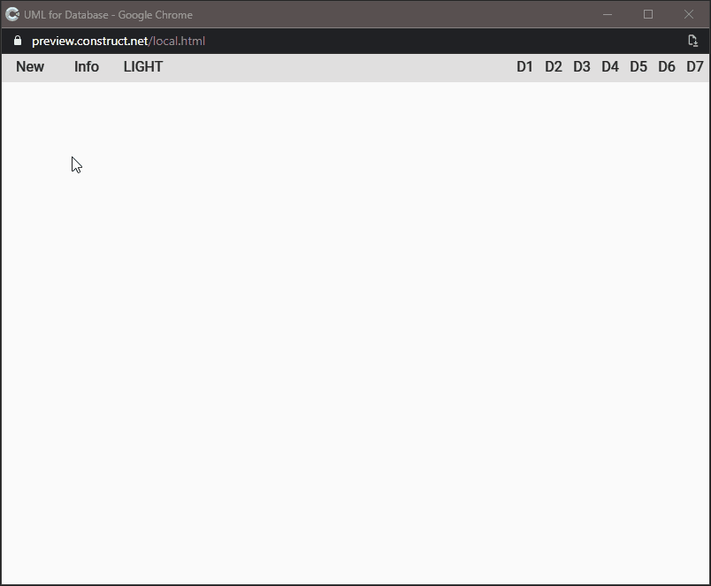
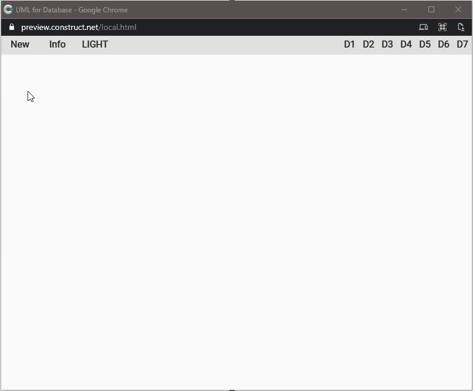

The past two weeks have been pretty hard. A sudden death hit my family, annihilating us. Programming has generally always been a safe heaven to take refuge in, a chance to bring some order to my otherwise chaotic world. In part it was like that this time too, even if I didn't want to publish, to share, to get in touch with the outside world. Anyway, this week's project is an excerpt of an idea for a working project.



It is an experiment on how to graphically represent the relationships between tables in a database. This is not a complete thing, just the graphical interface, but there are 4 interesting aspects in my opinion:

1. the ability to choose between a light theme and a dark theme
2. creating a modal window above the application (in this case to show information about the app)
3. the management of separate windows with the possibility of minimizing, maximizing and closing them
4. the graphic representation of diagrams written in a textual language



The management of the themes is done through a global variable:

```js
const Globals = {
	theme: {
		light: {
			statusBar: "#E0E0E0",
			appBar: "#F5F5F5",
			background: "#FAFAFA",
			card: "#FFFFFF",
			textPrimary: "#222222",
			secondaryText: "#455A64",
			textDisabled: "#CFD8DC",
			textInteractive: "#0071BC",
			textError: "#BF0000"			
		},
		dark: {
			statusBar: "#000000",
			appBar: "#212121",
			background: "#303030",
			card: "#424242",
			textPrimary: "#FFFFFF",
			secondaryText: "#B0BEC5",
			textDisabled: "#B0BEC5",
			textInteractive: "#FFFFFF",
			textError: "#FFFFFF"	
		}
	}
};

export default Globals;
```

To change the color of the different elements I use a function similar to this:

```js
function themeColorize(name) {
  const theme = Globals.theme.selected;

  const instances = runtime.objects[name].getAllInstances();

  for (const inst of instances){
    const color = inst.instVars.Color;
    const colorHEX = Globals.theme[theme][color];
    inst.colorRgb = hexToRGBA(colorHEX);
  }
}
```

For the management of the windows (including the modal one) I used [WinBox.js](https://github.com/nextapps-de/winbox), a library particularly suitable for this purpose. For example, a function similar to this is enough to open the window with the information about the application

```js
function toggleWinInfo() {
  const info = document.getElementById("winbox-info");

  if (!info) {
    const theme = Globals.theme.selected;

    const projectName = runtime.projectName;
    const projectVersion = runtime.projectVersion;

    const html = `
    <div style="text-align:center;" id="winbox-info">
    <h3 style="color=${Globals.theme[theme].textPrimary}">${projectName}</h3>
    <p style="color=${Globals.theme[theme].secondaryText}">v: ${projectVersion}</p>
    </div>
    `;

    new WinBox({
      title: "Info",
      class: theme,
      modal: true,
      background: Globals.theme[theme].statusBar,
      top: 32,
      x: "center",
      y: "center",
      width: 200,
      height: 150,
      html
    });
  }
}
```


Finally the graphs. I chose to use [Mermaid ](https://mermaid-js.github.io/mermaid/#/), a library that allows you to represent graphics and diagrams starting from a textual representation. Like Markdown, but for diagrams.

This part took a little more work because it requires integrating the creation of two new windows and their mutual linking. First I create the window to use as input:

```js
const theme = Globals.theme.selected;

const htmlInput = `
<div class="editor" id="input-1" contenteditable="true"></div>
`;

new WinBox({
  title: "INPUT",
  class: theme,
  background: Globals.theme[theme].statusBar,
  top: 32,
  html: htmlInput
});
```

Then I created the window to show the graph:

```js
const theme = Globals.theme.selected;

const htmlOutput = `
<div id="output-1"></div>
`;

new WinBox({
  title: "PREVIEW",
  class: theme,
  background: Globals.theme[theme].statusBar,
  top: 32,
  x: 32,
  y: 32,
  html: htmlOutput
});
```

Finally I connected the two windows in order to automatically update the drawing of the graph with each modification of the text contained in the first window.

```js
document.getElementById("input-1").addEventListener("input", (e) => {
  const output = document.getElementById("output-1");
  if (output.firstChild !== null) {
    output.innerHTML = "";
  };

  const code = e.target.innerText;
  const insert = function (code) {
    output.innerHTML = code;
  };
  mermaid.render("preparedScheme", code, insert);
});
```

As a final touch I added the ability to show some example code by importing it directly into the input window and updating the output window

```js
function showDemo(code) {
  const input = document.getElementById("input-1");
  if (input) {
    const number = localVars.number;
    input.innerHTML = code
        
    const output = document.getElementById("output-1");
    if (output) {
      if (output.firstChild !== null) {
        output.innerHTML = "";
      };
      const insert = function (code) {
        output.innerHTML = code.trim();
      };
      mermaid.render("preparedScheme", code, insert);
    }
  }
}
```

This project is currently a prototype but can already be used to test the potential of an application of this kind.

As usual I have shared the complete code on Github.

- [the project on GitHub](https://github.com/el3um4s/construct-demo)
- [the online demo](https://c3demo.stranianelli.com/javascript/010-mermaid/demo/)
- [Patreon](https://www.patreon.com/el3um4s)