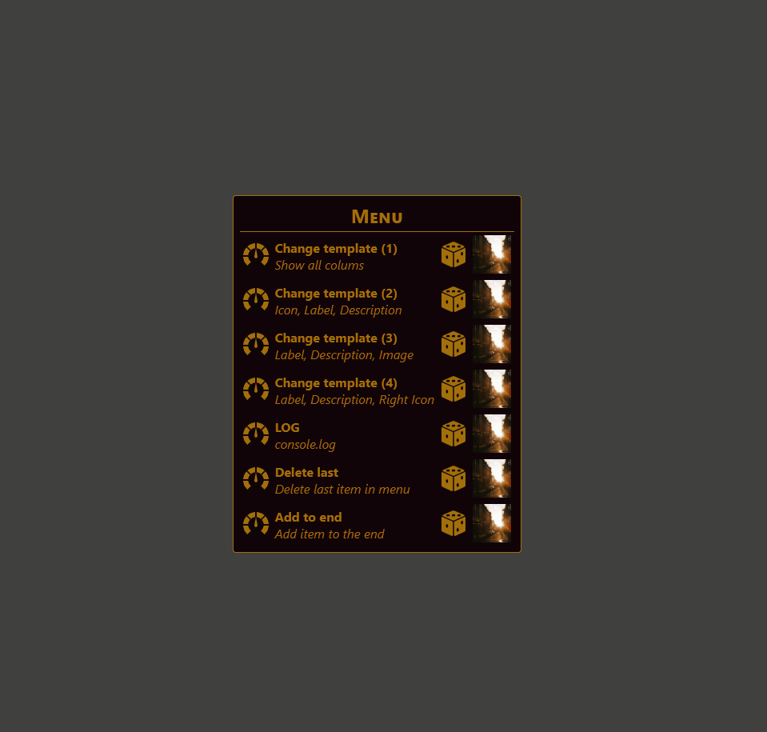
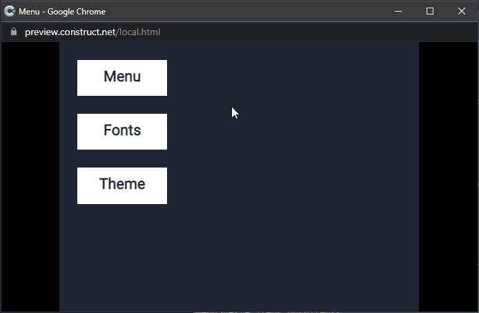
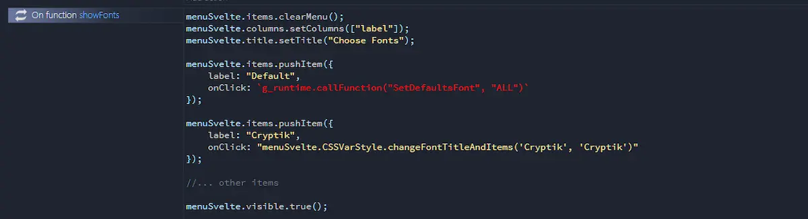
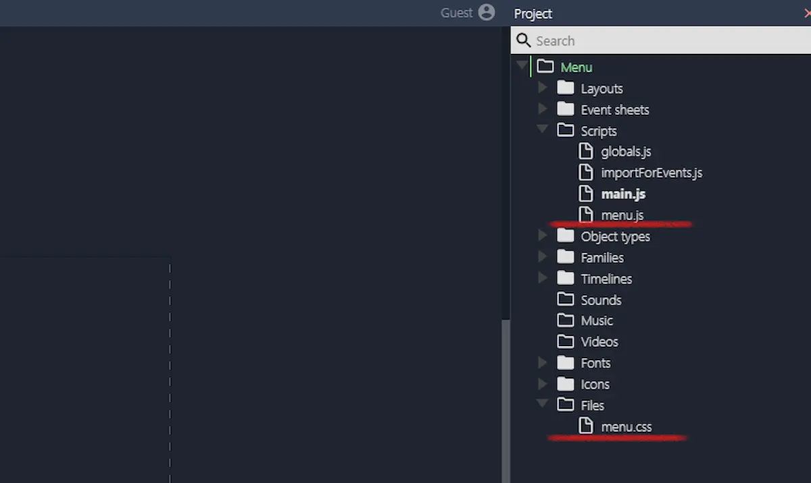

During this week I continued working on how to integrate Svelte and Construct 3. The first attempt ended in nothing. Why? Well, I wanted to make some kind of scientific calculator but my math knowledge is pretty rusty. I'll have to get back on the books. As a result, I threw myself into plan B: a menu for Construct 3. The first test was promising:

Starting from this, I decided to continue on this path. My idea is to get something that allows me to include menus of this type in my projects without having to work too hard. Although, to be honest, the fastest way would have been to use [Aekiro](https://aekiro.itch.io/)'s [Pro UI - UI Components](https://aekiro.itch.io/proui) project. But why do I have to choose the easy way when I can climb the long and hard one?

Anyway, starting from that test I created a template in which it is possible to add functionality. I've set up a mechanism to change the menu template:

I added the ability to decide which font to use in the menu

And obviously an interface to dynamically manage the various items

A couple of things are still missing. I'd like to add the ability to enable and disable the various items. And secondly, add some predefined styles.

And then obviously there is a project in C3 to show how to use the various functions. To finish it I have to define some details on the commands to use.

I think a syntax similar to `menuSvelte.category.function ()` would be fine. At the moment I have implemented

- `items`
  - _pushItem (item:ItemType)_
  - _unshiftItem (item:ItemType)_
  - _addItemAtIndex (index:number, item:ItemType)_
  - _updateItemById (id:string, item:ItemType)_
  - _updateItemByLabel (label:string, item:ItemType)_
  - _updateItemByIndex (index:number, item:ItemType)_
  - _shiftItem ()_
  - _popItem ()_
  - _removeItemById (id:string)_
  - _removeItemByLabel (label:string)_
  - _removeItemByIndex (index:number)_
  - _loadItemsFromArray (arrayItems:ItemType[])_
- `columns`
  - _allColumns ()_
  - _setColumns (array:string[])_
- `title`
  - _setTitle (title:string)_
  - _reset ()_
  - _clear ()_
- `visible`
  - _true ()_
  - _false ()_
- `CSSVarStyle`
  - _init ()_
  - _changeStyle (style: string, value: string)_
  - _changeFontTitle (value: string)_
  - _changeFontItems (value: string)_
  - _changeFontTitleAndItems (title: string, items: string)_

I still have a couple of technical issues to clarify. The first concerns the possibility or not of using sprites as icons. There are some C3 related limitations that I don't know if it's worth trying to get around. The second is how to publish all of this.

All you need are two files:

- `menu.js`
- `menu.css`

After importing them into Construct 3 it is possible to create customized menus. But I don't know if I can start from this to create a plugin or if I can distribute the two files directly.

I'll think about it, but not today and tomorrow. Today is (finally) my turn for the vaccine and tomorrow will be a long day of work. But I wanted to talk about this project because I'm quite proud of it. And if you like it too, I remember my page on [Patreon: patreon.com/el3um4s](https://www.patreon.com/el3um4s).
