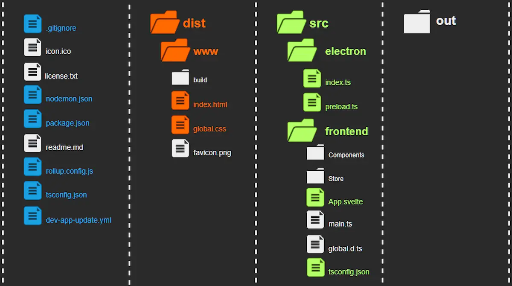
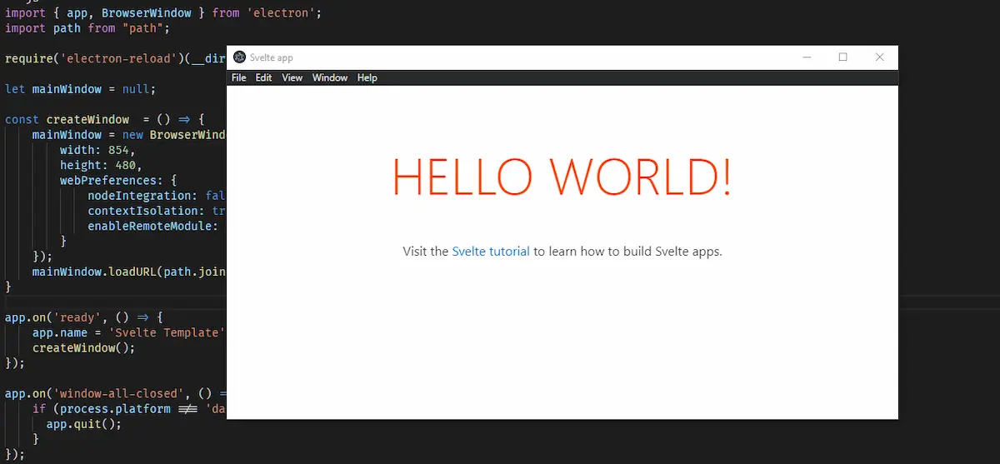
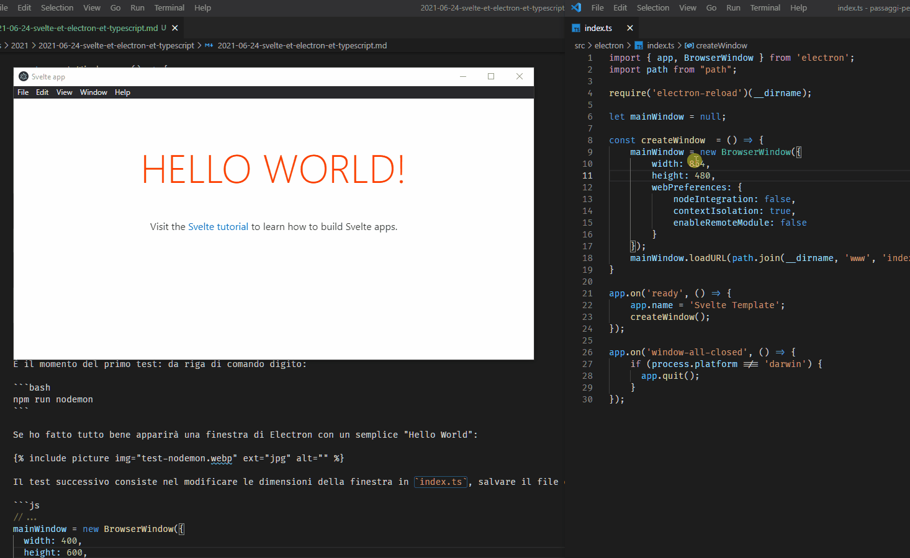
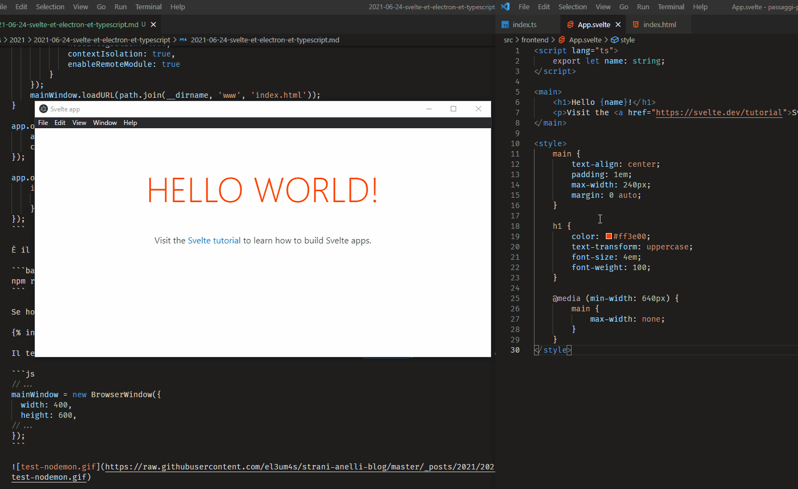
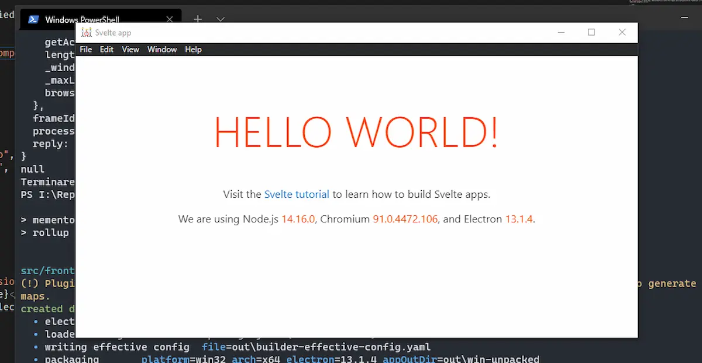
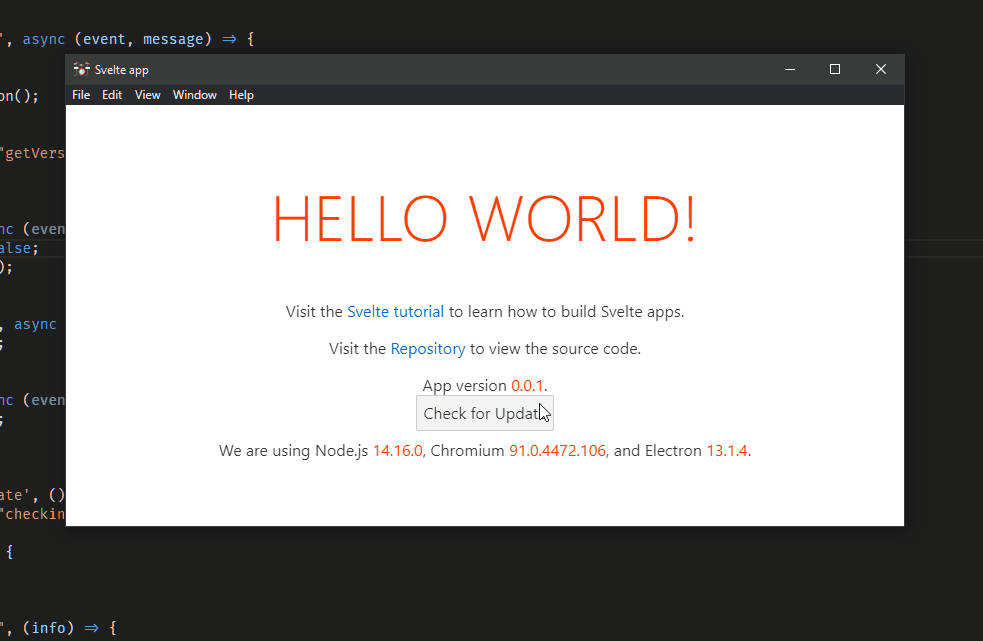

I am continuing to explore the world of [Svelte](https://svelte.dev/). Ever    y day I am adding a little bit to my knowledge, and every day I am struggling with my limits. While I'm happy that I was able to find a way to create static pages on GitHub, my goal is to make it easier for me to develop some offline tools. Unlike other frameworks, the Svelte community is quite small and there is no, or at least I could not find, a template suitable for my needs. For this I decided to create my own template to integrate Svelte, Electron and TypeScript.

I start with the "_rules of engagement_". I need a tool that:

- can work completely offline
- does not require internet connection to be installed
- can be updated both offline and online
- can be developed using TypeScript
- is relatively simple to develop and expand

I have already created a first template, without TypeScript: [MEMENTO - Svelte & Electron](https://github.com/el3um4s/memento-svelte-electron). Starting from this I'm implementing the second version, which I'll call [MEMENTO - Svelte, Electron & TypeScript](https://github.com/el3um4s/memento-svelte-electron-typescript) (I have a lot of imagination with the names, huh?).

This post is for me, and above all for the future me, to remember the steps I'm doing. And above all to remind me of some design choices that I'm making. Also because I think I will probably have to develop a third template (the final one? Perhaps) in which to integrate also SvelteKit. But better to take it one step at a time.

So, the first thing to do is to create a new project starting from Svelte:

```shell
npx degit sveltejs/template my-svelte-project
cd my-svelte-project
node scripts/setupTypeScript.js
npm install
```

I install the packages that I will need for Electron

```shell
npm i -D electron@latest
npm i -D typescript
npm i -D electron-builder
npm i electron-updater
npm i electron-reload
```

In this way I get:

- the latest version of [ElectronJS](https://www.electronjs.org/)
- TypeScript, for use with Electron
- [electron-builder](https://www.electron.build/) to create executable files to publish (for both Windows and Linux and macOS)
- [electron-updater](https://www.electron.build/auto-update) to easily update programs to the latest version
- [electron-reload](https://www.npmjs.com/package/electron-reload) to update the contents of Electron's "Browser Windows" during application development

Then I install [nodemon](https://nodemon.io/) to automatically restart Electron on any source code change. I also think this is useful when developing an application

```shell
npm i -D nodemon
```

After installing everything you need, it's time to go and fix the structure of the project. There are currently 2 folders

- `public`, where the compiled files of Svelte are
- `src`, where the Svelte source files are

But this structure doesn't work very well. Not only because the Electron files are missing but also because I will run into problems later. So I rearrange files in another way:



First of all I create a `dist` folder: it will be used to contain the compiled files of Svelte and Electron. I move Svelte files (those created automatically) to `dist\www`.

Then I start editing the `src` folder. I create 2 additional folders inside it: `electron` and `frontend`. In the first I insert the files necessary to make Electron work (for the moment only `index.ts` and `preload.ts`). I use `frontend` instead for everything related to Svelte. But I add the `tsconfig.json` file.

I also add some files to the root of the project: `icon.ico`, `license.txt`, `nodemon.json`. The icon file and the license file will be needed when installing the app on a PC. I will use the nodemon configuration file when developing the program.

I haven't written a line of code yet. But the time has come to put my hand to the keyboard and start tidying up some files. The first file to change is `dist\www\index.html`. I have to make a very simple change, fix the references of the imported files. So it goes like this:

```html
<link rel='icon' type='image/png' href='/favicon.png'>
<link rel='stylesheet' href='/global.css'>
<link rel='stylesheet' href='/build/bundle.css'>

<script defer src='/build/bundle.js'></script>
```

to this:

```html
<meta http-equiv="Content-Security-Policy" content="default-src 'self'; script-src 'self';">
<meta http-equiv="X-Content-Security-Policy" content="default-src 'self'; script-src 'self'">

<link rel='icon' type='image/png' href='favicon.png'>
<link rel='stylesheet' href='global.css'>
<link rel='stylesheet' href='build/bundle.css'>

<script defer src='build/bundle.js'></script>
```

Basically I removed the first slash from all the url and added some [CSP settings](https://developer.mozilla.org/en-US/docs/Web/HTTP/CSP).

Now I pass to the section dedicated to the frontend source files. Here I have created a file `src\frontend\tsconfig.json`: its purpose is to allow you to compile Svelte's TypeScript files in a different way from how Electron's ones are compiled (see [stackoverflow: How to use multiple tsconfig files in vs-code?](https://stackoverflow.com/questions/37579969/how-to-use-multiple-tsconfig-files-in-vs-code)). Inserisco questo codice:

```json
{
    "extends": "@tsconfig/svelte/tsconfig.json",
    "compilerOptions": {
      "target": "es2020",
    },
    "lib": ["es2020", "dom"]
}
```

I'll go back to `src\electron` later. Now I modify the other file related to the TypeScript configuration: the `tsconfig.json` file located at the root of the project. I write:

```json
{
  "compilerOptions": {
    "target": "ES2020",
    "module": "commonjs",
    "outDir": "dist",
    "rootDir": "src/electron",
    "strict": true,
    "moduleResolution": "node",
    "esModuleInterop": true,
    "skipLibCheck": true,
    "forceConsistentCasingInFileNames": true,
    "lib": ["es2020"]
  },
  "exclude": [
    "node_modules",
    "dist/www",
    "out/**",
    "src/frontend/**"
  ],
  "include": ["src/electron/**/*"]
}
```

Then I configure `nodemon.json` by entering in the file:

```json
{
  "watch": ["src/electron/"],
  "exec": "npm run dev",
  "ext": "js, json, ts, proto, css, png, jpeg, jpg, ico"
}
```

In this way I intercept all the changes made to Electron files and I can automatically restart Electron.

Another file to fix is `rollup.config.js`. Generally the automatically created file is fine but in this case I changed the file structure: I have to make sure that the various commands refer to the correct folders.

```js
export default {
	input: 'src/frontend/main.ts',  // check!
	output: {
		sourcemap: true,
		format: 'iife',
		name: 'app',
		file: 'dist/www/build/bundle.js' // check!
	},
	plugins: [
		svelte({
			preprocess: sveltePreprocess({ sourceMap: !production }),
			compilerOptions: {
				dev: !production
			}
		}),
		css({ output: 'bundle.css' }),
		resolve({
			browser: true,
			dedupe: ['svelte']
		}),
		commonjs(),
		typescript({
			tsconfig: "src/frontend/tsconfig.json", // add and check!
			sourceMap: !production,
			inlineSources: !production
		}),
		!production && serve(),
		!production && livereload('dist'), // check!
		production && terser()
	],
	watch: {
		clearScreen: false
	}
};
```

There is one last file to configure, `package.json`. I begin with the general information:

```json
{
  "name": "memento-svelte-electron-typescript",
  "productName": "memento-svelte-electron-typescript",
  "description": "Memento: how to use Svelte with Electron and TypeScript",
  "author": "Samuele de Tomasi <samuele@stranianelli.com>",
  "license": "MIT",
  "version": "0.0.1",
}
```

Then I define the entry point of the program. I decided to put all the compiled files in `dist`, so I add a line to `package.json`:

```json
{
  "main": "dist/index.js",
}
```

Obviously I omit to report the various dependencies, they add themselves when I import the libraries from `npm`. I pass instead to the part dedicated to `scripts`. I need something to run `nodemon`.

```json
{
  "scripts": {
    "nodemon": "nodemon",
    "dev": "rollup -c -w",
  }
}
```

Of course I also need to make sure I can run Electron with the compiled typescript files:

```json
{
  "scripts": {
    "start": "npm run compile && electron .",
    "compile": "tsc"
  }
}
```

Then I need something to build the executable files and to publish them directly on GitHub:

```json
{
  "scripts": {
    "out:win": "rollup -c && tsc && electron-builder build --win --publish never",
    "publish:win": "rollup -c && tsc && electron-builder build --win --publish always"
  }
}
```

Finally I have to configure the part dedicated to the creation of the files to be distributed:

```json
{
  "build": {
    "appId": "memento-set",
    "directories": {
      "output": "out"
    },
    "publish": [
      {
        "provider": "github",
        "owner": "el3um4s",
        "repo": "memento-svelte-electron-typescript"
      }
    ],
    "win": {
      "target": [
        "nsis"
      ],
      "icon": "icon.ico"
    },
    "nsis": {
      "installerIcon": "icon.ico",
      "uninstallerIcon": "icon.ico",
      "uninstallDisplayName": "Memento TES (Svelte+Electron+TypeScript)",
      "license": "license.txt",
      "oneClick": false,
      "allowToChangeInstallationDirectory": true
    }
  }
}
```

Once the configuration is finished, I can finally move on to the code. I start with something simple: I use `src\electron\index.ts` to create a simple window in which to display a simple HTML file (created by Svelte). So, I start with:

```js
import { app, BrowserWindow } from 'electron';
import path from "path";

require('electron-reload')(__dirname);

let mainWindow = null;

const createWindow  = () => { 
    mainWindow = new BrowserWindow({
        width: 854,
        height: 480,
        webPreferences: {
            nodeIntegration: true,
            contextIsolation: true,
            enableRemoteModule: true
        }
    });
    mainWindow.loadURL(path.join(__dirname, 'www', 'index.html'));
}

app.on('ready', () => {
    app.name = 'Svelte Template';
    createWindow();
});

app.on('window-all-closed', () => {
    if (process.platform !== 'darwin') {
      app.quit();
    }
});
```

It's time for the first test; from the command line I type:

```shell
npm run nodemon
```

If I have done everything right an Electron window will appear with a simple "Hello World":



The next test is to change the window size in `index.ts`, save the file and see what happens:

```js
//...
mainWindow = new BrowserWindow({
  width: 400,
  height: 600,
//...
});
```



Nodemon restarts Electron and applies the changes to the window. But if I only change the Svelte part then Nodemon won't do anything. This is a task for `electron-reload`:



If I'm not interested in working on the electron side I can just use:

```shell
npm run dev
```

This way I only monitor changes in files compiled with Svelte.

The next test is about the possibility of creating an executable file. So I run from the command line:

```shell
npm run out:win
```


I get the `memento-svelte-electron-typescript Setup 0.0.1.exe` file in the `out` directory.

To publish the app on GitHub I can use the command

```shell
npm run publish:win
```

Now is the time to start working on how to more closely integrate Electron with Svelte. And it's time to go edit the `src\preload.ts` file. I need a mechanism to communicate with Electron starting with Svelte: I enable some inbound and outbound communication channels.

```ts
import { contextBridge, ipcRenderer } from "electron";

// Expose protected methods that allow the renderer process to use
// the ipcRenderer without exposing the entire object
contextBridge.exposeInMainWorld(
    "api", {
        send: (channel: string, data: any) => {
            // whitelist channels
            let validChannels = ["toMain", "requestSystemInfo"];
            if (validChannels.includes(channel)) {
                ipcRenderer.send(channel, data);
            }
        },
        receive: (channel: string, func: (arg0: any) => void) => {
            let validChannels = ["fromMain", "getSystemInfo"];
            if (validChannels.includes(channel)) {
                // Deliberately strip event as it includes `sender`
                // @ts-ignore
                ipcRenderer.on(channel, (event, ...args) => func(...args));
            }
        }
    }
);
```

As a test I ask Electron for the version number of Chrome, Node and Electron. Then I use this information in a custom component. I add a function on `src\electron\index.ts`:

```ts
ipcMain.on('requestSystemInfo', async (event, message) => {
    const versionChrome = process.versions.chrome;
    const versionNode = process.versions.node;
    const versionElectron = process.versions.electron;
    const result = {
        chrome: versionChrome,
        node: versionNode,
        electron: versionElectron
    }
    mainWindow.webContents.send("getSystemInfo", result);
  });
```

This way when I request `requestSystemInfo` from the component Electron will get the information I need and send it back with a message on the `getSystemInfo` channel.

So I create the `src\frontend\Components\InfoElectron.svelte` component:

```html
<script lang="ts">
    let chrome = "-";
    let node = "-";
    let electron = "-";

    globalThis.api.send("requestSystemInfo", null);
    globalThis.api.receive("getSystemInfo", (data) => {
        chrome = data.chrome;
        node = data.node;
        electron = data.electron;
    });
</script>

<div>
    We are using Node.js <span class="version">{node}</span>,
    Chromium <span class="version">{chrome}</span>,
    and Electron <span class="version">{electron}</span>.
</div>

<style>
    .version {
        color: #ff3e00;
    }
</style>
```

I get this:



However, I admit that I have not explored yet this pattern well (and in general how to use TypeScript to create the input file for Electron): I recommend also reading [Electron IPC Response/Request architecture with TypeScript](https://blog.logrocket.com/electron-ipc-response-request-architecture-with-typescript/) by [LogRocket](https://blog.logrocket.com/).

The last thing to fix is the automatic update. To manage it, I import `Notification` from Electron and `autoUpdater` from `electron-updater`

```ts
import { Notification } from 'electron';
import { autoUpdater } from "electron-updater";
```

To check for updates just use

```ts
autoUpdater.checkForUpdates();
```

This command generates some events that I can intercept. For the moment I need this 2:

```ts
autoUpdater.on("update-available", () => {
    notification = new Notification({
        title: "Svelte App",
        body: "Updates are available. Click to download.",
        silent: true,

    });
    notification.show();
    notification.on("click", () => {
            autoUpdater.downloadUpdate();
    });
});
  
autoUpdater.on("update-downloaded", () => {
    notification = new Notification({
        title: "Svelte App",
        body: "The updates are ready. Click to quit and install.",
        silent: true,
    });
    notification.show();
    notification.on("click", () => {
        autoUpdater.quitAndInstall();
    });
});
```

This allows me to pop up a system notification when there is an update available. In case you decide to install it, just click on the notification to start the download. After that, when the download is finished, clicking on the notification starts the installation procedure.



Then I create the `dev-app-update.yml` file. This file is for testing automatic updates in development. I insert the references to the GitHub repository where I host the project:

```yml
provider: github
owner: el3um4s
repo: memento-svelte-electron-typescript
```

That's all for today.

- [MEMENTO - Svelte, Electron & TypeScript](https://github.com/el3um4s/memento-svelte-electron-typescript)
- [Patreon](https://www.patreon.com/el3um4s)
