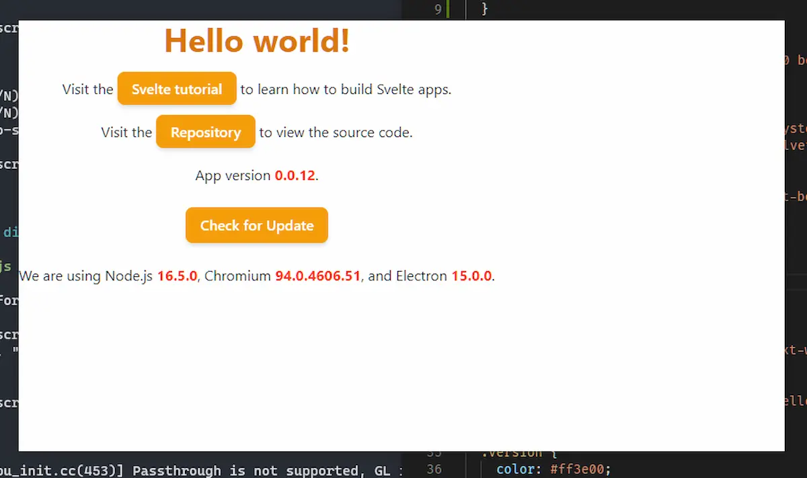
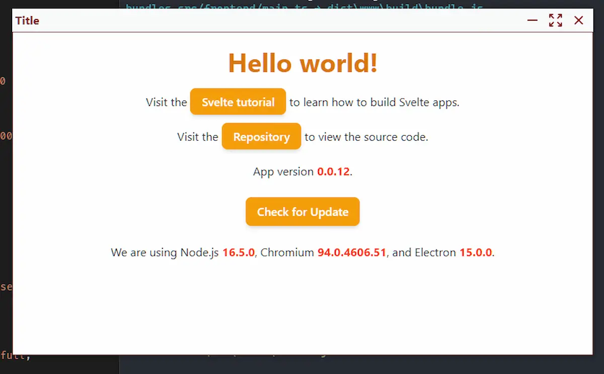
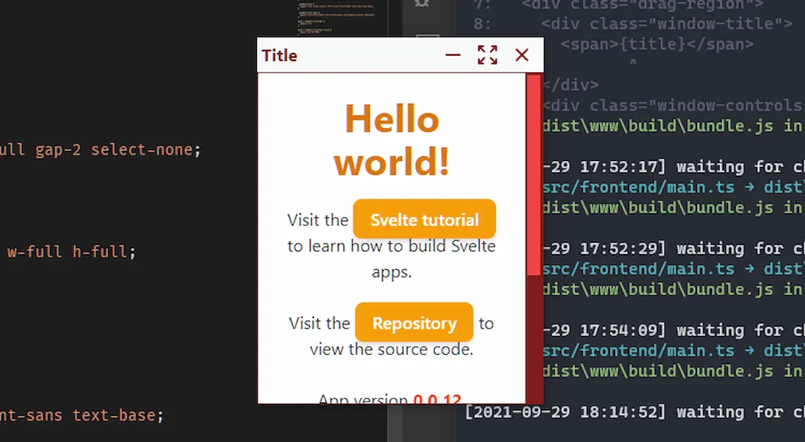

After some testing I decided not to use the windows that Electron creates by default. I decided to create my own titlebar, with Windows-style control buttons. There are many tutorial guides on the internet. I was inspired by a [Ronnie Dutta](https://github.com/binaryfunt/electron-seamless-titlebar-tutorial) project.

### Update the dependencies

A little note before starting with this post. I'm not starting from scratch but I still use my [el3um4s/memento-svelte-electron-typescript](https://github.com/el3um4s/memento-svelte-electron-typescript) template. At first, as usual, I make sure I have all the dependencies updated to the latest version:

```shell
npm run check-updates
```

### Create a window without a titlebar

First I create a window without a titlebar by setting the `frame` property to `false`:

```js
const settings = {
//...
  frame: false,
  backgroundColor: '#FFF'
//...
}
let window = new BrowserWindow({...settings})
```

### Add basic styles

For aesthetic reasons I add some basic styles to the `tailwind.pcss` file:

```css
@import "tailwindcss/base";
@import "tailwindcss/components";
@import "tailwindcss/utilities";

/** Modify your Tailwind layers etc. here **/
@layer base {
  * {
    @apply m-0 p-0 border-0 align-baseline;
  }
  html,
  body {
    @apply flex relative w-full h-full m-0 box-border text-gray-900;
  }
  body {
    @apply overflow-y-hidden;
  }
}
```

The only odd class is `overflow-y-hidden`. It is used to hide the scrollbar from the Electron window. I'll be using a custom scrollbar attached to the main section of the page.

When I start the app (with `npm run dev`) I get a window like this:



What's the problem? A window without a titlebar has no close buttons and cannot be moved. It's time to add a custom titlebar.

### Add a custom titlebar

Doing some testing the best way seems to be to create a component `src/frontend/Componentes/MainWithTitlebar.svelte` in which to insert both the titlebar and the main section of the page.

I write the basic code:

```html
<header />

<main>
  <slot />
</main>
```

Then I add the component to `App.svelte`:

```html
<script lang="ts">
  import "./css/tailwind.pcss";
  import MainWithTitlebar from "./Components/MainWithTitlebar.svelte";
</script>

<MainWithTitlebar>
  <p>
    Visit the <a
      href="https://github.com/el3um4s/memento-svelte-electron-typescript"
      class="btn-orange hover:no-underline">Repository</a
    > to view the source code.
  </p>
</MainWithTitlebar>
```

Obviously this does not cause any visible changes. I need to add some styles to my component:

```html
<style lang="postcss">
  header {
    @apply block fixed w-full h-8 p-1 bg-gray-50 text-red-900 font-bold;
  }

  main {
    @apply mt-8 p-5 overflow-y-auto w-full border border-red-900;
    height: calc(100% - theme("spacing.8"));
  }
</style>
```

I set the header height to 32px using Tailwind's `h-8` class and set the underlying page height accordingly:

```css
main {
  height: calc(100% - theme("spacing.8"));
}
```


It is not enough to set a titlebar to be able to move a window. Fortunately, Electron allows you to enable this possibility quite easily. Just add the CSS style `-webkit-app-region: drag`:

```html
<header>
  <div class="drag-region"></div>
</header>
<style lang="postcss">
  .drag-region {
    @apply w-full h-full;
    grid-template-columns: auto 138px;
    -webkit-app-region: drag;
  }
</style>
```

### Add window control buttons

Now the window can move. But I also want to be able to close, minimize and zoom it. I need some buttons:

```html
<div class="window-controls">
  <div class="button">Minimize</div>
  <div class="button">Maximize</div>
  <div class="button">Close</div>
</div>

<style lang="postcss">
.window-controls {
  @apply grid grid-cols-3 absolute top-0 right-2 h-full gap-2 select-none;
  -webkit-app-region: no-drag;
}
.button {
  @apply row-span-1 flex justify-center items-center w-full h-full;
}
.button:hover {
  @apply bg-red-600;
}
</style>
```

I set the button area as `no-drag` to make it easier to click on the buttons. And speaking of buttons, in the code above I used some writing but maybe it's better to use icons. Tailwind allows you to easily use [heroicons](https://heroicons.com/) icons. I take advantage of it and create some Svelte components to display the icons. This, for example, is the `IconClose.svelte` component:

```html
<script lang="ts">
  let customClass: string = "h-5 w-5";
  export { customClass as class };
</script>

<svg
  xmlns="http://www.w3.org/2000/svg"
  class={customClass}
  viewBox="0 0 20 20"
  fill="currentColor"
>
  <path
    fill-rule="evenodd"
    d="M4.293 4.293a1 1 0 011.414 0L10 8.586l4.293-4.293a1 1 0 111.414 1.414L11.414 10l4.293 4.293a1 1 0 01-1.414 1.414L10 11.414l-4.293 4.293a1 1 0 01-1.414-1.414L8.586 10 4.293 5.707a1 1 0 010-1.414z"
    clip-rule="evenodd"
  />
</svg>
```

After creating the icons I insert them in the titlebar:

```html
<script lang="ts">
  import IconMinimize from "./Icons/IconMinimize.svelte";
  import IconMaximize from "./Icons/IconMaximize.svelte";
  import IconClose from "./Icons/IconClose.svelte";
</script>

<header>
  <div class="drag-region">
    <div class="window-controls">
      <div class="button">
        <IconMinimize />
      </div>
      <div class="button">
        <IconMaximize />
      </div>
      <div class="button">
        <IconClose />
      </div>
    </div>
  </div>
</header>
```

### Add the title to the window

There can be several ways to add the title to a window. A simple way is this:

```html
<script lang="ts">
  export let title: string = "Title";
</script>

<header>
  <div class="drag-region">
    <div class="window-title">
      <span>{title}</span>
    </div>
</header>

<style lang="postcss">
.window-title {
  @apply flex items-center left-2 overflow-hidden font-sans text-base;
}

.window-title span {
  @apply overflow-hidden overflow-ellipsis whitespace-nowrap leading-6;
}
</style>
```



### Customize the scrollbar

Electron shows the Chrome scrollbar by default. I can change its style with some CSS code:

```css
main::-webkit-scrollbar {
  @apply w-4;
}

main::-webkit-scrollbar-track {
  @apply bg-red-900;
}

main::-webkit-scrollbar-thumb {
  @apply bg-red-500 border-2 border-red-900 border-solid;
}

main::-webkit-scrollbar-thumb:hover {
  @apply bg-red-300;
}
```

This is the result:



### Enable buttons

Nothing happens if I click on the buttons, also because I haven't added any functions. I resolve immediately:

```html
<script lang="ts">
  function minimize() {}
  function maximize() {}
  function close() {}
</script>

<div class="window-controls">
  <div class="button" on:click={minimize}>
    <IconMinimize />
  </div>
  <div class="button" on:click={maximize}>
    <IconMaximize />
  </div>
  <div class="button" on:click={close}>
    <IconClose />
  </div>
</div>
```

Obviously the functions must be filled with code. What can I use? I need to use a specific API. I create the `src/electron/IPC/windowControl.ts` file:

```ts
import { SendChannels } from "./General/channelsInterface";
import IPC from "./General/IPC";
import { BrowserWindow } from "electron";

const nameAPI = "windowControls";

const validSendChannel: SendChannels = {
  "minimize": minimize,
  "maximize": maximize,
  "unmaximize": unmaximize,
  "close": close
};

const validReceiveChannel: string[] = [];

const windowControls = new IPC ({
  nameAPI,
  validSendChannel,
  validReceiveChannel
});

export default windowControls;

function minimize(customWindow: BrowserWindow, event: Electron.IpcMainEvent, message: string) {
  customWindow.minimize();
}

function maximize(customWindow: BrowserWindow, event: Electron.IpcMainEvent, message: string) {
  customWindow.maximize();
}

function close(customWindow: BrowserWindow, event: Electron.IpcMainEvent, message: string) {
  customWindow.destroy();
}

function unmaximize(customWindow: BrowserWindow, event: Electron.IpcMainEvent, message: string) {
  customWindow.unmaximize()
}
```

Register the new API on `src/electron/preload.ts`:

```ts
import { generateContextBridge } from "./IPC/General/contextBridge"

import systemInfo from "./IPC/systemInfo";
import updaterInfo from './IPC/updaterInfo';
import windowControls from './IPC/windowControls'

generateContextBridge([systemInfo, updaterInfo, windowControls]);
```

Finally I allow the main Electron window to use the API. I edit the `src/electron/index.ts` file:

```ts
//...
import windowControls from './IPC/windowControls';

async function createMainWindow() {
  mainWindow = new CustomWindow();
  const urlPage = path.join(__dirname, 'www', 'index.html');
  mainWindow.createWindow(urlPage);
  await mainWindow.setIpcMain([systemInfo, updaterInfo, windowControls]);
}
```

This allows me to go back to the component I'm working on (`MainWithTitlebar.svelte`) and add the missing functions:

```js
function minimize() {
  globalThis.api.windowControls.send("minimize", null);
}
function maximize() {
  globalThis.api.windowControls.send("maximize", null);
}
function close() {
  globalThis.api.windowControls.send("close", null);
}
```

Now I can use the various buttons to minimize, maximize and close the window.

### Reset the window size

However, there is an anomalous behaviour. When I maximize the window I would like to replace the `maximize` icon with another one. And maybe when I click I can restore the original window size.

To achieve this I can take advantage of the [`<svelte:window>`](https://svelte.dev/docs#svelte_window) element. By inserting it into my Svelte component I can intercept some events related to the window without leaving the component itself.

Why do I have to do this? Because I haven't found an easier way to tell when the window is full screen. Then I have to use a trick: I check the size of the window. If the window is at least as big as the screen then I assume it is maximized. Otherwise no.

```html
<script>
let outerW = globalThis.outerWidth - 8;
let isMaximized = outerW >= globalThis.screen.availWidth;

$: {
  isMaximized = outerW >= globalThis.screen.availWidth;
}
</script>

<svelte:window bind:outerWidth={outerW} />
```

In Svelte, [`$:` marks a statement as reactive](https://svelte.dev/docs#3_$_marks_a_statement_as_reactive): this greatly simplifies the necessary code.

Now I just have to add the function:

```js
function unmaximize() {
  globalThis.api.windowControls.send("unmaximize", null);
}
```

and then:

```html
<header>
  <div class="drag-region">
    <div class="window-title">
      <span>{title}</span>
    </div>
    <div class="window-controls">
      <div class="button" on:click={minimize}>
        <IconMinimize />
      </div>
      {#if isMaximized}
        <div class="button" on:click={unmaximize}>
          <IconUnmaximize />
        </div>
      {:else}
        <div class="button" on:click={maximize}>
          <IconMaximize />
        </div>
      {/if}
      <div class="button" on:click={close}>
        <IconClose />
      </div>
    </div>
  </div>
</header>

<main>
  <slot />
</main>
```

### Link

That's all. Finally some useful links:

- the project on GitHub: [el3um4s/memento-svelte-electron-typescript](https://github.com/el3um4s/memento-svelte-electron-typescript)
- my Patreon: [patreon.com/el3um4s](https://patreon.com/el3um4s)
- [Svelte](https://svelte.dev/)
- [TailwindCSS](https://tailwindcss.com/)
- [ElectronJS](https://www.electronjs.org/)
- [TypeScript](https://www.typescriptlang.org/)
