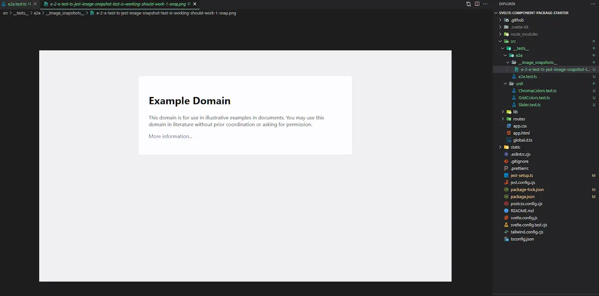
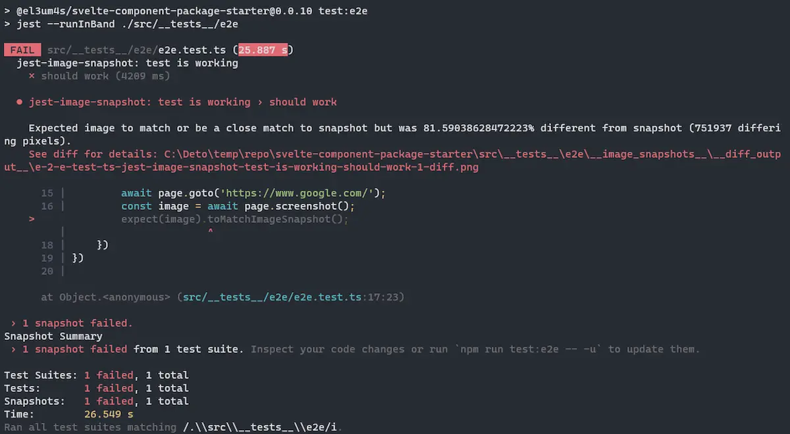
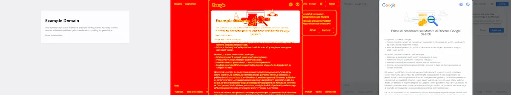
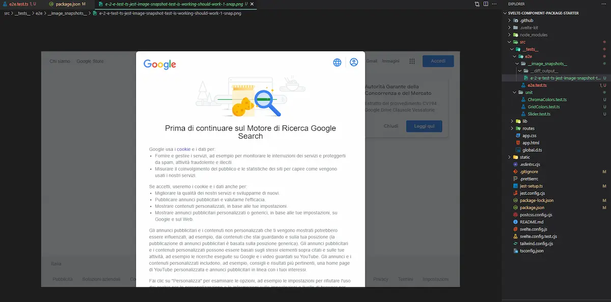
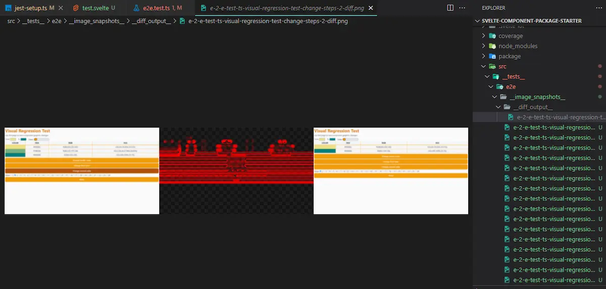
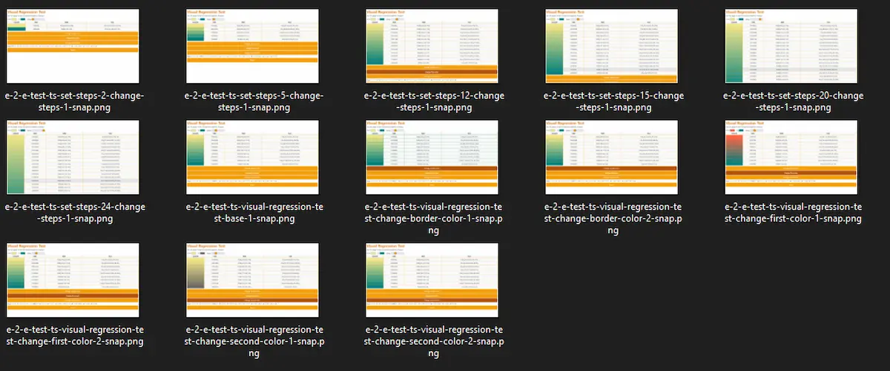

I am more and more comfortable with [test-driven development (TDD)](https://en.wikipedia.org/wiki/Test-driven_development). Editing your code is easier by knowing right away when something is wrong. Of course I don't know everything yet. A problem I had to face is related to unwanted changes in the graphic aspect of a web page. To solve this problem I had to learn how to perform Visual Regression Tests.

### Choose the tools

For a general overview I recommend reading this article by [Leonardo Giroto](https://medium.com/loftbr/visual-regression-testing-eb74050f3366), it is from some time ago but it is well written. For what concerns my problem, however, I have evaluated 3 options. In summary, I have considered [cypress](https://www.cypress.io/), [Puppeteer](https://pptr.dev/) and [Playwright](https://playwright.dev/). They are all valid tools but only Playwright allows you to easily interface with [Electron](https://www.electronjs.org/). I know, I know, this is my need: the project I have in mind includes a part built with Electron so this feature is fundamental for me.

It's time to get started with the code. So I pick up my [Svelte Component Package Starter](https://github.com/el3um4s/svelte-component-package-starter) template and start by adding Playwright:

```shell
npm i -D playwright @playwright/test
```

And then I install the browsers to use for testing

```shell
npx playwright install
```

For a basic use I don't need anything else but I prefer to continue using [Jest](https://jestjs.io/). I need an additional package: [Jest Image Snapshot](https://github.com/americanexpress/jest-image-snapshot):

```shell
npm i --save-dev jest-image-snapshot @types/jest-image-snapshot
```

### Put the old tests in order

It is a good practice to keep e2e (End to End) tests separate from unit tests. So I slightly modify the structure of my template and create the two directories `src/__tests__/unit` and src `src/__tests__/e2e`:

```text
src
├── __tests__
│   ├── unit
│   │   ├── ChromaColors.test.ts
│   │   ├── GridColors.test.ts
│   │   └── Slider.test.ts
│   └── e2e
├── lib
├── routes
├── app.css
├── app.html
└── global.d.ts
```

I copy the previous tests into `unit`.

The first problem is that by running `npm run test` I am running both unit tests and e2e tests. I then modify `package.json` to keep the two tests separate:

```json
{
  // ...
  "scripts": {
    // ...
    "test": "cross-env TAILWIND_MODE=build jest --runInBand ./src/__tests__/unit",
    "test:e2e": "jest --runInBand ./src/__tests__/e2e",
  }
  //...
}
```

### Configure Jest to take screenshots

To use `Jest-Image-Snapshot` first I must extend `expect` to support `toMatchImageSnapshot`. So I edit `jest-setup.ts`:

```ts
import '@testing-library/jest-dom';
import { toMatchImageSnapshot } from 'jest-image-snapshot';

expect.extend({ toMatchImageSnapshot });
```

### Create a sample test

As a first test I need something simple and trivial, just to verify that everything works properly. I create the `e2e.test.ts` file:

```ts
import { Browser, chromium } from 'playwright';

describe('jest-image-snapshot: test is working', () => {
    let browser: Browser;

    beforeAll(async () => {
      browser = await chromium.launch();
    });
    afterAll(async () => {
      await browser.close();
    });

    test("should work", async () => {
        const page = await browser.newPage();
        await page.goto('https://www.example.com/');
        const image = await page.screenshot();
        expect(image).toMatchImageSnapshot();
    })
})
```

What does this test do? Use Playwright to launch a hidden browser, go to the `https://www.example.com` page, capture an image of the page and compare it with the one saved in memory. If a reference image does not exist, it creates a new one in the `__image_snapshots__` folder. I run:

```shell
npm run test:e2e
```

I get the picture:



Obviously this test is purely didactic: I need it to understand how to use this tool. I change the address of the page to open (use `www.google.com`). I rerun the test and I get



A new `__diff_output__` folder has also appeared with an image inside:



Differences between one image and another are highlighted in red. Being two completely different pages, almost everything is red.

I pretend for a moment that the new page is correct and that the differences are intentional. To pass the test I have to update the screenshot. I create a script that simplifies my work:

```json
"test:e2e-update": "jest --runInBand --updateSnapshot ./src/__tests__/e2e",
```

I run the script:

```shell
npm run test:e2e-update
```

Now my reference page has become:



This time by repeating the `npm run test: e2e` I get no errors.

### Create a custom test

Now is the time to write a more useful test. I create a `src/routes/test.svelte` page dedicated to testing:

```html
<script lang="ts">
	import GridColors from '$lib/components/GridColors.svelte';
	import { stringToColorStyle } from '../lib/functions/ChromaColors';

	const settings = {
		firstColor: 'khaki',
		secondColor: 'teal',
		steps: 9
	};

	settings.firstColor = stringToColorStyle(settings.firstColor).hex;
	settings.secondColor = stringToColorStyle(settings.secondColor).hex;

	let borderColor = 'orange';

	$: settings.firstColor = stringToColorStyle(settings.firstColor).hex;
	$: settings.secondColor = stringToColorStyle(settings.secondColor).hex;

	const changeBorderColor = () => (borderColor = borderColor === 'orange' ? 'green' : 'orange');
	const changeFirstColor = () =>
		(settings.firstColor =
			settings.firstColor === stringToColorStyle('khaki').hex ? 'tomato' : 'khaki');
	const changeSecondColor = () =>
		(settings.secondColor =
			settings.secondColor === stringToColorStyle('teal').hex ? 'dimgray' : 'teal');
	const reset = () => {
		settings.firstColor = 'khaki';
		settings.secondColor = 'teal';
		settings.steps = 9;
	};
</script>

<main>
	<h1>Visual Regression Test</h1>
	<p>Use this page to test component graphics changes</p>
	<div id="grid-colors">
		<GridColors {...settings} --border-color={borderColor} />
	</div>

	<section>
		<button id="change-border-color" on:click={changeBorderColor}>Change border color</button>
		<button id="change-first-color" on:click={changeFirstColor}>Change first color</button>
		<button id="change-second-color" on:click={changeSecondColor}>Change second color</button>

		<div>
			<span>Steps:</span>
			{#each Array(23) as array, i}
				<label>
					<input type="radio" bind:group={settings.steps} value={i + 2} />
					{i + 2}
				</label>
			{/each}
		</div>

		<button id="reset" on:click={reset}>Reset</button>
	</section>
</main>

<style lang="postcss">
	#grid-colors { @apply mb-2 mt-2; }

	main { @apply overflow-y-auto; }

	section { @apply flex flex-col space-y-1; }
</style>
```

I inserted various buttons and controls to test my component in various situations. I modify the `e2e.test.ts` file to refer to the test page:

```ts
import { Browser, chromium } from 'playwright';

describe('visual regression test', () => {
    let browser: Browser;

    beforeAll(async () => {
      browser = await chromium.launch();
    });
    afterAll(async () => {
      await browser.close();
    });

    test("test page", async () => {
        const page = await browser.newPage();
        await page.goto('http://localhost:3000/test');
        const image = await page.screenshot();
        expect(image).toMatchImageSnapshot();
    })
})
```

And I run the test with the command `npm run test: e2e`.

I'm not interested in a static screenshot, I'm interested in seeing what happens when I change the various parameters. Then I add an action to automatically click on various buttons, record the screen and then compare the result.

```ts
test("test page", async () => {
	const page = await browser.newPage();
	await page.goto('http://localhost:3000/test');

	const image = await page.screenshot();
	expect(image).toMatchImageSnapshot();

	await page.click('text=Change border color');
	let changeBorder = await page.screenshot();
	expect(changeBorder).toMatchImageSnapshot();
	await page.click('text=Change border color');

	changeBorder = await page.screenshot();
	expect(changeBorder).toMatchImageSnapshot();
})
```

I create tests for all buttons and controls in a similar way.

After fixing the tests I can go back to editing the code. The nice thing is that I do something wrong, or if something unexpected happens, I can get a warning and quickly realize that something is wrong:



Another interesting thing is that the screenshots give a good idea of the characteristics of the component and almost serve as documentation:



That's all. As usual, you can see the repository code at  [el3um4s/svelte-component-package-starter](https://github.com/el3um4s/svelte-component-package-starter).
