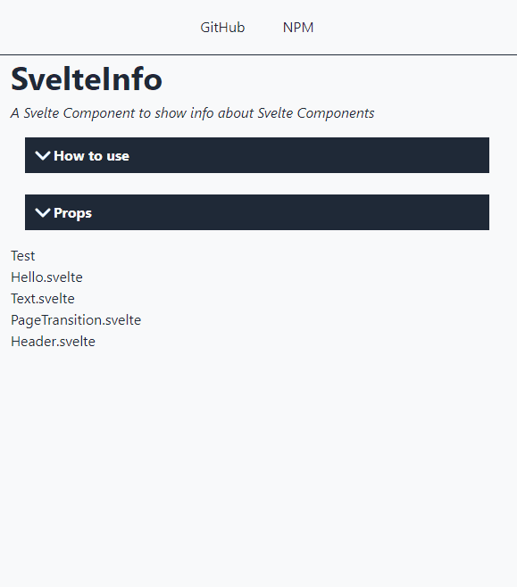

Sooner or later I will have to find the time to report what I am learning in these months. For example, that it is very difficult to predict how long it will take to complete a task.

My last idea (creating an automatic system to document Svelte components) is longer than I expected. The technique is not very complicated but there are too many details that I had not foreseen. Also my desire to understand how things work is leading me to take a long time to recreate some basic elements. The last in chronological order is the **accordion**: an element that you can be open and close with a click.

### What I want to build



Something simple, which does not depend on other libraries. Something which is quite light and customizable. [Svelte](https://svelte.dev/) makes it very easy to create. And [TailwindCSS](https://tailwindcss.com/) allows you to manage CSS styles.

### Let's start from the structure

```html
<script lang="ts">
  export let title:string = "Title";
</script>

<section>
  <header> {title} </header>
  <slot />
</section>
```

The basic structure is very simple, there are only 2 parts:

- one to use as the component **header** to insert the section title;
- the other is a simple **slot**: you can hide and show the content.

Of course, without adding any CSS styles or actions, the result is quite disappointing:


### Let's add some styles

I add some styles to highlight the title of the element and its margins. For this component I want to use a monochrome style. I am attracted to this kind of use of colors, but that's another story.

So I start by coloring the title:

```html
<script lang="ts">
  export let title: string = 'Title';
</script>

<section>
  <header>{title}</header>
  <slot />
</section>

<style lang="postcss">
  section {
    @apply flex flex-col p-2 m-2;
  }
  
  header {
    @apply flex flex-row items-center justify-start p-2 font-bold;
    background-color: var(--text-color, theme('colors.gray.800'));
    color: var(--background-color, theme('colors.gray.50'));
  }
</style>
```


I can't add a css style to the _slot_. But I can put it in a _div_ and stylize that:

```html
<div>
  <slot />
</div>

<style lang="postcss"> 
  div {
    @apply flex flex-col p-2 border border-solid w-full;
    background-color: var(--background-color, theme('colors.gray.50'));
    color: var(--text-color, theme('colors.gray.800'));
    border-color: var(--text-color, theme('colors.gray.800'));
  }
</style>
```


### Open and close

Svelte allows you to hide and display an element of the page in a very simple way. Using a simple `if...then...else` condition tied to a _prop_ I can check its status:

```html
<script lang="ts">
  export let title: string = 'Title';
  export let open: boolean = true;
</script>

<section>
  <header>{title}</header>
  {#if open}
    <div>
      <slot />
    </div>
  {/if}
</section>
```


### Let's add a rotating icon

I need a way to open the element with a click. To do this, I need a button and an animation to highlight the click. I found the video by [Johnny Magrippis](https://magrippis.com/) ([How to: Svelte Hamburger Menu Animation 🍔](https://www.youtube.com/watch?v=fWzKPUUQdQY)):

<iframe width="560" height="315" src="https://www.youtube.com/embed/fWzKPUUQdQY" title="YouTube video player" frameborder="0" allow="accelerometer; autoplay; clipboard-write; encrypted-media; gyroscope; picture-in-picture" allowfullscreen></iframe>

I recommend watching the video. To begin with, I need another component, Chevron.svelte, in which to insert an `svg` image:

```html
<svg
  xmlns="http://www.w3.org/2000/svg"
  viewBox="0 0 24 24"
  fill="none"
  stroke-linecap="round"
  stroke-linejoin="round"
  stroke-width="3"
>
  <path d="M19 9l-7 7-7-7" />
</svg>
```

I'd like to add a few styles to integrate it into the title of the main component:

```html
<svg
  xmlns="http://www.w3.org/2000/svg"
  viewBox="0 0 24 24"
  fill="none"
  stroke-linecap="round"
  stroke-linejoin="round"
  stroke-width="3"
>
  <path d="M19 9l-7 7-7-7" />
</svg>

<style lang="postcss">
  svg {
    @apply h-6 w-6;
    stroke: var(--background-color, theme('colors.gray.50'));
    background-color: var(--text-color, theme('colors.gray.800'));
  }
</style>
```


The purpose of this icon is to be a button: when clicked, it opens or closes the underlying part of the accordion. So I put it in a `button` element and add two `props` to it:

```html
<script lang="ts">
  export let open = false;
  export let onClick = () => {
    open = !open;
  };
</script>

<button on:click="{onClick}">
  <svg
    class:open
    xmlns="http://www.w3.org/2000/svg"
    viewBox="0 0 24 24"
    fill="none"
    stroke-linecap="round"
    stroke-linejoin="round"
    stroke-width="3"
  >
    <path d="M19 9l-7 7-7-7" />
  </svg>
</button>
```

I use the `open` prop as a CSS class. In this way, when the element is open, I can change the icon. I want to rotate it 180 degrees. So I add some CSS styles useful for this purpose:

```html
<style>
  :root {
    --transition-duration: 500ms;
  }
  button {
    cursor: pointer;
    display: flex;
    align-items: center;
    overflow: hidden;
  }
  svg {
    transition: transform var(--transition-duration);
  }
  .open {
    transform: rotate(180deg);
  }
</style>
```


### Let's add an action to the component

Now that the icon does its job I can go back to the main component and insert an action:

```html
<script lang="ts">
  import Chevron from "../icons/Chevron.svelte";
  export let title: string = "Title";
  export let open: boolean = true;
  let onClick = () => {
    open = !open;
  };
</script>

<section>
  <header>
    <Chevron {open} {onClick} />
    {title}
  </header>
  {#if open}
  <div>
    <slot />
  </div>
  {/if}
</section>
```

By clicking on the icon, I can finally open and close the accordion:


### Let's add a transition

The component works but it is not very nice to see a part of the page suddenly appear and disappear. To fix this I can use one of Svelte's features, the [transitions](https://svelte.dev/docs#svelte_transition):

```html
<script lang="ts">
	import Chevron from '../icons/Chevron.svelte';
	import { slide } from 'svelte/transition';
	
	export let title: string = 'Title';
	export let open: boolean = true;
	
	let onClick = () => {
		open = !open;
	};
</script>

<section>
	<header>
		<Chevron {open} {onClick} />
		{title}
	</header>
	{#if open}
		<div transition:slide={{ duration: 500 }}>
			<slot />
		</div>
	{/if}
</section>
```

And here is the final result:


As always, the code is available and downloadable from GitHub:

- [el3um4s/svelte-component-info](https://github.com/el3um4s/svelte-component-info)
