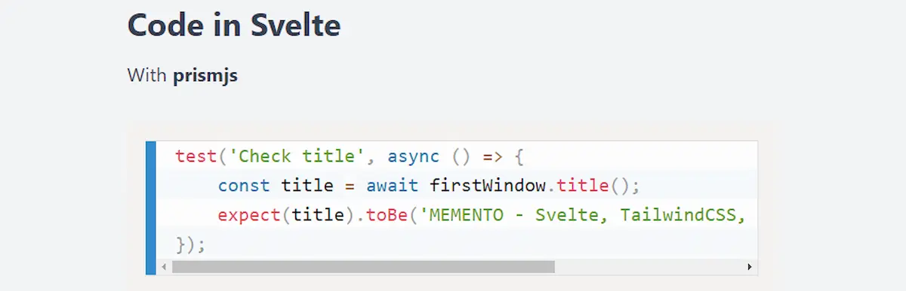
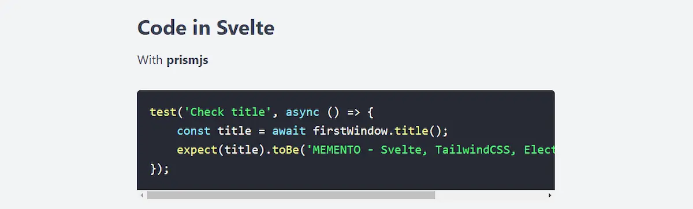
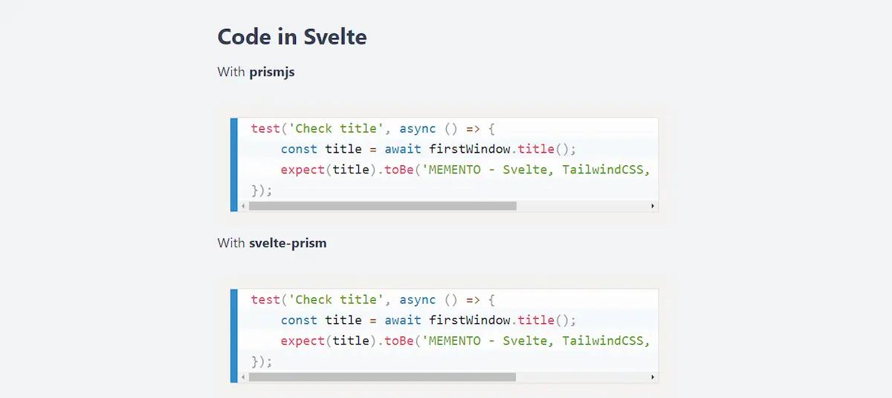
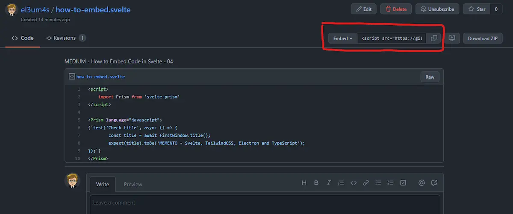
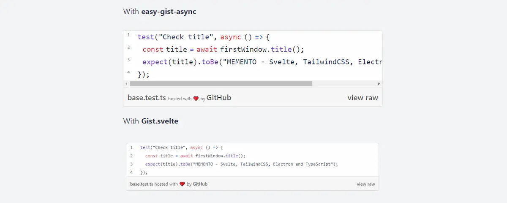
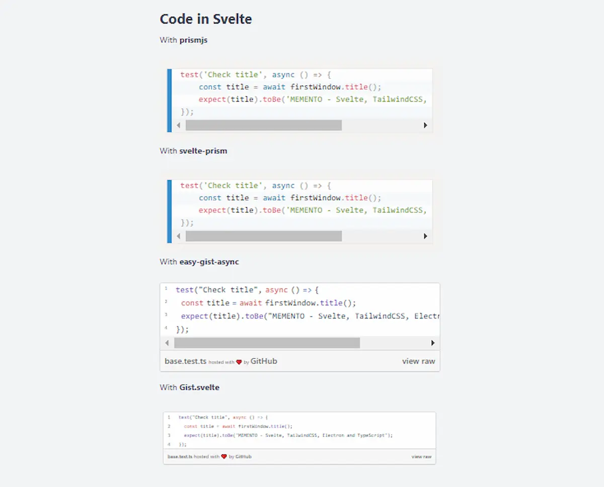

Sooner or later I will have to completely rewrite the code of my blog. Two years ago I switched from WordPress to Jekyll - it was a good choice. But the deeper I delve into [Svelte](https://svelte.dev/) the more curious I am to see what I can do. The last thing I got hooked on was how to show code snippets in Svelte. To my amazement it doesn't seem like a very in-depth topic, but I think I've found 4 ways that can work for me.

### PrismJS and Svelte

The first method is to use [Prismjs](https://prismjs.com/) directly on a Markdown page. As an example I use my [MEMENTO - SvelteKit & GitHub Pages](https://github.com/el3um4s/memento-sveltekit-and-github-pages). In this project the blog pages are `md` (markdown) files. Each page in the `blog` folder is a post from a hypothetical blog. And the code is shown using what's called `code fencing`:

```text
~~~javascript
function hello() {
  console.log("Hello World");
};
~~~
```

I want the code to look something like this:

```js
function hello() {
  console.log("Hello World");
};
```

How to do? First I import Prism into my template using:

```bash
npm i -D prismjs
```

I can use it directly in a Svelte file but it is better to insert it only once, in the `__layout__` file: in this way every piece of code will appear the same way on every post of the blog.

```html
<script context="module">
  import 'prismjs';
  import 'prismjs/themes/prism.css';
  import 'prismjs/themes/prism-coy.css';
</script>
```



Based on the blog theme I can change the theme used to show the codes. I can also use a custom theme, maybe `Dracula`. To use it I import [prism-themes](https://www.npmjs.com/package/prism-themes) with the command:

```bash
npm i -D prism-themes
```

then I import the theme in the file with:

```js
import "prism-themes/themes/prism-dracula.css";
```



### Svelte-Prism

The second way is to use a Svelte component: [svelte-prism](https://github.com/jakobrosenberg/svelte-prism). This component by [Jakob Rosenberg](https://github.com/jakobrosenberg) is very convenient if you work inside a file with the `.svelte` extension. Why? Because in this case I can't use the 3 backtick sequence.

I install the component:

```bash
npm i -D svelte-prism
```

then I import `svelte-prims`

```html
<script>
    import Prism from 'svelte-prism'
</script>

<Prism language="javascript">
{`test('Check title', async () => {
	const title = await firstWindow.title();
	expect(title).toBe('MEMENTO - Svelte, TailwindCSS, Electron and TypeScript');
});`}
</Prism>
```

The final result is almost identical to the first example:



### Embed GitHub Gist in Svelte with easy-gist-async

The third method is to use [GitHub Gist](https://gist.github.com/) to show the various code snippets. The advantage is the ability to show something much more beautiful. The main disadvantage is that the code to be shown lives outside the post: it makes it a little more complicated to edit.

Normally it would be enough to create a Gist and then copy the import code with the button at the top right



The problem is that the code to use is in this format:

```html
<script src="https://gist.github.com/el3um4s/b2ce146321ba67d7420f2a14f1a38544.js"></script>
```

This involves adding another js script to a Svelte page. But Svelte only accepts one Script element per component. Consequently, I create a new component.

I have found two ways to do this. The first is to use the npm [easy-gist-async](https://www.npmjs.com/package/easy-gist-async) package. I install it with:

```bash
npm i -D easy-gist-async
```

Then I create an `AsyncGist.svelte` component:

```html
<script>
	// https://www.npmjs.com/package/easy-gist-async
	import gistLoader from 'easy-gist-async';
	import { beforeUpdate, tick } from 'svelte';
	beforeUpdate(async () => {
		await tick();
		gistLoader();
	});
	export let dataGist = '';
</script>

<div data-gist={dataGist} />
```

I use my new component on my page:

```html
<script>
	import AsyncGist from '$lib/components/gist/AsyncGist.svelte';
</script>

<AsyncGist dataGist="https://gist.github.com/el3um4s/164a153b7097ca53ecd4904e12721bbd" />
```


The result depends on the style of the page into which the component is imported. It can be a good thing to customize the look but for what I need it is a problem.

### Gist.svelte

The last way is my reworking of this [svelte.dev/repl](https://svelte.dev/repl/2d4d41df9f404b2d896bb81c55cb75c0?version=3.44.0). The idea is to create an HTML frame around the imported script: in this way the original styles are maintained. Compared to the original code I have added a mechanism to vary the size of the frame based on the content. I think it is more convenient and more useful.

I create the `Gist.svelte` component:

```html
<script>
  export let src = '';
  export let title = '';
  src = src.slice(src.length - 3) === '.js' ? src : src + '.js';
  title = title === '' ? src : title;
  import { onMount } from 'svelte';
  let frame;
  let height = '30px';
  const barGistHeight = 30;
  onMount(() => {
    frame.srcdoc = `<script src='${src}'><${''}/script>`;
  });
  function getInnerHeight() {
    height = frame?.contentWindow?.document?.body?.scrollHeight + barGistHeight + 'px';
  }
</script>
<iframe src="about:blank" bind:this={frame} {title} {height} on:load={getInnerHeight} />
<style>
  iframe {
    border: 0;
    width: 100%;
  }
</style>
```

and I use it on my page:

```html
<script>
  import Gist from '$lib/components/gist/Gist.svelte';
</script>

<Gist src="https://gist.github.com/el3um4s/164a153b7097ca53ecd4904e12721bbd.js"/>

<Gist src="https://gist.github.com/el3um4s/164a153b7097ca53ecd4904e12721bbd"/>
```

The result I get is



Finally I can put all these techniques one after the other and I get

```html
<script>
  import Prism from '$lib/components/svelte-prism/Prism.svelte';
  import Gist from '$lib/components/gist/Gist.svelte';
  import AsyncGist from '$lib/components/gist/AsyncGist.svelte';
</script>

With **prismjs**

~~~ts
test('Check title', async () => {
  const title = await firstWindow.title();
  expect(title).toBe('MEMENTO - Svelte, TailwindCSS, Electron and TypeScript');
});
~~~

With **svelte-prism**

<Prism language="javascript">
{`test('Check title', async () => {
  const title = await firstWindow.title();
  expect(title).toBe('MEMENTO - Svelte, TailwindCSS, Electron and TypeScript');
  });`}
</Prism>

With **easy-gist-async**

<AsyncGist dataGist="https://gist.github.com/el3um4s/164a153b7097ca53ecd4904e12721bbd" />

With **Gist.svelte**

<Gist src="https://gist.github.com/el3um4s/164a153b7097ca53ecd4904e12721bbd.js"/>
```


