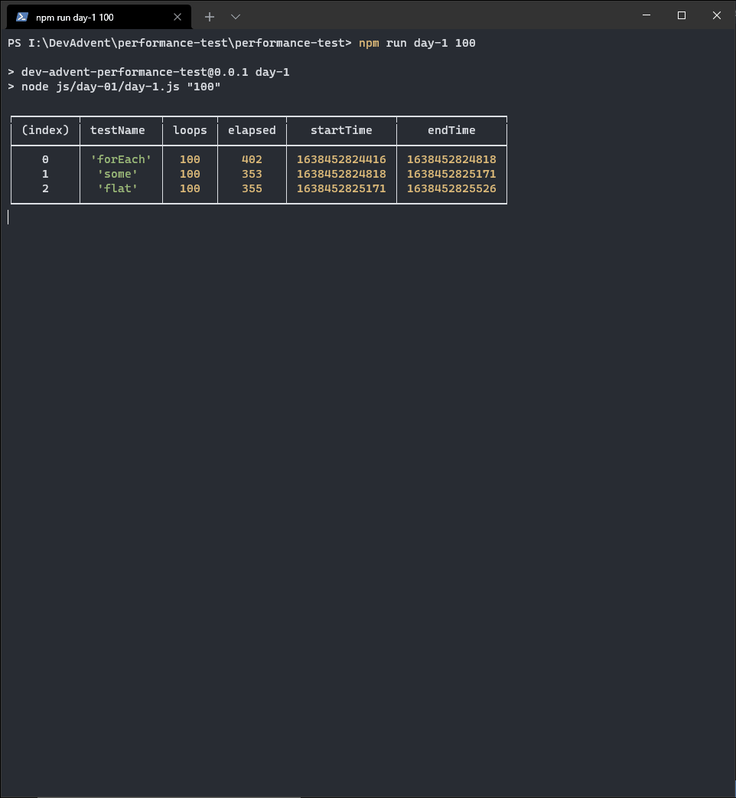

Whenever Christmas approaches, my wife begins her _Beads Advent Calendar_. It's something I've always envied her, her constancy and perseverance. On her advice I decided to try something similar too. Obviously not linked to the world of handcrafted jewelry (it would be a disaster) but linked to coding. Luckily YouTube recommended this video by [Marc Backes](https://www.youtube.com/c/MarcBackesCodes) to me. I like his idea for the **[Dev Advent Calendar 2021](https://github.com/devadvent/readme)**:

<iframe width="560" height="315" src="https://www.youtube.com/embed/AmtkdsTcHTo" title="YouTube video player" frameborder="0" allow="accelerometer; autoplay; clipboard-write; encrypted-media; gyroscope; picture-in-picture" allowfullscreen></iframe>

Of course, I still don't know if I'll be able to do my homework every day. I don't even know if I'll be able to write a post with my solution. I don't know about puzzles in advance, and I don't know if I'll have anything interesting to say. For the first problem, yes, there are a couple of interesting ideas.

### The first puzzle: find Rudolf


```text
Weeks before Christmas, Santa's reindeers start practicing their flying in order to be fit for the big night. Unfortunately, one of them (Rudolf) crashed and landed in the forest 🌲

Now, Santa 🎅 needs YOUR help to find him.
```

It is a search problem in an array of arrays. In other words I have to find coordinates of an element in a two-dimensional matrix. For example, if I have a matrix like this I expect to find Rudolf the reindeer at coordinates `(3, 2)`:

```js
const forest = [
  ["  ", "🌲", "🌲", "🌲"],
  ["🌲", "🌲", "🌲", "🌲"],
  ["🌲", "🌲", "🌲", "🦌"],
  ["🌲", "🌲", "🌲", "🌲"],
];
```

Instead in such a "forest" I will get negative coordinates, `(-1, -1)`:

```js
const forest = [
  ["🌲", "🌲", "🌲", "🌲"],
  ["🌲", "🌲", "🌲", "🌲"],
  ["🌲", "🌲", "🌲", "🌲"],
  ["🌲", "🌲", "🌲", "🌲"],
];
```

### Use forEach() to find an element in an array

The problem itself is quite simple. We can solve it in several ways. The most intuitive is to scroll through each line of the forest in search of Rudolf:

```ts
import type { Forest } from "./typeForest";

const findRudolf = (forest: Forest) => {
  const result = {
    col: -1,
    row: -1,
  };

  forest.forEach((row, index) => {
    const rudolfPosition = row.indexOf("🦌");
    if (rudolfPosition > -1) {
      result.row = index;
      result.col = rudolfPosition;
    }
  });

  return result;
};
```

The [Array.prototype.forEach()](https://developer.mozilla.org/en-US/docs/Web/JavaScript/Reference/Global_Objects/Array/forEach) method executes the same code for each element of an array. The code is simply a search of the index Rudolf (🦌) is in using [indexOf](https://developer.mozilla.org/en-US/docs/Web/JavaScript/Reference/Global_Objects/Array/indexOf). If the index is negative Rudolf is not in that row. If instead we get a positive index then we have found both the row and the column where to retrieve it.

### Use some() to find an element in an array

I wondered if there is a faster way to find an element in an array. There is no way to stop a **forEach()** loop before it ends. For example, if Rudolf is at `(0, 0)` coordinates, there is no need to go looking for him throughout the forest. But this code does exactly that, it keeps looking even if an answer has already been found.

To solve this problem I decided to use another method, [Array.prototype.some()](https://developer.mozilla.org/en-US/docs/Web/JavaScript/Reference/Global_Objects/Array/some). `some()` does exactly the same thing as `forEach` but with one small but substantial difference: it stops the loop when it finds the element. Or, better, when the defined condition turns out to be true.

So I rewrite the code:

```ts
import type { Forest } from "./typeForest";

const findRudolf = (forest: Forest) => {
  let col = -1;
  let row = -1;

  const found = forest.some((r, index) => {
    row = index;
    col = r.indexOf("🦌");
    return col > -1;
  });

  row = found ? row : -1;
  return {
    col,
    row,
  };
};
```

I save the coordinate value in two variables, `col` and `row`. But I also save an additional variable, `found`, to be used as a reference to find out whether or not I was able to find Rudolf. Then I loop for each element in the forest and break it when `r.indexOf("🦌") > -1`, which is when I have found the value "🦌" in the array.

### Use flat() to find an element in an array

Everything is very nice but I am not satisfied yet. I'd like to be able to avoid both `forEach()` and `some()`. So I decided to try another way. The basic assumption is that the forest is made up of rows all of the same size. If so then I can transform the two dimensional array into a one dimensional array. Then I use `indexOf("🦌")` to find Rudolf's position. Finally I convert that index into a pair of two-dimensional coordinates. At the basis of all this reasoning is the [Array.prototype.flat()](https://developer.mozilla.org/en-US/docs/Web/JavaScript/Reference/Global_Objects/Array/flat) method. The `flat()` method creates a new array with all sub-array elements concatenated into it recursively up to the specified depth.

Translating into code:

```ts
import type { Forest } from "./typeForest";

const findRudolf = (forest: Forest) => {
  const forestCols = forest[0].length;
  const rudolfPosition = forest.flat().indexOf("🦌");
  const row =
    rudolfPosition > -1 ? Math.floor(rudolfPosition / forestCols) : -1;
  const col = rudolfPosition > -1 ? rudolfPosition - row * forestCols : -1;

  return {
    col,
    row,
  };
};
```

### What is the best method?

At this point I asked myself: well, I have three methods to find an element in a two-dimensional array, but what is the most efficient method?

To answer this question, I went looking for some clever methods to measure the performance of a function. The best method is the most common: record the time it takes for various functions to perform the same operation many times and compare them. In my research I have found some very informative readings. I recommend reading this post by Zell Liew, [Testing JavaScript Performance](https://zellwk.com/blog/performance-now/).

I create a function to use to calculate the execution time of a single function:

```ts
function perfDate(message: string, callback: Function, loops: number) {
  const startTime = Date.now();

  let i = loops;
  while (i) {
    callback();
    i = i - 1;
  }

  const endTime = Date.now();
  const elapsed = endTime - startTime;

  return {
    testName: message,
    loops,
    elapsed,
    startTime,
    endTime,
  };
}
```

Then I create a set of random forests in which to look for the reindeer. I think a sample of 1,000,000 forests is enough for my tests

```ts
const tree = "🌲";
const rudolf = "🦌";
const forests: Array<Forest> = createMultipleForests(1000000);

function createMultipleForests(n: number): Array<Forest> {
  const forests = new Array<Forest>(n);
  forests.forEach((f) =>
    createForest(getRandomInt(10, 1000000), getRandomInt(10, 1000000))
  );
  return forests;
}

function createForest(col: number, row: number): Forest {
  const arrayTrees = new Array(col).fill(tree);
  const forest: Forest = new Array(row).fill(arrayTrees);
  const r = getRandomInt(0, row);
  const c = getRandomInt(0, col);
  if (Math.random() > 0.1) {
    forest[r][c] = rudolf;
  }
  return forest;
}

function getRandomInt(min: number, max: number): number {
  min = Math.ceil(min);
  max = Math.floor(max);
  return Math.floor(Math.random() * (max - min) + min);
}
```

And I create functions to search for Rudolf sequentially in each of the forests:

```ts
import findRudolf_forEach from "./solution-1";
import findRudolf_some from "./solution-2";
import findRudolf_flat from "./solution-3";

const a = () => forests.forEach((f) => findRudolf_forEach(f));
const b = () => forests.forEach((f) => findRudolf_some(f));
const c = () => forests.forEach((f) => findRudolf_flat(f));
```

Finally, I do some testing:

```ts
const args = process.argv.slice(2);
const l: number = parseInt(args[0]);

const resultGeneral = [];

resultGeneral.push(perfDate("forEach", a, l));
resultGeneral.push(perfDate("some", b, l));
resultGeneral.push(perfDate("flat", c, l));

console.table(resultGeneral);
```

I get something like this:



There does not seem to be a clear predominance of one method over another. I decide to save the test values in a file and try to see if the raw numbers can help. I install an additional package, [jsonexport](https://www.npmjs.com/package/jsonexport) to help me with the conversion of the `resultGeneral` variable and create a csv file:

```ts
import fs from "fs";
import jsonexport from "jsonexport";

jsonexport(resultGeneral, function (err: Error, csv: string) {
  if (err) return console.error(err);
  fs.writeFileSync("day-1.csv", csv);
});
```

After importing the results into Excel I get this chart:


Well, what about? So much effort for nothing: in my tests the performance of three methods is almost equivalent. But now it's time to put down the keyboard, to take the lantern and help the elves in the forest to find Rudolf.
