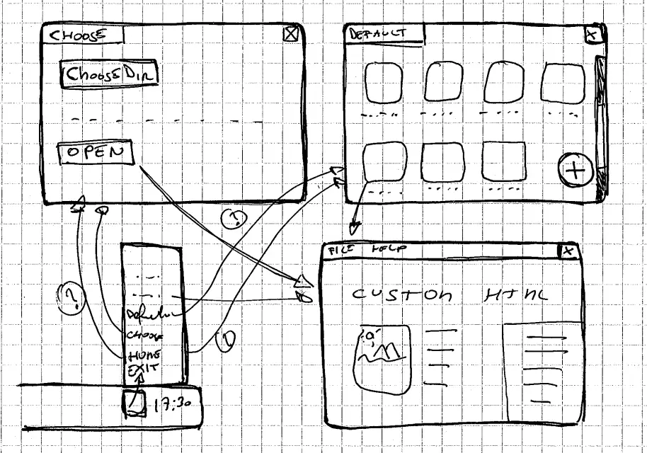
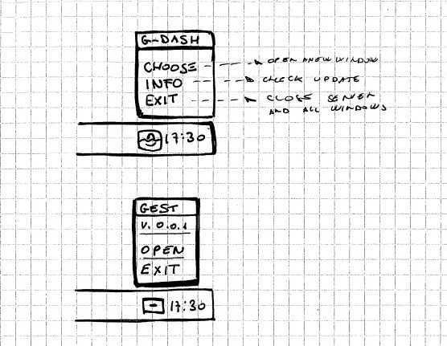
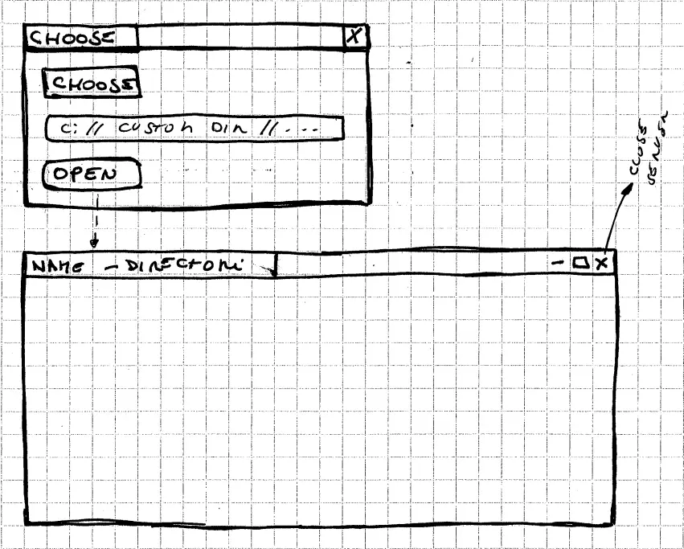
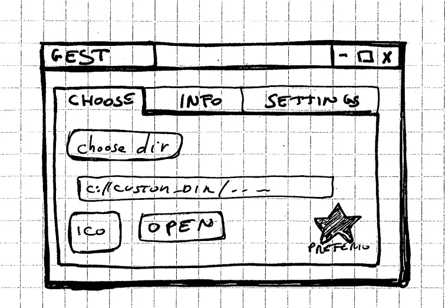
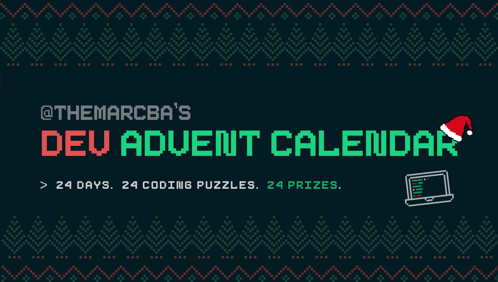
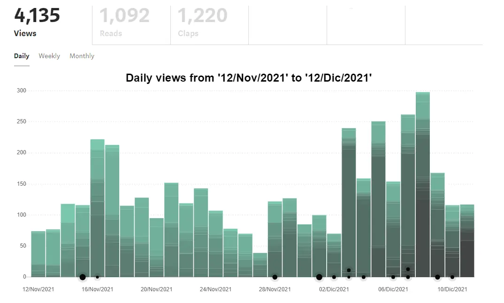

It's been 3 months since I wrote [Some notes about the future](https://blog.stranianelli.com/some-notes-about-the-future-and-how-to-use-svelte-with-construct-3-english/). It is time to see how it is progressing. Also because I haven't published anything on Patreon in the last month, and I'm sorry.

### Patreon and me

I start with this. Although Patreon can be an excellent platform, it has a major limitation: it is not easy to share code snippets. This is a fundamental aspect for me. Virtually all of my posts contain code examples. I have no intention, for the moment, of changing.

Why?

Because my articles are nothing more than my travel diary. They are my notes and my considerations. My findings and my mistakes. They are used to keep track of what I learn, to be able to find it in the future and to share it with those who find themselves facing the same problems.

So I have to decide what to do. I think the best thing is to regularly post updates on my various projects. And post links to articles on my blog (and Medium - but I'll come back to that in a moment). That way I can avoid filling Patreon with illegible posts. I can also avoid turning it into a page with only links to my blog. I can also use this space as an excuse to make a point about how my project is progressing, too and that's what I like best. And I can talk about my difficulties.

The next question is: how often? I do not know this. Definitely at least once a month. Maybe two.

### GEST-DASHBOARD: Go back to go forward

These three months, and I believe the next, have been characterized by going back. I started working on the `gest-dashboard` project and ran into many of my limitations.

The idea of the project is to create an Electron application that can open folders on a PC and read them as if they are on a server.

Why? Because I want to create some applications that can live offline. But I don't want something that requires advanced software development knowledge.

I try to explain myself better. I am interested in having a simple method to locally run an application saved as an html folder. The user launches the main program, then chooses the folder to open and can start using the app without having to set up any local server.

This way I don't have to create a program with Electron for every single app.

I am well aware that this is a very special need, and it will probably prove to be a mere exercise in style. But it's not a simple problem, not for me.

In dealing with all this, I noticed my shortcomings. Shortcomings given by the lack of academic training. In other words, I lack the basics. As a result, I have to work hard to build them.

### Understanding how Electron works

A big part of my free time was spent figuring out how to build applications with Electron. And just as much time to understand how to keep them updated and test them. I have tracked all of this in some articles.

These are the links on my blog:

- [Electron and TypeScript: how to use ipcMain and ipcRenderer](https://blog.stranianelli.com/electron-ipcmain-ipcrenderer-typescript-english/)
- [How to Test Electron Apps](https://blog.stranianelli.com/how-to-test-electronjs-app-english/)
- [Electron seamless titlebar with Svelte and Tailwind](https://blog.stranianelli.com/electron-seamless-titlebar-with-svelte-and-tailwind-english/)

While these are the links on Medium:

- [How to Use ipcMain and ipcRenderer](https://el3um4s.medium.com/electron-and-typescript-how-to-use-ipcmain-and-ipcrenderer-english-4ebd4addf8e5)
- [How to Test Electron Apps](https://betterprogramming.pub/how-to-test-electron-apps-1e8eb0078d7b)
- [Electron seamless titlebar with Svelte and Tailwind](https://el3um4s.medium.com/electron-seamless-titlebar-with-svelte-and-tailwind-bd4d53d81c67)

These articles are not enough to understand how to create an app with Electron. They show some of the problems I had to face. I have written others, and I plan to write more on this topic in the future.

### How to create Web Components

But at this point I ran into two other shortcomings. First of all my poor knowledge of style sheets (aka CSS). Secondly, my lack of knowledge of modern frameworks for building web applications.

After doing some testing, I convinced myself to try [TailwindCSS](https://tailwindcss.com/). I hate to admit it but it was a breath of fresh air.

Especially because I then decided to combine Tailwind with my other recent discovery: [Svelte](https://svelte.dev/):

_Svelte is a radical new approach to building user interfaces. Whereas traditional frameworks like React and Vue do the bulk of their work in the browser, Svelte shifts that work into a compile step that happens when you build your app._

Obviously I wrote a guide on it, to remind the future me of the various steps to take:

- blog: [Tailwind CSS & Svelte](https://blog.stranianelli.com/tailwind-and-svelte-english/)
- medium: [Tailwind CSS & Svelte](https://el3um4s.medium.com/tailwind-css-svelte-315075404c04)

I wanted to learn more about how to create a Svelte component:

- blog: [How to create and publish Svelte components](https://blog.stranianelli.com/how-to-create-svelte-componentes-english/)
- medium: [How to create and publish Svelte components](https://el3um4s.medium.com/how-to-create-and-publish-svelte-components-e770f1e94435)

On the blog and on Medium there are other articles on this topic.

### How to document the code

The next problem is a classic: I'm writing a lot of code, sometimes not entirely clear. Sometimes the code gets tangled and complicated to read, modify, fix and improve. I have approached this puzzle from multiple sides. I tried to keep the code as clean as possible, continuing to refract the functions, methods, variables and structure of the code itself.

Then I discovered the importance of continuous testing. Not only as a tool to verify the correctness of the code but also to understand how it works. After all, as an amateur programmer, the tests turned out to be the best documentation possible. On the one hand they show how a given part of an application works, on the other hand it shows what result to expect. Good tests are also used to show all the borderline cases, perhaps those you would never think about but which when they arise create endless problems.

But then there is the aspect of how to document the operation of a module or component to others. Solving this took me a long time. Maybe even too long.

I haven't written much about documenting code, just an article. However, I plan to write a second part in some time:

- blog: [How to Document Svelte Components](https://blog.stranianelli.com/hypothesis-how-to-document-svelte-components-english/)
- medium: [How to Document Svelte Components](https://betterprogramming.pub/how-to-document-svelte-components-ab504661a6fc)

Creating this component forced me to go a little deeper with how Svelte works. In the end it is a a vicious circle.

### Dev Advent Calendar

Programming in your free time sometimes is exhausting, especially when you feel like you're not making progress. It's an important passion for me, but there are times when it's hard to find the motivation to keep going. Over time I have learned that the best way to deal with this situation is to impose something on me.

<iframe width="560" height="315" src="https://www.youtube.com/embed/AmtkdsTcHTo" title="YouTube video player" frameborder="0" allow="accelerometer; autoplay; clipboard-write; encrypted-media; gyroscope; picture-in-picture" allowfullscreen></iframe>

By pure chance I discovered this project: solving a different puzzle every day, from December 1st until Christmas. The problems posed are simple but they are forcing me to delve into some aspects of JavaScript that I have always overlooked. I am discovering a lot of interesting things. Maybe they will be trivial but I did not know them.

I created a list on Medium to keep track of my solutions:

- medium: [Dev Advent Calendar](https://el3um4s.medium.com/list/dev-advent-calendar-89d163132d6e)

On the blog you can follow the tag [#dev-advent](https://blog.stranianelli.com/tags/#dev-advent).

### Medium

And speaking of lists, in addition to the one on the Advent calendar there are two other lists in which I have included my articles. Obviously they are also all present on my blog, but here it seems to me that they are a little more in order.

The first list contains the articles I wrote about Electron:

- medium: [Electron](https://el3um4s.medium.com/list/electron-029651cc3a36)

The second is on Svelte, SvelteKit and partly also on TailwindCSS:

- medium: [Svelte & SvelteKit](https://el3um4s.medium.com/list/svelte-sveltekit-bf5be8834fbf)

But why did I start publishing on Medium? For several, partly contradictory reasons.

First of all because I have found that it is quite fast to import my posts to Medium. So trying took me a very limited investment of time.

Secondly it is possible to show the code of my examples using various techniques. Among all, it is possible to show the code saved on [GitHub Gist](https://gist.github.com/) with a simple copy and paste. And since I use GitHub for my blog, well, it's too simple.

The third reason is related to the future. I plan to rewrite the code behind my blog. I'm not sure how yet, but I'd like to distinguish the various parts better. And Medium allows you to link your profile to a custom domain. It's something I'm thinking about but haven't decided yet.

Finally, I was curious to see how my articles would perform in monetary terms. On this it is too early to reason but there are some interesting aspects. And then I like to see the number of views grow. It's a question of vanity but give it to me, please.

### The next steps

What are the next steps to take? Well, first finish fixing the component to document the components. What a recursive sentence!

Then, having done this, I have to go back to the `gest-dashboard` project. I want to do a test by studying this repository: [AshleyScirra/servefolder.dev](https://github.com/AshleyScirra/servefolder.dev). It might be the right solution to my problem but it's too early to tell.

Then I have other ideas but if in a month I have finished with these two I will be more than happy.
