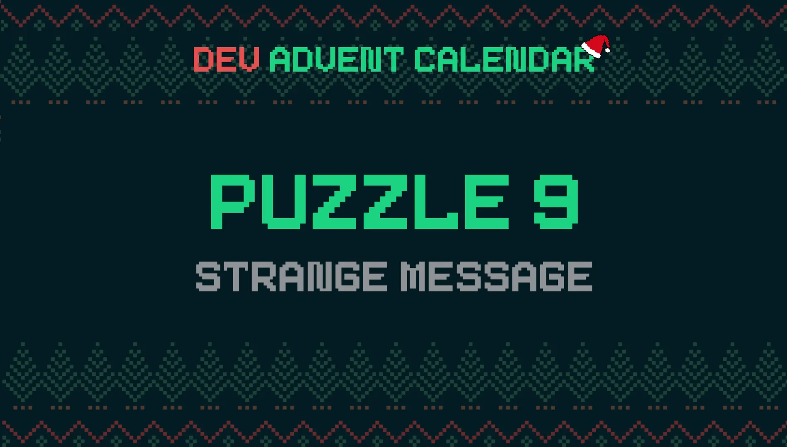

I'm a bit late today. Yesterday Santa Claus made a spree. I can't tell you the time he came back! He has even messed with the elves' secret code and can no longer decipher their messages. Fortunately, or unfortunately, the encryption code is quite weak. So weak that a line of code is enough to decrypt it.

### The puzzle: Strange Message 📜



Today's problem, issue 9 of the [Dev Advent Calendar 🎅](https://github.com/devadvent/puzzle-9) is a binary number conversion problem. What is a binary number? [Wikipedia](https://en.wikipedia.org/wiki/Binary_number) explains it pretty well:

`A binary number is a number expressed in the base-2 numeral system or binary numeral system, a method of mathematical expression which uses only two symbols: typically "0" (zero) and "1" (one).`

### Convert numbers to different bases

In a binary number the digits range from `0` to `1` and nothing more. They are only two but they are everything. Starting from a sequence of zeros and ones we can make computers, the internet, everything. Also write messages. We are not used to reading binary numbers and this complicates things a bit. We have to convert the various sequences into a number system that we handle better, generally the decimal one.

There are rules for converting a number from one base to another. JavaScript provides the [parseInt()](https://developer.mozilla.org/en-US/docs/Web/JavaScript/Reference/Global_Objects/parseInt) method. This method takes two arguments:

- a value in string format that represents a number
- a number that represents the number base used

`parseInt()` returns the value represented by the string as a base 10 number.

Let's take an example:

```js
parseInt("101010", 2); // 42
parseInt("101010", 3); // 273
parseInt("101010", 4); // 1092
parseInt("101010", 5); // 3255

parseInt(101010, 2); // 42
parseInt(1120, 3); // 42
parseInt(222, 4); // 42
parseInt(132, 5); // 1092
```

If, on the other hand, I want to do the reverse process, convert a decimal number into one of a different base, I can use the [Object.prototype.toString()](https://developer.mozilla.org/en-US/docs/Web/JavaScript/Reference/Global_Objects/Object/toString) method. I found that I always used it to convert a string to a number by implying that the number was base 10. This method takes a numeric argument. The argument indicates the conversion basis. In practice, to write the example above I used this code:

```js
let x = 42;

for (let b = 2; b <= 10; b++) {
  console.table(b, x.toString(b));
}
```

This is the result:

```js
3  '1120'
4  '222'
5  '132'
6  '110'
7  '60'
8  '52'
9  '46'
10 '42'
```

### Convert a number to text

After solving the problem of converting numbers from one base to another, the question remains: how to convert a number into a character? I can use [String.fromCharCode()](https://developer.mozilla.org/en-US/docs/Web/JavaScript/Reference/Global_Objects/String/fromCharCode). This method accepts as an argument a sequence of numbers between 0 and 65535 (0xFFFF) representing the UTF-16 encoding of unicode characters.

Long story short, each number between `0` and `65535` represents a distinct character. The `fromCharCode()` method allows you to convert a number into the corresponding character. Its inverse is the [String.prototype.charCodeAt()](https://developer.mozilla.org/en-US/docs/Web/JavaScript/Reference/Global_Objects/String/charCodeAt) method: it converts a character into a number code. So just to play I can write this:

```js
let a = "a".charCodeAt(); // 97

for (let n = 0; n < 5; n++, a++) {
  console.log(String.fromCharCode(a));
}

// a
// b
// c
// d
// e

console.log(String.fromCharCode(a + 11, a + 12, a + 13, a + 14));
// qrst
```

### Decode a text in binary

I have all the tools I need to solve the quiz. The only additional difficulty is the format of the data: it is stored in a `message.data` file which is read as a multiline string.

I create an array using [String.prototype.split()](https://developer.mozilla.org/en-US/docs/Web/JavaScript/Reference/Global_Objects/String/split). I have to use a regular expression to indicate the newline character because it is different on Windows (which I use) and on Linux (used by GitHub to verify the correctness of the solution).

I get a function like this:

```js
export const decode = (input) => {
  return input
    .split(/\r?\n/)
    .map((line) => String.fromCharCode(parseInt(line, 2)))
    .join("");
};
```

Alternatively I can get the same result with a similar function:

```js
export const decode = (input) => {
  return String.fromCharCode(
    ...input.split(/\r?\n/).map((n) => parseInt(n, 2))
  );
};
```

### A few links

That's all. But before closing I want to report two interesting links. The first is a similar article, written a few months ago by [Mehdi Aoussiad](https://mehdiouss.medium.com/). It's titled ["How to Convert from Binary to Text in JavaScript"](https://javascript.plainenglish.io/how-to-convert-from-binary-to-text-in-javascript-3e881c7fd8c7) and it faces the same problem. It was very helpful to me.

The second article concerns how to convert a number from decimal to binary ([Convert Decimal to Binary](https://masteringjs.io/tutorials/fundamentals/decimal-to-binary)): it is not strictly related to the resolution of the problem but it is still interesting.

Finally, the previous article in this series on [Dev Advent Calendar 🎅](https://github.com/devadvent/readme): [How to Generate an Array of Pairs From an Array in JavaScript](https://javascript.plainenglish.io/how-to-generate-an-array-of-pairs-from-an-array-in-javascript-edbbb5cdd8da).
