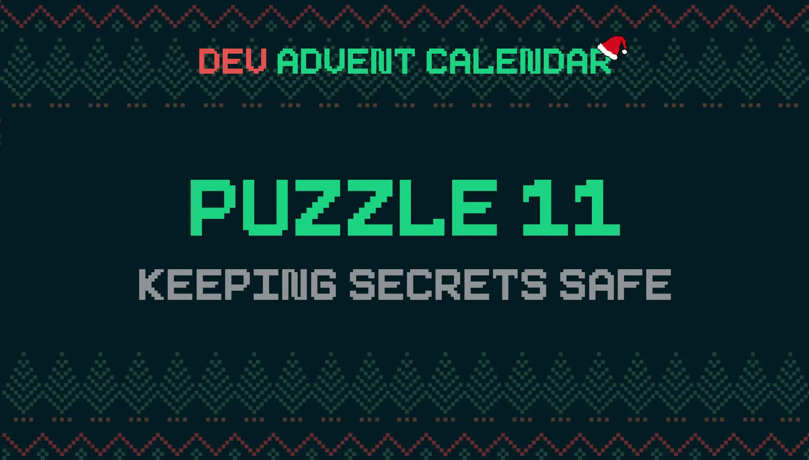

The North Pole has security concerns. First [Santa Claus loses the message code](https://blog.stranianelli.com/how-to-convert-from-binary-to-text-in-javascript/)). Then the elf in charge of the keys always uses the same one. Time to change all the locks. But this time, instead of keys, we will use passwords. Of different length and difficulty depending on the level of safety.

### The puzzle: Keeping Secrets Safe 🔑



Day 11 of the [Dev Advent Calendar 🎅](https://github.com/devadvent/puzzle-11): Today's problem is about creating passwords. We need to generate different passwords using different character sets.

The starting function is like this:

```js
export const generatePassword = (length, options = {}) => {
  return "";
};
```

`length` is a number: it is the length of the password. `options` instead is an object containing 4 properties:

```js
const options = {
  lowercase: true,
  uppercase: true,
  numbers: true,
  specialCharacters: true,
};
```

To simplify, problem tests always consider every property in the `options` object to be true. Likewise, it is not necessary to pass all properties to the function.

The `generatePassword` function returns a string of random characters. There must be a character for each option property.

I start with catch mistakes. I need to verify that the `options` argument is not empty. To do this I use the [Object.keys()](https://developer.mozilla.org/en-US/docs/Web/JavaScript/Reference/Global_Objects/Object/keys) method. This method returns an array with the names of the various properties of an object. Just check its length to understand if there are properties or not:

```js
const optionsKeysLength = Object.keys(options).length;

if (optionsKeysLength === 0) {
  throw new Error("NOT_ENOUGH_OPTIONS");
}
```

I use the same variable to verify that the required length is correct:

```js
if (optionsKeysLength > length) {
  throw new Error("PASSWORD_TOO_SHORT");
}
```

The next step is to make sure there is at least one character of each type selected. To do this I had to decide how the password will be generated. I think a good method would be to create each character independently and save it into an array. Then I'll mix the array with all the characters and turn it into a string with the [Array.prototype.join()](https://developer.mozilla.org/en-US/docs/Web/JavaScript/Reference/Global_Objects/Array/join) method.

To manage the character sets, however, I use a separate object. In this way I can, in the future, increase or decrease the available properties:

```js
const OPTIONS = {
  lowercase: "abcdefghijklmnopqrstuvwxyz",
  uppercase: "ABCDEFGHIJKLMNOPQRSTUVWXYZ",
  numbers: "1234567890",
  specialCharacters: "!@#$%^&*()",
};
```

I create a helper function to pick a random letter from a string.

```js
const randomChar = (string) =>
  string[Math.floor(Math.random() * string.length)];
```

It remains to understand how to scroll through the various properties of an object. I need to decide which character sets to use. To do this I use the [for...in statement](https://developer.mozilla.org/en-US/docs/Web/JavaScript/Reference/Statements/for...in). By combining these three pieces I can be sure that I have a character for each set selected in the password:

```js
const password = [];

for (const property in options) {
  password.push(randomChar(OPTIONS[property]));
}
```

For the remaining characters I reuse the `randomChar()` function. But passing all available characters as an argument. So I add a `characters` variable and start typing random letters in the `password`:

```js
let characters = "";

for (const property in options) {
  characters += OPTIONS[property];
}

for (let i = optionsKeysLength; i < length; i++) {
  password.push(randomChar(characters));
}
```

Finally I create a helper function to mix the array:

```js
const shuffleArray = (arr) => arr.sort(() => Math.random() - 0.5);
```

This is my solution to the puzzle:

```js
const OPTIONS = {
  lowercase: "abcdefghijklmnopqrstuvwxyz",
  uppercase: "ABCDEFGHIJKLMNOPQRSTUVWXYZ",
  numbers: "1234567890",
  specialCharacters: "!@#$%^&*()",
};

export const generatePassword = (length, options = {}) => {
  const optionsKeysLength = Object.keys(options).length;

  if (optionsKeysLength === 0) {
    throw new Error("NOT_ENOUGH_OPTIONS");
  }

  if (optionsKeysLength > length) {
    throw new Error("PASSWORD_TOO_SHORT");
  }

  const password = [];
  let characters = "";

  for (const property in options) {
    characters += OPTIONS[property];
    password.push(randomChar(OPTIONS[property]));
  }

  for (let i = optionsKeysLength; i < length; i++) {
    password.push(randomChar(characters));
  }

  return shuffleArray(password).join("");
};

const randomChar = (string) =>
  string[Math.floor(Math.random() * string.length)];
const shuffleArray = (arr) => arr.sort(() => Math.random() - 0.5);
```

That's all for today. To help me keep track of this series of posts I've created a list on Medium: [Dev Advent Calendar - The advent diary of an amateur programmer](https://el3um4s.medium.com/list/dev-advent-calendar-89d163132d6e).
