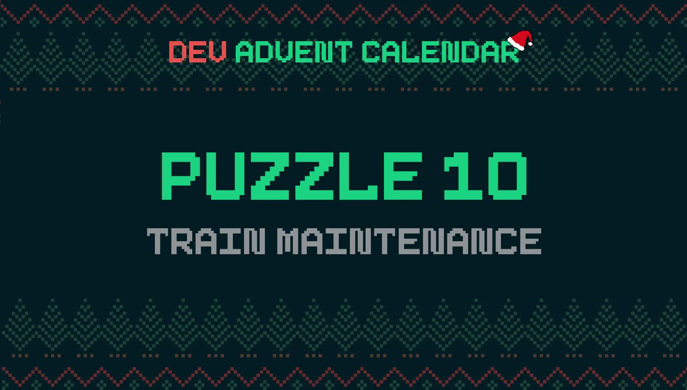
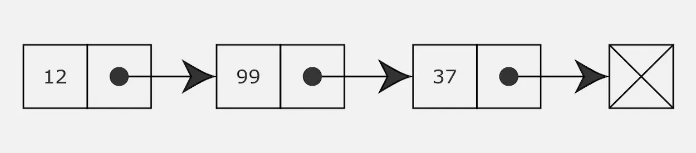

It's cold in the North Pole. I don't understand why Santa Claus insists on spending most of the year there. But so it is, and we have to deal with it. Problems are not lacking. After the name tags damaged by the snow today there was another accident. Someone forgot to check the revision date of the gift train wagons. Obviously the train left late.

### The puzzle: Train Maintenance 🚂



Day 10 of the [Dev Advent Calendar 🎅](https://github.com/devadvent/puzzle-10): I'm definitely out of my comfort zone. Today's problem concerns linked lists. According to [Wikipedia](https://en.wikipedia.org/wiki/Linked_list) they are fundamental dynamic data structures. I have to admit that I've never used them before.

### What are Linked Lists

The first thing was to understand what they were. There are many articles online, some more technical than others. Wikipedia is a great start. But I also found three specific posts helpful. The first is an overview of the various types of linked lists. There is also some sample code in C ++ and Python.

- [Data Structures Explained with Examples - Linked List](https://www.freecodecamp.org/news/data-structures-explained-with-examples-linked-list/)

The other two involve implementing linked lists in JavaScript. They were useful to make me understand in general how to deal with today's puzzle.

- [How to Implement a Linked List in JavaScript](https://www.freecodecamp.org/news/implementing-a-linked-list-in-javascript/)
- [Singly Linked List in JavaScript](https://medium.com/swlh/singly-linked-list-in-javascript-a0e58d045561)

There aren't many quick videos on YouTube explaining what they are. There are some videos, well done, but very long. Luckily [Anthony Sistilli](https://www.youtube.com/channel/UCoYzQqZNCRqqAomJwJ6yEdg) summarized the fundamental concepts in 3 minutes:

<iframe width="560" height="315" src="https://www.youtube.com/embed/W-9hyTm1syc" title="YouTube video player" frameborder="0" allow="accelerometer; autoplay; clipboard-write; encrypted-media; gyroscope; picture-in-picture" allowfullscreen></iframe>

In short words, linked lists are a collection of objects, each property of the previous one.



They are objects made like this:

```js
const mario = {
  name: "Mario",
  next: john,
};

const john = {
  name: "John",
  next: luigi,
};

const luigi = {
  name: "Luigi",
  next: null,
};
```

The fundamental property is `next`. We can actually call it whatever we want but `next` is a pretty clear term. The `mario` object is the `head` of the list. All elements are `nodes` of the structure.

I can rewrite the previous code in this way:

```js
mario = {
  name: "Mario",
  next: {
    name: "John",
    next: {
      name: "Luigi",
    },
  },
};
```

I can also create longer and more complex structures but I think this is enough to understand the basic concept.

### Iterate the elements of a list

The problem requires you to go through a list of items and take an action for each. Forcing the comparison is to create a kind of `map()` method.

The first step is to understand how to iterate between all the various elements. In this case, with this structure, it is better to use a [while](https://developer.mozilla.org/en-US/docs/Web/JavaScript/Reference/Statements/while) loop: I scroll through the next property of each element as long as the property itself exists:

```js
export const iterateList = (start) => {
  let next = start;
  while (next) {
    next = next.next;
  }
};
```

This code is the foundation upon which I can build my solution. Suspicion will also be the basis of all the other methods linked to linked lists.

### Filter items in a linked list

To make the list useful, and to solve the puzzle, I need to add a couple more arguments to the `iterateList` function. I add the `actionFn` argument

```js
export const iterateList = (start, actionFn) => {
  let item = start;
  while (item) {
    actionFn(item);
    item = item.next;
  }
};
```

I also need a way to perform actions on only certain items in the list. A kind of filter, `filterFn`:

```js
export const iterateList = (start, actionFn, filterFn) => {
  let item = start;
  while (item) {
    if (filterFn(item)) {
      actionFn(item);
    }
    item = item.next;
  }
};
```

This is all I need to solve the problem. The complete code of my solution, after renaming the variables to make it easier to read, is this:

```js
const DAY_IN_MILLISECONDS = 1000 * 60 * 60 * 24;

const defaultFilterFn = () => true;
const defaultActionFn = (wagon) => console.log(`${wagon.emoji} ${wagon.name}`);

export const iterateWagons = (
  start,
  actionFn = defaultActionFn,
  filterFn = defaultFilterFn
) => {
  let wagon = start;
  while (wagon) {
    if (filterFn(wagon)) {
      actionFn(wagon);
    }
    wagon = wagon.next;
  }
};

export const filterOldBreaks = (wagon) =>
  daysAfterDate(wagon.lastBreakRevision) > 365;

const daysAfterDate = (d) => {
  const origDate = new Date(d);
  const today = new Date();
  const difference = today - origDate;
  return difference / DAY_IN_MILLISECONDS;
};
```

### Useful methods for Linked List in JavaScript

After solving the question I spent some time experimenting with linked lists. I have compiled a list of some methods that may be of use to me in the future. I bring them back here, for the future me.

### Calculate the size of a linked list

The first method allows to calculate the number of nodes present in a list.

```js
const size = (start) => {
  let count = 0;
  let item = start;
  while (item) {
    count++;
    item = item.next;
  }
  return count;
};
```

But I can also get the same result starting from `iterateList()`:

```js
export const size = (start) => {
  let count = 0;
  iterateList(start, () => count++);
  return count;
};
```

### Count how many nodes in a linked list satisfy a condition

I prefer the second method because you can easily modify it to count how many nodes in a list satisfy a given condition:

```js
export const countNode = (start, filterFn = () => true) => {
  let count = 0;
  iterateList(start, () => count++, filterFn);
  return count;
};
```

### Find the last node in a linked list

In arrays, it is easy to find the last element. With linked lists you need to scroll through all the nodes until you get to the last one:

```js
export const last = (start) => {
  let node = start;
  while (node.next) {
    node = node.next;
  }
  return node;
};
```

I can add a filter to get the last of the nodes that satisfies a given condition:

```js
export const last = (start, filterFn = () => true) => {
  let node = start;
  let lastNode = null;
  while (node.next) {
    node = node.next;
    if (filterFn(node)) {
      lastNode = node;
    }
  }
  return lastNode;
};
```

### Find the first item in a list based on a condition

I can modify the last function to create a method to get the first node that satisfies a certain condition:

```js
export const first = (start, filterFn = () => true) => {
  let node = start;
  let firstNode = null;
  while (node.next) {
    if (filterFn(node)) {
      firstNode = node;
      break;
    }
    node = node.next;
  }
  return firstNode;
};
```

### Find a node in a linked list based on its location

Although there is no index, as with arrays, it is possible to obtain a node of a linked list based on its position.

```js
export const getByIndex = (start, index) => {
  let counter = 0;
  let node = start;
  while (counter < index) {
    node = node.next;
    counter++;
  }
  return node;
};
```

I can also decide to count the elements starting from `1` instead of `0`: just change the original value of `counter`.

### Add a node at the beginning of a linked list

So far I have only searched among the various nodes. But it can be useful to add a new node. The easiest situation is when we want to add something at the beginning, emulating the `unshift()` method of arrays:

```js
export const addHead = (start, node) => (node.next = start);
```

Things get a little complicated. At this point it is advisable to create a specific class to manage the various borderline cases. I recommend reading the post by [Gulgina Arkin](https://medium.com/swlh/singly-linked-list-in-javascript-a0e58d045561) that I linked at the beginning.

### Delete a node at the top of the list

It's quick to delete the head of a list:

```js
export const removeHead = (start) => {
  let next = start.next;
  start.next = null;
  return next;
};
```

### Add a node to the end of the list

Adding a node to the end of the list takes an extra step. I must first find the last node, and then add the new one to that:

```js
export const push = (start, node) => {
  const lastNode = last(start);
  lastNode.next = node;
};
```

In one line it would be:

```js
export const push = (start, node) => (lastWagon(start).next = node);
```

### Delete a node at the end of the list

In a symmetrical way I can delete the last element of a linked list:

```js
export const pop = (start) => {
  const n = countWagon(start);
  const node = getByIndex(start, n - 2);
  node.next = null;
};
```

Or in a more synthetic way

```js
export const pop = (start) =>
  (getByIndex(start, countWagon(start) - 2).next = null);
```

### Add an item in a linked list

Another operation that can be useful is to insert an element in a specific position in the list. To do this I have to change the element that precedes the desired position.

```js
export const insert = (start, index, node) => {
  const prev = getByIndex(start, index - 1);
  const next = getByIndex(start, index);

  prev.next = node;
  node.next = next;
};
```

### Delete a node from a list

Deleting a node involves modifying the node that precedes it.

```js
export const remove = (start, index) => {
  const prev = getByIndex(start, index - 1);
  const next = getByIndex(start, index + 1);
  prev.next = next;
};
```

### Edit a node

The last common operation left is to modify a node. This case is quite simple, just retrieve the node to modify with `getByIndex()`

```js
export const change = (start, index, value) => {
  let node = getByIndex(start, index);
  node = {
    ...node,
    ...value,
  };
  remove(start, index);
  insert(start, index, node);
};
```

That's all for today. To help me keep track of this series of posts I've created a list on Medium: [Dev Advent Calendar - The advent diary of an amateur programmer](https://el3um4s.medium.com/list/dev-advent-calendar-89d163132d6e).
