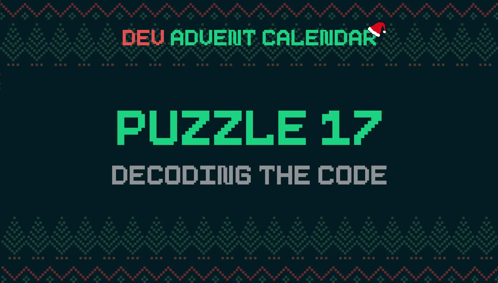

I taught the elves how to [create passwords with JavaScript](https://blog.stranianelli.com/how-to-generate-paswword-with-javascript/) and they lost the password. This is a problem, because the central elven computer system does not keep copies of passwords. It simply stores the hash, which by its nature is practically impossible to decode. What can I do?

### The Puzzle: Decoding The Code 🔐



[Dev Advent Calendar puzzle 17 🎅](https://github.com/devadvent/puzzle-17) can be summed up like this: How to hack a password using JavaScript? How to [bruteforce](https://en.wikipedia.org/wiki/Brute-force_search) a hash table?

Obviously the problem is unsolvable. The hash cryptographic functions are inviolable. Before tackling the problem it is better to understand what is meant by a hash function

### Cryptographic hash function

[Wikipedia](https://en.wikipedia.org/wiki/Cryptographic_hash_function) explains well what the characteristics are.

How does it work? A hash function takes data and converts it to a fixed-size binary string. Each dataset produces a different hash. And similar data produces very different hashes.

These algorithms are designed to resist various types of attacks and have 3 levels of security:

- **Pre-image resistance**: Given a hash value h, it should be difficult to find any message m such that h = hash(m). This concept is related to that of a one-way function. Functions that lack this property are vulnerable to preimage attacks.
- **Second pre-image resistance**: Given an input m1, it should be difficult to find a different input m2 such that hash(m1) = hash(m2). This property is sometimes referred to as weak collision resistance. Functions that lack this property are vulnerable to second-preimage attacks.
- **Collision resistance**: It should be difficult to find two different messages m1 and m2 such that hash(m1) = hash(m2). Such a pair is called a cryptographic hash collision. This property is sometimes referred to as strong collision resistance. It requires a hash value at least twice as long as that required for pre-image resistance; otherwise collisions may be found by a birthday attack.

This allows you to be sure that if two hashes are identical then the starting data are the same.

An example of use are passwords. If we want to create an identity verification system, it is dangerous to create a database with the passwords of the various users. It is advisable to keep only the hash of the passwords. When someone tries to log in, we compare the hash generated by the request with the saved hash: if they are identical then the password is correct.

This thing fascinates me. Being able to verify the correctness of a password without having to know it. Another feature fascinates me a lot: two similar passwords have very different hashes.

```js
const h = {
  abcde: "03de 6c57 0bfe 24bf c328 ccd7 ca46 b76e adaf 4334",
  ABCDE: "7be0 7aaf 460d 593a 323d 0db3 3da0 5b64 bfdc b3a5",
  abcdf: "9693 da0e 085a f20e f1f9 82b0 17fc 6ec2 4198 48e5",
  ABCDF: "0efb 7bbc eafd 99fe 7eaa 38ed d279 ca6e 277c 1aba",
};
```

This makes it very difficult to trace the starting password.

### Calculate the Hash of a password

To make the problem manageable it is necessary to simplify. The rules of engagement are these:

- we know the hash of the password to find
- we know what form the starting password had: `<UPPER CASE LETTER>-<3-DIGIT-NUMBER>`. For example `X-348`, `L-239`, `V-111`.

This is a great help. We can create a list of potential passwords to test. Then we calculate the hash of each one until we find the correct one.

In NodeJS it is easy to find the hash of a string. Just use the [crypto](https://nodejs.org/api/crypto.html) API:

```js
import { createHash } from "crypto";

const string = "abcde";

const hash = createHash("sha1").update(string).digest("hex");
// 03de 6c57 0bfe 24bf c328 ccd7 ca46 b76e adaf 4334
```

### Create a list of potential passwords

The simplest way to create a list of potential passwords to test is to use two nested `for` loops. I use the first one to scroll through the letters of the alphabet:

```js
export const bruteForcePassword = (hash) => {
  for (let i = "A".charCodeAt(); i <= "Z".charCodeAt(); i++) {}
  return null;
};
```

I then insert a second loop to iterate through all numbers from `0` to `999`

```js
export const bruteForcePassword = (hash) => {
  for (let i = "A".charCodeAt(); i <= "Z".charCodeAt(); i++) {
    for (let j = 0; j <= 999; j++) {}
  }
  return null;
};
```

So I create a `test` variable:

```js
const test = `${String.fromCharCode(i)}-${j.toString().padStart(3, "0")}`;
```

I use the [String.prototype.padStart()](https://developer.mozilla.org/en-US/docs/Web/JavaScript/Reference/Global_Objects/String/padStart) method to make each password have exactly 3 numbers. This way I can transform `A-0` to `A-000`, `C-12` to `C-012` and so on.

I get the hash

```js
const hashTest = createHash("sha1").update(test).digest("hex");
```

Finally I compare it with what I already have:

```js
if (hash === hashTest) {
  return test;
}
```

I quit the function immediately: I don't need to check the other passwords. Once I found the one generating the correct hash I also found what I was looking for.

The complete code looks like this:

```js
import { createHash } from "crypto";

export const bruteForcePassword = (hash) => {
  for (let i = "A".charCodeAt(); i <= "Z".charCodeAt(); i++) {
    for (let j = 0; j <= 999; j++) {
      const test = `${String.fromCharCode(i)}-${j.toString().padStart(3, "0")}`;
      const hashTest = createHash("sha1").update(test).digest("hex");
      if (hash === hashTest) {
        return test;
      }
    }
  }
  return null;
};
```

### To Refractor

It is a simple and understandable solution. But I can do better. I can delete the `nested loop`. I can also delete one of the two `returns`. This way I can get something clearer:

```js
export const bruteForcePassword = (hash) => {
  let password = null;
  for (const test of listPassword()) {
    password = isPassword(hash, test);
    if (password) break;
  }
  return password;
};
```

Actually you could simplify it even more by adding the `listPassword` argument instead of calculating it inside the function. But the puzzle doesn't allow me to do that.

I have decided to extract from the `bruteForcePassword` function everything that is not related to the problem: the creation of the password list and the comparison of the hashes:

```js
const getHash = (message) => createHash("sha1").update(message).digest("hex");
const isPassword = (hash, message) =>
  hash === getHash(message) ? message : null;
```

The `isPassword` function returns the password directly and not a boolean value. This way I can take advantage of JavaScript's ability to treat strings as [truthy](https://developer.mozilla.org/en-US/docs/Glossary/Truthy) and null values as [falsy](https://developer.mozilla.org/en-US/docs/Glossary/Falsy). I need it to simplify the exit from the `for...of` loop.

To generate the password list, I break down the problem into several parts. First I need an array containing the numbers `0` to `999`. I create this function:

```js
const getHash = (message) => createHash("sha1").update(message).digest("hex");
const isPassword = (hash, message) =>
  hash === getHash(message) ? message : null;
```

There is a good discussion on [stackoverflow](https://stackoverflow.com/questions/3746725/how-to-create-an-array-containing-1-n) on this problem. In short, I can create an array of `n` elements with `Array(n)`. If I add the [Array.prototype.keys()](https://developer.mozilla.org/en-US/docs/Web/JavaScript/Reference/Global_Objects/Array/keys) method and then use the [spread operator](https://developer.mozilla.org/en-US/docs/Web/JavaScript/Reference/Operators/Spread_syntax), I can get an array of `n` elements each of which contains a number that represents the index of its position:

```js
[...Array(5).keys()];
// [0, 1, 2, 3, 4]
```

I use this array with the[Array.prototype.map()](https://developer.mozilla.org/en-US/docs/Web/JavaScript/Reference/Global_Objects/Array/map) method to add the missing 0s to the first 100 elements.

I can easily create an array containing the letters of the alphabet:

```js
const createArrayChars = () =>
  [...Array(26)].map((n, i) => `${String.fromCharCode(i + "A".charCodeAt())}`);
```

This time I don't use `keys()`: I can leave all the elements of the array null and then use the index to get the `charCode` of the letter I want to insert.

I create a helper function to join letters and numbers:

```js
const combineCharWithNumber = (char, numbers) =>
  numbers.map((n) => `${char}-${n}`);
```

I add the desired character to each element of the array with numbers. Finally I create the list of potential passwords:

```js
const listPassword = () =>
  createArrayChars()
    .map((char) => combineCharWithNumber(char, createArrayNumbers()))
    .flat();
```

By combining everything I get my solution:

```js
import { createHash } from "crypto";

const getHash = (message) => createHash("sha1").update(message).digest("hex");
const isPassword = (hash, message) =>
  hash === getHash(message) ? message : null;

const createArrayNumbers = () =>
  [...Array(1000).keys()].map((n) => `${n.toString().padStart(3, 0)}`);
const createArrayChars = () =>
  [...Array(26)].map((n, i) => `${String.fromCharCode(i + "A".charCodeAt())}`);
const combineCharWithNumber = (char, numbers) =>
  numbers.map((n) => `${char}-${n}`);

const listPassword = () =>
  createArrayChars()
    .map((char) => combineCharWithNumber(char, createArrayNumbers()))
    .flat();

export const bruteForcePassword = (hash) => {
  let password = null;
  for (const test of listPassword()) {
    password = isPassword(hash, test);
    if (password) break;
  }
  return password;
};
```

That's all. This puzzle is related to the number 11:

- [How to Generate a Random Password Using JavaScript](https://blog.stranianelli.com/how-to-generate-paswword-with-javascript/)

I have saved in this list the solutions to the other problems of this challenge:

- [Dev Advent Calendar](https://el3um4s.medium.com/list/dev-advent-calendar-89d163132d6e)
