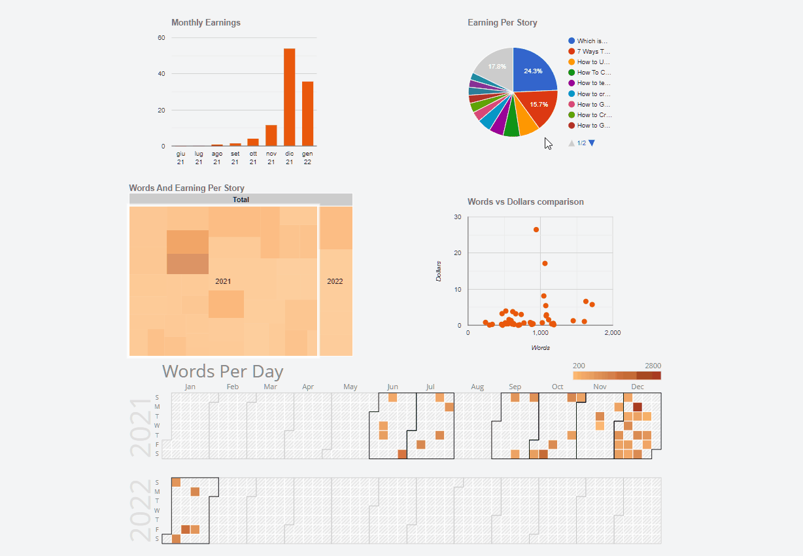

The numbers explain the reality, but sometimes they are not clear. Series and reports are powerful but not always understandable tools. For this reason, it is often convenient to add a graphic to your pages. But how to do it? Well, today I try to explain the simplest way I have found to add charts to a web page.

### Introduction

Before, here's what I want to create:



There are 5 different charts but the procedure is very similar:

- a column chart
- a pie chart
- a treemap chart
- a scatter plot
- a calendar chart

In this tutorial I will be using data from the Medium Partner Program. I already used them a few days ago when I talked about how to [create responsive tables](https://betterprogramming.pub/how-to-create-responsive-data-tables-with-css-grid-9e0a37394450) with CSS. To see how to download and import statistics I recommend this post:

- [How to Get Medium Stats With JavaScript and Svelte](https://blog.stranianelli.com/medium-stats-with-javascript-and-svelte-part-1/)

However, in summary, just go to [medium.com/me/stats?format=json&count=100](https://medium.com/me/stats?format=json&count=100) and download the page. Of course I can create graphs with any data, but to remind me of the process in the future I need some sample data.

### The toolbox

What do I need to easily create graphics with JavaScript, HTML and CSS? On the net you can find various libraries. The simplest one, in my opinion, is [Google Charts](https://developers.google.com/chart). As you can easily guess from the name, it is a Google library. Google defines it like this:

```text
Google Charts provides a perfect way to visualize data on your website
```

The [quickstart page](https://developers.google.com/chart/interactive/docs/quick_start) explains how to create a pie chart. It is a good starting point but it is not the path I intend to follow. There is an easier way.

Searching on the net you can find the [Google Charts API web components](https://www.npmjs.com/package/@google-web-components/google-chart). This allows you to create a graph with a syntax similar to this:

```html
<google-chart data='[["Month", "Days"], ["Jan", 31]]'></google-chart>
```

I can import the APIs into a project with the command:

```bash
npm i @google-web-components/google-chart
```

The second tool I intend to use is Svelte. [Svelte](https://svelte.dev/) allows you to easily create web apps. And, above all, it allows me to write some example code in a synthetic way.

Of course, it is possible to use any other framework, or even none. But Svelte simplifies the steps.

### How to create a column chart

I start with the first chart:


I start by creating a `GoogleChartColumn.svelte` component. First I import `@google-web-components/google-chart`:

```html
<script type="ts">
  import "@google-web-components/google-chart";
</script>
```

Then I define the props. The [Google documentation](https://developers.google.com/chart/interactive/docs/gallery/columnchart) is well done and allows you to understand what can be used. For the moment I will limit myself to the basics:

- `data`: for the data to be displayed
- `options`: to configure some details of the graph

I am not interested in many options. I just need to be able to customize the title and decide the color of the various columns. Consequently the props become:

```html
<script type="ts">
  import "@google-web-components/google-chart";
  export let data: (String[] | (string | number)[])[] = [];
  export let title: String = "";
  export let colors: String[] = [];
</script>
```

The data is of a bizarre kind. Basically they are a matrix where the first row indicates the name and type of the columns:

```ts
const cols = [
  { label: "Title", type: "string" },
  { label: "$", type: "number" },
];
```

The following lines instead contain the actual data:

```ts
const rows = [
  ["september", 1.0],
  ["october", 1.5],
  ["november", 1.25],
];
```

I add a variable for the configuration options:

```ts
const options = {
  title,
  legend: "none",
  backgroundColor: "transparent",
  colors: colors.length > 0 ? colors : undefined,
  titleTextStyle: { fontSize: 14, color: "#737373" },
};
```

Since I only use one dataset the legend is useless, so I set it as `none`. I also change the background color so it doesn't detach from the rest of the page (it's `transparent`). Finally I change the formatting of the chart title using the CSS properties.

The complete component code is:

```html
<script type="ts">
  import "@google-web-components/google-chart";
  export let data: (String[] | (string | number)[])[] = [];
  export let title: String = "";
  export let colors: String[] = [];
  $: options = {
    title,
    legend: "none",
    backgroundColor: "transparent",
    colors: colors.length > 0 ? colors : undefined,
    titleTextStyle: { fontSize: 14, color: "#737373" },
  };
</script>

<google-chart {data} options={{ ...options }} />
```

But how can I actually use it in an HTML page? Like this:

```html
<script lang="ts">
  import GoogleChartColumn from "./GoogleChartColumn.svelte";
  import { getMonthlyAmounts, monthlyEarning } from "./MonthlyAmounts";
  const monthlyAmounts = getMonthlyAmounts(mediumPartnerProgram);
  const monthlyEarning = earningPerMonth(monthlyAmounts);
</script>

<GoogleChartColumn
  title="Monthly Earnings"
  data={monthlyEarning}
  colors={["#ea580c"]}
/>
```

To get the data to insert I create the `earningPerMonth` function:

```ts
const earningPerMonth = (
  monthly: PartnerProgram_Analysis_Month[]
): [string, string | number][] => {
  const data = monthly.map((m) => m.amount).reverse();
  const labels: string[] = monthly
    .map((m) => `${m.month.monthName} ${m.month.year.toString().substring(2)}`)
    .reverse();

  const column: [string, string] = ["Month", "$"];
  const rows: [string, number][] = labels.map((label, index) => [
    label,
    data[index] / 100,
  ]);
  return [column, ...rows];
};
```

Obviously this function must be modified according to your data.

### How to create a pie chart


Starting from this example it is possible to create other types of graphs. Obviously each has its own particular characteristics. Next is a pie chart.

I create the `GoogleChartPie.svelte` file

```html
<script lang="ts">
  import "@google-web-components/google-chart";
  export let cols: {
    label: string;
    type: string;
  }[] = [];
  export let rows: [string, number][] = [];
  export let title: String = "";
  export let sliceVisibilityThreshold: number = 0;
</script>

<google-chart
  type="pie"
  {cols}
  {rows}
  options={{
    title,
    backgroundColor: "transparent",
    titleTextStyle: { fontSize: 14, color: "#737373" },
    sliceVisibilityThreshold,
  }}
/>
```

The pie chart has the data split into two different props: `cols` and `rows`.

It also allows you to pass a numerical value (between 0 and 1) to decide the minimum width of the slices of the cake. For example, if I set `sliceVisibilityThreshold = 0.03` I will only be able to see categories that are at least 3% of the total. The smaller ones are grouped under `Other`.

The JavaScript function to get the data looks like this:

```ts
interface PieData {
  cols: { label: string; type: string }[];
  rows: [string, number][];
}

const earningPerStory = (
  listStories: PartnerProgram_Analysis_ListStories[]
): PieData => {
  const listValue: { title: string; amount: number }[] = [...listStories]
    .sort((a, b) => b.amountTot - a.amountTot)
    .map((story) => {
      const title = story.title;
      const amount = story.amountTot;
      return { title, amount };
    });

  const groupedValue = groupBy(listValue, (s) => s.title);

  let rows = [];
  for (const property in groupedValue) {
    const amount = groupedValue[property].reduce(
      (sum, current) => sum + current.amount,
      0
    );
    rows.push([property, amount / 100]);
  }

  const cols = [
    { label: "Title", type: "string" },
    { label: "$", type: "number" },
  ];
  return {
    cols,
    rows,
  };
};

function groupBy(xs, f) {
  return xs.reduce(
    (r, v, i, a, k = f(v)) => ((r[k] || (r[k] = [])).push(v), r),
    {}
  );
}
```

Now I can insert the graphic on the page with:

```html
<script lang="ts">
  import GoogleChartPie from "./GoogleChartPie.svelte";
  const listStories = getListStoryAmountStats(mediumPartnerProgram);
  const storyEarning = earningPerStory(listStories);
</script>

<GoogleChartPie
  cols={storyEarning.cols}
  rows={storyEarning.rows}
  title="Earning Per Story"
  sliceVisibilityThreshold={2.5 / 100}
/>
```

Using the same code but changing the values passed to the props I can create different graphs on the same page:


### How to create a treemap chart


[Wikipedia](https://en.wikipedia.org/wiki/Treemapping) explains well what a treemap is:

```text
In information visualization and computing, treemapping is a method for displaying hierarchical data using nested figures, usually rectangles.
```

I think the steps to follow are now clear. I create the `GoogleChartTreemap.svelte` file:

```html
<script lang="ts">
  import "@google-web-components/google-chart";
  export let data: [String, String | null, Number | String, Number | String][] =
    [];
  export let title: String = "";
  export let maxDepth: Number = 1;
  export let maxPostDepth: Number = 0;
  export let minColor: String = "#dd0000";
  export let midColor: String = "#000000";
  export let maxColor: String = "#00dd00";
</script>

<google-chart
  type="treemap"
  {data}
  options={{
    title,
    backgroundColor: "transparent",
    titleTextStyle: { fontSize: 14, color: "#737373" },
    maxDepth,
    maxPostDepth,
    minColor,
    midColor,
    maxColor,
  }}
/>
```

The specific [props](https://developers.google.com/chart/interactive/docs/gallery/treemap) are:

- `maxDepth`: The maximum number of node levels to show in the current view.
- `maxPostDepth`: How many levels of nodes beyond maxDepth to show in "hinted" fashion.
- `minColor`, `midColor` e `maxColor`

The function to extract and prepare the data looks something like this:

```ts
const treemapWordsAndEarning = (
  listStories: PartnerProgram_Analysis_ListStories[]
): [String, String, Number | String, Number | String][] => {
  const rows: [String, String, Number, Number][] = listStories.map((story) => {
    const title = `${story.title} (${story.firstPublishedAt.year} ${story.firstPublishedAt.monthName} ${story.firstPublishedAt.day})`;
    const amount = story.amountTot;
    const words = story.wordCount;
    const month = `${story.firstPublishedAt.monthName} ${story.firstPublishedAt.year}`;
    return [title, month, words, amount];
  });

  const listMonths: [String, String, Number, Number][] = [
    ...new Set(rows.map((row) => row[1])),
  ].map((m) => [m, m.slice(m.length - 4), 0, 0]);

  const listYears: [String, String, Number, Number][] = [
    ...new Set(listMonths.map((m) => m[1])),
  ].map((y) => [y, "Total", 0, 0]);

  return [
    ["Title", "Month", "Words", "$"],
    ["Total", null, 0, 0],
    ...listYears,
    ...listMonths,
    ...rows,
  ];
};
```

The HTML code is

```html
<GoogleChartTreemap
  data={treemapWords}
  title="Words And Earning Per Story"
  maxPostDepth={3}
  minColor="#fed7aa"
  midColor="#f97316"
  maxColor="#9a3412"
/>
```

### How to create a scatter chart


The scatter plot allows you to see if there is any correlation between two data. In this example I tried to relate the length of the different posts (measured with the number of words) and the revenue from them. Also I have set a custom tooltip when we hover the mouse over the various points.

The code of the `GoogleChartScatter.svelte` component is similar to the above:

```html
<script lang="ts">
  import "@google-web-components/google-chart";
  export let data: [
    Number | String,
    Number | String,
    String | { type: String; role: String }
  ][] = [];
  export let title: String = "";
  export let axisX: String = data[0][0].toString();
  export let axisY: String = data[0][1].toString();
  export let colors: String[] = [];
</script>

<google-chart
  type="scatter"
  {data}
  options={{
    title,
    backgroundColor: "transparent",
    titleTextStyle: { fontSize: 14, color: "#737373" },
    legend: "none",
    hAxis: { title: axisX },
    vAxis: { title: axisY },
    colors: colors.length > 0 ? colors : undefined,
    tooltip: { isHtml: true },
  }}
/>
```

There are 2 specific `props` for this graph:

- `axisY`: the title to show on the Y axis
- `axisX`: the title to show on the X axis

I also add the `tooltip: {isHtml: true}` option. What is it for? To be able to customize the tooltip of the various points using HTML and CSS.

The function to get the data for the chart is slightly different from the previous ones:

```ts
const scatterWordsAndEarning = (
  listStories: PartnerProgram_Analysis_ListStories[]
): [
  Number | String,
  Number | String,
  String | { type: String; role: String; p: { html: boolean } }
][] => {
  const cols: [
    String,
    String,
    { type: String; role: String; p: { html: boolean } }
  ] = [
    "Words",
    "Dollars",
    { type: "string", role: "tooltip", p: { html: true } },
  ];
  const rows: [Number, Number, String][] = listStories.map((story) => [
    story.wordCount,
    story.amountTot / 100,
    `
    <div style="padding:4px;">
    <div>${
      story.title.length > 30 ? story.title.slice(0, 30) + "..." : story.title
    }</div>
    <div style="display:grid;grid-template-columns:8ch 8ch;gap:1px; margin:2px;">
      <div>words</div><div><strong>${story.wordCount}</strong></div>
      <div>dollars</div><div><strong>${(story.amountTot / 100).toFixed(
        2
      )}</strong></div>
    </div>
    </div>`,
  ]);
  return [cols, ...rows];
};
```

I add to the data a string containing some HTML code. This code is then rendered by the component and displayed as an HTML element of the page.

I can insert the graphic into an HTML page using

```html
<GoogleChartScatter
  data={scatterWords}
  title="Words vs Dollars comparison"
  colors={["#ea580c"]}
/>
```

### How to create a calendar chart


The fifth chart is a calendar chart. It is used to view data on a calendar. The color intensity of the individual days indicates the relative amount per day. The classic example is the one shown in the GitHub profile:


Compared to the previous charts this one requires some CSS and a little trick. But first the code base:

```html
<script lang="ts">
  import "@google-web-components/google-chart";
  export let cols: {
    id: string;
    type: string;
  }[] = [];
  export let rows: [Date, number][] = [];
  export let title: String = "";
  export let colorAxis: [String, String] = ["#f0f9ff", "#0369a1"];
</script>

<section>
  <google-chart
    type="calendar"
    {cols}
    {rows}
    options={{
      title: title,
      backgroundColor: "transparent",
      colorAxis: { colors: colorAxis },
    }}
  />
</section>
```

In this case I need only one additional props, `colorAxis`. It is an array of colors. By default the lowest value is represented by a white. After importing the component into the page, however, I noticed that it was blending into the background. So I decided to start with a stronger color:

```html
<GoogleChartCalendar
  cols={dayWithWords.cols}
  rows={dayWithWords.rows}
  title="Words Per Day"
  colorAxis={["#fdba74", "#9a3412"]}
/>
```

The function to prepare the data is similar to the previous ones, with obviously some small differences:

```ts
interface CalendarData {
  cols: ColsCalendar[];
  rows: [Date, number][];
}
interface ColsCalendar {
  id: string;
  type: string;
}
export const writingDay = (
  listStories: PartnerProgram_Analysis_ListStories[]
): CalendarData => {
  const listValue: { date: Date; words: number }[] = listStories.map(
    (story) => {
      const { day, month, year } = story.firstPublishedAt;
      const date: Date = new Date(year, month, day);
      const words = story.wordCount;
      return { date, words };
    }
  );

  const groupedValue = groupBy(listValue, (s) => s.date);

  let rows = [];
  for (const property in groupedValue) {
    const words = groupedValue[property].reduce(
      (sum, current) => sum + current.words,
      0
    );
    rows.push([new Date(property), words]);
  }

  const cols = [
    { type: "date", id: "Date" },
    { type: "number", id: "$" },
  ];
  return {
    cols,
    rows,
  };
};

function groupBy(xs, f) {
  return xs.reduce(
    (r, v, i, a, k = f(v)) => ((r[k] || (r[k] = [])).push(v), r),
    {}
  );
}
```

Good but not enough. There remains a problem related to the size of the graph. I don't know why but the component is too short for the calendar length. I then have to force the size using a CSS property:

```css
section {
  height: fit-content;
}
google-chart {
  width: 1000px;
}
```

The height of the graph is also wrong. In this case I have to calculate it based on the number of years I want to show. First I have to figure out the number of years to show

```html
<script lang="ts">
  const listDates = rows
    .map((r) => r[0])
    .sort((a, b) => {
      return a.getTime() - b.getTime();
    });
  const firstYear = listDates[0].getFullYear();
  const lastYear = listDates[listDates.length - 1].getFullYear();
  const years = lastYear - firstYear + 1;
</script>
```

Then I use the [style: property](https://svelte.dev/docs#template-syntax-element-directives-style-property) directive:

```html
<!-- ... -->
  <google-chart
    type="calendar"
    {cols}
    {rows}
    options={{
      title: title,
      backgroundColor: "transparent",
      colorAxis: { colors: colorAxis },
    }}
    style:height="{175 * years}px"
  />
<!-- ... -->
```

By combining the whole the component becomes:

```html
<script lang="ts">
  import "@google-web-components/google-chart";
  export let cols: {
    id: string;
    type: string;
  }[] = [];
  export let rows: [Date, number][] = [];
  export let title: String = "";
  export let colorAxis: [String, String] = ["#f0f9ff", "#0369a1"];
  const listDates = rows
    .map((r) => r[0])
    .sort((a, b) => {
      return a.getTime() - b.getTime();
    });
  const firstYear = listDates[0].getFullYear();
  const lastYear = listDates[listDates.length - 1].getFullYear();
  const years = lastYear - firstYear + 1;
</script>

<section>
  <google-chart
    type="calendar"
    {cols}
    {rows}
    options={{
      title: title,
      backgroundColor: "transparent",
      colorAxis: { colors: colorAxis },
    }}
    style:height="{175 * years}px"
  />
</section>

<style lang="postcss">
  section {
    height: fit-content;
  }
  google-chart {
    width: 1000px;
  }
</style>
```

That's all. Obviously this method is not perfect. However, I find it simpler than other implementations I've tried. The code, as usual, is available in the repository on GitHub:

- [el3um4s/medium-stats](https://github.com/el3um4s/medium-stats)

Obviously it's a work in progress, so there are still some details to refine and I will probably change something again over time.

Regarding Svelte, I made a list on Medium with my various posts on this topic:

- [Svelte & SvelteKit](https://el3um4s.medium.com/list/svelte-sveltekit-bf5be8834fbf)
