Tables are quite a complicated thing. They have existed since the dawn of HTML and they bring with them some serious problems. They are great for showing little data but rather complicated when the data grows. I had to investigate this for a recent project of mine (related to [how to use Medium stats](https://blog.stranianelli.com/medium-stats-with-javascript-and-svelte-part-1/). The solution I have chosen involves the use of CSS and the Grid Layout Module. Here are my passages and my arguments.

But before starting an image with the result I want to achieve:


### Introduction

The first step is to look for what already exists. There are some interesting articles worth reading:

- [Responsive data tables with CSS Grid](https://medium.com/evodeck/responsive-data-tables-with-css-grid-3c58ecf04723)
- [How to create responsive tables with pure CSS using Grid Layout Module](https://www.freecodecamp.org/news/https-medium-com-nakayama-shingo-creating-responsive-tables-with-pure-css-using-the-grid-layout-module-8e0ea8f03e83/)
- [Really Responsive Tables using CSS3 Flexbox](https://hashnode.com/post/really-responsive-tables-using-css3-flexbox-cijzbxd8n00pwvm53sl4l42cx)

From this I started to think about how to create my table.

First, of course, I need the data. I decided not to use fictional data for this article simply because the best way to learn is by solving a real problem. My problem is: I have some stats regarding my earnings on Medium. How can I analyze them?

But I won't talk about the data itself. For the moment I just need to know how they are organized. And I decided to organize them into an array, `listStories`. Each element of this array is an object composed of these properties:

```ts
interface StoryAmountStats {
  id: string;
  title: string;
  amountMonth: number;
  amountTot: number;
  homeCollectionId: string;
  wordCount: number;
  readingTime: number;
  firstPublishedAt: CustomDateTime;
}

interface CustomDateTime {
  timestamp: Date;
  year: number;
  month: number;
  monthName: string;
  day: number;
}
```

I don't care about showing every single property. And I'm interested in having an easy way to decide which ones to view and order. To do this I need another array, this time made up of objects composed like this:

```ts
interface Table_Labels {
  key: string;
  title: string;
  type: string;
  width?: string;
  align?: string;
}
```

The properties are:

- `key`, the property to show in the table
- `title`, the name of the column
- `type`, the type of data (numeric, date, string, boolean, ...)
- `width`, the width of the column. If not present it is interpreted as `auto`
- `align`, the alignment of the column

### Create a simple table

The table is in CSS. But to use it effectively I need something to automatically insert various data into the table. I decided to use [Svelte](https://svelte.dev/): it allows me to keep the JavaScript code, the HTML5 part and the table styles in a single file. Also to speed up the writing of CSS I use the [Tailwind CSS](https://tailwindcss.com/) classes.

I start by creating the props to import the table data and labels:

```html
<script lang="ts">
  import type { Table_Labels } from "./Table";

  export let rows = [];
  export let header: Table_Labels[] = [];
</script>
```

I write the HTML part:

```html
<div class="table">
  {#each headers as header}
    <div class="table-header">{header.title}</div>
  {/each}

  {#each rows as row}
    {#each headers as header}
      <div>
        {row[header.key]}
      </div>
    {/each}
  {/each}
</div>
```

Obviously the result is very bad:

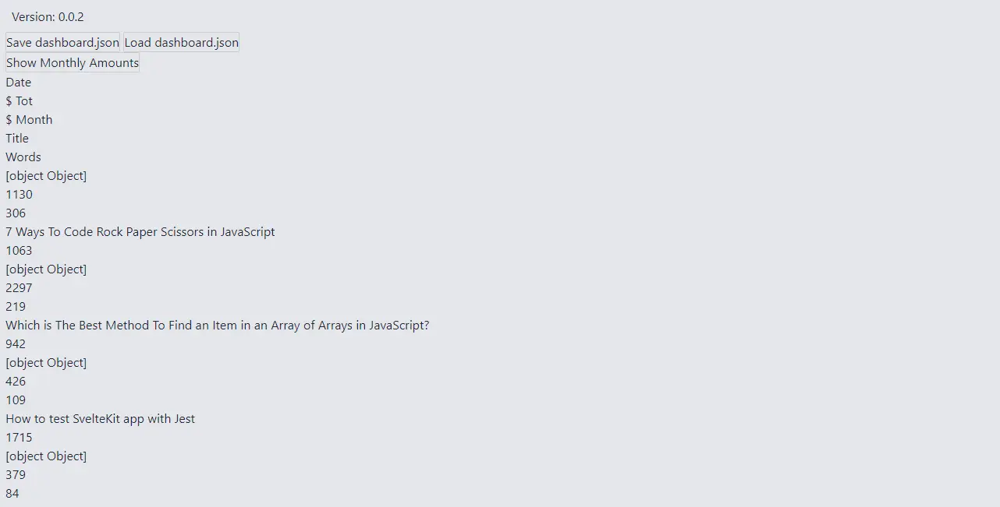

I need to add some styles to make it presentable. I start by defining everything as a CSS Grid:

```css
.table {
  display: grid;
}
```

Then I bold the first row, the one with the names of the various columns:

```css
.table > div.table-header {
  font-weight: 700;
}
```

Finally I add a line to divide each row of the table:

```css
.table > div {
  border-bottom: 1px solid var(--text-color, theme("colors.gray.800"));
}
```

The result is a little more elegant but still not useful:

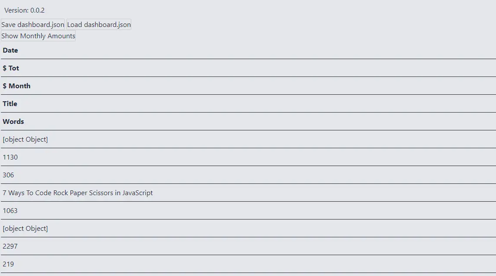

I need to use the [grid-template-columns](https://developer.mozilla.org/en-US/docs/Web/CSS/grid-template-columns) property to define how many columns there should be.

A little while ago I explained how to create the `headers` prop. Well, the number of columns is simply the number of elements in the array.

```html
<script>
  const columnsNumber: headers.length;
  $: gridTemplate = `grid-template-columns: repeat(${columnsNumber}, 1fr);`;
</script>

<div class="table" style="{gridTemplate}">
  <!-- ... -->
</div>
```

Finally something like a table appears:

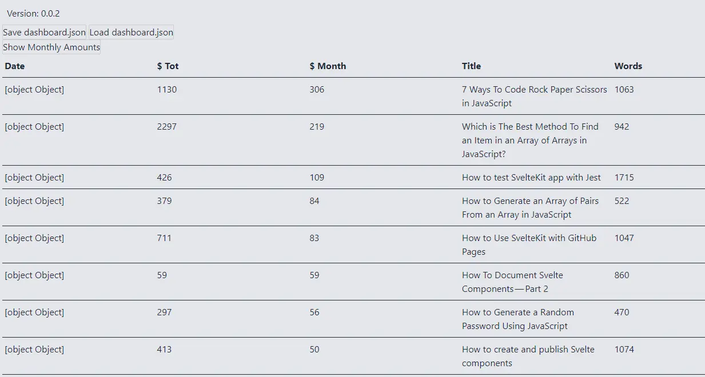

There's a thing I don't like: the columns are all the same size. It makes more sense to make some columns smaller and leave the one with the article title larger. To do this I use the `width` property of each `label`:

```ts
const getWidthColumns = (header: Table_Labels[]) => {
  const widths = header.map((h) => (h?.width ? h.width : "auto"));
  return widths.join(" ");
};

$: gridTemplate = `grid-template-columns: ${getWidthColumns(headers)};`;
```

Now the table is a little prettier.

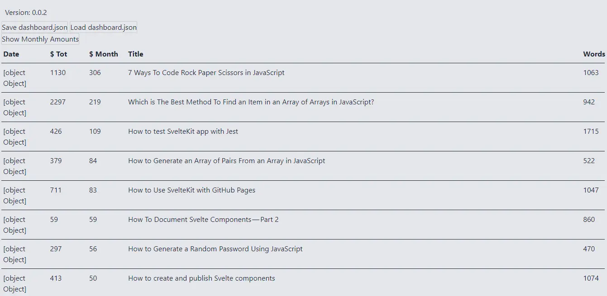

However, some critical issues remain. First, some values do not appear, others are in the wrong format. I add a function to solve them:

```ts
const convertToDollars = (cents: number) => cents / 100;
const convertToDate = (date: CustomDateTime) =>
  `${date.year} ${date.monthName} ${date.day}`;

const convert = (t: string, v: number | CustomDateTime | string) => {
  if (t === "cents" && typeof v === "number") {
    return convertToDollars(v);
  }
  if (t === "date" && typeof v === "object") {
    return convertToDate(v);
  }
  return v;
};
```

I edit the HTML

```html
<div class="table" style={gridTemplate}>
  {#each headers as header}
    <div class="table-header">{header.title}</div>
  {/each}

  {#each rows as row}
    {#each headers as header}
      <div>
        {convert(header.type, row[header.key])}
      </div>
    {/each}
  {/each}
</div>
```

This fixes the wrong format:

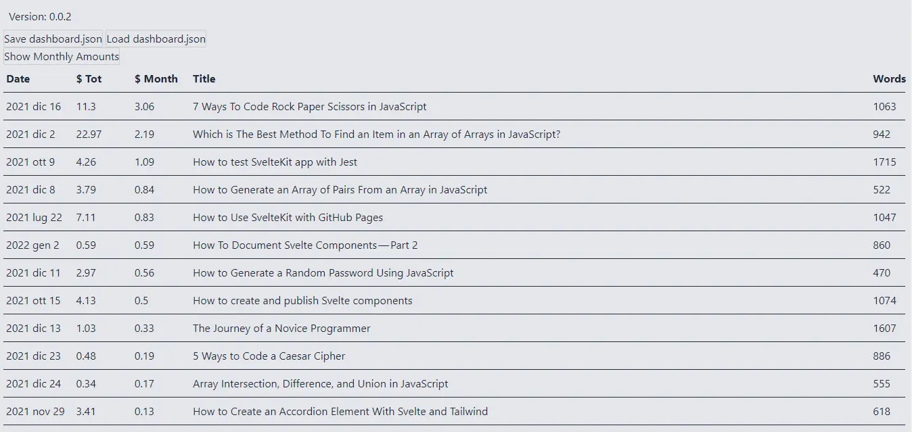

In a similar way I can correct the alignment of the columns:

```html
<script lang="ts">
  const getAlignItem = (header: Table_Labels) => {
    return header?.align ? `text-align: ${header.align};` : "";
  };
</script>

<div class="table" style={gridTemplate}>
  {#each headers as header}
    <div class="table-header" style={getAlignItem(header)}>{header.title}</div>
  {/each}

  {#each rows as row}
    {#each headers as header}
      <div style={getAlignItem(header)}>
        {convert(header.type, row[header.key])}
      </div>
    {/each}
  {/each}
</div>
```

### Keep the header visible

This is fine for tables with little data. But there is a problem when there are several rows of data. Scrolling down the header of the columns disappears, making it difficult to read. To keep the first line fixed I have to modify the structure of the HTML part and the CSS style. I start by adding a `header` tag and a `section` tag:

```html
<article class="table">
  <header style={gridTemplate}>
    {#each headers as header}
      <div class="cell title" style={getAlignItem(header)}>
        {header.title}
      </div>
    {/each}
  </header>

  <section style={gridTemplate}>
    {#each rows as row}
      {#each headers as header}
        <div class="cell" style={getAlignItem(header)}>
          {convert(header.type, row[header.key])}
        </div>
      {/each}
    {/each}
  </section>
</article>
```

The idea is to set a maximum height for the section with the data lines and then add a side scrollbar to scroll through the data. To do this I first need to change the `display` property of `article`:

```css
article {
  display: flex;
  flex-direction: column;
  overflow: hidden;
  height: 100%;
  width: 100%;
}
```

`header` and` section` instead become `grid`:

```css
header,
section {
  display: grid;
}

section {
  overflow-y: auto;
}
```

The `section` can have a vertical scrollbar.

To maintain the alignment of the last column, I should customize the scrollbar. For details I recommend reading [CSS Almanac - Scrollbar](https://css-tricks.com/almanac/properties/s/scrollbar/):

```css
::-webkit-scrollbar {
  width: 1rem;
}

::-webkit-scrollbar-track {
  -webkit-box-shadow: inset 0 0 6px rgba(246, 107, 33, 0.5);
  border-radius: 10px;
}

::-webkit-scrollbar-thumb {
  border-radius: 10px;
  -webkit-box-shadow: inset 0 0 6px rgba(234, 88, 12, 0.8);
}
```

I also shorten the width of the `header`:

```css
header {
  width: calc(100% - 1rem);
}
```

The result of all this is a table with the first fixed row at the top:

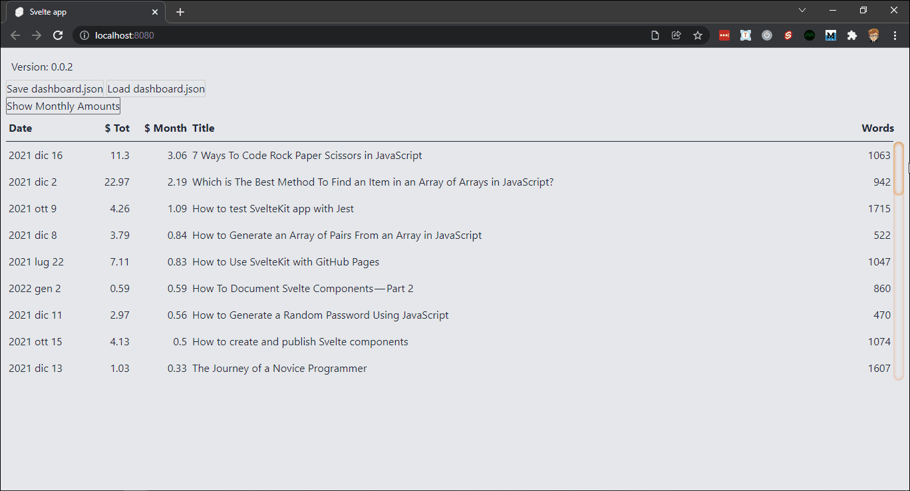

### Add a row for totals

Another thing I need is a line with the total. Because especially when I add a system of filters it is convenient to immediately see what the value of the selection is. To do this I add a `footer` to the table:

```html
<footer style="{gridTemplate}">
  {#each totals as total}
  <div class="cell total" style="{getAlignItem(total)}">{total.value}</div>
  {/each}
</footer>

<style>
  footer {
    display: grid;
    border-top: 1px solid var(--text-color, theme("colors.gray.800"));
    border-bottom: 1px solid var(--text-color, theme("colors.gray.800"));
    width: calc(100% - 1rem);
  }
</style>
```

I know, I haven't defined `totals` yet. But I have to decide where and how to calculate the totals. The simplest way is by adding a third props.

So I define a props of this type:

```ts
interface Table_Totals {
  key: string;
  title: string;
  type: string;
  width?: string;
  align?: string;
  value: number | string;
}

export let totals: Table_Totals[] = [];
```

I correct the HTML code to format the values:

```html
{#if totals.length > 0}
<footer style="{gridTemplate}">
  {#each totals as total}
  <div class="cell total" style="{getAlignItem(total)}">
    {convert(total.type, total.value)}
  </div>
  {/each}
</footer>
{/if}
```

This allows me to get something like this:

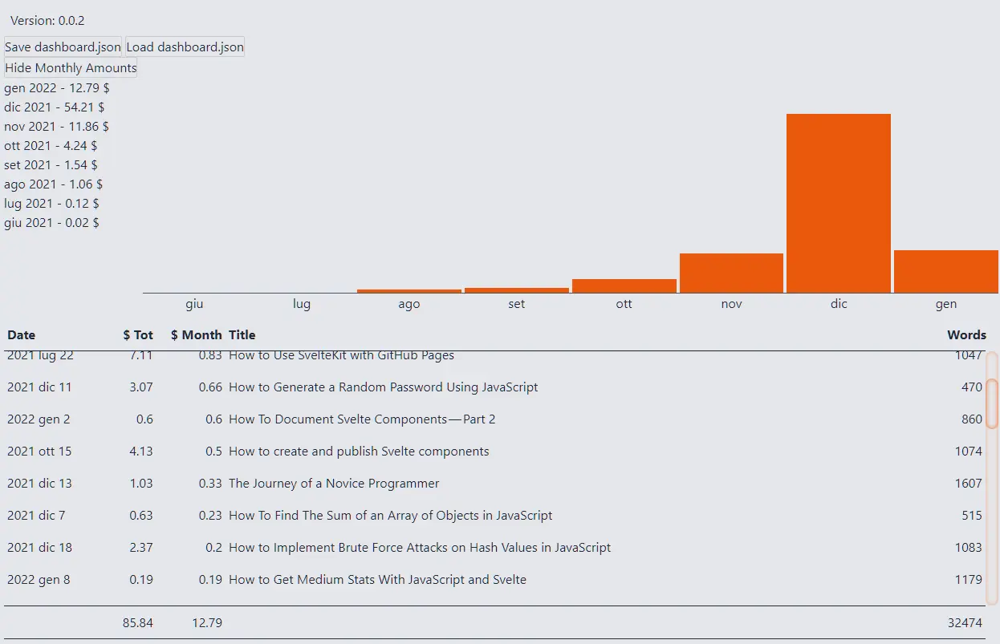

### Sort the data

A useful feature is the ability to sort the data.

There are various ways to achieve this. I can add buttons outside the table, or I can add a mouse-based control. I would like to order in ascending or descending order using a context menu.

Maybe I'll talk about it in more depth in another post, but with Svelte it's quite easy to create a context menu. For the moment I just recommend this repl:

- [Svelte: Context Menu](https://svelte.dev/repl/3a33725c3adb4f57b46b597f9dade0c1?version=3.25.0)

For the moment I create a very simple component. First I need a couple of icons (`SortAscending` and `SortDescending`) to use as buttons.

```html
<script lang="ts">
  import SortAscending from "./SortAscending.svelte";
  import SortDescending from "./SortDescending.svelte";
</script>

<button><SortDescending /></button>
<button><SortAscending /></button>
```

Then a couple of props to manage the position on the screen:

```html
<script lang="ts">
  export let x: number = 0;
  export let y: number = 0;
</script>

<section style="top: {y}px; left: {x}px;">
  <!--  -->
</section>
```

It is also necessary to understand when the menu should be displayed and when it shouldn't be:

```html
<script lang="ts">
  export let show: boolean = false;
  const hide = () => {
    show = false;
  };
</script>
```

I use [createEventDispatcher](https://svelte.dev/docs#run-time-svelte-createeventdispatcher) to set the events I need:

```html
<script lang="ts">
  import { createEventDispatcher } from "svelte";
  const dispatch = createEventDispatcher();
</script>

{#if show}
  <section style="top: {y}px; left: {x}px;">
    <button
      on:click={() => {
        hide();
        dispatch("order-desc");
      }}><SortDescending /></button
    >
    <button
      on:click={() => {
        hide();
        dispatch("order-asc");
      }}><SortAscending /></button
    >
  </section>
{/if}
```

Then I add events to hide the context menu when we click on some other element of the page:

```html
<svelte:body on:click="{hide}" on:wheel="{hide}" />
```

Last, I add some CSS styles:

```css
section {
  position: absolute;
  display: grid;
  border: 1px solid #0003;
  box-shadow: 2px 2px 5px 0px #0002;
  background: white;
  padding: 4px;
}
```

By combining everything I get:

```html
<script lang="ts">
  import SortAscending from "./SortAscending.svelte";
  import SortDescending from "./SortDescending.svelte";

  import { createEventDispatcher } from "svelte";
  const dispatch = createEventDispatcher();

  export let x: number = 0;
  export let y: number = 0;
  export let show: boolean = false;

  const hide = () => {
    show = false;
  };
</script>

{#if show}
  <section style="top: {y}px; left: {x}px;">
    <button
      on:click={() => {
        hide();
        dispatch("order-desc");
      }}><SortDescending /></button
    >
    <button
      on:click={() => {
        hide();
        dispatch("order-asc");
      }}><SortAscending /></button
    >
  </section>
{/if}

<svelte:body on:click={hide} on:wheel={hide} />

<style lang="postcss">
  section {
    position: absolute;
    display: grid;
    border: 1px solid #0003;
    box-shadow: 2px 2px 5px 0px #0002;
    background: white;
    padding: 4px;
  }
</style>
```

Now all that remains is to insert it into the table. I decided to activate the context menu every time you click on a cell, not just in the column headings:

```html
<script lang="ts">
  import TableContextMenu from "../contextMenu/TableContextMenu.svelte";

  let showContextMenu = false;
  let posContextMenu = { x: 0, y: 0 };

  async function onRightClick(header, event) {
    if (showContextMenu) {
      showContextMenu = false;
      await new Promise((res) => setTimeout(res, 10));
    }
    posContextMenu = { x: event.pageX, y: event.pageY };
    showContextMenu = true;
  }
</script>

<TableContextMenu show={showContextMenu} {...posContextMenu} />

<!--  -->
<div
  class="cell title"
  style={getAlignItem(header)}
  on:contextmenu|preventDefault={(event) => {
    onRightClick(header, event);
  }}
>
  {header.title}
</div>
<!--  -->
```

It's a minimal context menu but it's enough:

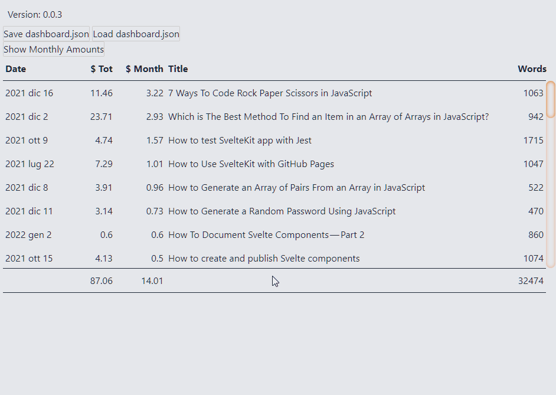

Nothing happens if I click on the icons. Because I haven't linked any functions to the two commands. I need to go back to the table and add another prop:

```ts
export let orders: Table_Orders[] = [];

interface Table_Orders {
  key: string;
  functionOrderASC: Function;
  functionOrderDESC: Function;
}
```

I also need two functions to sort values in ascending and descending order:

```ts
function orderAsc() {
  rows = [
    ...getFunctions(cellData.key, orders).functionOrderASC(cellData.key, rows),
  ];
}

function orderDesc() {
  rows = [
    ...getFunctions(cellData.key, orders).functionOrderDESC(cellData.key, rows),
  ];
}

function getFunctions(key: string, orders: Table_Orders[]): Table_Orders {
  const index = orders.findIndex((o) => o.key === key);
  return orders[index];
}
```

Finally I update the HTML code

```html
<TableContextMenu
  show="{showContextMenu}"
  {...posContextMenu}
  on:order-asc="{orderAsc}"
  on:order-desc="{orderDesc}"
/>
```

Now I can sort the various columns:

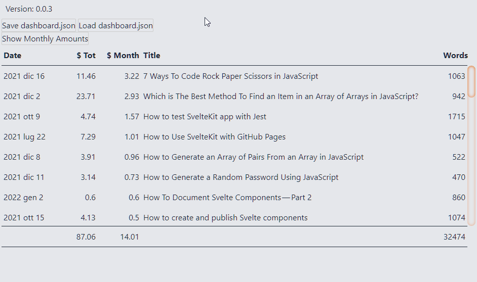

### Add some colors

As far as it works, there remains a problem. It is not clearly visible which column we have selected, or on which row the mouse is positioned. To solve the problem I can use a few lines of CSS.

Let's start with the lines. I think the quickest way is to add an element which contains all the elements of the row:

```html
<section>
  {#each rows as row}
    <div class="row" style={gridTemplate}>
      {#each headers as header}
        <div
          class="cell"
          style={getAlignItem(header)}
          on:contextmenu|preventDefault={(event) => {
            onRightClick(header, event);
          }}
        >
          {convert(header.type, row[header.key])}
        </div>
      {/each}
    </div>
  {/each}
</section>
```

I adjust the styles to keep the same format:

```css
section {
  display: flex;
  flex-direction: column;
  overflow-y: auto;
}

.row {
  display: grid;
}
```

And then, of course, I add a hover effect:

```css
.row:hover {
  background-color: theme("colors.orange.100");
}
```

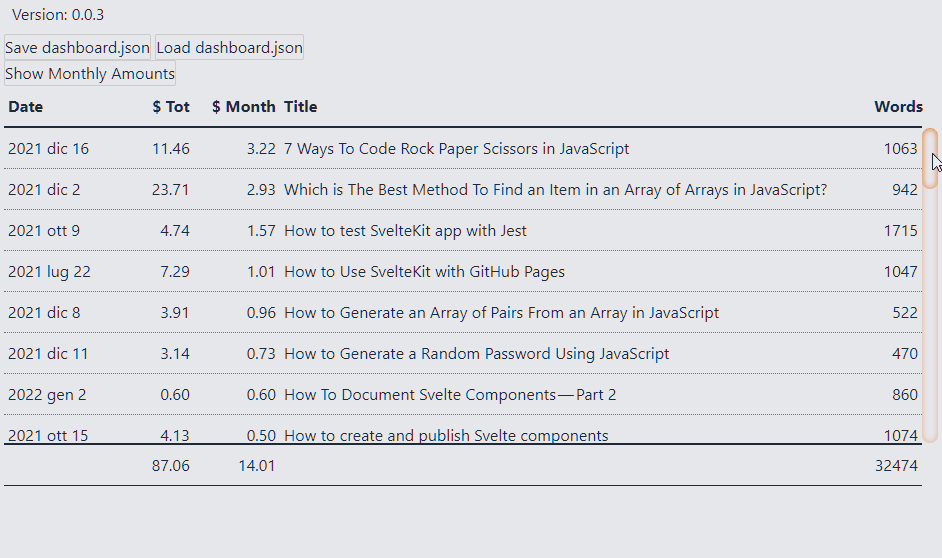

For columns I use the `cellData` variable to manage styles. First I make sure to avoid unwanted styles when the context menu is not visible:

```ts
$: cellData = !showContextMenu ? null : cellData;
```

Then I add a directive [class:name](https://svelte.dev/docs#template-syntax-element-directives-class-name)

```html
<div
  class="cell"
  class:column-order={cellData?.key === header.key} >
  Value
</div>
```

I add the style:

```css
.cell {
  @apply pt-2 pb-2 pr-1 pl-1;
  border: 2px solid transparent;
  box-sizing: content-box;
}

.column-order {
  border-left: 2px dotted theme("colors.orange.300");
  border-right: 2px dotted theme("colors.orange.300");
  background-color: theme("colors.orange.100");
}
```

This allows me to make the context menu effects visible:

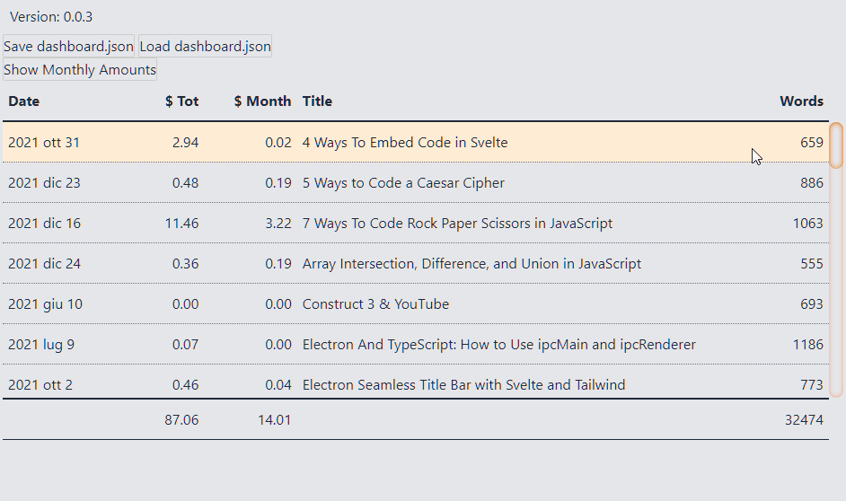

### Add a chart

Numbers and words are fine but there is another aspect that interests me: the ability to graphically represent some values. It's simple to add a bar chart. I use the space in the cell with the title.

I start by setting up a couple of props:

```ts
export let chartColumn: string = "";
export let chartValue: string = "";
```

I want to color the lines proportionally to the indicated value. To do this, I need the maximum value:

```ts
$: chartListValues = [
  ...rows.map((row) => {
    return row[chartValue];
  }),
];
$: chartMaxValue = Math.max(...chartListValues);
```

Then I create a function to define the style:

```ts
function chartStyle(condition, value) {
  if (!condition) {
    return "";
  }
  const left = Math.round((value / chartMaxValue) * 100);
  const result = `background:linear-gradient(to right,#fdba74 ${left}%, transparent ${left}%)`;
  return result;
}
```

Finally I modify the HTML code of the cells:

```html
<div
  class="chart-bar"
  style={chartStyle(chartColumn === header.key, row[chartValue])}
>
  {convert(header.type, row[header.key])}
</div>
```

I get this:

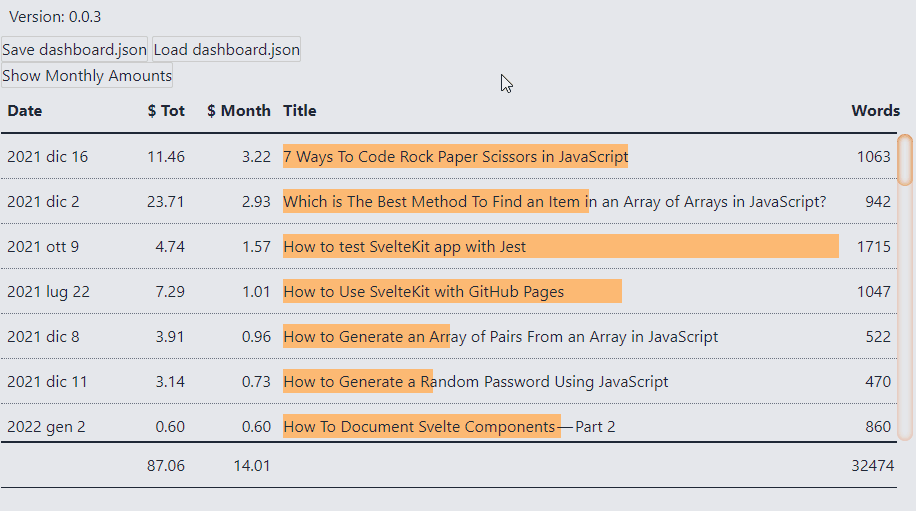

### Choose the data to show

I want to customize the choice of the column to use in the chart. I modify the context menu by adding another button:

```html
<script lang="ts">
  export let canChart: boolean = false;
</script>

{#if canChart}
<button
  on:click={() => {
    hide();
    dispatch("chart-this");
  }}><ChartBar /></button
>
{/if}
```

I have to use something to signal when to show the button because not all data can be represented graphically. For example the dates, or the texts. I add a `chartsColumns` variable with the list of columns

```html
<TableContextMenu
  show={showContextMenu}
  {...posContextMenu}
  on:order-asc={orderAsc}
  on:order-desc={orderDesc}
  on:hide={() => {
    showContextMenu = false;
  }}
  canChart={chartsColumns.includes(cellData?.key)}
/>
```

Then I add a function to select the data:

```html
<script lang="ts">
  const chartThis = () => {
    chartValue = cellData.key;
  };
</script>

<TableContextMenu
  show={showContextMenu}
  {...posContextMenu}
  on:order-asc={orderAsc}
  on:order-desc={orderDesc}
  on:hide={() => {
    showContextMenu = false;
  }}
  canChart={chartsColumns.includes(cellData?.key)}
  on:chart-this={chartThis}
/>
```

There is a problem: how do I know which data I am viewing? There can be various ways. For the moment I think it is enough to highlight the column, perhaps using a bold font.

```html
<div
  class="cell"
  class:data-charted={chartValue === header.key}
>
  <!--  -->
</div>

<style>
.data-charted {
  font-weight: 700;
}
</style>
```

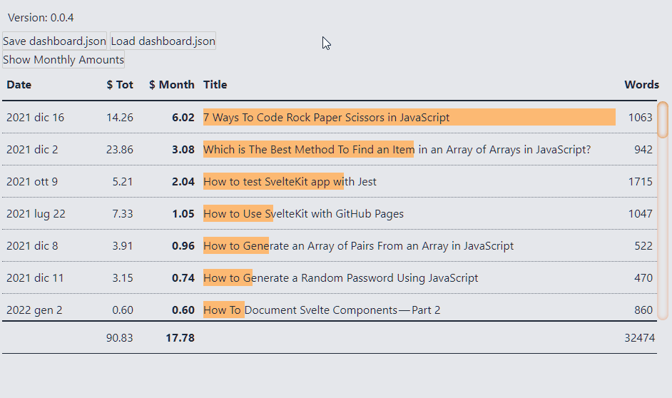

### Add numbers to lines

One last detail remains: the line numbers. Simply add an index to Svelte's `#each` loop:

```html
<!--  -->
{#each rows as row, index (row.id)}
  <div class="row" style={gridTemplate}>
    <div class="cell"> {index + 1} </div>
<!--  -->
```

Then I modify the `gridTemplate` variable to create the corresponding column:

```js
$: gridTemplate = `grid-template-columns: 4ch ${getWidthColumns(headers)};`;
```

It only takes a few lines of code to achieve this:

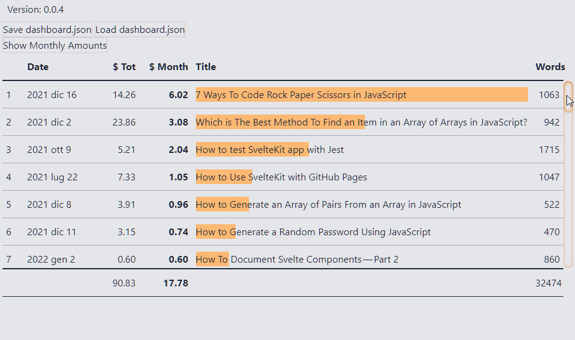

### Animate the table

Finally I can add an animation to make it evident when we sort the table. To do this I use the [animate:fn](https://svelte.dev/docs#template-syntax-element-directives-animate-fn) directive:

```html
<script>
  import { flip } from "svelte/animate";
  import { sineOut } from "svelte/easing";
</script>

<!-- -->
<section>
  {#each rows as row, index (row.id)}
    <div
      class="row"
      style={gridTemplate}
      animate:flip={{ duration: 1000, easing: sineOut }}
    >
<!--  -->
```

In this way I make the order operation visible:

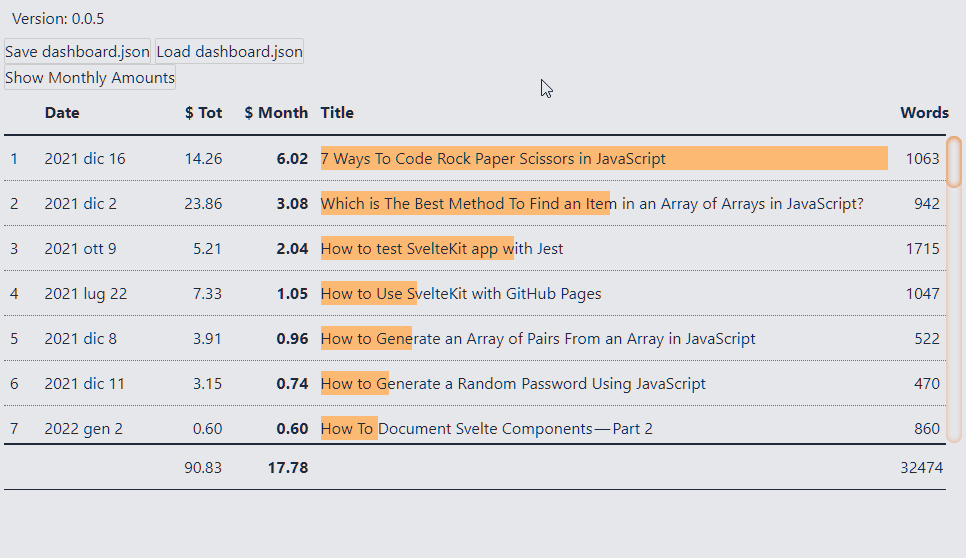

Well, that's all for now. I still have to think about if and how to manage filters and groupings. Maybe I'll talk about it in the future.

As for the code, however, the repository I'm working on is [el3um4s/medium-stats](https://github.com/el3um4s/medium-stats). It is a work in progress and the code is quite dirty. However, it can be useful.

Finally, these are my other articles related to Svelte and SvelteKit:

- [Svelte & SvelteKit](https://el3um4s.medium.com/list/svelte-sveltekit-bf5be8834fbf)
