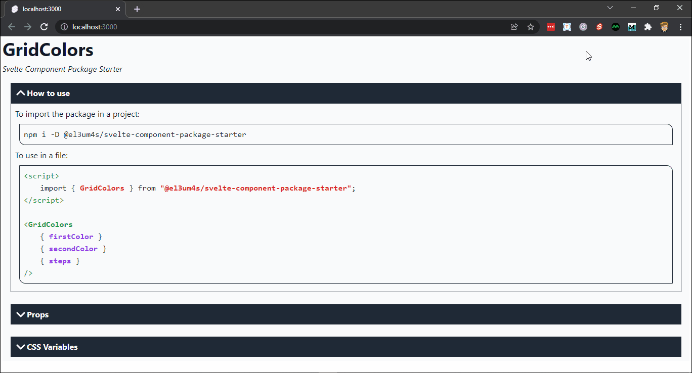
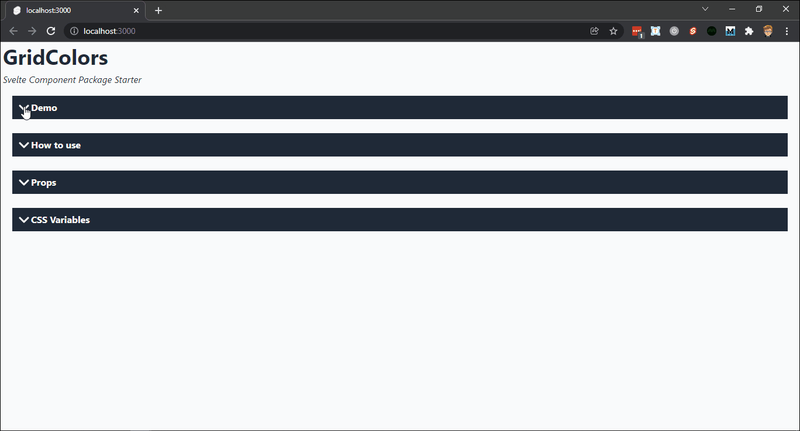
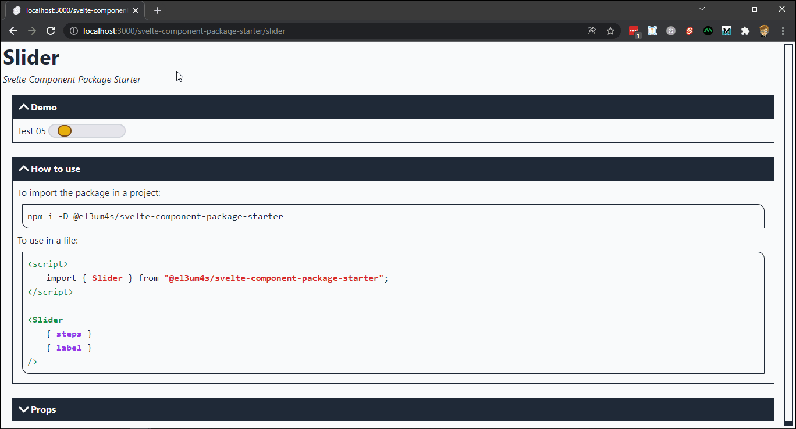

This post took me longer than expected. A little over a month. The two main repositories took me longer. This is to answer a question: how can I easily document a web component created with Svelte?

### Introduction

Before starting I have to clarify a couple of things. First of all, this post consists of three parts.

The first part takes up the discourse begun with this article:

- [How to Document Svelte Components](https://blog.stranianelli.com/hypothesis-how-to-document-svelte-components-english/)

I take up my hypothesis from a month and a half ago and present the two repositories that I will use.

The second part is a review of how to create a blog on GitHub using static pages. It is basically a summary of this piece:

- [How to Use SvelteKit with GitHub Pages](https://blog.stranianelli.com/sveltekit-et-github-pages-english/)

Finally the third part is about how to use Markdown (`md`) files together with Svelte components.

I'm not starting from a new component but from one I've already created:

- [How to Create and Publish Svelte Components](https://blog.stranianelli.com/how-to-create-svelte-componentes-english/)

So with that said, let's get started.

### How to create documents that document themselves

To simplify the creation of the Svelte component documentation I have created 2 NPM packages. The first, [@el3um4s/svelte-get-component-info](https://www.npmjs.com/package/@el3um4s/svelte-get-component-info), has the task of parsing the component and extracting a JSON object with the basic information. The second, [@el3um4s/svelte-component-info](https://www.npmjs.com/package/@el3um4s/svelte-component-info), takes care of transforming this information into a readable format on the screen.

Why did I split the project in two? Because in this way it is possible to create different graphic presentations, if someone wants to do it.

I begin by installing the first one:

```bash
npm i -D @el3um4s/svelte-get-component-info
```

I then create a `getInfoSvelteComponents.js` file that allows me to read all the files in the `src\lib\components` directory. After extracting the data I need, I save it in an `infoSvelteComponents.json` file in the `src\routes` folder:

```js
import { writeFileSync } from "fs";
import glob from "glob";
import { getInfo } from "@el3um4s/svelte-get-component-info";

const basePath = "src/lib/components/";

const listFile = glob.sync(`${basePath}**/*.svelte`);

let infoFiles = {};
listFile.forEach((file) => {
  const prop = getInfo(file);
  const fileName = file.substring(basePath.length);
  infoFiles[fileName] = prop;
});

let data = JSON.stringify(infoFiles);
writeFileSync("./src/routes/infoSvelteComponents.json", data);
```

It can also be useful, but not essential, to create a `getInfoSvelteComponents-watcher.js` file to automatically intercept any changes to the component source code:

```js
import { watch } from "fs";

import { exec } from "child_process";

exec("npm run get-info-svelte-components");

watch("./src/lib/components", () => {
  exec("npm run get-info-svelte-components");
});
```

So I add a couple of scripts to `package.json`:

```json
"scripts": {
  "get-info-svelte-components": "node getInfoSvelteComponents.js",
  "get-info-svelte-components-watcher": "node getInfoSvelteComponents-watcher.js",
}
```

When I run `npm run get-info-svelte-components` I get a file similar to this:

```json
{
  "_InputColors.svelte": {
    "props": [
      { "name": "firstColor", "defaultValue": "white" },
      { "name": "secondColor", "defaultValue": "black" }
    ],
    "actions": [],
    "slots": [],
    "css": []
  },
  "GridColors.svelte": {
    "props": [
      { "name": "firstColor", "defaultValue": "#fafa6e" },
      { "name": "secondColor", "defaultValue": "red" },
      { "name": "steps", "defaultValue": "9" }
    ],
    "actions": [],
    "slots": [],
    "css": [{ "name": "--default-color-border" }, { "name": "--border-color" }]
  },
  "Slider.svelte": {
    "props": [
      { "name": "steps", "defaultValue": "9" },
      { "name": "label", "defaultValue": "Steps" }
    ],
    "actions": [],
    "slots": [],
    "css": []
  }
}
```

For each component in the `lib\components` directory I get an object with 4 properties:

- props
- actions
- slots
- css

I can import this information into the `src\routes\index.svelte`file

```html
<script lang="ts">
  import infoSvelteComponents from "./infoSvelteComponents.json";
</script>
```

This alone would be enough to create an automatic documentation system: just extract the information contained in `infoSvelteComponents` and that's it.

I preferred to create a specific component, [@el3um4s/svelte-component-info](https://www.npmjs.com/package/@el3um4s/svelte-component-info). I install it with:

```bash
npm i @el3um4s/svelte-component-info
```

I then import the component into the `index.svelte` file:

```html
<script lang="ts">
  import infoSvelteComponents from "./infoSvelteComponents.json";
  import { SvelteInfo } from "@el3um4s/svelte-component-info";
</script>

<SvelteInfo
  name="GridColors"
  description="Svelte Component Package Starter"
  info={infoSvelteComponents['GridColors.svelte']}
  urlPackage="@el3um4s/svelte-component-package-starter" />
```

I get a page like to this:



I add a `slot="demo"` to show a preview of the component:

```html
<main>
	<SvelteInfo
		name="GridColors"
		description="Svelte Component Package Starter"
		info={infoSvelteComponents['GridColors.svelte']}
		urlPackage="@el3um4s/svelte-component-package-starter"
	>
		<GridColors slot="demo"
      {...settings}
      --border-color="orange"
    />
	</SvelteInfo>
</main>
```

This way I get this:



And with this I concluded the first part.

But one question remains: how can I automatically upload pages created by SvelteKit to GitHub?

### How to use SvelteKit with GitHub Pages

I start from the article [How to Use SvelteKit with GitHub Pages](https://javascript.plainenglish.io/sveltekit-github-pages-4fe2844773de) to use markdown as documentation of my components. I install [gh-pages](https://www.npmjs.com/package/gh-pages):

```bash
npm install gh-pages --save-dev
```

and then I add a script to `package.json`:

```json
"scripts": {
 "deploy": "node ./gh-pages.js"
}
```

I create the `gh-pages.js` file:

```js
import { publish } from "gh-pages";

publish(
  "build", // path to public directory
  {
    branch: "gh-pages",
    repo: "https://github.com/el3um4s/svelte-component-package-starter.git", // Update to point to your repository
    user: {
      name: "Samuele de Tomasi", // update to use your name
      email: "samuele@stranianelli.com", // Update to use your email
    },
    dotfiles: true,
  },
  () => {
    console.log("Deploy Complete!");
  }
);
```

Then I add the [adapter-static](https://www.npmjs.com/package/@sveltejs/adapter-static) to get pages ready for GitHub:

```bash
npm i -D @sveltejs/adapter-static@next
```

I update the `svelte.config.js` file:

```js
import preprocess from "svelte-preprocess";
import adapter from "@sveltejs/adapter-static";

/** @type {import('@sveltejs/kit').Config} */
const config = {
  preprocess: [
    preprocess({
      style: "postcss",
      script: "typescript",
      postcss: true,
    }),
  ],

  kit: {
    target: "#svelte",
    package: {
      dir: "package",
      emitTypes: true,
    },
    adapter: adapter({
      pages: "build",
      assets: "build",
      fallback: null,
    }),
    paths: {
      base: "/svelte-component-package-starter",
    },
  },
};

export default config;
```

I add the `.nojekyll` file to the `static` folder.

Whenever I create a new version of the documentation it is worth cleaning up the `build` folder containing the previous one. I can do this directly from NodeJs, by creating a `clean-build.js` file:

```js
import { existsSync, rmSync } from "fs";

function deleteFolderRecursive(path) {
  console.log(`Deleting old documents "${path}"...`);
  if (existsSync(path)) {
    rmSync(path, {
      force: true,
      recursive: true,
    });
  }
}

const paths = ["./build"];

paths.forEach((path) => {
  deleteFolderRecursive(path);
});

console.log("Successfully deleted!");
```

```bash
npm i -D npm-run-all
```

I edit `package.json`:

```json
"scripts": {
  "build": "npm run get-info-svelte-components && npm run clean-build && svelte-kit build",
	"clean-build": "node clean-build.js"
}
```

To upload the documentation to GitHub Pages, simply use the commands:

```bash
npm run build
npm run deploy
```

I get a web page similar to this

- [el3um4s.github.io/svelte-component-package-starter](https://el3um4s.github.io/svelte-component-package-starter/)

As long as it is a single component this is sufficient. However, I prefer to use markdown files.

### How to use Markdown with SvelteKit

I import [mdsvex](https://mdsvex.pngwn.io/):

```bash
npm i -D mdsvex
npx svelte-add@latest mdsvex
npm install
```

And I set the configuration file `mdsvex.config.js`

```js
const config = {
  extensions: [".svelte.md", ".md", ".svx"],

  smartypants: {
    dashes: "oldschool",
  },

  remarkPlugins: [],
  rehypePlugins: [],
};

export default config;
```

Finally I modify `svelte.config.js` to recognize the `md` files

```js
import { mdsvex } from "mdsvex";
import mdsvexConfig from "./mdsvex.config.js";
import preprocess from "svelte-preprocess";
import adapter from "@sveltejs/adapter-static";

/** @type {import('@sveltejs/kit').Config} */
const config = {
  extensions: [".svelte", ...mdsvexConfig.extensions],

  preprocess: [
    preprocess({
      style: "postcss",
      script: "typescript",
      postcss: true,
    }),
    mdsvex(mdsvexConfig),
  ],

  kit: {
    target: "#svelte",
    package: {
      dir: "package",
      emitTypes: true,
    },
    adapter: adapter({
      pages: "build",
      assets: "build",
      fallback: null,
    }),
    paths: {
      base: "/svelte-component-package-starter",
    },
  },
};

export default config;
```

Now I can use the `md` files as pages in the `routes` directory. I then rename the `index.svelte` file to `index.md`.

I can create a `slider.md` file to document this component:

```html
<script lang="ts">
	import Slider from '$lib/components/Slider.svelte';
	import infoSvelteComponents from './infoSvelteComponents.json';
	import { SvelteInfo } from '@el3um4s/svelte-component-info';

	let steps = 8;
	let label = "Test";
	$: label = `Test ${steps.toString().padStart(2, "0")}`
</script>

<main>
	<SvelteInfo
		name="Slider"
		description="Svelte Component Package Starter"
		info={infoSvelteComponents['Slider.svelte']}
		urlPackage="@el3um4s/svelte-component-package-starter"
	>
    	<Slider bind:steps {label} slot="demo"/>
    </SvelteInfo>
</main>
```

So on page [el3um4s.github.io/svelte-component-package-starter/slider](https://el3um4s.github.io/svelte-component-package-starter/slider) I find something like this:



And this is all. The project repository is here:

- [el3um4s/svelte-component-package-starter](https://github.com/el3um4s/svelte-component-package-starter)
