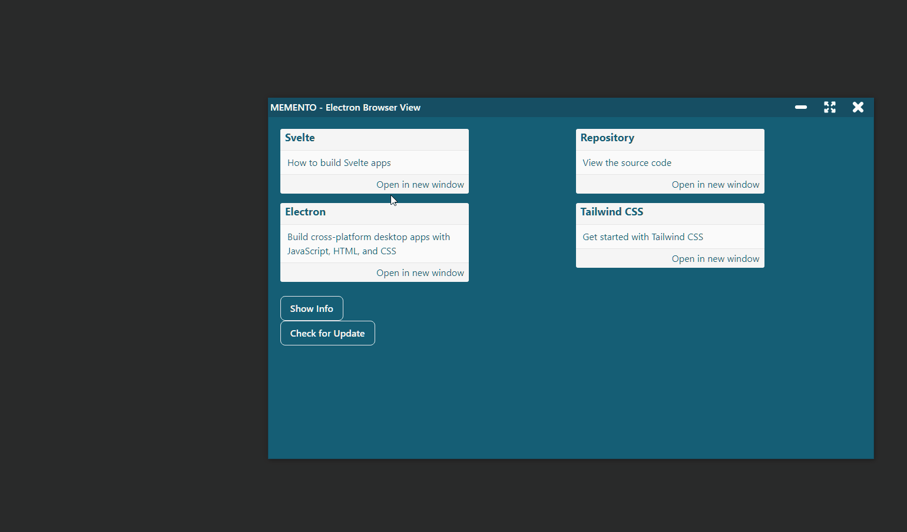
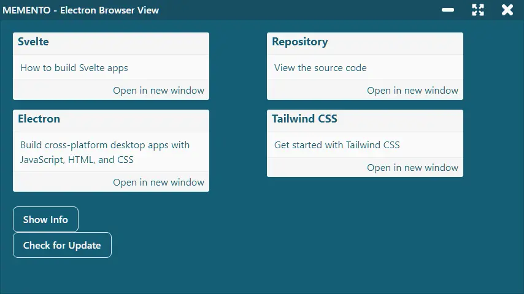
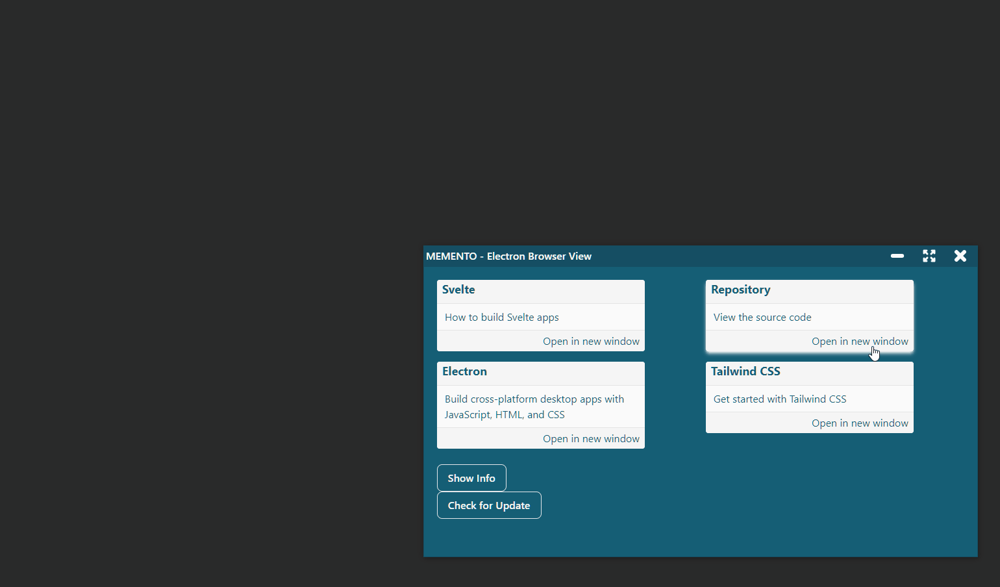

One of the problems I'm facing with my [gest-dashboard](https://javascript.plainenglish.io/the-journey-of-a-novice-programmer-82366ec7851a) project is managing several windows with Electron. It is a more complex problem than I thought and it prompted me to study the issue. After some testing I discarded `<iframe>` and `<webview>`. Instead, I focused on how to use [Browser View](https://www.electronjs.org/docs/latest/api/browser-view) with Electron.

The target? Get something similar to this: being able to load external pages into Electron, while maintaining control of the [Browser Window](https://www.electronjs.org/docs/latest/api/browser-window).



Since this post is about a very specific topic I don't cover all the steps to set up a new Electron project. For simplicity, I have used the [el3um4s/memento-svelte-electron-typescript](https://github.com/el3um4s/memento-svelte-electron-typescript) template but it is not mandatory. Instead it is important to understand one thing, before starting: how to use ipcMain and ipcRenderer to make the various windows communicate with Electron. There are some interesting guides on the net. In this tutorial I start from this:

- [Electron And TypeScript: How to Use ipcMain and ipcRenderer](https://blog.stranianelli.com/electron-ipcmain-ipcrenderer-typescript-english/)

### But first: why use a browser view?

The question must be answered: why use a browser view instead of a simpler [webview tag](https://www.electronjs.org/docs/latest/api/webview-tag)?

The question must be answered: why use a browser view instead of a simpler [] tag (https://www.electronjs.org/docs/latest/api/webview-tag)?

The first reason is that Electron's own documentation recommends doing this. The web views are now being discontinued. To quote [developer.chrome](https://developer.chrome.com/docs/extensions/reference/webviewTag/):

```text
chrome.webviewTag: This API is part of the deprecated Chrome Apps platform. Learn more about migrating your app.
```

It follows that it is better to turn to other shores. An interesting solution is to use `iframes`. Unfortunately it creates more problems than it solves. Maybe in the future I will do more in-depth tests.

Fortunately, the problem has already been solved by others smarter than me. I recommend reading these two stories, they are very informative:

- [Slack Engineering - Growing Pains: Migrating Slack’s Desktop App to BrowserView](https://slack.engineering/growing-pains-migrating-slacks-desktop-app-to-browserview/)
- [Figma - Introducing BrowserView for Electron](https://www.figma.com/blog/introducing-browserview-for-electron/)

Summarizing what I need, and what I believe the Browser Views can give me, is a method for:

- view pages external to Electron
- integrate these pages into the application
- use the ipcMain-ipcRenderer system from external pages

That said, go with the code!

### The graphical interface



The first thing I need is a button. For aesthetic reasons I created a `Card.svelte` component:

```html
<script lang="ts">
  export let link: string;
  export let title: string;

  import { createEventDispatcher } from "svelte";
  const dispatch = createEventDispatcher();

  $: detail = {
    title,
    link,
  };

  function openInNewWindow() {
    dispatch("open-in-new-window", detail);
  }
</script>

<div class="card">
  <div class="header">
    <div class="title">
      {title}
    </div>
  </div>
  <div class="content">
    <slot name="description" />
  </div>
  <div class="footer">
    <button title={link} on:click={openInNewWindow}>
      Open in new window
    </button>
  </div>
</div>
```

The important part is the function to call on the `click`:

```html
<script>
  function openInNewWindow(e) {
    globalThis.api.windowManager.send("openInNewWindow", e.detail);
  }
</script>

<Card
  title={title}
  link={link}
  on:open-in-new-window={openInNewWindow}
>
  <div slot="description">{description}</div>
</Card>
```

I send the `openInNewWindow` command from the renderer with the details that interest me (the `link` of the page to open). But I have to create a special API.

### Add the WindowManager API

I create `src\electron\IPC\windowManager.ts`. First I import the core libraries of my API:

```ts
import { BrowserWindow } from "electron";

import { SendChannels } from "./General/channelsInterface";
import IPC from "./General/IPC";
```

Then I define the name to use to call it:

```ts
const nameAPI = "windowManager";
```

Then I define the open channels in output, the ones to be used to send the commands from the window

```ts
const validSendChannel: SendChannels = {
  openInNewWindow: openInNewWindow,
};
```

Then it's up to the incoming channels, the ones that can be used to send a response to the window. For simplicity in this example I leave the list empty:

```ts
const validReceiveChannel: string[] = [];
```

Finally I initialize the API and export it:

```ts
const windowManager = new IPC({
  nameAPI,
  validSendChannel,
  validReceiveChannel,
});

export default windowManager;
```

### Define the commands to execute

Obviously this is not enough. I need to actually define the command to run. To do this I create the `openInNewWindow()` function:

```ts
import CustomWindow from "../customWindow";
import * as globals from "../globals";

async function openInNewWindow(
  customWindow: BrowserWindow,
  event: Electron.IpcMainEvent,
  message: any
) {
  let win = await createMainWindow();
}

async function createMainWindow() {
  let customWindow: CustomWindow;
  const settings = {
    title: "-",
    x: Math.floor(Math.random() * 64),
    y: Math.floor(Math.random() * 64),
  };

  const urlPage = globals.get.mainUrl();
  customWindow = new CustomWindow(settings);
  customWindow.createWindow(urlPage);

  return customWindow;
}
```

This way if I click a button from the main window I can create a new window.

I have to point out one thing. I imported the module `src\electron\globals.ts` to make it easier to pass the url of the start page:

```ts
interface Globals {
  mainURL: string;
}

const globals: Globals = {
  mainURL: "index.html",
};

const get = {
  mainUrl: () => globals.mainURL,
};

const set = {
  mainURL: (v: string) => {
    globals.mainURL = v;
    return v;
  },
};

export { get, set };
```

This way I can call the main page from any module.

But I'm not done yet. I'd better give the new window some "special powers". At least the ability to use the titlebar buttons:

```ts
import windowControls from "./windowControls";
import CustomWindow from "../customWindow";
import * as globals from "../globals";

async function createMainWindow() {
  let customWindow: CustomWindow;
  const settings = {
    title: "-",
    x: Math.floor(Math.random() * 64),
    y: Math.floor(Math.random() * 64),
  };

  const urlPage = globals.get.mainUrl() + "#browserview";
  customWindow = new CustomWindow(settings);
  customWindow.createWindow(urlPage);

  await customWindow.setIpcMain([windowControls]);
  return customWindow;
}
```

All that remains is to add a Browser View to the new window. I call the `addBrowserView` and `setIpcMainView` methods:

```ts
async function openInNewWindow(
  customWindow: BrowserWindow,
  event: Electron.IpcMainEvent,
  message: any
) {
  let win = await createMainWindow();
  await win.addBrowserView(message.link);
  win.setIpcMainView([windowControls]);
}
```

### Create a BrowserWiew in Electron

Now I have to define these methods. To do I change the `CustomWindow` class (`src\electron\customWindow.ts`).

First I add the `browserView` property:

```ts
class CustomWindow {
  window!: BrowserWindow;
  settings: { [key: string]: any };
  onEvent: EventEmitter = new EventEmitter();

  browserView!: BrowserView;
  // ...
```

The general procedure for creating and adding the Browser View in Electron is this:

```js
// In the main process.
const { app, BrowserView, BrowserWindow } = require("electron");

app.whenReady().then(() => {
  const win = new BrowserWindow({ width: 800, height: 600 });

  const view = new BrowserView();
  win.setBrowserView(view);
  view.setBounds({ x: 0, y: 0, width: 300, height: 300 });
  view.webContents.loadURL("https://electronjs.org");
});
```

Starting from this I add a method to my class:

```ts
class CustomWindow {
  // ...
  async addBrowserView(link: string) {
    this.browserView = new BrowserView({
      webPreferences: {
        nodeIntegration: false,
        contextIsolation: true,
        nativeWindowOpen: true,
        preload: path.join(__dirname, "preload.js"),
      },
    });

    this.window.setBrowserView(this.browserView);
    this.browserView.setBounds({
      x: 1,
      y: 32,
      width: 800,
      height: 600,
    });

    this.browserView.webContents.loadURL(link);
  }
  // ...
}
```

I have set the position to `x = 1` and `y = 32` because I want to leave space for the title bar in the main window.

There is a small detail to solve:



If I change the size of the window, the size of the Browser View does not change. And the dimensions are not what I want.

First I make sure the size is correct at startup using [BrowserWindow.getSize()](https://www.electronjs.org/docs/latest/api/browser-window#wingetsize)

```ts
const [width, height] = this.window.getSize();

this.browserView.setBounds({
  x: 1,
  y: 32,
  width: width - 2,
  height: height - 33,
});
```

Then I use [BrowserView.setAutoResize(options)](https://www.electronjs.org/docs/latest/api/browser-view) to automatically change the size when the BrowserWindow changes:

```ts
this.browserView.setAutoResize({
  width: true,
  height: true,
});
```


To complete everything I have to allow the BrowserView to access the API:

```ts
async setIpcMainView(api: Array<IPC>) {
  api.forEach(async (el) => await el.initIpcMain(ipcMain, this.browserView));
}
```

### Register WindowManager API

It is not enough to define the WindowManager API, I also need to enable it in `src\electron\preload.ts`:

```ts
import { generateContextBridge } from "./IPC/General/contextBridge";

import systemInfo from "./IPC/systemInfo";
import updaterInfo from "./IPC/updaterInfo";
import windowControls from "./IPC/windowControls";
import windowManager from "./IPC/windowManager";

generateContextBridge([systemInfo, updaterInfo, windowControls, windowManager]);
```

Finally I allow only the main window to create new windows. To do this I edit `src\electron\index.ts`:

```ts
// ...
import windowManager from "./IPC/windowManager";
// ...

async function createMainWindow() {
  const settings = {
    title: "MEMENTO - Electron BrowserView",
  };
  mainWindow = new CustomWindow(settings);
  const urlPage = globals.get.mainUrl() + "#main";
  mainWindow.createWindow(urlPage);

  await mainWindow.setIpcMain([
    systemInfo,
    updaterInfo,
    windowControls,
    windowManager, // <---
  ]);

  updaterInfo.initAutoUpdater(autoUpdater, mainWindow.window);
}
```

Well, after completing all these steps I can open a new window, with a BrowserView embedded, using a simple line of code:

```js
globalThis.api.windowManager.send("openInNewWindow", {
  title: "BrowserView",
  link: "https://example.com/",
});
```

As usual, the project code is freely available on GitHub

- [el3um4s/memento-electron-browser-view](https://github.com/el3um4s/memento-electron-browser-view)

I also created a list with my articles on ElectronJS:

- [Electron Stories](https://el3um4s.medium.com/list/electron-stories-029651cc3a36)
