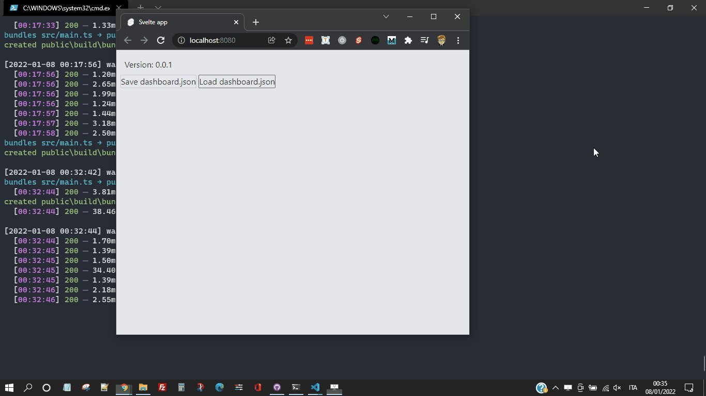

It is quite common knowledge that Medium does not provide in-depth stats. It is not a problem but I am used to recording some data on what I write and program. So I'm looking for an easy way to keep basic information.

There are some interesting posts. Of all the most interesting is [How to Get Medium Story Stats with 3 Lines of Python Code](https://python.plainenglish.io/how-to-get-medium-story-stats-with-3-lines-of-python-code-c28df3501392) by [Saul Dobilas](https://solclover.com/). I started from here to understand how to download and analyze Medium's stats.

### Partner Dashboard

First of all: to download the various statistics you must first be logged into Medium. After that you can download some JSON files with some data.

Saul recommends [medium.com/me/stats?format=json&count=100](https://medium.com/me/stats?format=json&count=100). From that page you can download a JSON file with data from the last 30 days. But I prefer a slightly different approach.

Forcing the reasoning, the only truly objective parameter of Medium is related to monetization. The views, reads, claps and so on also count. A number is enough for me: how much has each story monetized?

Yes, I know, it sounds like a venal speech. And what's more, my "earnings" are small, indeed very small. But I want to start from here.

To do this I need a JSON file containing the earnings data. To obtain it, I use the address: [medium.com/me/partner/dashboard?format=json](https://medium.com/me/partner/dashboard?format=json).

This file is interesting, it contains some useful data.
First of all, the first letters must be eliminated:

```js
])}while(1);</x>
```

This string is the remnant of an old problem now solved. There is an article from over ten years ago that explains it well: [JSON Hijacking](http://haacked.com/archive/2009/06/25/json-hijacking.aspx/).

The JSON file consists of several parts:

```json
{
  "success": true,
  "payload": {
    "currentMonthAmount": {},
    "completedMonthlyAmounts": [],
    "postAmounts": [],
    "userId": "...",
    "monthlyPaymentPeriod": {},
    "userTaxDocuments": {},
    "userTaxWithholding": {},
    "includesNonEarningPosts": true,
    "username": "...",
    "references": {}
  },
  "v": 3,
  "b": "..."
}
```

I don't care about everything, of course. What interests me is this:

```json
{
  "currentMonthAmount": {},
  "completedMonthlyAmounts": [],
  "postAmounts": []
}
```

### Current Month Amount

`currentMonthAmount` contains the current month's data:

```json
{
  "currentMonthAmount": {
    "periodStartedAt": 1640995200000,
    "periodEndedAt": 1643673600000,
    "createdAt": 1640995200000,
    "amount": 324,
    "minimumGuaranteeAmount": 0,
    "hightowerUserBonusAmount": 0,
    "hightowerConvertedMemberEarnings": 0
  }
}
```

I'm not sure what the last three items mean, but the first ones are dates that identify the reference period.

To convert a timestamp into a more readable format just use [Date.prototype.toDateString()](https://developer.mozilla.org/en-US/docs/Web/JavaScript/Reference/Global_Objects/Date/toDateString):

```js
const converToString = (timestamp) => new Date(timestamp).toDateString();
```

`amount` instead represents the total "earned" during the month. Of course, it's cents, not whole dollars.

### Completed Monthly Amounts

`completedMonthlyAmounts` contains the data for the completed months. It's an array with an object for each previous month:

```json
{
  "completedMonthlyAmounts": [
    {
      "periodStartedAt": 1638316800000,
      "periodEndedAt": 1640995200000,
      "createdAt": "2022-01-03 18:36:47",
      "userId": "...",
      "collectionId": "",
      "amount": 5421,
      "state": 2,
      "stateUpdatedAt": 1641319862000,
      "withholdingPercentage": 0,
      "withholdingAmount": 0,
      "payoutAmount": 5421,
      "minimumGuaranteeAmount": 0
    }
  ]
}
```

In addition to the previous data, some additional information is saved: the user ID and the time when the data is consolidated. I don't know what is meant by `state`.

### Post Amounts

`postAmounts` is an array containing some interesting data for each published post:

```json
{
  "postAmounts": [
    {
      "periodStartedAt": 1640995200000,
      "periodEndedAt": 1643673600000,
      "createdAt": 1640995200000,
      "userId": "...",
      "post": {
        "id": "...",
        "homeCollectionId": "...",
        "title": "...",
        "detectedLanguage": "en",
        "createdAt": 1638488763608,
        "updatedAt": 1641277823221,
        "firstPublishedAt": 1638475200000,
        "virtuals": {
          "wordCount": 942,
          "imageCount": 3,
          "readingTime": 4.104716981132076,
          "subtitle": "...",
          "links": {
            "entries": [
              {
                "url": "...",
                "alts": [],
                "httpStatus": 200
              }
            ]
          }
        },
        "slug": "...",
        "importedUrl": "...",
        "importedPublishedAt": 1638475200000,
        "visibility": 2,
        "isEligibleForRevenue": true,
        "curationEligibleAt": 1638489502373,
        "isShortform": false
      },
      "amount": 97,
      "totalAmountPaidToDate": 2175,
      "totalAmountInCents": 97
    }
  ]
}
```

I am not examining all the items, also because I have not copied them all. However, there are some data on which I want to emphasize:

- `totalAmountPaidToDate`: is how much a story has earned since the day it was published
- `totalAmountInCents`: is the earning of the story in the current month
- `post.id`: is the `id` that uniquely identifies a story within Medium. I can access the post with the story using an address like `https://medium.com/story/id`. For example, my latest post can be reached via the address [medium.com/story/9db50dff8f38](https://medium.com/story/9db50dff8f38)
- `post.homeCollectionId` is the `id` that identifies the publication hosting a story.
- `post.title`, `post.virtuals.wordCount` and `post.virtuals.readingTime` contain some of the title of the story, the word count and an estimate of the reading time

With this information I can begin to create something to download, store and analyze my story data on Medium.

### How to download Medium stats

So, in summary, I go to [medium.com/me/partner/dashboard?format=json](https://medium.com/me/partner/dashboard?format=json) and save the page. Just use the right mouse button and choose `Save As...`. To help me, and to remind me of all the steps, I create a small app. I start from a template with [Svelte](https://svelte.dev/), [Typescript](https://www.typescriptlang.org/) and TailwindCSS already configured: [el3um4s/memento-svelte-typescript-tailwind](https://github.com/el3um4s/memento-svelte-typescript-tailwind):

```bash
npx degit el3um4s/memento-svelte-typescript-tailwind medium-stats
cd medium-stats
npm install
```

So, the first step is to remember to download the most up-to-date stats. I add a link to the page using Svelte:

```html
<script lang="ts">
  import "./css/tailwind.pcss";
  const urlMedium: string =
    "https://medium.com/me/partner/dashboard?format=json";
</script>

<p>
  1.
  <a
    sveltekit:prefetch
    href="{urlMedium}"
    target="_blank"
    rel="noopener noreferrer"
    >Save dashboard.json</a
  >
</p>
```


### Import a JSON file

After downloading the `dashboard.json` file I can import it into my application using the [File System Access API](https://web.dev/file-system-access/). The idea is to upload the file with the statistics and extract only those that interest me. Then, at a later time, and probably in a future post, I'll combine this data to give it the shape I'm interested in.

Let's start with creating a button:

```html
<p>2. Load dashboard.json</p>
<button on:click="{loadDashboardJSON}">Open</button>
```

I add a function:

```js
async function loadDashboardJSON() {
  let [fileHandle] = await window.showOpenFilePicker();
  const file = await fileHandle.getFile();
  const contents = await file.text();
  const stats = JSON.parse(contents);
  return stats;
}
```

I use `showOpenFilePicker()` to open a system window and select the file to use. Then with `getFile()` I load the file into the page. Finally I use `text()` to extract the content and save it in a variable of type string.

With a normal JSON file at this point it would be enough to use [JSON.parse()](https://developer.mozilla.org/en-US/docs/Web/JavaScript/Reference/Global_Objects/JSON/parse) to get an object. But in this case I have to delete the characters])} `])}while(1);</x>` first. I create the `sanitizeOriginalStats()` function:

```js
function sanitizeOriginalStats(contents) {
  const result = contents.startsWith(`])}while(1);</x>`)
    ? contents.replace(`])}while(1);</x>`, "")
    : contents;
  return result;
}
```

I add this function to `loadDashboardJSON()`.

```js
async function loadDashboardJSON() {
  let [fileHandle] = await window.showOpenFilePicker();
  const file = await fileHandle.getFile();
  const contents = await file.text();
  const stats = JSON.parse(sanitizeOriginalStats(contents));
  return stats;
}
```

### Analyze the data

Now that I have my data I can decide how to view them on the screen. As a first test, to test my idea, I decide to limit myself to something simple. I want to create two lists. The first with the proceeds of each month. The second with the progressive revenue of each post.

I start with the monthly proceeds. To get it I use the properties `currentMonthAmount` and `completedMonthlyAmounts`. For both it is sufficient to use `periodStartedAt` and `amount`. I create a function that helps me extract this information:

```js
function getMonthStats(month, isCurrentMonth = false) {
  return {
    isCurrentMonth,
    month: month.periodStartedAt,
    amount: parseInt(month.amount),
  };
}
```

Dates are a difficult type of subject to deal with. To get something readable I have to use some methods:

- [getFullYear()](https://developer.mozilla.org/en-US/docs/Web/JavaScript/Reference/Global_Objects/Date/getFullYear)
- [getMonth()](https://developer.mozilla.org/en-US/docs/Web/JavaScript/Reference/Global_Objects/Date/getMonth)
- [toLocaleString()](https://reactgo.com/convert-month-number-to-name-js/)

I create the `getDate()` function:

```js
function getDate(periodStartedAt) {
  const date = new Date(parseInt(periodStartedAt));
  return {
    year: date.getFullYear(),
    month: date.getMonth(),
    monthName: date.toLocaleString("default", { month: "short" }),
  };
}
```

And I use it in `getMonthStats()`:

```js
function getMonthStats(month, isCurrentMonth = false) {
  return {
    isCurrentMonth,
    month: getDate(month.periodStartedAt),
    amount: parseInt(month.amount),
  };
}
```

Now I can extract the data of the current month and those of the previous months with:

```js
function getMonthlyAmounts(stats) {
  const currentMonth = getMonthStats(stats.payload.currentMonthAmount, true);
  const previousMonths = stats.payload.completedMonthlyAmounts.map((month) => {
    return getMonthStats(month);
  });

  return [currentMonth, ...previousMonths];
}
```

I modify the button and add a list in which to show the various values:

```html
<button
    on:click={() => {
      window.open(urlMedium, "medium stats");
    }}>Save dashboard.json</button>

<button
  on:click={async () => {
    const stats = await loadDashboardJSON();
    monthlyAmounts = [...getMonthlyAmounts(stats)];
  }}>Load dashboard.json</button>

{#if monthlyAmounts.length > 0}
  <ul>
    {#each monthlyAmounts as data (data.month)}
      <li>
        {data.month.monthName}
        {data.month.year} - {data.amount / 100} $
      </li>
    {/each}
  </ul>
{/if}
```

So on the screen I can see something like this:


### Add a chart

The next step is to figure out how to graphically display the values. There are 3 libraries to consider:

- [Layer Cake](https://github.com/mhkeller/layercake)
- [Pancake](https://github.com/Rich-Harris/pancake)
- [Ffoodd Chaarts](https://ffoodd.github.io/chaarts/index.html)

What interests me is quite simple so I create a basic component to draw a histogram.

I start with setting the variables

- `data` for the data to show
- `labels`
- `columns` for the number of vertical bars to show
- `maxData` to scale the bars correctly

```js
export let data = [];
export let labels = [];

$: columns = data.length;
$: maxData = Math.max(...data);
```

I also need a way to manage some styles based on the amount of data to show:

```js
$: positionColumns = `grid-template-columns: repeat(${columns}, minmax(0, 1fr));`;
```

I add the `html` part:

```html
<section>
  <div class="columns data" style={positionColumns}>
    {#each data as d }
      <div class="column" style="height:{(d / maxData) * 100}%;">
        <span class="value">{d / 100}</span>
      </div>
    {/each}
  </div>
  <div class="columns labels" style={positionColumns}>
    {#each labels as l}
      <div>{l}</div>
    {/each}
  </div>
</section>
```

To make the graphical representation proportional I use `height:{(d / maxData) * 100}%`.

As for the CSS part I use a [grid](https://css-tricks.com/snippets/css/complete-guide-grid/):

```css
section {
  @apply w-full h-full grid items-end;
  grid-template-rows: auto 32px;
}

.columns {
  display: grid;
  justify-items: center;
  column-gap: 4px;
}

.data {
  @apply h-5/6 items-end;
}

.labels {
  @apply border-t border-slate-600 h-8 align-top;
}

.column {
  @apply bg-orange-600 w-full text-center font-bold;
  color: transparent;
}

.column:hover {
  @apply bg-red-600 text-red-600;
}

.value {
  position: relative;
  top: -32px;
}
```

I create a helper function to extract the dataset that interests me:

```js
function getDataForChart(monthly) {
  const data = monthly.map((m) => m.amount).reverse();
  const labels = monthly.map((m) => m.month.monthName).reverse();
  return { data, labels };
}
```

To dynamically manage the graphical representation I use [$](https://svelte.dev/docs#component-format-script-3-$-marks-a-statement-as-reactive):

```js
$: chartData = [...getDataForChart(monthlyAmounts).data];
$: chartLabels = [...getDataForChart(monthlyAmounts).labels];
```

Finally I add the graphic to the main page:

```html
{#if monthlyAmounts.length > 0 && showMonthlyAmounts}
  <div class="monthly-amounts">
    <div class="monthly-list">
      <ul>
        {#each monthlyAmounts as data (data.month)}
          <li>
            {data.month.monthName}
            {data.month.year} - {data.amount / 100} $
          </li>
        {/each}
      </ul>
    </div>
    <div class="istogram">
      <Istogram labels={chartLabels} data={chartData} />
    </div>
  </div>
{/if}
```

This way I can get something like this:



Okay, that's enough for now. There are still things to say: I will write another article on this topic in the near future.
