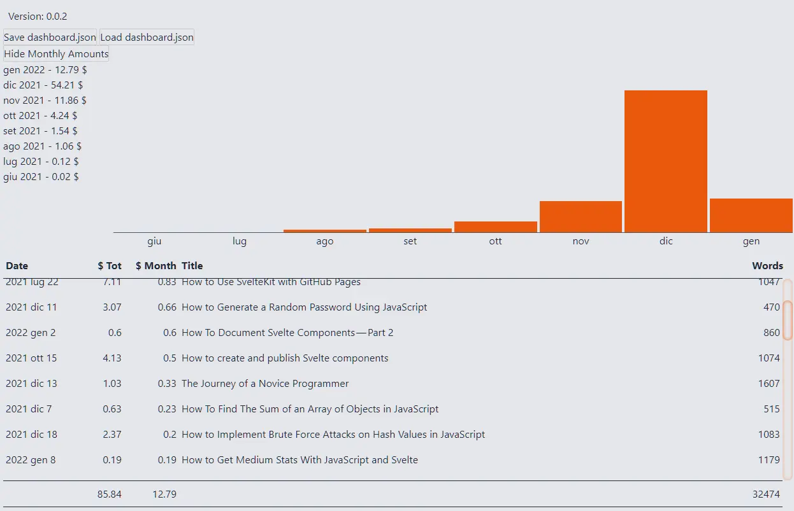

It's time to understand how to analyze the earnings of the various posts. So I'm going back to the [first article of this series](https://blog.stranianelli.com/medium-stats-with-javascript-and-svelte-part-1/), but focusing on the `postAmounts` property. For the moment I am interested in focusing only on a few values:

- `totalAmountPaidToDate`, all that the story has earned
- `amount`, the earnings in the current month
- `post.id`, the identifying `ID` of the story
- `firstPublishedAt`, the date of the first publication (for the moment I decide to ignore the date of the last modification)
- `post.title`, the title of the story
- `post.virtuals.wordCount`, the number of words in the post
- `post.virtuals.readingTime`, the estimated reading time
- `post.homeCollectionId`, the ID of the publication hosting the story

### Show story data

First I load the data into the page. To do this I use the `loadDashboardJSON()` function

```js
async function loadDashboardJSON() {
  let [fileHandle] = await window.showOpenFilePicker();
  const file = await fileHandle.getFile();
  const contents = await file.text();
  const stats = JSON.parse(sanitizeOriginalStats(contents));
  return stats;
}
```

I need to add a specific function to load each post's data into a separate object. I create the `getListStories()` function:

```js
function getListStories(postAmounts) {
  const result = postAmounts.map((p) => {
    return {
      id: p.post.id,
      title: p.post.title,
      amountMonth: p.amount,
      amountTot: p.totalAmountPaidToDate,
      homeCollectionId: p.post.homeCollectionId,
      wordCount: p.post.virtuals.wordCount,
      readingTime: p.post.virtuals.readingTime,
      firstPublishedAt: p.post.firstPublishedAt,
    };
  });
  return result;
}
```

There is a problem with this way of saving `firstPublishedAt`: it could create complications when I want to filter and sort the different posts. To avoid this, I break down the date into several parts. I modify `getDate()` by adding the [Date.prototype.getDate()](https://developer.mozilla.org/en-US/docs/Web/JavaScript/Reference/Global_Objects/Date/getDate) method:

```js
function getDate(periodStartedAt) {
  const date = new Date(parseInt(periodStartedAt));
  return {
    timestamp: date,
    year: date.getFullYear(),
    month: date.getMonth(),
    monthName: date.toLocaleString("default", { month: "short" }),
    day: date.getDate(),
  };
}
```

And accordingly I correct `getListStories()`:

```js
let listStories = [];

function getListStories(postAmounts) {
  const result = postAmounts.map((p) => {
    const firstPublishedAt = getDate(p.post.firstPublishedAt);
    return {
      id: p.post.id,
      title: p.post.title,
      amountMonth: p.amount,
      amountTot: p.totalAmountPaidToDate,
      homeCollectionId: p.post.homeCollectionId,
      wordCount: p.post.virtuals.wordCount,
      readingTime: p.post.virtuals.readingTime,
      firstPublishedAt: getDate(p.post.firstPublishedAt),
    };
  });
  return result;
}
```

I modify the `Load dashboard.json` button to save everything in the `listStories` array:

```html
  <button
    on:click={async () => {
      const stats = await loadDashboardJSON();
      monthlyAmounts = [...getMonthlyAmounts(stats)];
      listStories = [...getListStories(stats.payload.postAmounts)];
    }}>Load dashboard.json</button
  >
```

Now that I have my data, how to show them?

### Create a table with CSS Grid

I decided to create a table using the [CSS Grid Layout](https://developer.mozilla.org/en-US/docs/Web/CSS/CSS_Grid_Layout). During the first draft of this piece I wrote a long explanation on how to do it. But it is long and off topic. However, I have created a guide with my notes on how to create a table using CSS Grid Layout. You can read it here:

- [How To Create Responsive Data Tables With CSS Grid](https://blog.stranianelli.com/how-to-create-responsive-data-tables-with-css-grid/)

So, now I have an array with the stats of my stories. I need a second array containing the information about the columns:

```js
const headersTable = [
  { key: "firstPublishedAt", title: "Date", type: "date", width: "12ch" },
  {
    key: "amountTot",
    title: "$ Tot",
    type: "cents",
    width: "10ch",
    align: "end",
  },
  {
    key: "amountMonth",
    title: "$ Month",
    type: "cents",
    width: "10ch",
    align: "end",
  },
  { key: "title", title: "Title", type: "text" },
  {
    key: "wordCount",
    title: "Words",
    type: "numeric",
    width: "6ch",
    align: "end",
  },
];
```

I add the `Table` component to my page:

```html
{#if listStories.length > 0}
<div class="list-stories">
  <table rows="{listStories}" headers="{headersTable}" />
</div>
{/if}
```

It is convenient to display the total of the columns: I use the props `totals`. First I define a function that calculates the sum of the various values:

```js
const calculateTotalsTable = (listStories, headersTable) => {
  const result = headersTable.map((header) => {
    let value = "";
    if (header.type === "numeric" || header.type === "cents") {
      value = calculateTotalKey(listStories, header.key);
    }
    return { ...header, value };
  });
  return result;
};

function calculateTotalKey(listStories, key) {
  return listStories.reduce((previous, current) => {
    return previous + current[key];
  }, 0);
}
```

Then I edit the `App.svelte` file:

```html
<script>
  $: totalsTable = [...calculateTotalsTable(listStories, headersTable)];
</script>

{#if listStories.length > 0}
<div class="list-stories">
  <table rows="{listStories}" headers="{headersTable}" totals="{totalsTable}" />
</div>
{/if}
```

And here is the table with the statistics of the various articles.



### Add sort functions

Another useful thing is the ability to sort the stories by date, title, earnings and word count. To do this I use a context menu and the `ordersTable` variable;

```js
const ordersTable = [
  {
    key: "firstPublishedAt",
    functionOrderASC: (key, list) => [...orderDatesASC(key, list)],
    functionOrderDESC: (key, list) => [...orderDatesDESC(key, list)],
  },
  {
    key: "amountTot",
    functionOrderASC: (key, list) => [...orderNumbersASC(key, list)],
    functionOrderDESC: (key, list) => [...orderNumbersDESC(key, list)]
  },
  {
    key: "amountMonth",
    functionOrderASC: (key, list) => [...orderNumbersASC(key, list)],
    functionOrderDESC: (key, list) => [...orderNumbersDESC(key, list)]
  },
  {
    key: "title",
    functionOrderASC: (key: string, list: StoryAmountStats[]) => [..orderStringsASC(key, list)],
    functionOrderDESC: (key: string, list: StoryAmountStats[]) => [...orderStringsDESC(key, list)]
  },
  {
    key: "wordCount",
    functionOrderASC: (key, list) => [...orderNumbersASC(key, list)],
    functionOrderDESC: (key, list) => [...orderNumbersDESC(key, list)]
  },
];
```

I edit the HTML part

```html
<div class="list-stories">
  <table
    rows="{listStories}"
    headers="{headersTable}"
    totals="{totalsTable}"
    orders="{ordersTable}"
  />
</div>
```

And I get a list similar to this:


### Add a bar chart

The list is not enough. I want to add something graphic to have a better eye view. I then add a bar chart in my table.

Basically I want to use the widest column as an area to draw my bar graphs. First I define which columns can become the source of the graph:

```js
const chartsTable = ["amountTot", "amountMonth", "wordCount"];
```

Then I add the corresponding props

```html
<table
  rows="{listStories}"
  headers="{headersTable}"
  totals="{totalsTable}"
  orders="{ordersTable}"
  chartsColumns="{chartsTable}"
  chartColumn="title"
  chartValue="amountMonth"
/>
```

And finally I get the list with the earnings of the various posts:


### Let's make a summary

Every day I fill in by hand, in excel, a scheme similar to this:


As long as I have a few articles it's simple. But if I continue to write on Medium it is foreseeable that the matter will get complicated. This is why I want to make the collection and analysis of Medium's statistics as automatic as possible.

I can start by creating a simplified version of this summary. The simplest version is for the current month. But first a clarification.

As I already explained in the first article of this series, I am using TypeScript. Or rather, so far I've only used JavaScript. But from now on, things get complicated. So, to make development easier, I start introducing some types. And the first concerns the data I need to create the summary:

```ts
export interface MonthSynthesis {
  monthName: string;
  month: number;
  year: number;
  monthlyIncomeTotal: number;
  monthlyIncomeNewArticle: number;
  monthlyIncomeOldArticle: number;
  numberArticleTotal: number;
  numberArticleNewArticle: number;
  numberArticleOldArticle: number;
  monthsTopStory: number;
}
```

Then I create the component. Or, better, I start by creating a very simplified version:

```html
<script lang="ts">
  import type { MonthSynthesis } from "./Synthesis";
  export let monthSynthesis: MonthSynthesis;
</script>

<article>
  <div>Total Monthy Income: {monthSynthesis.monthlyIncomeTotal}</div>
  <div>
    New Article Earning (Active): {monthSynthesis.monthlyIncomeNewArticle}
  </div>
  <div>
    Old Article Earning (Passive): {monthSynthesis.monthlyIncomeOldArticle}
  </div>

  <div>Total Articles: {monthSynthesis.numberArticleTotal}</div>
  <div>
    # of New Articles Published: {monthSynthesis.numberArticleNewArticle}
  </div>
  <div>
    # of Old Articles Published: {monthSynthesis.numberArticleOldArticle}
  </div>

  <div>Month's top story: {monthSynthesis.monthsTopStory}</div>
</article>
```

I import the component into `App.svelte`:

```html
<script lang="ts">
  import Synthesis from "./components/synthesis/Synthesis.svelte";
</script>

<div class="synthesis">
  <Synthesis {monthSynthesis} />
</div>
```

Obviously I don't get anything because I haven't created the functions to extract the data. The simplest thing to calculate is the number of articles published and their earnings:

```ts
function getMonthlyIncomeTotal(listStories: StoryAmountStats[]): number {
  return listStories.reduce((sum, curr) => curr.amountMonth + sum, 0);
}

function getNumberArticleTotal(listStories: StoryAmountStats[]): number {
  return listStories.length;
}
```

It's just as quick to figure out which is the story with the most earnings in the month:

```ts
function getMonthsTopStory(listStories: StoryAmountStats[]): number {
  const listValue = listStories.map((story) => story.amountMonth);
  return Math.max(...listValue);
}
```

Things get a little more complicated when I have to divide the data for the stories of the current month and those of the previous months.

There are various ways to do this. Perhaps the smartest one is to use another json file. I can download the [stats.json](https://medium.com/me/stats?format=json&count=1000) file and extract the firstPublishedAtBucket property from there. But that's not what I'm going to do, not now. Later I will use this new file to get more data: `views`, `reads`, `claps` and `fans`.

Today I just use what I already have. So how do I divide the various posts by month and year of publication?

When I created the `StoryAmountStats` interface I also saved the` firstPublishedAt` property of type `CustomDateTime`:

```ts
interface StoryAmountStats {
  // ...
  firstPublishedAt: CustomDateTime;
}

interface CustomDateTime {
  timestamp: Date;
  year: number;
  month: number;
  monthName: string;
  day: number;
}
```

Well, that's all I need to get started.

How do I understand which month we are in? I can calculate the system date with [Date.now()](https://developer.mozilla.org/en-US/docs/Web/JavaScript/Reference/Global_Objects/Date/now). Then I extract the number of the month and year and use it as a filter.

```ts
function getCurrentMonth(): CustomDateTime {
  const date = Date.now();
  return getDate(date);
}

function getMonthData(obj: {
  listStories: StoryAmountStats[];
  month: number;
  year: number;
}): {
  income: number;
  articles: number;
} {
  const { listStories, month, year } = obj;
  const stories: StoryAmountStats[] = listStories.filter(
    (s) =>
      s.firstPublishedAt.month === month && s.firstPublishedAt.year === year
  );
  const income = getMonthlyIncomeTotal(stories);
  const articles = getNumberArticleTotal(stories);
  return { income, articles };
}
```

To calculate the data of the previous articles I can make a subtraction. Or I can create a function. I think a specific function is more suitable, also because I will need it later:

```ts
function getPreviousMonthData(obj: {
  listStories: StoryAmountStats[];
  month: number;
  year: number;
}): {
  income: number;
  articles: number;
} {
  const { listStories, month, year } = obj;
  const stories: StoryAmountStats[] = listStories.filter(
    (s) =>
      s.firstPublishedAt.year < year ||
      (s.firstPublishedAt.year === year && s.firstPublishedAt.month < month)
  );
  const income = getMonthlyIncomeTotal(stories);
  const articles = getNumberArticleTotal(stories);
  return { income, articles };
}
```

Now I just have to put it all together:

```ts
export const monthSynthesis = (
  listStories: StoryAmountStats[]
): MonthSynthesis => {
  const currentMonth = getCurrentMonth();
  const { monthName, month, year } = currentMonth;
  const currentMonthData = getMonthData({ listStories, month, year });
  const previousMonthsData = getPreviousMonthData({ listStories, month, year });
  return {
    monthName: monthName,
    month: month,
    year: year,
    monthlyIncomeTotal: getMonthlyIncomeTotal(listStories),
    monthlyIncomeNewArticle: currentMonthData.income,
    monthlyIncomeOldArticle: previousMonthsData.income,
    numberArticleTotal: getNumberArticleTotal(listStories),
    numberArticleNewArticle: currentMonthData.articles,
    numberArticleOldArticle: previousMonthsData.articles,
    monthsTopStory: getMonthsTopStory(listStories),
  };
};
```

After adding a few CSS styles I finally get a summary of the month:


### Where are we

I'll stop here for today. There are still some problems to be solved. And especially the one that started all this: how can I view the same data but for several months in a row? I'll talk about this in a future post.

So far we have created a page that shows the overall performance of the various months, the performance of the individual stories and a brief summary of the current month:


As for the first part of this article, you can read it here:

- [How to Get Medium Stats With JavaScript and Svelte](https://blog.stranianelli.com/medium-stats-with-javascript-and-svelte-part-1/)

On Medium there is a list with my posts on Svelte and SvelteKit:

- [Svelte & SvelteKit](https://el3um4s.medium.com/list/svelte-sveltekit-bf5be8834fbf)

This is the repository with the code:

- [el3um4s/medium-stats](https://github.com/el3um4s/medium-stats)

Obviously it's still a work in progress, so there are still some functions to fix and some code to clean up.
