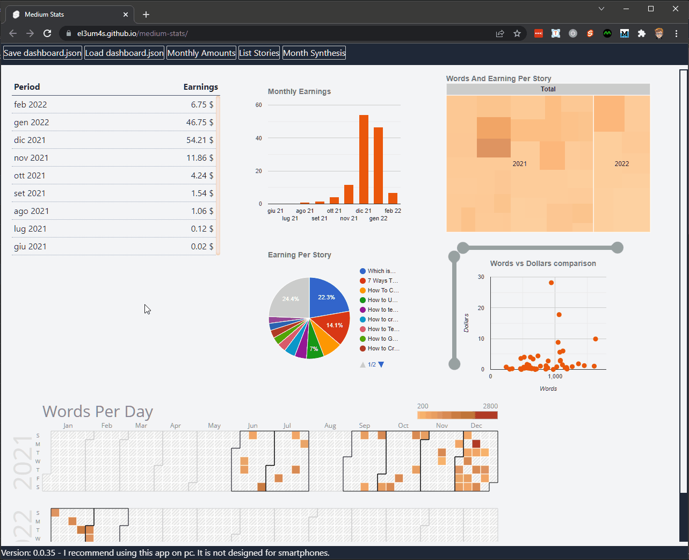
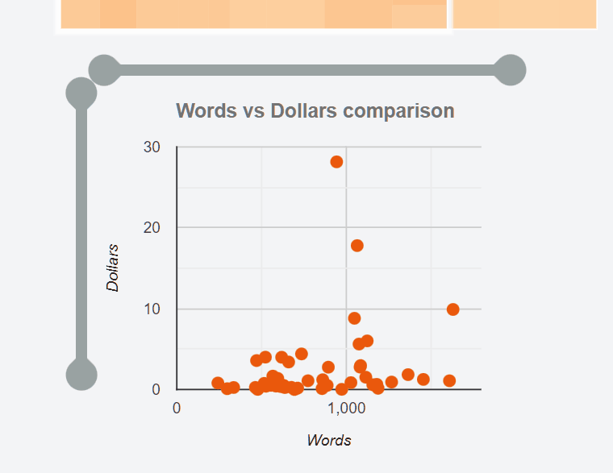
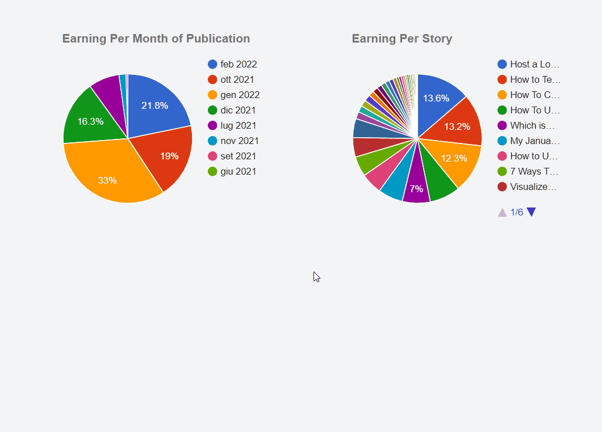

A few days ago [Corey Thompson](https://github.com/thompcd) added events to the charts of my previous tutorial. I admit that I have deliberately left the subject. However, I took advantage of the question to investigate a little deeper on how to make the various graphs more interesting.

First of all, here's what I want to achieve:



In summary, these are two different actions. The first allows you to change the zoom of the scatter plot using two sliders. The second event allows you to retrieve the data of the selected item and display some additional information. But before you can do this, you need to clean up the code.

### Clean up the code

In this post I continue the tutorial from a few weeks ago:

- [Visualize Your Medium Stats With Svelte and JavaScript](https://betterprogramming.pub/visualize-your-medium-stats-with-svelte-and-javascript-eb1ef7c71a63)

All the code, from this tutorial and the previous ones, is available in the repository

- [el3um4s/medium-stats](https://github.com/el3um4s/medium-stats)

Compared to the first part, I changed the structure of the project to simplify.

First I decided not to pass the data through `props` but to use a [Svelte store](https://svelte.dev/docs#run-time-svelte-store). In this way I can group all methods more logically, simplifying their modification and eliminating duplicates.

I create the `StorePartnerProgram.ts` file and start importing the TS types I need, as well as the `writable` module:

```ts
import type { Writable } from "svelte/store";
import { writable, get } from "svelte/store";
import type { PartnerProgram } from "../../Interfaces/MediumPartnerProgram";
```

I create the store and prepare it for export:

```ts
const partnerProgramStore: Writable<PartnerProgram> = writable();

export const partnerProgram = {
  subscribe: partnerProgramStore.subscribe,
  set: (p: PartnerProgram) => partnerProgramStore.set(p),
};
```

So I group all the various methods I have already talked about in new files and import them:

```ts
import * as H from "./HelperPartnerProgram";
import * as U from "./Utility";
import * as ChartsMonthly from "./HelperMonthlyAmountsCharts";
import * as ChartsCurrentMonth from "./HelperCurrentMonthCharts";
import * as Stories from "./HelperSingleStoryData";
import { getCurrentMonthSynthesis } from "./HelperSynthesis";
```

Finally I add the various methods to the store:

```ts
export const partnerProgram = {
  subscribe: partnerProgramStore.subscribe,
  set: (p: PartnerProgram) => partnerProgramStore.set(p),
  getCurrentMonthDate: () => U.getCurrentMonthDate(get(partnerProgramStore)),
  getMonthlyAmounts: () => H.getMonthlyAmounts(get(partnerProgramStore)),
  getListStories: () => H.getListStories(get(partnerProgramStore)),
  getStoryById: (id: string) =>
    Stories.getStoryById(get(partnerProgramStore), id),
  getCurrentMonthSynthesis: () =>
    getCurrentMonthSynthesis(get(partnerProgramStore)),
  getChartsData: {
    monthly: {
      earningPerMonth: () =>
        ChartsMonthly.earningPerMonth(get(partnerProgramStore)),
      earningPerStory: () =>
        ChartsMonthly.earningPerStory(get(partnerProgramStore)),
      treemapWordsAndEarning: () =>
        ChartsMonthly.treemapWordsAndEarning(get(partnerProgramStore)),
      scatterWordsAndEarning: () =>
        ChartsMonthly.scatterWordsAndEarning(get(partnerProgramStore)),
      wordPerDay: () => ChartsMonthly.wordPerDay(get(partnerProgramStore)),
    },
    currentMonth: {
      earningPerMonthPub: () =>
        ChartsCurrentMonth.earningPerMonthPub(get(partnerProgramStore)),
      earningPerMonthStory: () =>
        ChartsCurrentMonth.earningPerMonthStory(get(partnerProgramStore)),
    },
  },
};
```

After incorporating the various methods in `partnerProgram` I can call them directly from the various components.

For example, I can get the list of articles of the month by simply writing:

```ts
import { partnerProgram } from "./StorePartnerProgram";
const listStories = partnerProgram.getListStories();
```

### Change the zoom of the scatter plot

After cleaning up the code I can start thinking about how to improve the various graphics. The first thing I need is something to see in more detail the relationship between the length of the various posts and their yield. I think the best solution may be to add two sliders, one horizontal, the other vertical.



The first thing is to understand how to create the two sliders. We can have fun creating them from scratch or rely on something ready. For the moment I have chosen the easy way. On the Internet you can find several interesting components. I decided to use [Simon Goellner's Range Slider](https://github.com/simeydotme/svelte-range-slider-pips).

I install the component in my project using:

```bash
npm install svelte-range-slider-pips --save-dev
```

Then I import the component into `GoogleChartScatter.svelte`:

```ts
import RangeSlider from "svelte-range-slider-pips";
```

I can use it easily:

```html
<RangeSlider
  values = [...]
  min = 0
  max = 100
  range
  float
/>
```

There are some points to understand. I need to set the range of numbers. It is better to calculate them immediately so that you can return to the original view later:

```ts
const dataRange = {
  hAxis: {
    min: 0,
    max: Math.floor(
      Math.max(
        ...data.map((d, i) => (i > 0 && typeof d[0] == "number" ? d[0] : null))
      ) * 1.1
    ),
  },
  vAxis: {
    min: 0,
    max: Math.floor(
      Math.max(
        ...data.map((d, i) => (i > 0 && typeof d[1] == "number" ? d[1] : null))
      ) * 1.1
    ),
  },
};
```

The second point concerns how to intercept the two inputs. To do this I create an array with only two elements. The first indicates the smaller value, the second the greater:

```ts
let hRange = [dataRange.hAxis.min, dataRange.hAxis.max];
let vRange = [dataRange.vAxis.min, dataRange.vAxis.max];
```

Then I just have to join the pieces, using the [bind:property](https://svelte.dev/docs#template-syntax-element-directives-bind-property) directive to... bind the values:

```html
<RangeSlider
  vertical
  bind:values={vRange}
  min={dataRange.vAxis.min}
  max={dataRange.vAxis.max}
  range
  float
/>

<RangeSlider
  bind:values={hRange}
  min={dataRange.hAxis.min}
  max={dataRange.hAxis.max}
  range
  float
/>
```

This is for the sliders. I have to slightly modify the graph as well. Or, better, the `hAxis` and `vAxis` properties by binding them to the values of the sliders.

```html
<script lang="ts">
  $: hAxis = {
    title: axisX,
    viewWindow: { min: hRange[0], max: hRange[1] },
  };
  $: vAxis = {
    title: axisY,
    viewWindow: { min: vRange[0], max: vRange[1] },
  };
</script>

<google-chart
  class="chart"
  type="scatter"
  {data}
  options={{
    title,
    backgroundColor: "transparent",
    titleTextStyle: { fontSize: 14, color: "#737373" },
    legend: "none",
    hAxis,
    vAxis,
    colors: colors.length > 0 ? colors : undefined,
    tooltip: { isHtml: true },
  }}
/>
```

### Add an event when we select a value in the chart

The second event allows me to see some additional information when I select an element in a chart. So I switch to the `GoogleChartPie.svelte` chart and start modifying it to get this:



To generate events within a Svelte component I use [createEventDispatcher](https://svelte.dev/docs#run-time-svelte-createeventdispatcher):

```ts
import { createEventDispatcher } from "svelte";
import "@google-web-components/google-chart";

const dispatch = createEventDispatcher();
```

I can create an event linked to the selection of an element using:

```html
<google-chart
  // ...
  on:google-chart-select={(e) => {
    const selection = e.detail.chart.getSelection();
    dispatch("select", {
      selection,
      row: selection[0]?.row,
      value: rows[selection[0]?.row],
    });
  }}
/>
```

I use the Google Chart [select event](https://developers.google.com/chart/interactive/docs/events#the-select-event) to retrieve the values to pass out of the component.

Before going on, a note on the events of Google Charts. There are 3 events that can be called from (almost) any chart:

- `select`
- `error`
- `ready`

But if we want to use other events we have to register them. For example to listen for the `on mouse over` event:

```html
<google-chart
  events={["onmouseover"]}
  on:google-chart-onmouseover
/>
```

Or the `onmouseout` event:

```html
<google-chart
  events={["onmouseover","onmouseout"]}
  on:google-chart-onmouseover
  on:google-chart-onmouseout={(e) => { dispatch("mouseout", e); }}
/>
```

### Show a preview of the story

What I want to get is a quick way to figure out which story a data is referring to. To do this, I also pass the ID of the story to the graph:

```ts
export const earningPerStory = (mediumPartnerProgram: PartnerProgram) => {
  const listStories = getListStories(mediumPartnerProgram);
  const rows = listStories
    .sort((a, b) => b.amountTot - a.amountTot)
    .map((story) => {
      const title = story.title;
      const id = story.id;
      const amount = story.amountTot / 100;
      return [title, amount, id];
    });

  const cols = [
    { label: "Title", type: "string" },
    { label: "$", type: "number" },
    { label: "ID", type: "string" },
  ];

  return {
    cols,
    rows,
  };
};
```

I can then edit the component in the `MonthlyAmounts.svelte` file

```html
<GoogleChartPie
  cols={storyEarning.cols}
  rows={storyEarning.rows}
  title="Earning Per Story"
  sliceVisibilityThreshold={2.5 / 100}
  on:select={(e) => {
    const id = e.detail.value ? e.detail.value[2] : undefined;
    storySelected = id ? partnerProgram.getStoryById(id) : undefined;
  }}
/>
```

To get the post data starting from its ID I use the `getStoryById` function:

```ts
export const getStoryById = (
  mediumPartnerProgram: PartnerProgram,
  id: string
) => {
  const list = mediumPartnerProgram.payload.postAmounts;
  return list.find((p) => p.post.id === id);
};
```

To preview I created a `CardStory.svelte` component:

```ts
<script type="ts">
  import { slide } from "svelte/transition";
  export let story;
  $: id = story.post.id;
  $: backgroundImage = `url(https://miro.medium.com/max/160/${story.post.virtuals.previewImage.imageId})`;
</script>

<section>
  {#key id}
    <div class="content" transition:slide>
      <div class="info">
        <div class="title">{story.post.title}</div>
        <div class="subtitle">{story.post.virtuals.subtitle}</div>
        <div class="link">
          <a href="https://medium.com/story/{story.post.id}" target="_blank"
            >Link: medium.com/story/{story.post.id}</a
          >
        </div>
      </div>
      <div class="previewImage" style:background-image={backgroundImage} />
    </div>
  {/key}
</section>
```

I can use this component on the various pages by simply passing it the history data to show:

```html
{#if storySelected}
  <div class="storySelected">
    <CardStory story={storySelected} />
  </div>
{/if}
```

Well, that's it for today.
