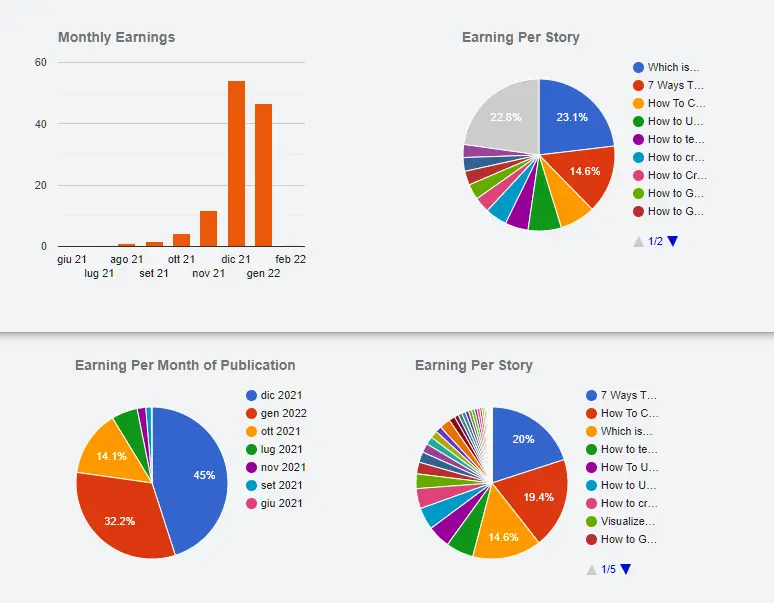
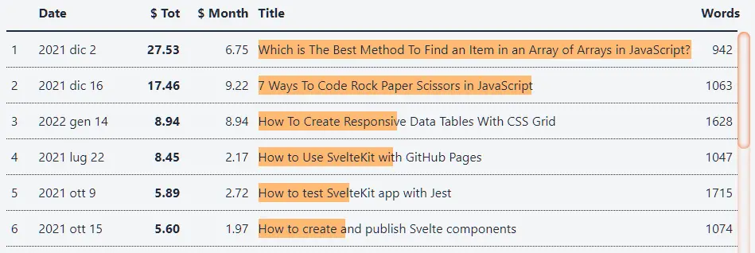
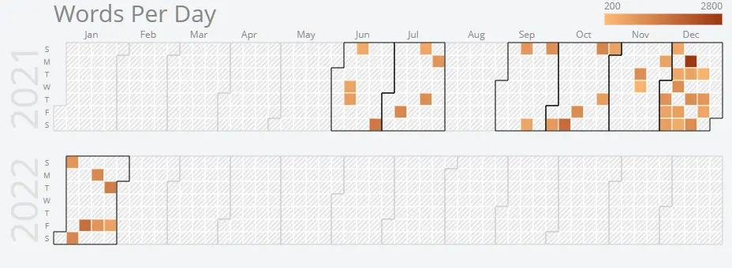

I haven't decided yet if I will regularly post updates on Medium. But I want to have a place to keep track of this writing "experiment". It is a topic that I have already partly covered in [my travel diary](https://el3um4s.medium.com/the-journey-of-a-programmer-january-2022-65b46994dfa1). In this post I want to be more specific.

I begin with the summary, in the style of those of [John Cooper](https://medium.com/@John_Cooper):

January 2022 produced $ 46. That's 14% less than in December. But I also wrote much less: there are 7 posts instead of 18 (-60%).

There are some interesting trends:

- it's the second month in a row that "new stories" produce on average more than 2$ each; it's not my goal yet (to approximate the average 5$ per story) but it's something
- the "old" stories increase their yield approaching 1$
- in 3 of the last 4 months the most profitable story weighs about a fifth of the total: I don't know how much it is possible to lower this percentage but I'm happy that it hasn't grown this month
- in 3 of the last 4 months about two-thirds of the income is from old articles

Obviously it is not enough to make in-depth considerations but this "passive" income is interesting. I still don't know if this phenomenon will repeat itself in February but it is worth keeping an eye on.

Going a little more specifically, 45% of January revenue is from stories published in December, 32% from stories of the month, 14% from October stories.

Looking at the individual posts, however, there are 3 main stories, which alone are worth 54%:

- [7 Ways To Code Rock Paper Scissors in JavaScript](https://betterprogramming.pub/7-ways-to-code-rock-paper-scissors-in-javascript-4189a5e7e535)
- [How To Create Responsive Data Tables With CSS Grid](https://betterprogramming.pub/how-to-create-responsive-data-tables-with-css-grid-9e0a37394450)
- [Which is The Best Method To Find an Item in an Array of Arrays in JavaScript?](https://betterprogramming.pub/which-is-the-best-method-to-find-an-item-in-an-array-of-arrays-in-javascript-5f51589d2086)

And always these 3 alone are worth 45% of the total (of all I've collected since I started writing on Medium).

I was talking about the 5$ per story. It is a goal that I have set myself. I would like every story I publish to produce at least 5$. Obviously this would be an average. For the moment only 6 out of 45 posts (13%) are on that level.

As I said, I wrote significantly less in January than in December. You can clearly see this by looking at the days I have published. This brings me to what I want to do this February: write more.

Translating into numbers, the optimal would be to be able to publish 3 or 4 articles per week, between 12 and 16 per month. I don't know if it's possible: generally what I write is strictly related to the code I develop. And many of these articles take a long time. For me, writing more means improving my coding technique. And it is a goal that I want to set myself.

More specifically, there are 3 articles that I want to be able to write by the end of the month:

1. how to create a contextual menu with JavaScript
2. how to create the side navigation bar using html and css
3. how to read excel file in javascript

I would also like to report my reading recommendations on a regular basis. A sort of list of the most interesting stories I've read on Medium and beyond.

From a monetary standpoint, I'd like to stick around what I've been doing over the past couple of months. Let's say a $ 45-55 profit range suits me.
