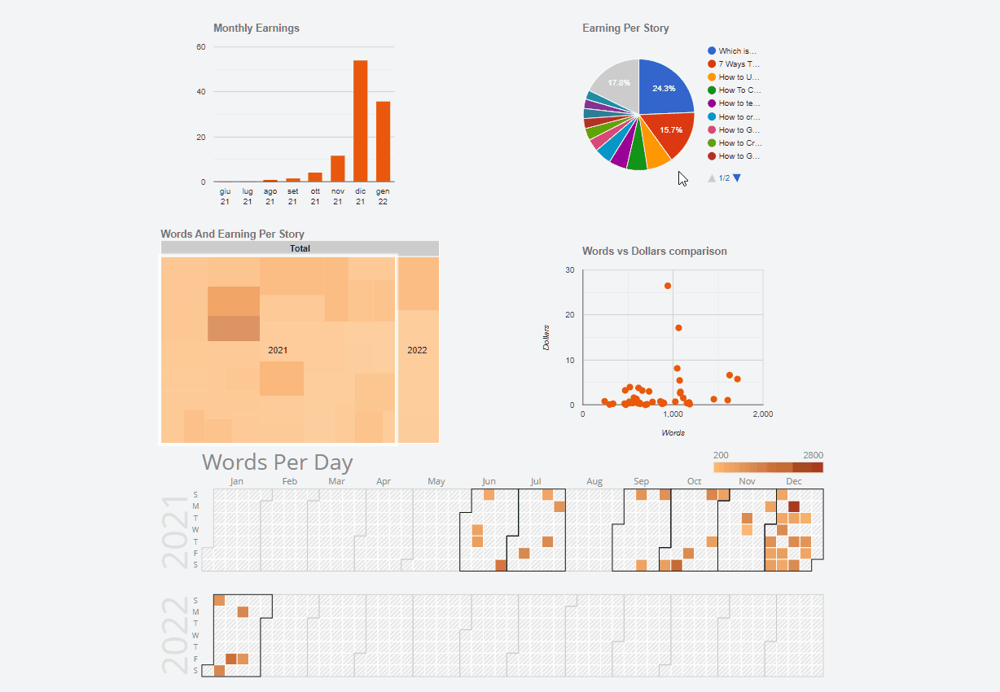
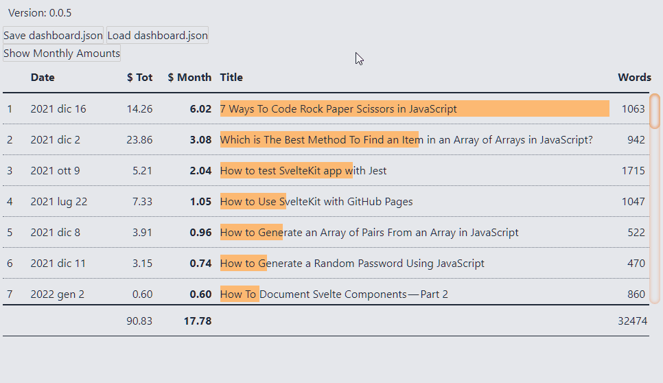

A little over a month has passed since my last update: it's time for a new update. Sooner or later I will be able to achieve regularity with these reports. I should do them on a monthly basis. They are used, above all to me, to understand how I am proceeding: giving a regularity this should bring me some advantages.

Anyway, I'm starting from what I wrote the last time (in [mid-December 2022](https://blog.stranianelli.com/an-update-for-my-patreons-november-2021/))

### Patreon

I still can't figure out how to use this platform. It's probably not the right one for my purpose: keeping a journal of what I do and possibly receiving feedback. I got some interesting comments on Medium. Not all positive, not all agree with what I write. But all informative and useful for growing and improving. On Patreon no.

Could the solution be publishing a copy of my articles on Patreon? Or report when I post something on my blog and on Medium?

Regarding this, could I use Patreon to signal the publication of something on Medium, by inserting the friend link? In this way, readers of the piece on Patreon have access to the full version of the article without having to pay a subscription to Medium. It's something I have to think about.

### GEST-DASHBOARD

I made some progress with my main project, GEST-DASHBOARD. I'm satisfied.

In December, I highlighted some of the problems I was encountering. The problems are related to Electron and file management via Browser. Well, I was able to (partially) solve both. However, there are still many details to be defined. And I have to figure out how to put the various pieces together.

I have created two repositories. In the first, [el3um4s/memento-electron-browser-view](https://github.com/el3um4s/memento-electron-browser-view), I experimented with how to use a browser view to show web pages outside Electron. I do not repeat the steps, I refer to a more complete article:

- [How To Use BrowserView With Electron](https://blog.stranianelli.com/how-to-use-browser-view-with-electron/)

The idea is to use this technique to view independent apps saved on the PC. This is possible thanks to an idea by Ashley Gullen: [AshleyScirra/servefolder.dev](https://github.com/AshleyScirra/servefolder.dev). Starting from this canvas I created my own version, [el3um4s/svelte-server-folder](https://github.com/el3um4s/svelte-server-folder). For technical details I refer to this post:

- [Host a Local Folder of Web Dev Files Directly in the Browser Using TypeScript and Svelte](https://blog.stranianelli.com/how-to-serve-a-local-folder-of-files-in-your-browser/)

The next step will be to merge these two projects and figure out if I can make them work together.

### SVELTE

As you can tell from the history of my articles I am focusing a lot on Svelte.

At the beginning of December I was still thinking about how to document my Svelte components. I have completed the repositories linked to this idea. I've talked about it extensively here:

- [How To Document Svelte Components — Part 2](https://blog.stranianelli.com/how-to-document-svelte-components-part-2/)

It was a longer job than I had planned and forced me to delve into some technical aspects.

After that I started a slightly more complex project: how to create a dashboard to view my Medium statistics. Working on something more complex was very instructive. I spent a lot of time finding a way to [create responsive tables](https://blog.stranianelli.com/how-to-create-responsive-data-tables-with-css-grid/) and insert [charts](https://blog.stranianelli.com/5-charts-example-to-get-you-started/).

Obviously I'm far from what I want to achieve but I'm not in a hurry: it's good training.

In the coming days and weeks I want to deepen two things:

- how to create a context menu
- how to create a side menu

### Exercises

And speaking of training, I took part in the Dev Advent Calendar. It was very useful for two reasons:

1. helped me face a different problem every day
2. It helped me to write something every day

In January I missed this habit. At the beginning of the month I thought I could do something like that but ... well, no, I haven't even left. I'd like to find a balance between exercises and slightly more complex experiments. But I have to find a good "workbook". Many on the internet recommend these sites:

- [CodeWars](https://www.codewars.com/)
- [LeetCode](https://leetcode.com/)
- [HackerRank](https://www.hackerrank.com/)
- [CodinGame](https://www.codingame.com/)

In this month I want to understand what best suits my needs.

### Medium

Finally Medium. In January I wrote less. But I really appreciate the comments received, and especially the suggestions of [Better Programming](https://betterprogramming.pub/) and [JavaScript in Plain English](https://javascript.plainenglish.io/). Writing helps me focus on ideas, keep track of what I learn and remember techniques and procedures.

But there is one thing I would like to do. Every day I read different things, not just on Medium. Some are forgettable, but sometimes there are some really interesting stories. Not just about programming and coding. I'd like to keep track of these little discoveries. Maybe by writing, from time to time, a post with "reading tips". That's another thing I want to think about.

Well, that's it. At least for this month of January 2022.
