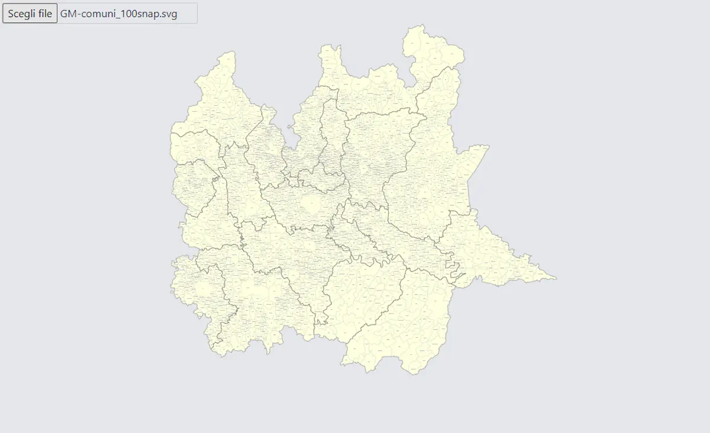
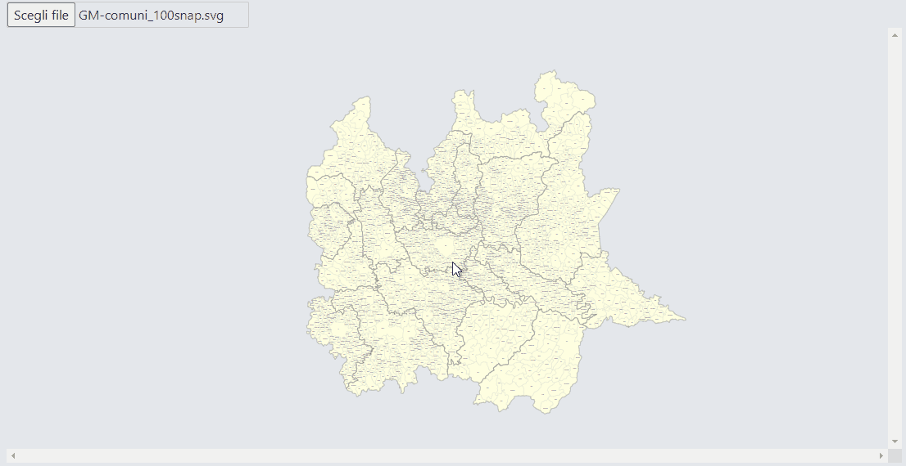
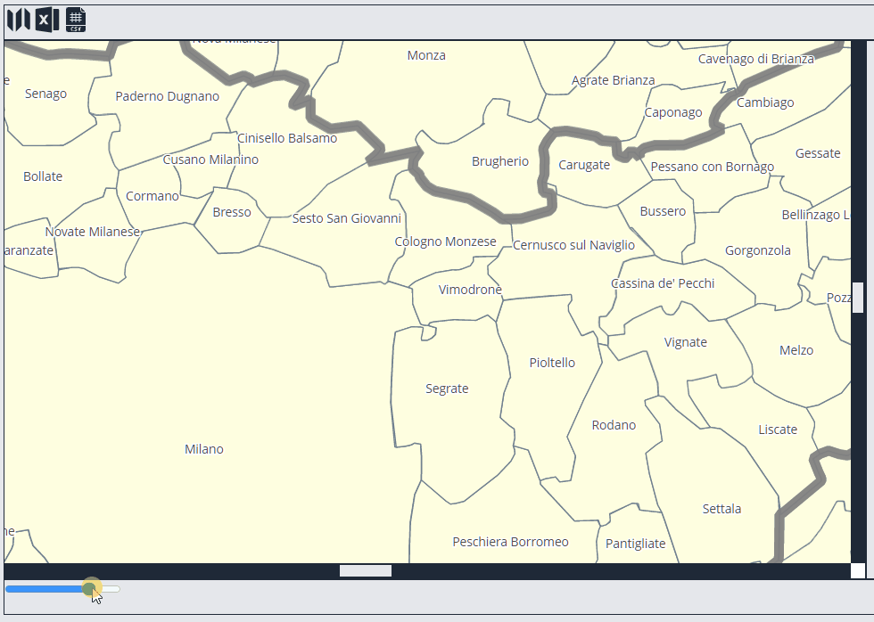
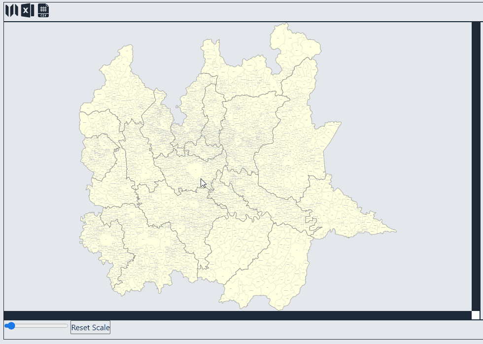

One of the benefits of SVG files is the ability to edit them with JavaScript in an HTML page. To simplify the process I create a small app with [Svelte](https://svelte.dev/) where you can load an SVG file, edit it and then save it back to disk.

### Open an SVG file

First I create a button to select the file to upload and an html element to show the file

```html
<script lang="ts">
  import { tick } from "svelte";

  let src: string;
  let divSVG: HTMLDivElement;

  const onFileSelected = async (e) => {
    let file = e.target.files[0];

    src = null;
    await tick();
    src = await file.text();
    await tick();

    const svg = divSVG.getElementsByTagName("svg")[0];
    const viewBoxWidth = parseFloat(svg.getAttribute("width"));
    const viewBoxHeight = parseFloat(svg.getAttribute("height"));
    const viewBox = `0 0 ${viewBoxWidth} ${viewBoxHeight}`;
    svg.setAttribute("viewBox", viewBox);
  };
</script>

<main>
  <input type="file" accept=".svg" on:change={(e) => onFileSelected(e)} />
  {#if src}
  <div class="svg" bind:this="{divSVG}" style:width="100vw" style:height="80vh">
    {@html src}
  </div>
  {/if}
</main>
```

After selecting the file I get something like this:



### How to scale and move SVG maps

For some maps, an overall view is enough but in this case I am interested in being able to zoom in on some elements. And, of course, also being able to move around the map.

To do this I can use the repository [luncheon/svg-pan-zoom-container](https://github.com/luncheon/svg-pan-zoom-container). I install the package using:

```bash
npm i svg-pan-zoom-container
```

So I change my code:

```html
<script lang="ts">
  import "svg-pan-zoom-container";
</script>

<div
  class="svg"
  bind:this={divSVG}
  style:width="100vw"
  style:height="80vh"
  data-zoom-on-wheel="min-scale: 0.3; max-scale: 20;"
  data-pan-on-drag="button: left;modifier: Control"
>
  {@html src}
</div>
```

The `data-zoom-on-wheel` attribute enables `zoom` with the mouse wheel. Set as _minimum scale 0.3_ and _maximum scale 20_. The `data-pan-on-drag` attribute enables mouse movement. In this case I set that the movement is done using the combination `control` key plus `left mouse button`.



In addition to the mouse wheel it is also useful to have a button or something similar to manage the zoom. I can, for example, create an `input` element of type `range`, by binding its value to the `scale` variable.

```html
<script>
  let scale = 1;
</script>
<input type="range" min="0.3" max="20" step="1" bind:value="{scale}" />
```

To pass the scale from the map to the element I add [`MutationObserver`](https://github.com/luncheon/svg-pan-zoom-container#observation):

```js
import { getScale, setScale, resetScale } from "svg-pan-zoom-container";

let observer;

const onFileSelected = async (event) => {
  // ...
  observer = new MutationObserver(function (mutations) {
    mutations.forEach(function (mutation) {
      scale = getScale(divSVG);
    });
  });

  observer.observe(divSVG.firstElementChild, {
    attributes: true,
    attributeFilter: ["transform"],
  });
};
```

Then I add a new event to the `input [range]` element in order to dynamically change the zoom:

```html
<input
  type="range"
  min="0.3"
  max="20"
  step="1"
  bind:value={scale}
  on:input={(e) => {
    setScale(divSVG, scale, { minScale: 0.3, maxScale: 20 });
  }}
/>
```

The result looks like this:



Finally, I can add a button to reset the scale and return to the original one:

```html
<button
  on:click={(e) => {
    resetScale(divSVG);
  }}>Reset Scale</button
>
```



The next step is to understand how to manage layers and selections. But I'll talk about this in the next post.
