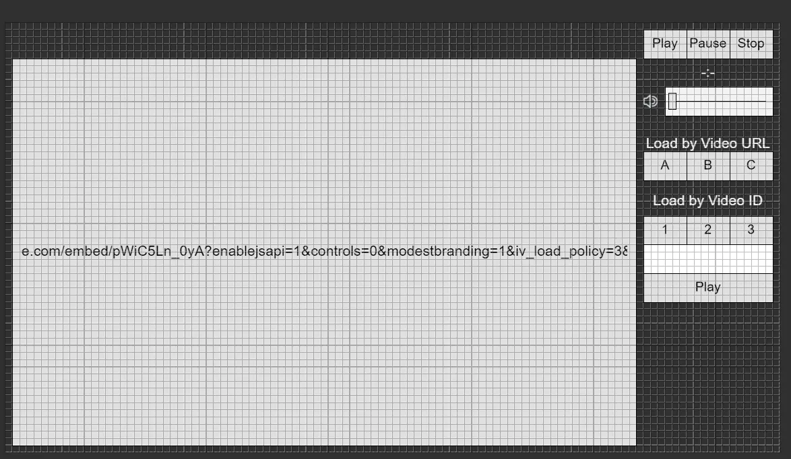
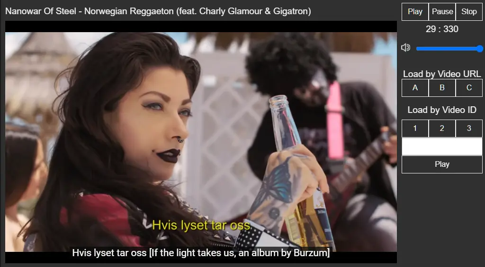
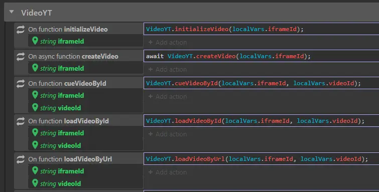
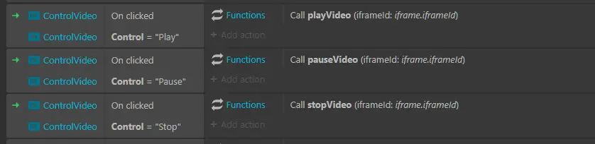

One of my most successful open source projects is my collection of templates for Construct 3. Not so much the part dedicated to video games as the one where I experimented with integrating JavaScript and event sheets. I think it might be useful to give some tips on how to create a custom YouTube video player with JavaScript.

First, let's see what I want to achieve:



The interface is quite simple. Most of the screen is taken up by video. At the top there is space for the title, and on the right some buttons to control playback (`Play`,` Pause`, `Stop` and the volume). Still on the right, but further down, some buttons allow you to choose which video to play, and possibly to select others via the YouTube ID.

It is a project designed as a demonstration, so in the code I put the ability to view YouTube videos starting from two separate JSON files. The first with the video IDs, the second with the URLs. Of course, you can choose your own preferred method.

You can also download the code from this link: 
- [simple-youtube-player.c3p](./simple-youtube-player.c3p)

Running the project the interface looks like this:



### Let's coding

It's time for the most interesting part: how to use Javascript to create a simple YouTube player. First, of course, I recommend consulting the [official documentation](https://developers.google.com/youtube/iframe_api_reference).

I need two functions to run when the page starts. With `LoadAPI` I import the YouTube bees into my project:

```js
export async function LoadAPI() {
  const scriptTag = document.createElement("script");
  scriptTag.src = "https://www.youtube.com/iframe_api";
  var firstScriptTag = document.getElementsByTagName("script")[0];
  firstScriptTag.parentNode.insertBefore(scriptTag, firstScriptTag);

  return new Promise((resolve) => {
    globalThis["onYouTubeIframeAPIReady"] = resolve;
  });
}
```

I need another function to actually create the player and assign the events that I am interested in monitoring (i.e. being able to control the execution of the video through custom buttons)

```js
export async function CreatePlayer(iframeId, eventHandlers) {
  return new Promise((resolve) => {
    if (!eventHandlers) eventHandlers = {};
    eventHandlers["onReady"] = (e) => resolve(e.target);

    // ADD ON PLAYER STATE CHANGE
    eventHandlers["onPlayerStateChange"] = (e) => resolve(e.target);

    new globalThis["YT"]["Player"](iframeId, {
      events: eventHandlers,
    });
  });
}
```

Finally I can create the actual video using the `createVideo` function and passing the iFrame ID as argument:

```js
import * as YouTube from "./youTube.js";

export async function createVideo(iframeId) {
  Globals.ytPlayer[iframeId]["player"] = await YouTube.CreatePlayer(iframeId, {
    onStateChange: (e) => {
      console.log(e.data);
    },
    onReady: (e) => {
      console.log(e);
    },
  });
  return true;
}
```

How to use this code depends on the type of project and the framework. In my example project I use this function to pass some information to the main interface:

```js
export const Globals = {
  ytPlayer: {},
};

export function initializeVideo(iframeId) {
  Globals.ytPlayer[iframeId] = {};
  Globals.ytPlayer[iframeId]["player"] = null;
}

export async function createVideo(iframeId) {
  Globals.ytPlayer[iframeId]["player"] = await YouTube.CreatePlayer(iframeId, {
    onStateChange: (e) => {
      Globals.ytPlayer[iframeId]["state"] = e.data;
      g_runtime.globalVars[`YTStatus_${e.target.i.id}`] = e.data;
      g_runtime.globalVars[`YTTitle_${e.target.i.id}`] = e.target.videoTitle;
    },
    onReady: (e) => {
      g_runtime.globalVars[`YTReady_${frameID}`] = true;
    },
  });
  return true;
}
```

### Create custom commands

Since I have linked the YouTube player to the web page iFrame, I can create custom functions to use in my code. I can also have multiple videos on the same page, as long as they each have a different ID.

### Play a video, pause it and stop it

```js
export function playVideo(iframeId) {
  Globals.ytPlayer[iframeId]["player"].playVideo();
}
export function pauseVideo(iframeId) {
  Globals.ytPlayer[iframeId]["player"].pauseVideo();
}
export function stopVideo(iframeId) {
  Globals.ytPlayer[iframeId]["player"].stopVideo();
}
```

### Manage the volume of a YouTube video

```js
export function setVolume(iframeId, volume) {
  Globals.ytPlayer[iframeId]["player"].setVolume(volume);
}
export function getVolume(iframeId) {
  return Globals.ytPlayer[iframeId]["player"].getVolume();
}

export function mute(iframeId) {
  Globals.ytPlayer[iframeId]["player"].mute();
}
export function unMute(iframeId) {
  Globals.ytPlayer[iframeId]["player"].unMute();
}
```

### Load a video but don't play it automatically

```js
export function cueVideoById(iframeId, videoId) {
  Globals.ytPlayer[iframeId]["player"].cueVideoById(videoId);
}
export function cueVideoByUrl(iframeId, videoId) {
  Globals.ytPlayer[iframeId]["player"].cueVideoByUrl(videoId);
}
```

### Load a video and play it immediately

```js
export function loadVideoById(iframeId, videoId) {
  Globals.ytPlayer[iframeId]["player"].loadVideoById(videoId);
}
export function loadVideoByUrl(iframeId, videoId) {
  Globals.ytPlayer[iframeId]["player"].loadVideoByUrl(videoId);
}
```

### Load a playlist

```js
export function loadPlaylist(iframeId, videoId) {
  Globals.ytPlayer[iframeId]["player"].loadPlaylist(Globals.playlist[videoId]);
}

export function lengthPlaylist(iframeId) {
  return Globals.ytPlayer[iframeId]["player"].getPlaylist().length;
}
```

### Find the duration of a video

```js
export function getCurrentTime(iframeId) {
  return Globals.ytPlayer[iframeId]["player"].getCurrentTime();
}
export function getDuration(iframeId) {
  return Globals.ytPlayer[iframeId]["player"].getDuration();
}
```

E così via.

### YouTube without code

As for the JavaScript part, I think I can stop here. For those who want to look at the part inserted in the Event Sheets of the project, it is simply a matter of recalling the corresponding functions.



For example, function C3 is nothing more than this:

```js
import * as VideoYT from "./videoYT.js";
VideoYT.loadVideoById(localVars.iframeId, localVars.videoId);
```

Similarly, to manage video playback I can use JS in a "hidden" way:



