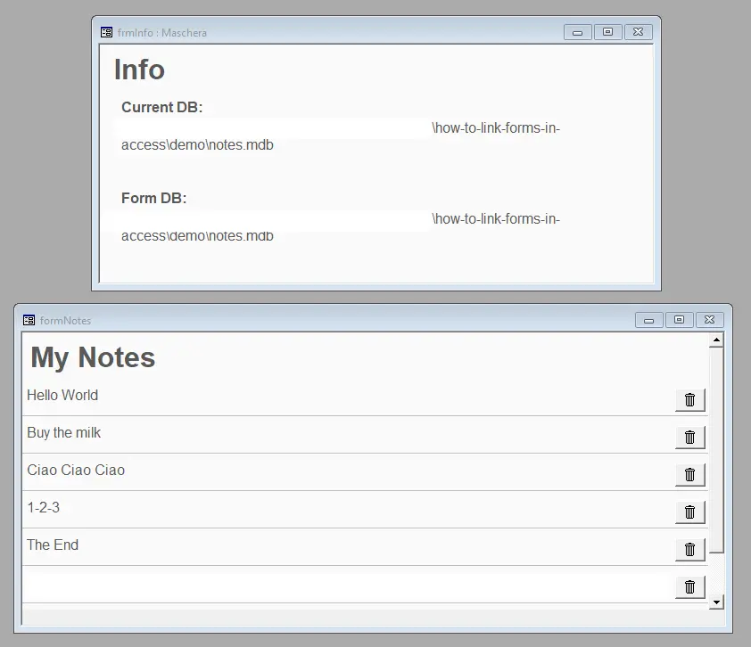
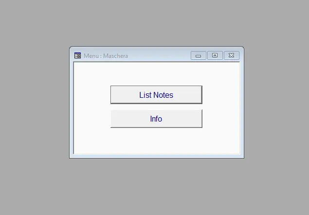
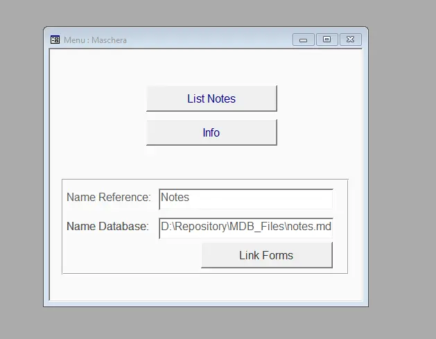
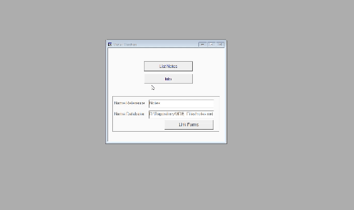

One of the problems I have most often faced with Microsoft Access is code duplication. Intended not only as a duplication of VBS code, but also of queries, macros, procedures, etc. In this article we will see how to link forms between Microsoft Access databases, in order to use the same form between multiple databases.

The procedure, after understanding it, is quite simple and intuitive. It involves these steps:

1. Create a reference database, which will contain the templates
2. Create the other databases
3. Connect the databases to the reference database
4. Call up masks when needed

### Create a reference database

As an example I create a simple database (`notes`). It has a single table, `tbNotes` with 2 fields: `ID` and `Notes`. In addition, it has two forms. The first, `frmNotes`, which allows you to insert the various notes and delete them.


The second form is used to display the position of the open database, and that of the linked form.

I create two functions:

```vb
Public Function getNameCurrentDB()
    Dim db As DAO.Database
    Set db = CurrentDb()

    Dim name As String
    name = db.name

    Set db = Nothing

    getNameCurrentDB = name
End Function

Public Function getNameFormDB()
    Dim db As DAO.Database
    Set db = CodeDb()

    Dim name As String
    name = db.name

    Set db = Nothing

    getNameFormDB = name
End Function
```

So you get something like this:



I also need two functions to open the two forms:

```vb
Public Sub openFormNotes()
    DoCmd.OpenForm "frmNotes"
End Sub

Public Sub openFormInfo()
    DoCmd.OpenForm "frmInfo"
End Sub
```

### Create the other databases

Now that I have the database with the reference templates I can create the `otherNotes` database. For the moment I create a form with two buttons, but without implementing the code:



In order to actually link the masks I have to add a reference to the project. I go to the Visual Basic for Applications (VBA) editor and click on `Tools` > `References`. From here I can select the reference database, `notes`.

This is the simplest solution but I prefer to implement a general function.

```vb
Public Function AddReference(referenceToImport As String, nameDatabase As String)
    Dim reference As reference

    For Each reference In Access.References
        Dim nameReference As String
        nameReference = reference.Name
        If nameReference = referenceToImport Then
            Access.References.Remove reference
        End If
    Next reference

    Set reference = References.AddFromFile(nameDatabase)
End Function
```

First I make sure that the same reference does not already exist. If there is I remove it. Then I add again the reference to the database I want to connect with.

This way I can connect to multiple databases, without having to manually add references.

I create some controls and add a button



So I write the function:

```vb
Private Sub linkForms_Click()
    On Error GoTo Err_linkForms_Click

    Dim nameReference As String
    nameReference = Forms![Menu]!NameReference.Value

    Dim nameDatabase As String
    nameDatabase = Forms![Menu]!NameDatabase.Value

    AddReference nameReference, nameDatabase

Exit_linkForms_Click:
    Exit Sub

Err_linkForms_Click:
    Resume Exit_linkForms_Click
End Sub
```

After connecting the two databases, I can call the functions to open the forms.

```vb
Public Function openNotes()
    Notes.openFormNotes
End Function

Public Function openInfo()
    Notes.openFormInfo
End Function
```

The final result is this:



Well, that's it. I created a repository with the code from the example. You can find it here: [el3um4s/how-to-link-forms-in-access](https://github.com/el3um4s/how-to-link-forms-in-access)
