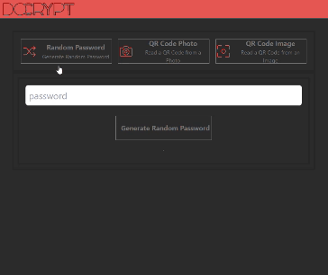

In the last month I worked on my side project, a web application that allows you to encrypt and decrypt text messages ([DoCrypt.org](https://docrypt.org/)). It's still a work in progress, but I've already implemented some features I'd like to share. I think it's an interesting project, and I intend to dedicate a few posts to it. For now, I want to focus on one feature I've recently implemented: notifications.

### The issue

I want to visually confirm the success of some operations. In particular, the action of "copying to the device clipboard" of the encrypted text. This is a feature I have implemented to allow users to copy ciphertext to an external application, such as a text message. For this reason, I decided to implement a notification confirming the copy to the device clipboard.

Visually, this is the result I want to achieve:


As you can see, the notification is a small bar that appears at the top right. The bar is green, and contains a text message. The bar remains visible for a short time, and then disappears. The interesting thing is that I can use the same method to show different notifications, of different colors and with different messages.

### I create a notification store

To solve this problem I used a [Svelte](https://svelte.dev/) component. The idea behind it is not mine, I was inspired by this [@kevmodrome](https://twitter.com/kevmodrome) [repl](https://svelte.dev/repl/2254c3b9b9ba4eeda05d81d2816f6276). I customized everything according to my needs.

I need two things: an html element to use on the screen to show notifications, and something that keeps track of the notifications themselves and their life cycle. I begin with this aspect. And to solve it I use a [store](https://svelte.dev/docs#run-time-svelte-store).

I create the `Notification.ts` file and start by setting up some interfaces and creating a simple store:

```typescript
import { writable } from "svelte/store";
import type { Writable } from "svelte/store";

const TIMEOUT = 3000;

type MessageType = "default" | "danger" | "warning" | "info" | "success";

export interface Msg {
  type: MessageType;
  message: string;
  timeout?: number;
}

interface Message {
  id: string;
  msg: Msg;
}

const notificationStore: Writable<Message[]> = writable([]);

const notifications = {
  subscribe: notificationStore.subscribe,
};

export default notifications;
```

As you can see, I have created a `Msg` interface which represents a notification. The notification has a type, which can be `default`, `danger`, `warning`, `info` or `success`. The type of notification determines the color of the bar. The message is the text that is shown in the bar. Finally, the timeout is the time that the notification remains visible. If not specified, the default is 3000 milliseconds.

For each notification I assign an ID; I need a unique identifier to be able to interact with the notification itself at a later time. I cannot use a counter based on the length of the array, because I could cancel a notification and then the counter would no longer be valid. For this reason, I use the `idGenerator()` function to generate a unique ID.

```typescript
const idGenerator = (): string =>
  "_" + Math.random().toString(36).substring(2, 9);
```

So I need a method to add notifications to the store:

```typescript
const notifications = {
  // ...
  send: (msg: Msg, id: string = idGenerator()) => {
    notificationStore.update((n) => {
      return [...n, { id, msg }];
    });
  },
};
```

I use the store's `update()` method to add a new notification to the array. The `update()` method accepts a function that receives the current state of the store, and returns the updated state. In this case, I add a new notification to the array.

I am interested in passing the id explicitly because there may be cases in which I am interested in accessing the notification from outside the component. If instead I choose not to pass the id, then I generate it internally.

Now I need a method to remove a notification from the store:

```typescript
const notifications = {
  // ...
  remove: (id: string) => {
    notificationStore.update((n) => {
      return n.filter((m) => m.id !== id);
    });
  },
};
```

I use the `update()` method, combined with the [filter()](https://developer.mozilla.org/en-US/docs/Web/JavaScript/Reference/Global_Objects/Array/filter) method, to remove the notification from the array.

To manage the disappearing notifications I need a timer, or something similar. I use [SetTimeout()](https://developer.mozilla.org/en-US/docs/Web/API/setTimeout) method:

```typescript
// ...
setTimeout(
  () => {
    notificationStore.update((n) => {
      return n.filter((m) => m.id !== id);
    });
  },
  msg?.timeout ? msg.timeout : TIMEOUT
);
// ...
```

Combining it all I get the complete `Notification.ts` file:

```typescript
import { writable } from "svelte/store";
import type { Writable } from "svelte/store";

const TIMEOUT = 3000;

type MessageType = "default" | "danger" | "warning" | "info" | "success";

export interface Msg {
  type: MessageType;
  message: string;
  timeout?: number;
}

interface Message {
  id: string;
  msg: Msg;
}

const idGenerator = (): string =>
  "_" + Math.random().toString(36).substring(2, 9);

const notificationStore: Writable<Message[]> = writable([]);

const notifications = {
  subscribe: notificationStore.subscribe,
  send: (msg: Msg, id: string = idGenerator()) => {
    notificationStore.update((n) => {
      return [...n, { id, msg }];
    });
    setTimeout(
      () => {
        notificationStore.update((n) => {
          return n.filter((m) => m.id !== id);
        });
      },
      msg?.timeout ? msg.timeout : TIMEOUT
    );
  },
  remove: (id: string) => {
    notificationStore.update((n) => {
      return n.filter((m) => m.id !== id);
    });
  },
};

export default notifications;
```

Having fixed the store part, I move on to the component part.

### I create a component for display notifications

I create the `Notification.svelte` file and start importing the store:

```js
import notifications from "./Notification";
```

To access the store values ​​I can use the [reactive `$store` syntax](https://svelte.dev/docs#component-format-script-4-prefix-stores-with-$-to-access-their-values). Also to show all the values ​​contained in the store, I use [`{#each...}`](https://svelte.dev/docs#template-syntax-each):

```html
<div class="notifications">
  {#each $notifications as notification (notification.id)}
    <div class="toast">
      <div class="content">{notification.msg.message}</div>
    </div>
  {/each}
</div>
```

As you can see, I use the `each` method to iterate over all the store values. For each value, I create a div with the notification text.

The per component is complete, but I'm interested in adding some style to make it juicier.

```css
.notifications {
  position: fixed;
  top: 64px;
  left: 0;
  right: 8px;
  margin: 0 auto;
  padding: 0;
  z-index: 9999;
  display: flex;
  flex-direction: column;
  justify-content: flex-start;
  align-items: flex-end;
  pointer-events: none;
}

.toast {
  flex: 1;
  margin-bottom: 10px;
  min-width: 240px;
  padding: 10px;
  text-align: center;
  border: 4px solid transparent;
  border-radius: 2px;
}

.content {
  padding: 10px;
  display: block;
  color: white;
  font-weight: 500;
}
```

This way I show the notifications at the top right of the screen, one above the other.

But how do I show the notifications in a different color depending on the type? To do this, I add a class to the `toast` div based on the notification type and an object to use as a color reference:

```html
<script>
  export let themes = {
    danger: "#E26D69",
    success: "#1f8c34",
    warning: "#f0ad4e",
    info: "#5bc0de",
    default: "#aaaaaa",
  };
</script>

<!-- ... -->
<div
  class="toast"
  style="background: {themes[notification.msg.type]};">
<!-- ... -->
```

I can make it more beautiful by adding an animation to highlight the appearance and disappearance of notifications. To do this I use [svelte/transition](https://svelte.dev/docs#run-time-svelte-transition) and [svelte/animate](https://svelte.dev/docs#run-time-svelte-animate):

```html
<script>
  import { flip } from "svelte/animate";
  import { fly } from "svelte/transition";
</script>

<!-- ... -->
<div
  animate:flip
  class="toast"
  style="background: {themes[notification.msg.type]};"
  transition:fly={{ y: 128, duration: 500 }}
>
<!-- ... -->
```

By combining it all I finally get my `Notification.svelte` component:

```html
<script lang="ts">
  import { flip } from "svelte/animate";
  import { fly } from "svelte/transition";

  import notifications from "./Notification";

  export let themes = {
    danger: "#E26D69",
    success: "#1f8c34",
    warning: "#f0ad4e",
    info: "#5bc0de",
    default: "#aaaaaa",
  };
</script>

<div class="notifications">
  {#each $notifications as notification (notification.id)}
    <div
      animate:flip
      class="toast"
      style="background: {themes[notification.msg.type]};"
      transition:fly={{ y: 128, duration: 500 }}
    >
      <div class="content">{notification.msg.message}</div>
    </div>
  {/each}
</div>

<style>
  .notifications {
    position: fixed;
    top: 64px;
    left: 0;
    right: 8px;
    margin: 0 auto;
    padding: 0;
    z-index: 9999;
    display: flex;
    flex-direction: column;
    justify-content: flex-start;
    align-items: flex-end;
    pointer-events: none;
  }

  .toast {
    flex: 1;
    margin-bottom: 10px;
    min-width: 240px;
    padding: 10px;
    text-align: center;
    border: 4px solid transparent;
    border-radius: 2px;
  }

  .content {
    padding: 10px;
    display: block;
    color: white;
    font-weight: 500;
  }
</style>
```

Now all that remains is to use it in our app.

### I add the component to the pages

To add the component to the pages, I need to import it into the `App.svelte` file:

```html
<script>
  // ...
  import Notification from "./Notification.svelte";
  // ...
</script>

<Notification />
<Header />
<main>
  <!-- ... -->
</main>
```

I only need to import it once, on the main page of the app. This way I can show a notification starting from any page of the app.

For example, to show a notification when I have copied the ciphertext, I add the following code to the component:

```ts
import notifications from "./Notification";

const copyText = () => {
  navigator.clipboard.writeText(cipherText);
  notifications.send({
    message: "Copied to clipboard",
    type: "success",
    timeout: 1500,
  });
};
```



Or, if I want to show a notification of a different color, I just need to change the `type` of the message:

```ts
// ...
import notifications from "../Notification/Notification";

const goHome = () => {
  page.set("Home");
  if ($password != "") {
    password.set("");
    notifications.send({
      message: "Password cleared",
      type: "danger",
      timeout: 1500,
    });
  }
  window.history.replaceState({}, document.title, "/");
};
```

Well, that's all for now. If you want to see the full code, you can find it on [GitHub](https://github.com/el3um4s/docrypt). The application is available on [docrypt.org](https://docrypt.org/).
