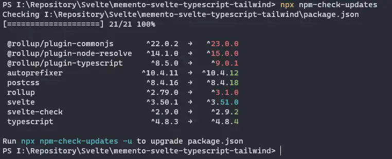

A few days ago [Rollup](https://rollupjs.org/guide/en/) reached version 3. I updated some of my projects, but it wasn't a painless operation. There are some changes to the code, and some plugins to update. In this post I report the steps I followed, hoping that they can also be useful to someone else

In this post I use as an example my repository [MEMENTO - Svelte, Typescript & TailwindCSS](https://github.com/el3um4s/memento-svelte-typescript-tailwind), but the process is the same for all projects.

First I check which packages are to be updated

```bash
npx npm-check-updates
```

This way I get the list of packages to upgrade



Now I update the packages

```bash
npx npm-check-updates -u
npm install
```

The problems start now. I get some error messages. The main errors are:

- `ERESOLVE overriding peer dependency`
- `peer rollup@"1 || 2" from rollup-plugin-css-only@3.1.0`
- `peer rollup@"^2.0.0" from rollup-plugin-terser@7.0.2`


They are linked, because I have two packages that have version 1 or version 2 `rollup` dependencies. To fix this, I need to update these two packages. The problem is that at the moment the two repositories appear out of date. I made a pull request for both of them with a possible solution. Hope they are updated soon.

In the meantime I have created two forks, with two packages that should solve the problem:

- [@el3um4s/rollup-plugin-css-only](https://www.npmjs.com/package/@el3um4s/rollup-plugin-css-only)
- [@el3um4s/rollup-plugin-terser](https://www.npmjs.com/package/@el3um4s/rollup-plugin-terser)

So, I uninstall the two problematic plugins:

```bash
npm uninstall rollup-plugin-css-only rollup-plugin-terser
```

And I replace them with my forks

```bash
npm install @el3um4s/rollup-plugin-css-only @el3um4s/rollup-plugin-terser
```

I also need to change the references in the `rollup.config.js` file:

```javascript
import css from "@el3um4s/rollup-plugin-css-only";
import { terser } from "@el3um4s/rollup-plugin-terser";
```

instead of `import css from "rollup-plugin-css-only";` and `import { terser } from "rollup-plugin-terser";`

Now if I try to run the `npm run dev` command I get another error

```text
[!] (plugin at position 8) ReferenceError: require is not defined
ReferenceError: require is not defined
```


In this case the problem is related to the `serve` function:

```javascript
function serve() {
  let server;

  function toExit() {
    if (server) server.kill(0);
  }

  return {
    writeBundle() {
      if (server) return;
      server = require("child_process").spawn(
        "npm",
        ["run", "start", "--", "--dev"],
        {
          stdio: ["ignore", "inherit", "inherit"],
          shell: true,
        }
      );

      process.on("SIGTERM", toExit);
      process.on("exit", toExit);
    },
  };
}
```

I need to replace `require("child_process")` with `import { spawn } from "child_process"`:

```javascript
import { spawn } from "child_process";

function serve() {
  let server;

  function toExit() {
    if (server) server.kill(0);
  }

  return {
    writeBundle() {
      if (server) return;
      server = spawn("npm", ["run", "start", "--", "--dev"], {
        stdio: ["ignore", "inherit", "inherit"],
        shell: true,
      });

      process.on("SIGTERM", toExit);
      process.on("exit", toExit);
    },
  };
}
```


After that I can use `npm run dev` and `npm run build`.
