Yes, it is my fourth article in a row dedicated to artificial intelligences, and in particular to those specialized in generating images from a text prompt. I am finding that it is very easy to get some interesting results. The biggest challenge is figuring out how to write good prompts. In this article I will try to explain how to do this.

And I'll do it starting from [Andrew Wong](https://medium.com/@andrewwongai)'s excellent post, [How to come up with good prompts for AI image generation](https://medium.com/@andrewwongai/how-to-come-up-with-good-prompts-for-ai-image-generation-f28355e46d21). In addition to this, I recommend that you also read:

- [Stable Diffusion Akashic Records](https://github.com/Maks-s/sd-akashic)
- [Create detailed prompts for AI art instantly](https://promptomania.com/prompt-builder/)
- [Like Grammarly, but for AI Generated Art](https://write-ai-art-prompts.com/)

Andrew suggests using the following scheme to write a prompt:

1. Subject
2. Medium
3. Style
4. Artist
5. Website
6. Resolution
7. Additional details
8. Color
9. Better to add as much information as possible, in order to give more information to the artificial intelligence. For example, if we want to create an image of a cat, we could simply write `cat`:

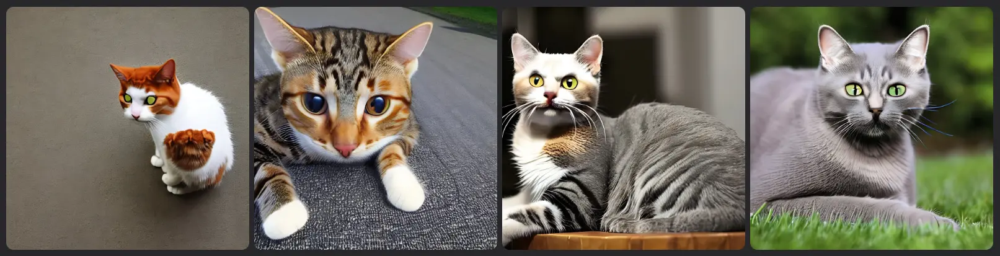

The result is very bad. To make it more interesting we can add some details, `Cat in Boots`:

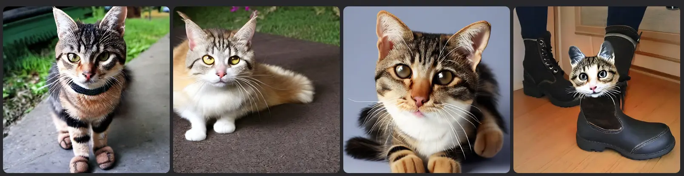

Decisamente non ci siamo. Aggiungo altri dettagli per rendere un po' più chiara la mia idea:

```
a big fiery cat, powerful and menacing, wearing cowboy boots, hat, holding an old gun
```

Among the first results this cat emerges:

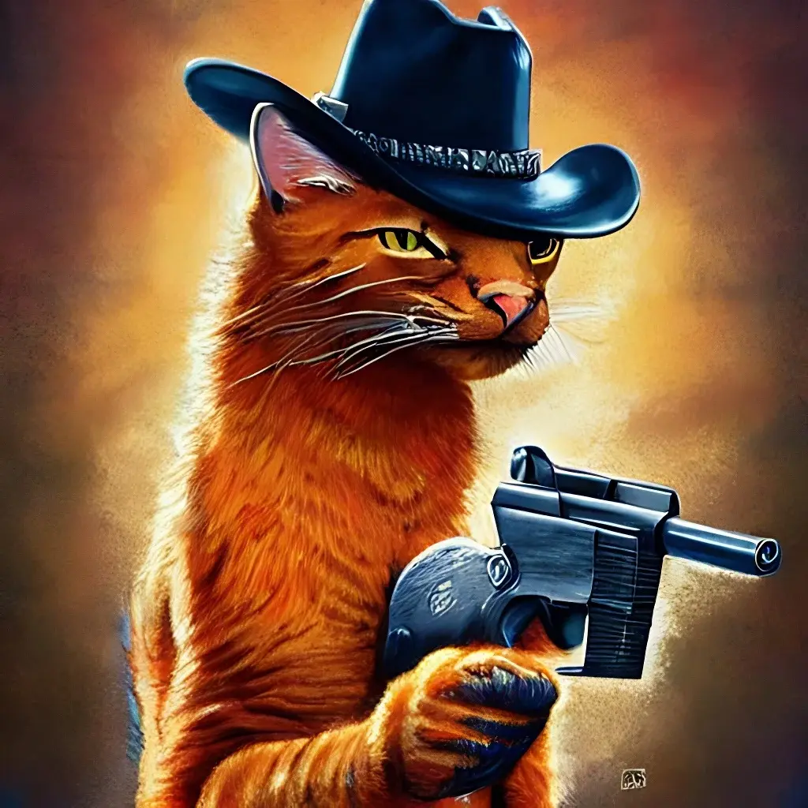

But it's just a coincidence, the other images are not all like this:

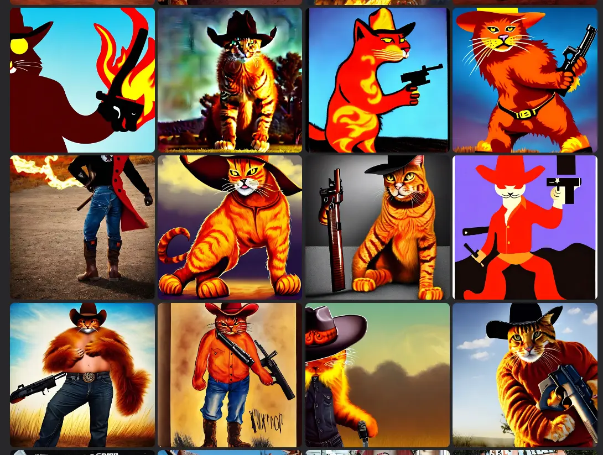

It's time to add some information. For example the `medium` we want to aim for, for example `digital paint`:

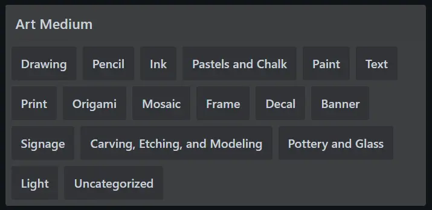

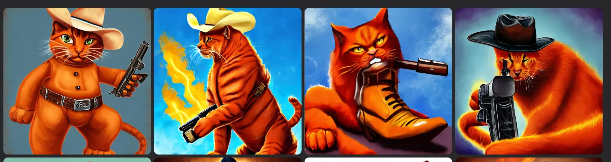

Things start to get interesting. I add more information. I want a sketch, `white and black`. Then I set the resolution to `4k`.
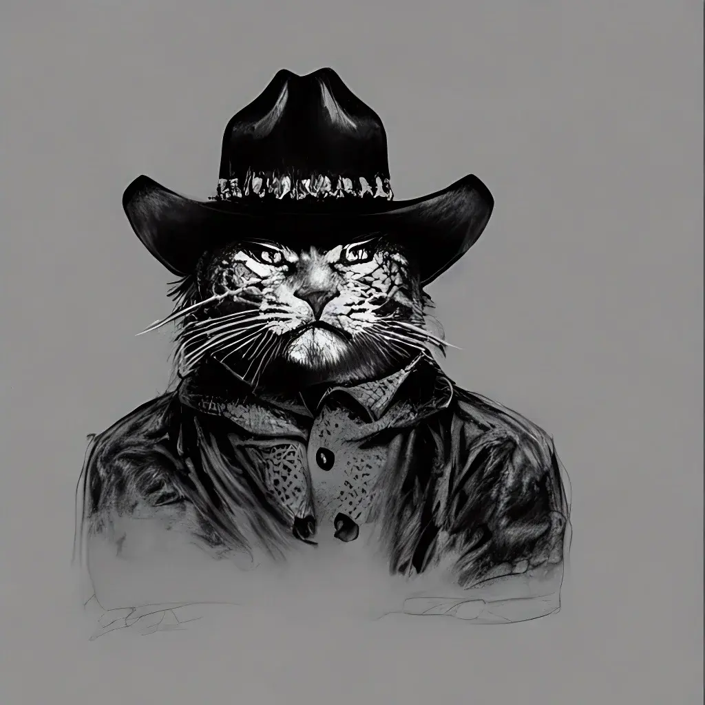

Adding an artist requires a little more expertise, at least for me. If I add the style of an author who has not dealt with the theme of my drawing, the image I get is not very interesting, or it becomes something completely different. For example, if I try to use [Franklin Booth](https://en.wikipedia.org/wiki/Franklin_Booth)'s style, the cat disappears from the composition

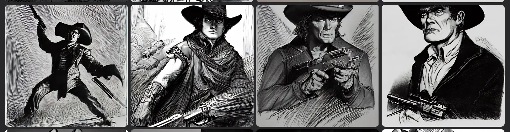

I think that to experiment more thoroughly, you need a little knowledge of art. For the art of the far west I can draw inspiration from [Charles Marion Russell and Frederic Remington](https://en.wikipedia.org/wiki/Western_American_Art):

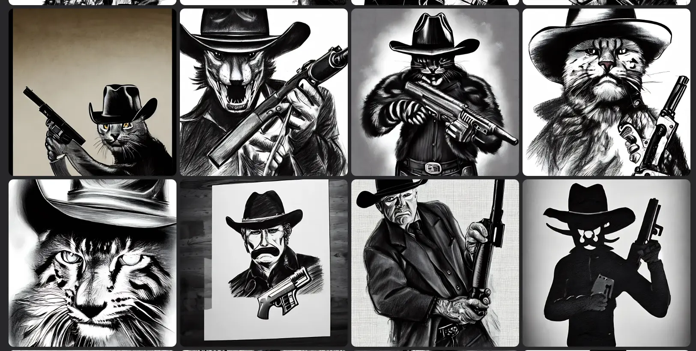

If instead I'm inspired by Tim Burton, using as a prompt:

```
Sketch, Black and White, 4k, a big fiery cat, powerful and menacing, wearing cowboy hat, holding an old gun, by tim burton
```

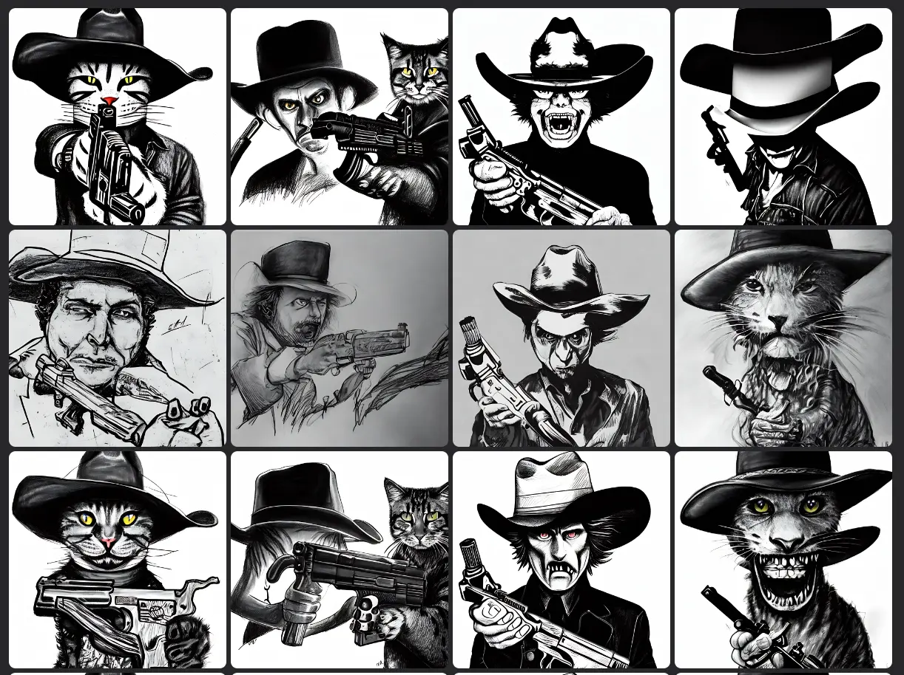

Finally, if I use `Picasso` I get a very interesting result:

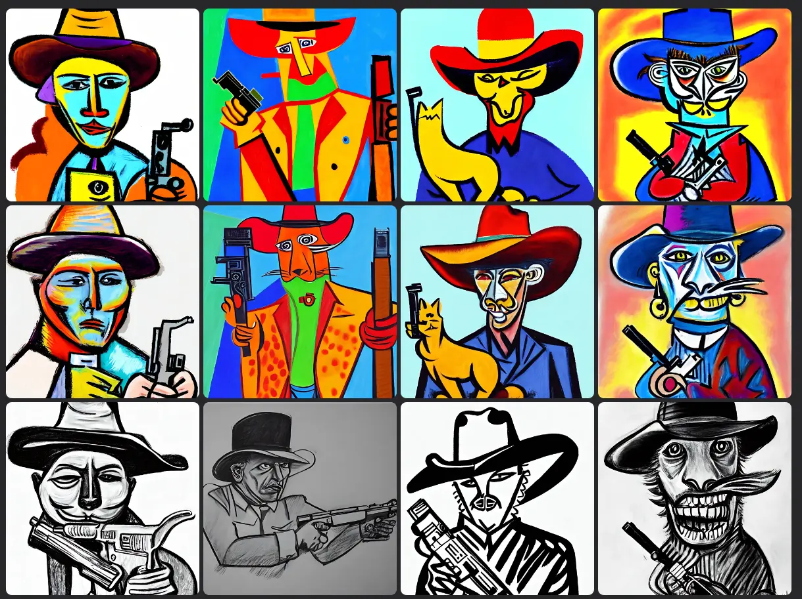

Well, that's all for now. I think I still need some practice to write better prompts. If you have any advice, don't hesitate to leave it in the comments.

Thanks for reading! Stay tuned for more.
