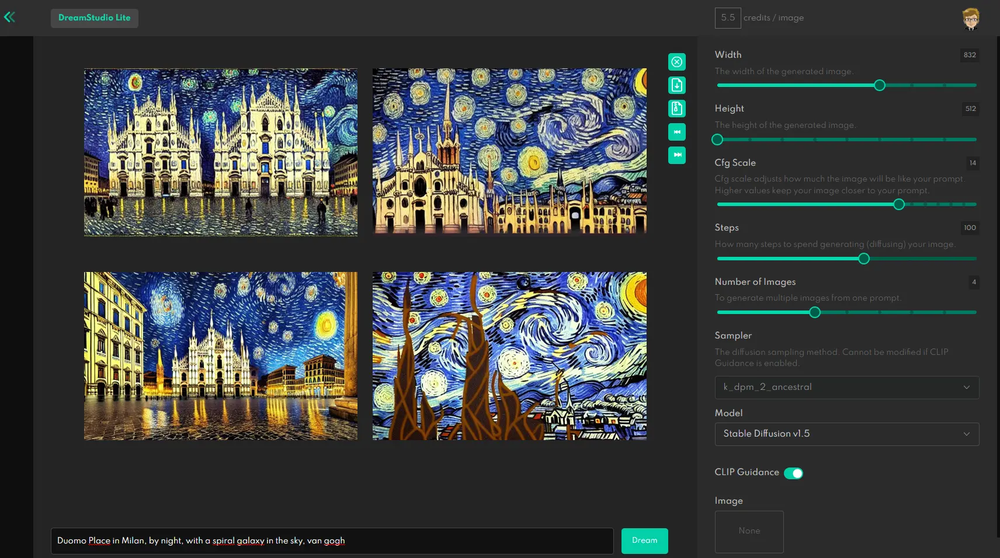

In recent days I have read some articles about [Dream Studio](https://dreamstudio.ai/) and [Lexica Art](https://lexica.art). They are two services that allow you to create images from text. The approach is slightly different. Dream Studio is in effect an editor that allows you to create images, Lexica is mainly a search engine with some interesting information. In this post, however, I want to talk only about the first tool.

This Tool is not free. Requires the purchase of "points". Each costs $ 0.01 and allows you to create an image. The price is then $ 10 for 1000 images. Dream Studio offers 200 free points to new users. it's a great chance to try it out.

There are other price considerations

The bigger and more "beautiful" an image is, the more it costs. Furthermore, every generated image is counted, not just the one with the final result. This makes it very easy to spend points, perhaps even in just half an hour of testing:

After understanding how it works, you can create very interesting images. For example this:

To generate an image like this I used `Duomo Place in Milan, by night, with a spiral galaxy in the sky, van gogh`. After entering it, I set the parameters on the bar on the right.

**Width** e **Height** allow you to define the size of the image. The bigger they are, the more they cost.

**Cfg Scale**, aka _Classifier Free Guidance_ defines how much to respect the textual description. In practice, the higher it is, the more similar the image will be to what is written. The lower it is, the more randomly the image will be generated. It is quite a complex parameter to handle, but it is what allows you to obtain the most interesting results.

**Steps** indicates the number of steps to use for each generated image. The lower they are, the faster the generation, the lower the quality. On the contrary, by increasing the steps the quality increases, but also the generation time increases. Furthermore, the improvement is not linear, and after a certain point nothing is achieved. In practice, this is a parameter to be used with caution.

**Seed** it is the seed to be used for generation. If you want to repeat the generation, you need to use the same seed. If you want to generate different images, you need to change the seed. Or set a random one.

**Number of Images** allows you to create many different images at the same time. Each image costs points. Creating nine images at a time is perhaps the best way to finish points in no time.

In addition to creating images, you can edit those already created, or use your own. To do this we use an editor

Here my problems begin. It is not really easy to understand how to use it, and how to combine the various aspects. What's more, each attempt costs points, making it a little difficult to test in a carefree way. There are some tutorials on YouTube: maybe I'll go into this in another article.

### Final thoughts

Well, what about? I like it, I like it, I like it. Even if it is a beta, and therefore there are some things to fix (especially on the interface), the price is still very interesting. And the images that can be created are truly beautiful. If you need images for a site, blog, book, poster, etc. etc. etc. it could be an excellent solution.

I have noticed that better results are obtained by writing precise descriptions, and adding information on the style to keep, perhaps indicating artists to be inspired by.

Thanks for reading! Stay tuned for more.
