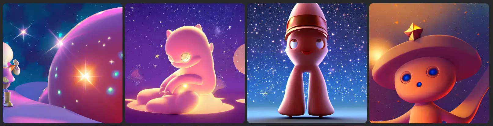
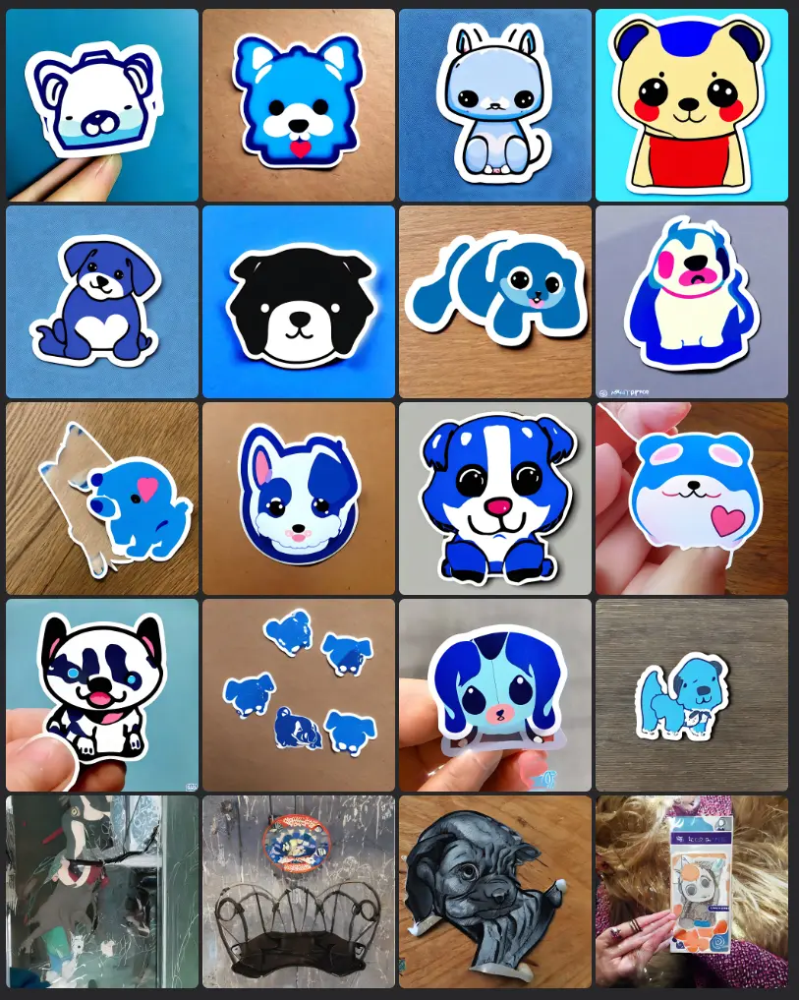

In the last few days I have become obsessed with the art generated through Artificial Intelligence. I don't have the knowledge to really understand how these algorithms work, but I really enjoy experimenting with the various options. One of the weirdest concepts, for me, is _guidance scale_. In this post I will try to understand what it means.

So, as far as I can understand, it is a number that indicates how important the prompt is (i.e. the textual description of the image as a general). The lower the number, the more "creative" the image will be; the higher the number, the more relevant the image will be to the prompt.

Better to give an example. I use this text as a prompt:

```
ultra-cute Moebius king, a starry background, high quality, 3d render 4k, soft shadow, soft light
```

And I start with `Guidance Scale = 1`. The result is this:


I then switch to `Guidance Scale = 5`


I continue with `Guidance Scale = 10`



Now it's `Guidance Scale = 15`


I end up with `Guidance Scale = 20`


As you can see, the best results lie somewhere between 5 and 10. Of course, it also depends on the prompt. Sometimes the best result is the result of a low value, other times a high one.


### Other examples

I keep trying. I intend to use some suggestions from [Jim Clyde Monge](https://medium.com/@jimclydemonge) as a prompt. By the way, I recommend following this author, he has very interesting articles, and even if I'm not an AI expert, I really enjoy reading them. For me he is a source of inspiration, and I think I will write a few more posts starting from his suggestions.

That said, let's do some testing with [the prompt](https://medium.com/codex/stable-diffusion-arrives-in-photoshop-heres-how-to-install-3db277491023):

```
a misty valley with exposed fossils, extremely detailed oil painting, unreal 5 render, rhads, sargent and leyendecker, savrasov levitan polenov, bruce pennington, studio ghibli, tim hildebrandt, digital art, landscape painting, octane render, beautiful composition, trending on artstation, award winning photograph, masterpiece
```


Now I try [this prompt](https://medium.com/mlearning-ai/how-to-make-super-cute-stickers-with-ai-in-under-2-minutes-782892641ba7):

```
cut sticker, kawaii, blue puppy
```



Finally, a prompt taken from an image, [the pillars of creation](https://it.wikipedia.org/wiki/Pilastri_della_Creazione#/media/File:Heic1501a.png):

```
hubble space telescope pillars of creation
```

The result I want to get is something like this:


This instead is what Artificial Intelligence creates:


As a last test, I try with a portrait (the prompt is taken [from this images](https://lexica.art/prompt/d1dadd1c-20a6-4586-b39a-0a970812431d))

```
character portrait of young woman as a heroic retrofuturistic punk, pixie cut with shaved side hair, bad attitude, dystopian cyberpunk steampunk soviet mood, intricate, wild, highly detailed, digital painting, artstation, upper body, concept art, smooth, sharp focus, illustration, art by artgerm and greg rutkowski and alphonse mucha, vibrant deep colors
```


Thanks for reading! Stay tuned for more.
