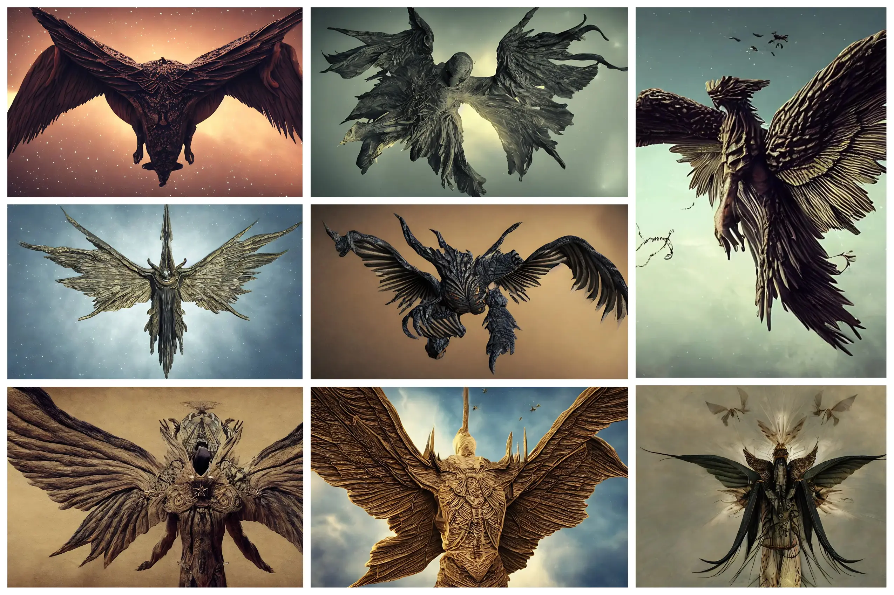
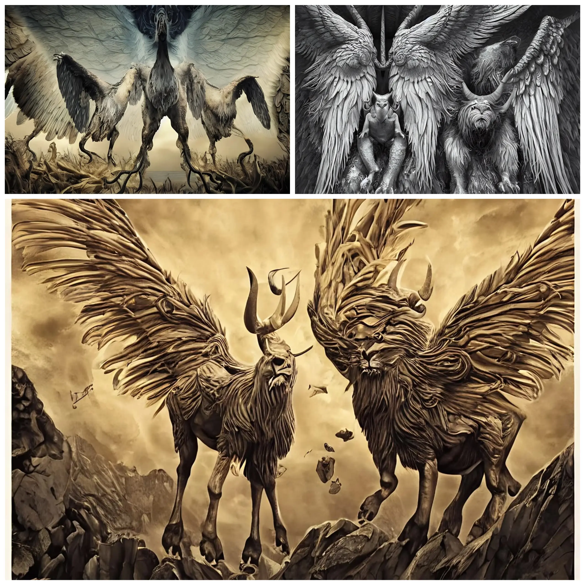

The angelic tradition has always intrigued me. Both because my family has a strong spiritual connotation, and because the traditional representation of angels is very different from their textual description. What better argument to test how biblical angels look to an Artificial Intelligence?

Today I focus on the [first hierarchy of angels](https://en.wikipedia.org/wiki/Hierarchy_of_angels), the most important and closest to divinity. It consists of 3 orders:

- Seraphim - שרף
- Cherubim - כְּרוּב
- Thrones - θρόνος

### Seraphim

So I start with the **Seraphim**, the angels closest to God, the ones most important in their closeness to the creator. But how are they described in the Bible? In these [words of Isaiah](<https://en.wikisource.org/wiki/Bible_(King_James)/Isaiah#6:1>):

```
each one had six wings; with twain he covered his face, and with twain he covered his feet, and with twain he did fly
```

If I pass this description to my AI, I get


I'm not sure why, but many of the angels generated from descriptions have darker colors and a gloomier appearance than they are usually represented. Or rather, I have a suspicion. Angels and Demons are of the same lineage, so they may look similar. Demonic representations can also be angelic representations. And viceversa.

But this is a speech for theologians, I'm more interested in the artistic side of the representation.

On the second attempt I get this


This angelic representation offers some food for thought. I like how this representation has something alien and terrestrial at the same time. The background is well suited to the angelic mythology but at the same time it is alienating to imagine a flock of these beings flying in the sky.

The third seraphim already looks more like the classic representation


At least it has feathered wings. The body is anthropomorphic. And in some form it resembles some angelic representations. But it still has something alien, strange, disturbing. And some kind of crown on the head.


The fourth is perhaps the one with the most angelic appearance. At least it has a more elegant, almost feminine shape. The wings are larger and more symmetrical, even though they have no feathers. The crown looks more like a halo, while the face is hidden even if it's not clear from what.



The AI has also processed other images, I think they are interesting but it's time to move on to the next order of angels.

### Cherubim

The second angelic order is that of the **Cherubim**. In the Book of Ezekiel they are described something like this:

```
The cherub is depicted as having two pairs of wings, and four faces: that of a lion (representative of all wild animals), an ox (domestic animals), a human (humanity), and an eagle (birds). Their legs were straight, the soles of their feet like the hooves of a bull, gleaming like polished brass.
```

In short, a little angelic appearance, and more like a monster. Let's try to see what the AI gets out of such a description:


Here the AI is definitely confusing. He cannot conceive and reconcile the presence of multiple heads, wings and legs. Wanting to make a classification we can roughly divide the cherubs into 3 categories.

The first represents the cherubs as 4-legged creatures



The second represents the cherubs as complex creatures, difficult to interpret and with an appearance very similar to that of a demon


Finally, the third representation creates a very tall creature in which the various faces overlap and combine to form a bizarre creature.


### Thrones

Finally the Thrones

```
are great wheels containing many eyes, and reside in the area of the cosmos where material form begins to take shape
```

Perhaps they are the angels most alien to the common conception. They are wheels with eyes, living in the cosmos. They have the task of presiding over divine justice.

Unlike the Seraphim and Cherubim, in this case the AI has a fairly accurate opinion of how to represent the Thrones:


They are all quite similar images, differing only in a few details. However, they give a good idea of a being capable of scrutinizing the cosmos and presiding over divine justice.

### Conclusions


I'd say that's enough for now. The AI did an amazing job of generating images of unexpected angels. They are interesting and bizarre in their own way. And they can lead to deeper reflections as well. Obviously, when dealing with the sacred imagery, it is a good idea not to claim the truthfulness of what has been achieved. After all, faith is a sensitive, individual subject. And, honestly, far beyond any algorithm.
