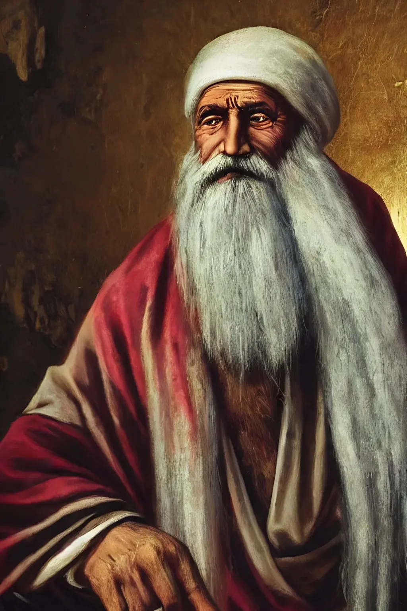
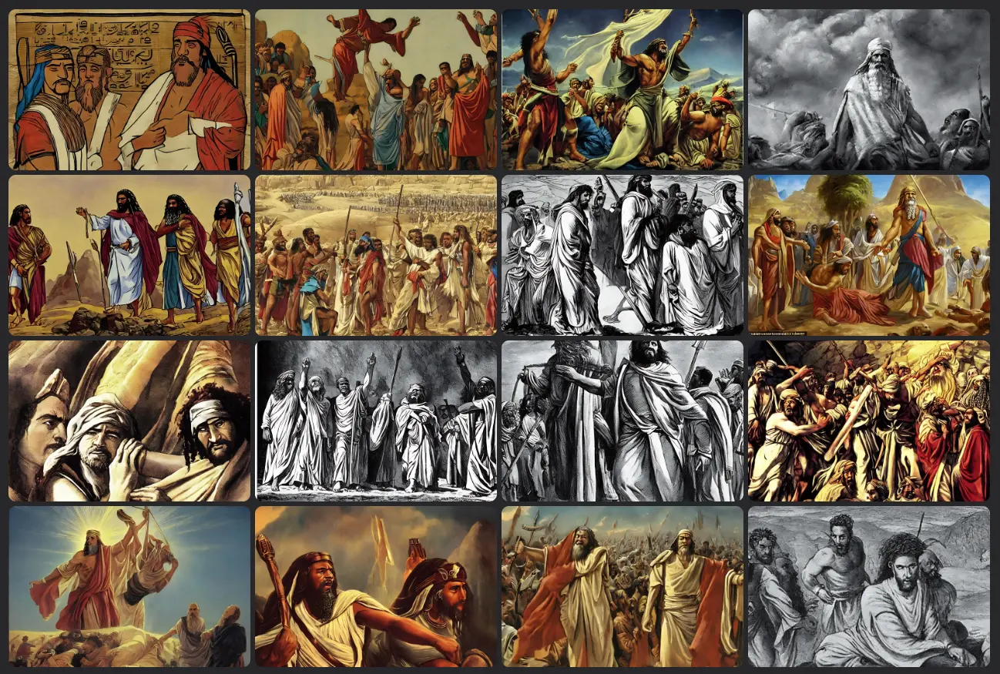
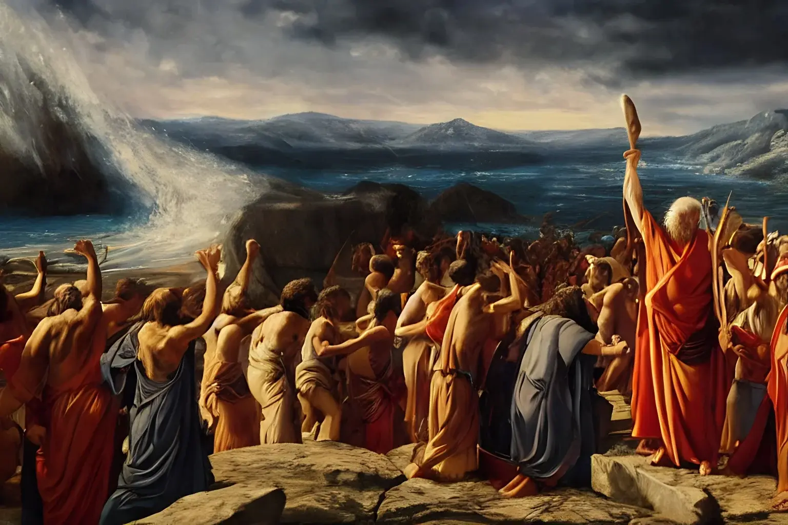
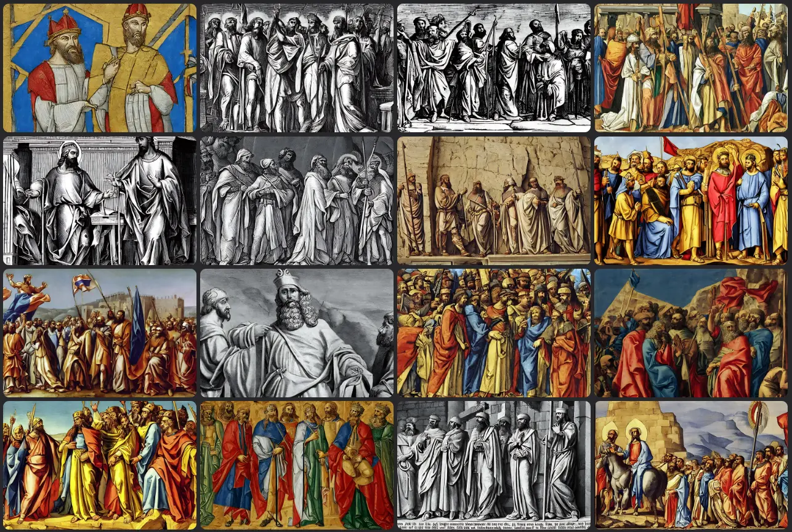
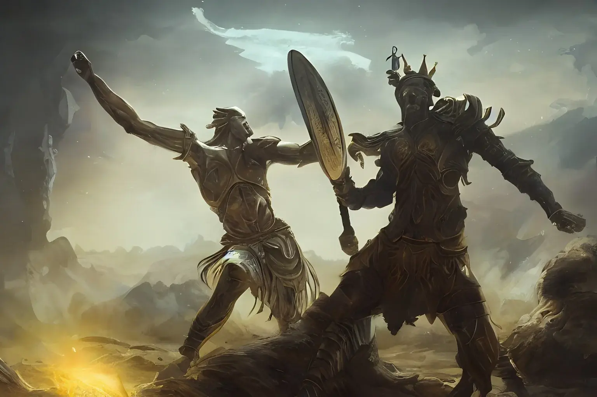
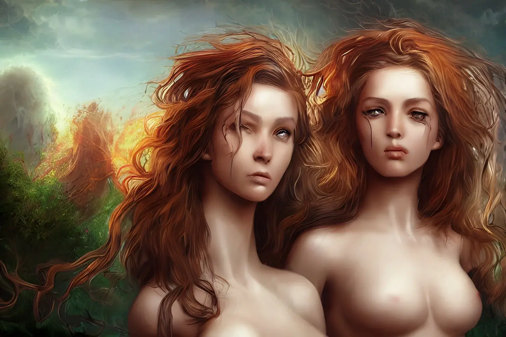
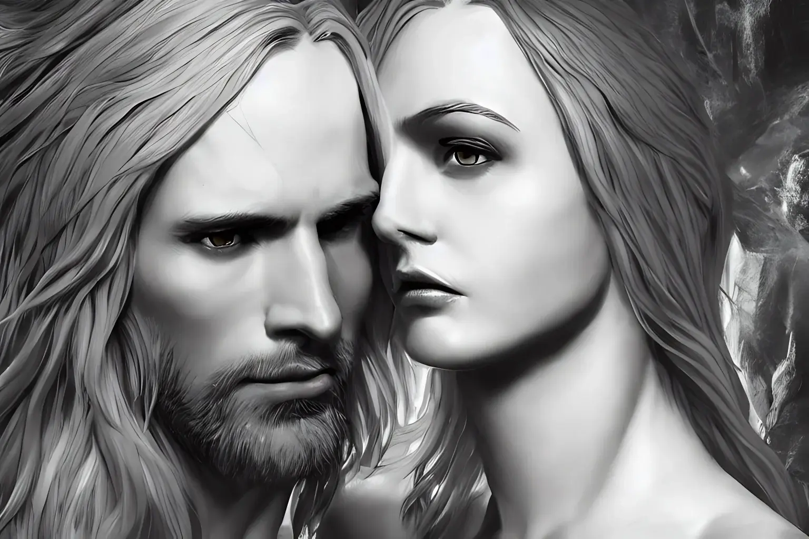

So far I have limited myself to playing with innocuous images. Today I'm curious to test how an Artificial Intelligence behaves with some biblical characters. I'm curious for two reasons. The first, aesthetic, I'm curious to see what it produces from an artistic or pseudo-artistic point of view. The second, I'm curious to see the bias in sacred representation.

I start with **Abraham (אַבְרָהָם)** The first prophet, the first patriarch. His name means "father of many", and he is the founder of the nation of Israel. In this case the AI has decided to represent him as a wise old man, looking towards the future. A serene image.

The case of **Moses (משֶׁה)** is different. Here the AI doesn't have a precise idea and proposes many action scenes. Indeed, the life of this character presents many possibilities of representation.

Now let's move on to **David (דָּוִד)** perhaps the most famous king in the Bible. In this case the bias of Artificial Intelligence is quite evident, in many ways recalling the legends of the Arthurian cycle.

Incidentally, because it's not something I want to talk about right now, the use of images generated by artificial intelligence could become a tool for finding non-immediate connections between different traditions, legends and representations.

.

On the other hand, the choice to represent the clash between David and Goliath as if it were a fantasy battle is curious. Personally I would have bet on an image more similar to _David di Donatello_.

Instead, what really amazed me is the choice to represent **Adam and Eve** as two girls. I have no idea why, also because I am not aware of similar pictorial representations.

Of course, the message that emerges from such a choice is very strong, but I don't think the AI has made a conscious choice. There are probably more images of Eve in his dataset than there are of Adam.

Obviously they are not the only images proposed. For example, this represents a couple formed by a man and a woman.

But… But in all these AI-generated images, there is a huge problem. The Bible is a book that tells the story of a Middle Eastern people. Yet the AI represents all of these characters, with perhaps the exception of Abraham, as Western. A bit like almost all the representations of **Jesus Christ** that we see in Europe.

This experiment highlights this limitation. AI is a powerful tool, and will increasingly be so. But it is not currently a creative tool in the strict sense. It allows you to have a new look, but only starting from old information. And, often, partial and encrusted by centuries or even millennia of prejudices.
