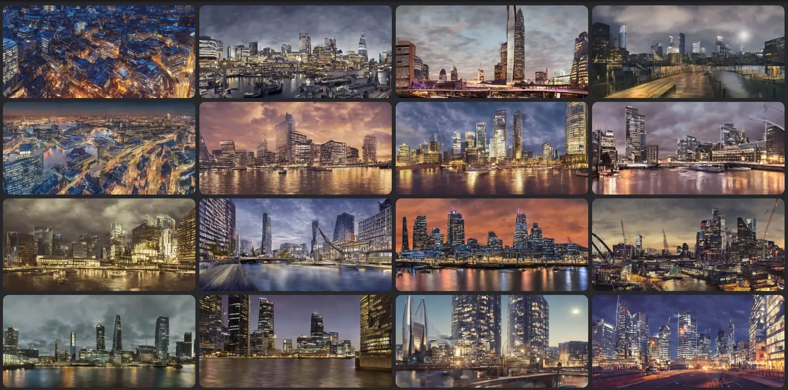
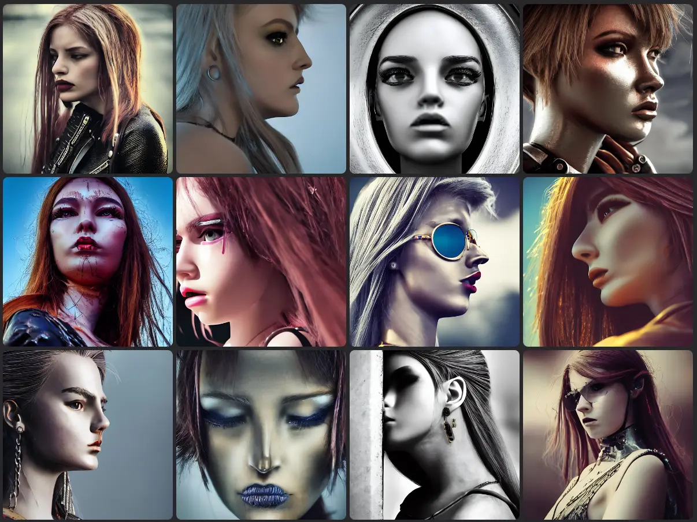
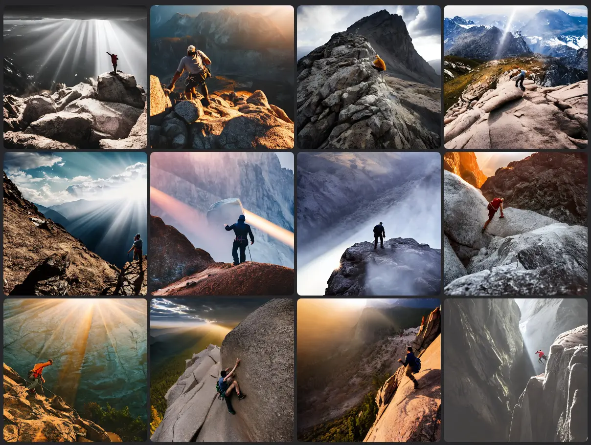
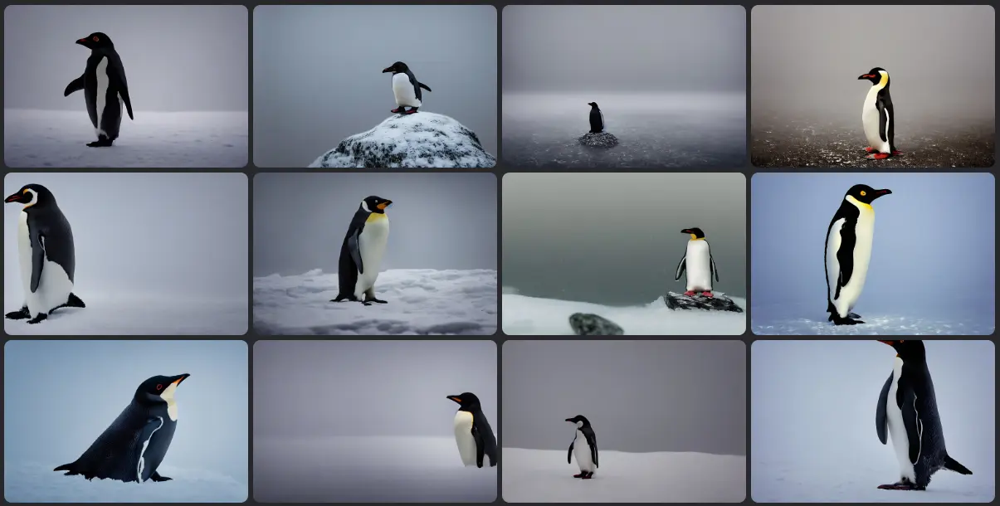

Today I want to understand if adding a focal length to an artificial intelligence prompt can drastically change the result. Spoiler alert: yes. Furthermore, I am interested in understanding how to use this feature to improve images generated with AI. If you like, follow me on this journey.

First, some theoretical notions. I recommend reading [What Is Focal Length in Photography?](https://photographylife.com/what-is-focal-length-in-photography). In summary, the focal length is a number that represents the angle of view of the lens used. The lower it is, the larger the portion of reality that can be immortalized. The higher, the further we can photograph. This graph (which I took from the article I just recommended) explains it well:


Another interesting article, by [The Dark Room](https://thedarkroom.com/focal-length/), publishes this scheme:


### Fish Eye

I can start with a fish eye lens. This lens has a focal length of 8mm. In this case, the lens is much wider than our sight is. This is the result:


### Landscape lenses: 14mm and 28mm

Now I ask the AI to use a 14mm lens. I Use as a prompt:

```
high quality night photograph of docklands in london, dimly lit cirrus clouds, octane render, colorful, architecture photography, 14mm 114°
```


If I change the lens to a 28mm lens I get a similar result:




### Portrait lenses: 35mm, 50mm and 85mm

35, 50 and 85 mm lenses can be used to generate portraits. I have already posted [some examples of portraits](https://medium.com/mlearning-ai/10-ai-prompts-for-realistic-photography-portraits-da5edeacb031). For example, with a 35mm I get results similar to this:



If I use a 50mm lens instead I get this:


With an 85mm lens I get this:


### Sports photo lenses: 135mm, 200mm and 300mm

Generating sporting event images takes a little more work. Or maybe it's just not my favorite field. However, a lens with a focal length of 135mm, 200mm or 300mm can be used. This is the result:

```
Basketball Photography with the Sony 135mm f/1.8 GM
```


```
motocross race on dirt jump, garden of earthly delights painting by jerome bosch, canon 200mm, realistic, detailed, 4k
```


```
a man climbing up a rocky mountain, no ropes, highly cinematic, dramatic, beautiful lighting, god rays, award winning photograph, national geographic, highly detailed, 4k, canon 300mm, f/4
```



### Wildlife and Birds: 400mm e 800mm

Finally I try to generate images of animals and birds. In this case I use a 400mm and 800mm lens.

```
a highly detailed cinematic photograph of a lonely penguin on the north pole, in the morning mist, ultra realistic, beautiful lighting, by annie leibovitz, hasselblad, 400mm, bokeh, photorealistic, hyperrealistic, octane, masterpiece
```



```
photograph of a flying eagle, ultra realistic, beautiful lighting,  hasselblad, 800mm, bokeh, photorealistic, hyperrealistic, octane render, unreal engine
```


Obviously, it is not enough to enter the name of the lens, you must also use a suitable prompt. I suspect that AI image generation follows similar rules to photography. So, in addition to the type of lens, exposure time, depth of field and light also count. I would say that there are still experiments to be done.

Thanks for reading! Stay tuned for more.
