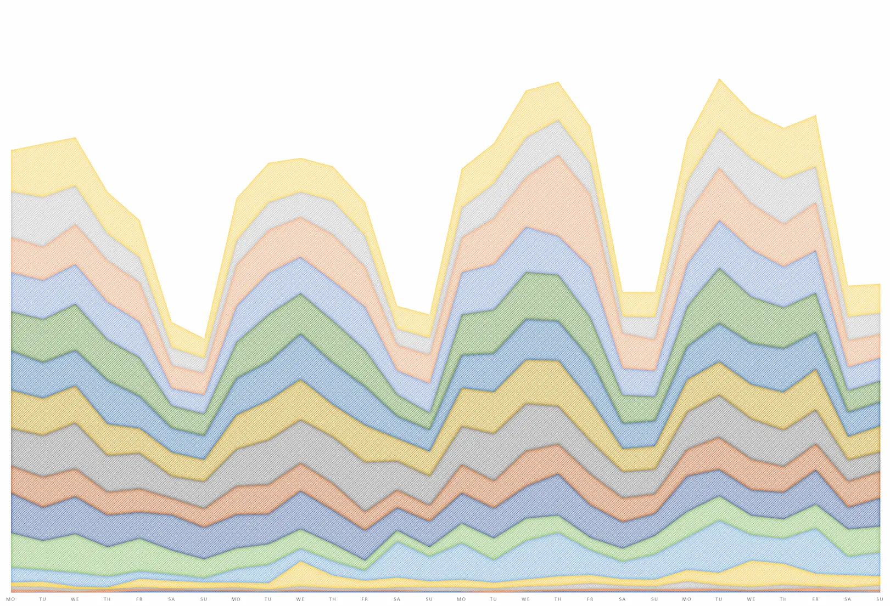

A few days ago, [Attila Vágó](https://attilavago.medium.com/) published an interesting post about the progress of his stories on Medium. According to his experience, there are some [Saturdays that record a peak](https://attilavago.medium.com/saturdays-are-weird-on-medium-31b1fbdf6631) in readers. It is a phenomenon that occurs with a certain regularity, and that also drags Sundays up. Intrigued by this data, I decided to take a look at my statics.

I lined up the various data of the days of the week, dividing them into groups of 4 weeks, starting with my first post (in the summer of 2021). I have not indicated the absolute values, because they do not interest me in this context. However, I must specify that they are much less than those of Attila. Also the quality of his pieces is higher than my posts. This is the chart of the data:

Well, what can I say? In my case there is no anomaly in the progress of the views. They follow a wave pattern, peaking on Wednesday. Over time, the overall views tend to increase, following a trend of their own. They don't seem related to the days of the week in which I publish the articles or even to the number of stories published.

|      |           | Stories | Views |
| ---- | --------- | ------- | ----- |
| 2021 | July      | 4       | 88    |
| 2021 | August    | 0       | 295   |
| 2021 | September | 3       | 330   |
| 2021 | October   | 6       | 790   |
| 2021 | November  | 3       | 2213  |
| 2021 | December  | 18      | 5624  |
| 2022 | January   | 7       | 5424  |
| 2022 | February  | 6       | 5093  |
| 2022 | March     | 0       | 7216  |
| 2022 | April     | 0       | 6758  |
| 2022 | May       | 4       | 7141  |
| 2022 | June      | 0       | 7661  |
| 2022 | July      | 0       | 7521  |
| 2022 | August    | 5       | 8646  |
| 2022 | September | 0       | 6407  |
| 2022 | October   | 7       | 7930  |

It's obviously not a very large sample. And many of the stories were released in December, driven by DevAdvent.

To complicate things a bit are also the topics covered. In recent months I have talked about many things, from JavaScript to Svelte through some reviews. And now I'm focused on how to create images with Artificial Intelligence.

Then nothing. This post is just my note on the Attila hypothesis. This is just my experience, and nothing more.
