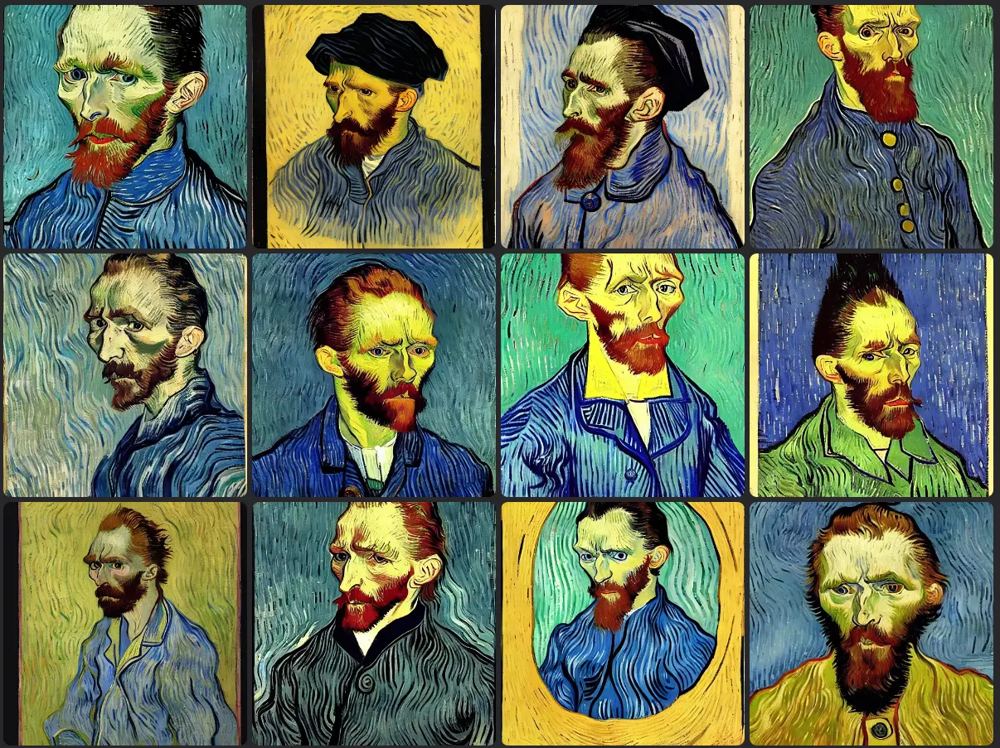

I am aphantasic and I find the generation of images using Artificial Intelligence very interesting. I don't have a lot of expectations about the results that can be achieved. I don't use images to think, so I don't expect a particular result from a specific text prompt. On the other hand, it is interesting to see how AI manages to translate text into images.

Trying and retrying, reading and re-reading, it is easy to see patterns in these image generation systems. One of these is related to using the name of a particular artist to give a specific style to the result. It is a powerful tool, which allows you to obtain very interesting results. But that should be used with some caution.

If you think about it it is quite logical. The dataset used to train these programs is composed of images, and often they are images of famous artists. It is part of the training process that the AI ​​learns to recognize the characteristics of a style. Conversely, using the name of an unknown artist could lead to very different results. And often to something bizarre, not always in a good way.

Let's try an example. This time I want to try to reproduce a portrait of Sherlock Holmes, but based on [Conan Doyle's description](https://www.arthur-conan-doyle.com/index.php/Sherlock_Holmes#Physical_appearance). In this way, the AI ​​has no way of recognizing Holmes's name: so it cannot use his dataset to generate the image. The result is quite interesting.

```
Portrait of a man. He had a tall, gaunt figure made even gaunter and taller by his long grey travelling-cloak and close-fitting cloth cap. He had a dolichocephalic skull with well-marked supra-orbital development. His hair were black.
```


Despite the unsettling result, there is something interesting in these images. But now it's time to experiment with the same prompt, but adding the name of an artist. I begin with one of the most iconic, [Vincent Van Gogh](https://en.wikipedia.org/wiki/Vincent_van_Gogh).

```
Portrait of a man. He had a tall, gaunt figure made even gaunter and taller by his long grey travelling-cloak and close-fitting cloth cap. He had a dolichocephalic skull with well-marked supra-orbital development. His hair were black. By Vincent Van Gogh
```



Well, this Sherlock Holmes is very different from the previous one. It is clear how the artist's name alone is able to completely change the tone of the result.

Let's try another artist, [Pablo Picasso](https://en.wikipedia.org/wiki/Pablo_Picasso)


Again, the style is unquestionably Picasso. But. But it is the most famous Picasso, that of the Cubist period. Adding other terms, such as `Blue Period` or `Rose Period`, does not substantially change the result. The AI ​​is unable to understand that Picasso had multiple different styles, and therefore cannot generate images that are in line with the specified period.


This highlights the limitations of this type of AI well. At the same time, it explains why using prompts well is important.

Let's try another artist, [Claude Monet](https://en.wikipedia.org/wiki/Claude_Monet)


So far we have generated square images. But some artists perform better with taller images. Let's try [Alphonse Mucha](https://en.wikipedia.org/wiki/Alphonse_Mucha), and see what happens.


The result is quite reminiscent of the artist's style. Even with [Osamu Tezuka](https://en.wikipedia.org/wiki/Osamu_Tezuka) I get some good results.


Tim Burton, on the other hand, uses slightly longer images well


But what if we try to use an important but not so famous artist? I try with [Hugo Pratt](https://en.wikipedia.org/wiki/Hugo_Pratt)


In this case the result is not satisfactory at all.

So, to conclude: adding an artist name to the text prompt to generate images with AI is a great idea. But the AI ​​cannot recognize all artists. And, above all, he still cannot differentiate between the various styles that an artist goes through in the course of his artistic life.

Thanks for reading! Stay tuned for more.
