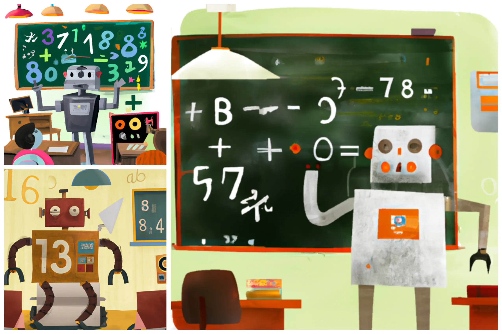
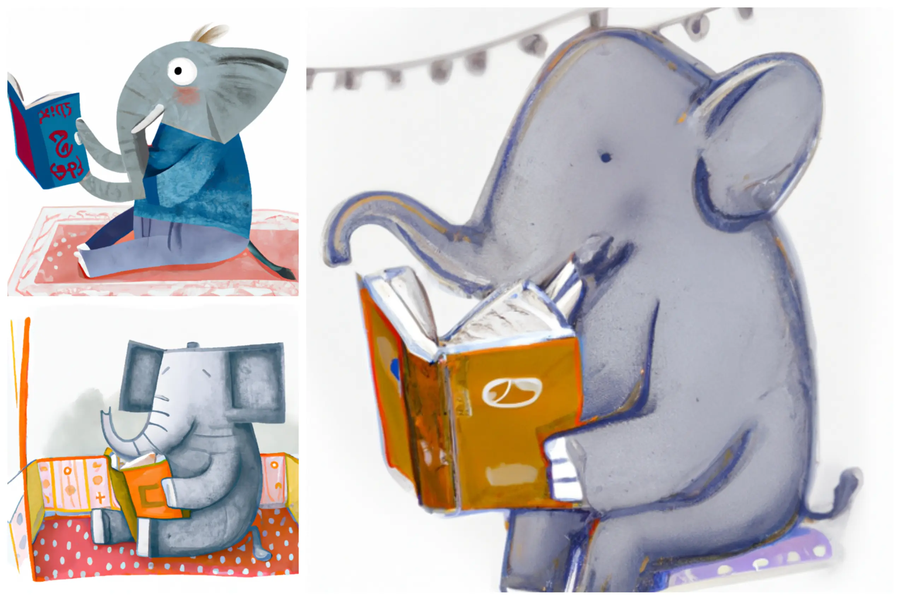
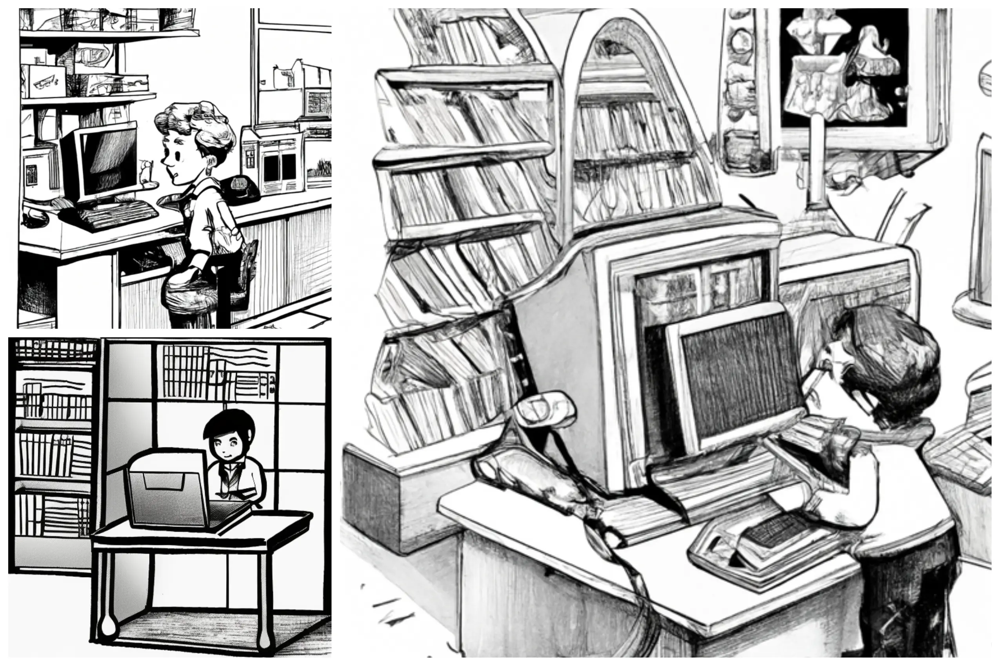
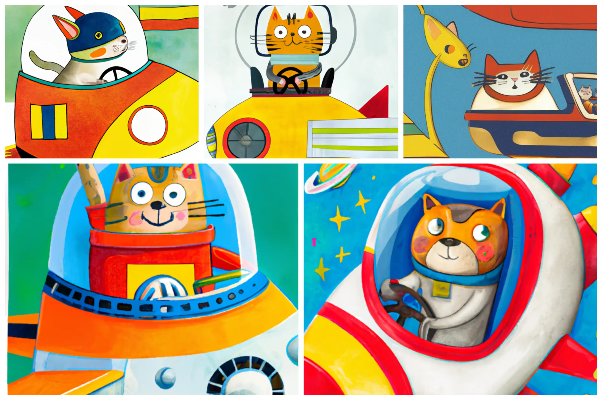
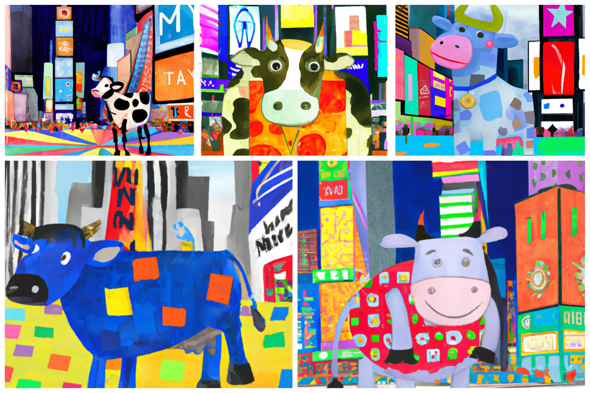
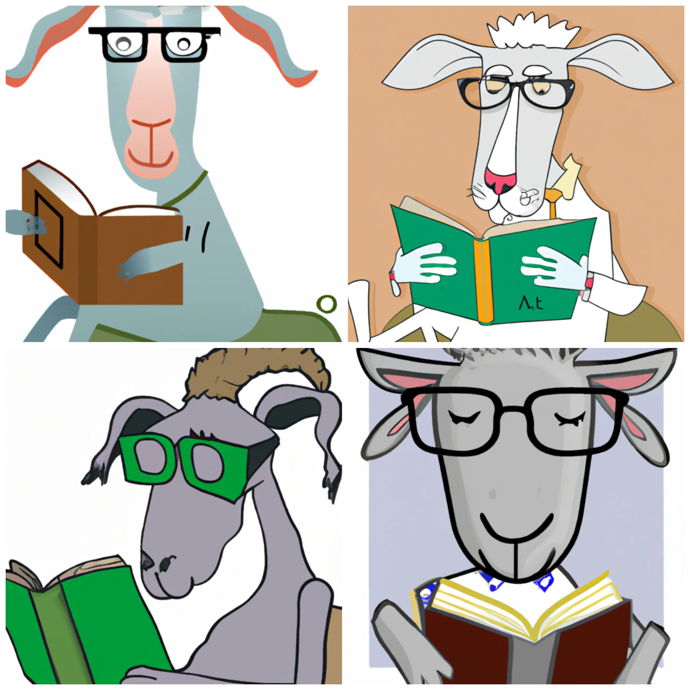
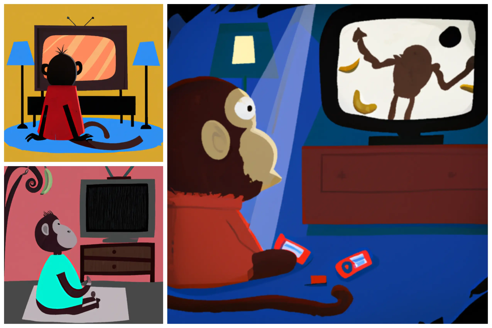
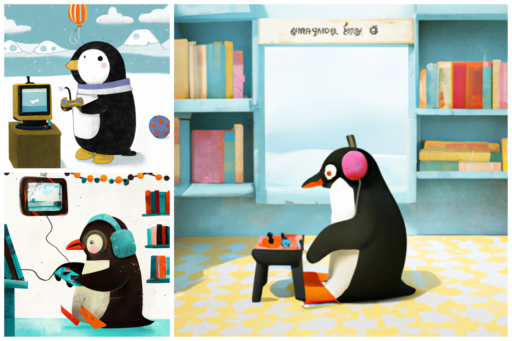
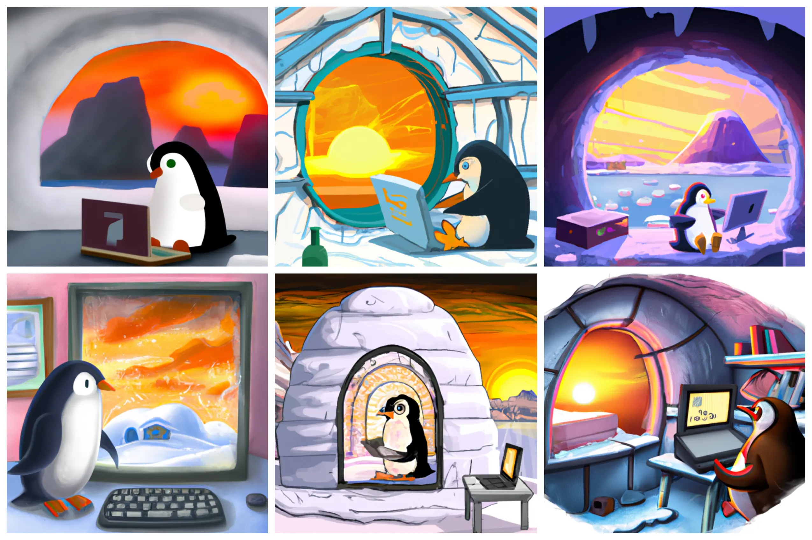

For several weeks now, I have been using images generated by Artificial Intelligences to illustrate my articles. I have realized that I prefer colorful images with a kawaii style. Based on this assumption, I wondered if there was another style that suited me. I therefore decided to explore the world of children's book illustrators a bit. In this post, I report on my experiments, hoping that they may be useful to someone.

### Who are the most famous children's illustrators?

I must admit that I am not an expert. In fact, I am definitely out of my comfort zone. But by searching online, I found some lists. So I can report the names of some illustrators who seemed the most interesting to me:

1. Jon Klassen
2. Toni Pagot
3. John Tenniell
4. Richard Scarry
5. Eric Carle
6. Mo Willems
7. Chris Haughton
8. Oliver Jeffers

Well, now I have a list of artists to take inspiration from.

### Jon Klassen

link to [Wikipedia](https://en.wikipedia.org/wiki/Jon_Klassen)



```
a robot teaching math in a classroom, children book illustration, in the style of Jon Klassen
```

### Toni Pagot

link to [Wikipedia](https://en.wikipedia.org/wiki/Toni_Pagot)

```
an elephant reading a book, children book illustration, in the style of Toni Pagot
```



### John Tenniel

link to [Wikipedia](https://en.wikipedia.org/wiki/John_Tenniel)

```
boy in computer store, children book illustration, in the style of John Tenniel
```



### Richard Scarry

link to [Wikipedia](https://en.wikipedia.org/wiki/Richard_Scarry)

```
a cat driving a spaceship, children book illustration, in the style of Richard Scarry
```



### Eric Carle

link to [Wikipedia](https://en.wikipedia.org/wiki/Eric_Carle)

```
a cow in times square, children book illustration, in the style of Eric Carle
```



### Mo Willems

link to [Wikipedia](https://en.wikipedia.org/wiki/Mo_Willems)

```
a goat with glasses reading a book, children book illustration, in the style of Mo Willems
```



### Chris Haughton

link to his [blog](https://www.chrishaughton.com/blog)

```
a monkey watching the tv, children book illustration, in the style of Chris Haughton
```



### Oliver Jeffers

link to [Wikipedia](https://en.wikipedia.org/wiki/Oliver_Jeffers)

```
a penguin playing videogame, children book illustration, in the style of Oliver Jeffers
```



### Conclusion

These are the images I got from my experiments. The interesting thing is that the style recalls, more or less, the style by the original illustrators. However, I’m not completely satisfied. Some of the pictures are fascinating but not all of them. I think there is much to improve, starting with the prompts. For example, if I choose an in-depth prompt, I get more intriguing images:

```
A penguin is drawing on a computer with Photoshop, in an ice igloo, with a window showing a sunset. Children book illustration, in the style of Oliver Jeffers
```


