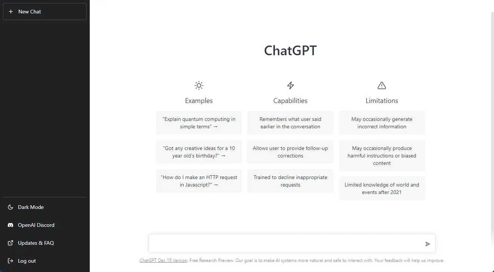
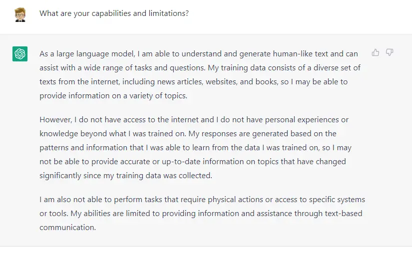
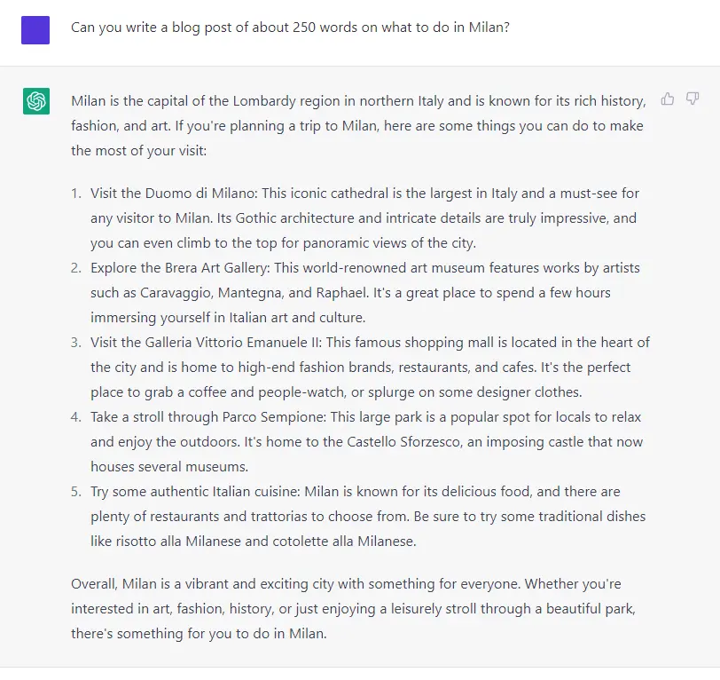
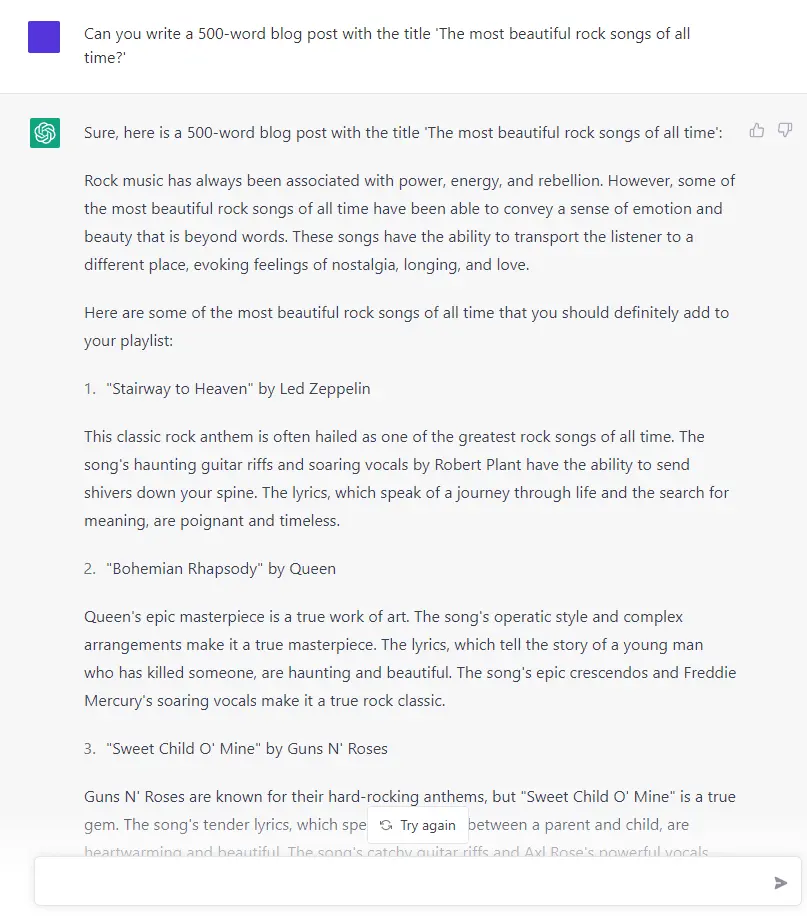
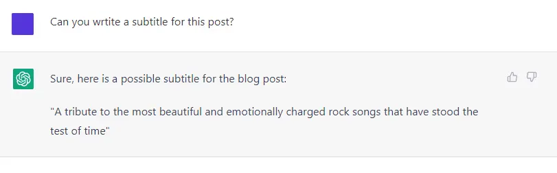
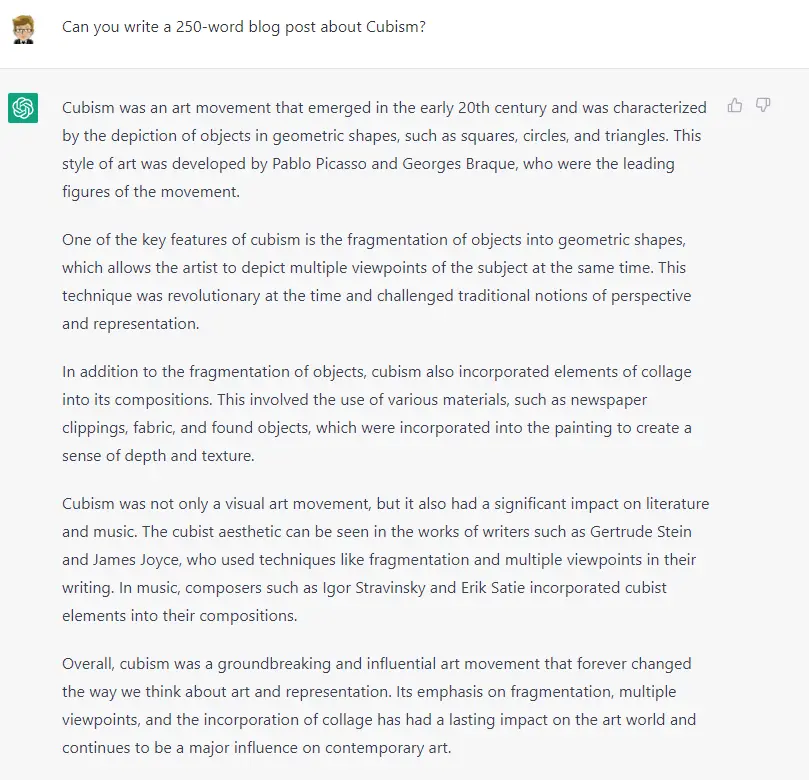

For a few days I have been trying [ChatGPT](https://chat.openai.com/), an artificial intelligence trained by OpenAI. It differs from other AI in two aspects. First, it is a system designed to work like a chat. And then, even more importantly, it really works well. Maybe too well, to be honest. But let's go in order and start with the user interface.



The interface is very simple. On the left there are some buttons. The most important one is the first one, with the label "New Chat". The main part of the screen looks very much like a chat. There is a box where we can write our message. After writing it, we can send it using the Enter button or by clicking on an icon.

After writing the message, ChatGPT begins to respond, just like a real chat.


### Capabilities and limitations

When starting a new conversation, there are some brief information about how ChatGPT works:

**Capabilities**

- Remembers what user said earlier in the conversation
- Allows user to provide follow-up corrections
- Trained to decline inappropriate requests

**Limitations**

- May occasionally generate incorrect information
- May occasionally produce harmful instructions or biased content
- Limited knowledge of world and events after 2021

But we can also ask the AI ​​directly. For example, we can ask it to tell us about itself. And it will do it, in a very human way.



```
As a large language model, I am able to understand and generate human-like text and can assist with a wide range of tasks and questions. My training data consists of a diverse set of texts from the internet, including news articles, websites, and books, so I may be able to provide information on a variety of topics.

However, I do not have access to the internet and I do not have personal experiences or knowledge beyond what I was trained on. My responses are generated based on the patterns and information that I was able to learn from the data I was trained on, so I may not be able to provide accurate or up-to-date information on topics that have changed significantly since my training data was collected.

I am also not able to perform tasks that require physical actions or access to specific systems or tools. My abilities are limited to providing information and assistance through text-based communication.
```

This answer adds some additional limitations to ChatGPT:

- It cannot access the internet
- It has a limited set of knowledge (but we already knew that)
- It cannot perform actions in the physical world (so we're not yet at the robot uprising :D)

### The test

I have already done some testing with this AI. But for this review, I want to replicate the requests I made to [Article Forge](https://medium.com/data-driven-fiction/article-forge-review-of-the-article-generator-7ff8616e8914). So I will try to have some posts written with these titles:

1. What To Do In Milan
2. The Best Rock Songs
3. The Cubism
4. Story of a Brigand and a Canary

I will add another type of test, but we will talk about it at the end. Let's start with the first test.

### Test 1: What To Do In Milan

In the first test, I want to get a short guide to Milan. I'm interested in a short post, about 250 words. Setting the length can be a problem (Article Forge allows you to do it easily) but I still want to try.

So I ask ChatGPT:

"Can you write a blog post of about 250 words on what to do in Milan?"

And it responds:



Well, the result is more than good. I like how ChatGPT wrote the post, and the fact that it treated it like a list. The writing is good and the information is not banal. I like the suggestion of Parco Sempione.

It's time to move on to the second test.

### Test 2: The Best Rock Songs

The second test involves an evaluation of the best rock songs of all time. Article Forge has written a trivial and essentially off-topic piece. I'm curious to see what ChatGPT comes up with.

Therefore, I ask the AI:

"Can you write a 500-word blog post with the title 'The most beautiful rock songs of all time?'"



The result is very interesting. But I can't fit it into a screenshoot. So I copied the result into a new post:

- [The Most Beautiful Rock Songs of All Time](https://el3um4s.medium.com/the-most-beautiful-rock-songs-of-all-time-5006eae96508)

I also added a subtitle and an explanation. Of course, I had ChatGPT do everything.



The images, on the other hand, are the result of [Lexica Art](https://medium.com/data-driven-fiction/lexica-art-how-to-search-and-create-images-with-artificial-intelligence-58ca51e63394). I didn't generate them myself, I drew from the vast library available on that site.

### Test 3: The Cubism

The third test for ChatGPT involves another generic post. But unlike the first two, this one has a more rigorous foundation. I am asking the AI to talk to me about Cubism in about 250 words:

"Can you write a 250-word blog post about Cubism?"



### Test 4: Story of a Brigand and a Canary

The fourth test is a piece of fictional text based on an absurd, illogical, almost nonsensical prompt:

"Can you write a short story post about a story of a brigand and a canary?"

ChatGPT wrote a fairy tale. I must admit that it is a beautiful fairy tale for children. I published it in a separate post, and I added some images to it. The images were also created using artificial intelligence (in this case it was Jasper).

- [The Brigand and the Canary: A tale of redemption and friendship](https://medium.com/@el3um4s/the-brigand-and-the-canary-55e0329099e4)

Out of all the tests, I think this is the most successful one. The fairy tale of the Brigand and the Canary has a coherent narrative. It has a happy ending. And it even has a moral.

### Other tests

In these days I have used ChatGPT several times. I put this Artificial Intelligence to the test even with more technical issues. I asked the AI to solve some programming questions, with alternating results. I have talked about it in detail in the various DevAdvent 2022 posts of the last week

- [Dev Advent Calendar](https://el3um4s.medium.com/list/dev-advent-calendar-89d163132d6e)

In this case, the result of the tests is objectively measurable. The answer is either right or wrong. _Tertium non datur_.

The answers were always plausible but not always correct. Which leads me to the conclusions of this review.

### Conclusions

The result is undoubtedly positive. ChatGPT is the state of the art of Artificial Intelligences capable of creating and processing texts. But it is not perfect.

There are limits in understanding the text, there are limits in processing the answers. But they are always plausible answers. This forces us to a detailed and thorough review of the produced text.

But ChatGPT's limitations also illustrate its main advantage well: being a valid assistant. At this level, this technology can be the ultimate virtual assistant. With the caution of not taking everything as absolute truth.

And what will I do? Will I continue to use this technology? I don't know yet, ChatGPT is currently free, but it won't always be. It will depend a lot on the price that will be proposed.
