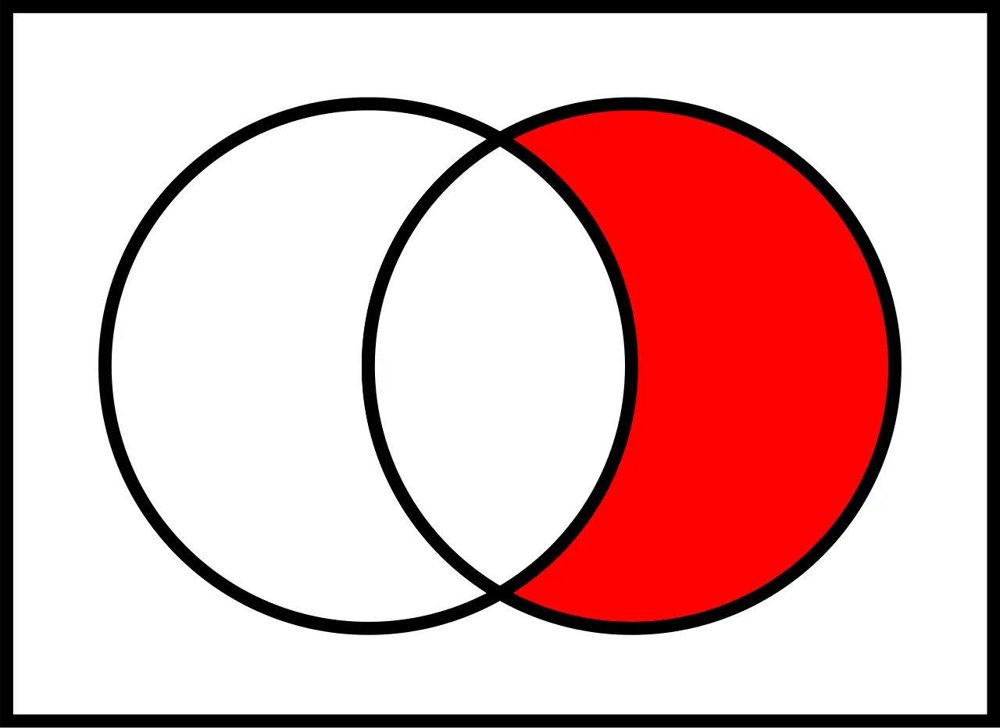
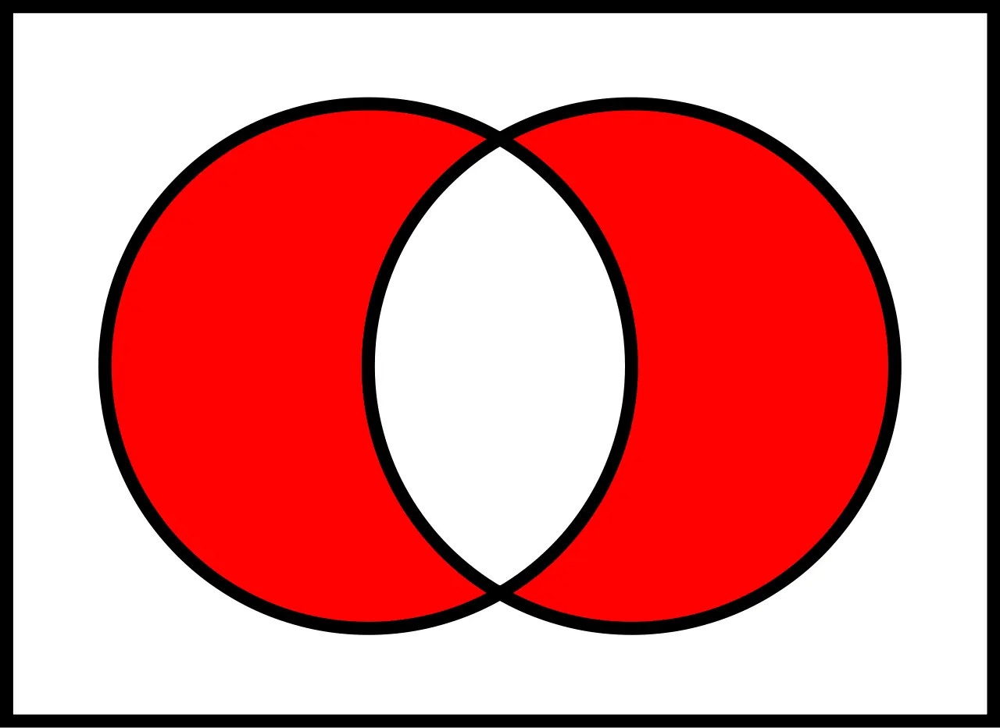
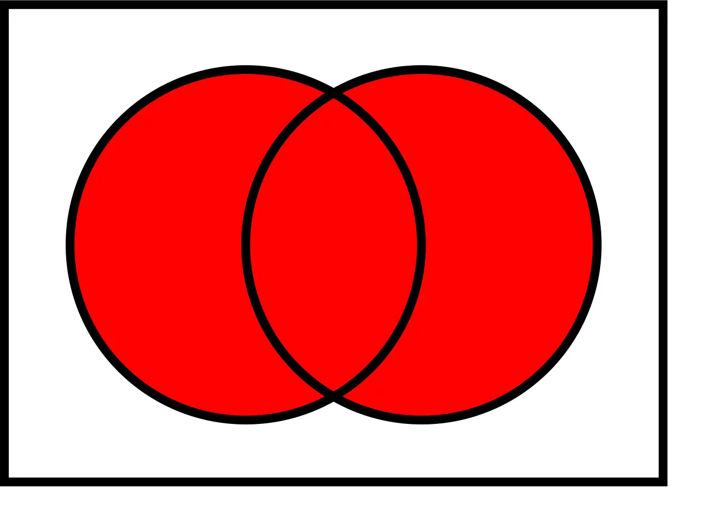

Today's DevAdvent 2022 issue is about set theory. Given two arrays of elements, how do I find their difference? There is a very easy way to do this. And also to do the intersection of two arrays and to calculate their geometric difference.

### The Problem: Array.diff()

link to the [Kata](https://www.codewars.com/kata/523f5d21c841566fde000009)

Your goal in this kata is to implement a difference function, which subtracts one list from another and returns the result.

It should remove all values from list `a`, which are present in list `b` keeping their order.

```js
array_diff({1, 2}, 2, {1}, 1, *z) == {2} (z == 1)
```

If a value is present in b, all of its occurrences must be removed from the other:

```js
array_diff({1, 2, 2, 2, 3}, 5, {2}, 1, *z) == {1, 3} (z == 2)
```

### Array.diff(): `A \ B` (also written `A − B`)



But let's start with the basic problem. To solve it I start from the [Wikipedia definition](<https://en.wikipedia.org/wiki/Set_(mathematics)>) of difference between sets:

Given any two sets `A` and `B`, the set difference `A \ B (also written A − B)` is the set of all things that belong to `A` but not `B`. Especially when `B` is a subset of `A`, it is also called the relative complement of `B` in `A`.

I can translate this definition into an algorithm:

- for each element of A
- check if it belongs to B
- if it doesn't belong to B, go to the next element
- if it belongs to B, I delete it from A

I can also rewrite it in the form:

- filter every element of A that does not belong to B

At this point I have everything I need. I can use [Array.filter()](https://developer.mozilla.org/en-US/docs/Web/JavaScript/Reference/Global_Objects/Array/filter) method to select values. And decide to filter all values based on the result of [Array.includes()](https://developer.mozilla.org/en-US/docs/Web/JavaScript/Reference/Global_Objects/Array/includes) method:

```ts
export const arrayDiff = (a: number[], b: number[]): number[] =>
  a.filter((x) => !b.includes(x));
```

### Array.intersect(): `A ∩ B`



After solving the basic problem, I can have fun and try adding more operations with arrays and sets. Pass at the intersection of the sets:

Given any two sets `A` and `B`, their intersection `A ∩ B` is the set of all things that are members of both `A` and `B`. If `A ∩ B = ∅`, then A and B are said to be disjoint.

I can translate this definition into an algorithm:

- for each element of A
- check if it belongs to B
- if it doesn't belong to B, I delete it from A
- if it belongs to B, go to the next element

I can also rewrite it in the form:

- filter every element of A that does belong to B

```ts
export const arrayIntersect = (a: number[], b: number[]): number[] =>
  a.filter((x) => b.includes(x));
```

### Array.union(): `A ∪ B`



Joining two sets is a simple problem in JavaScript. But before the solution, the definition:

Given any two sets `A` and `B`, their union `A ∪ B` is the set of all things that are members of `A` or `B` or both.

In this case there is the [Array.concat()](https://developer.mozilla.org/en-US/docs/Web/JavaScript/Reference/Global_Objects/Array/concat) method which allows you to join two arrays:

```ts
export const arrayUnion = (a: number[], b: number[]): number[] => a.concat(b);
```

### Array.symDiff(): `A Δ B`


The next operation is the symmetric difference. Wikipedia defines it like this:

Given any two sets `A` and `B`, their symmetric difference `A Δ B` is the set of all things that belong to A or B but not both. One has to be a member of A and not a member of B, or a member of B and not a member of A: `A Δ B = (A \ B) ∪ (B \ A)`.

In fact it is an operation composed of two different ones. I can write it like this:

```ts
export const arraySymDiff = (a: number[], b: number[]): number[] =>
  arrayUnion(arrayDiff(a, b), arrayDiff(b, a));
```

Or if I prefer to use an extended notation:

```ts
export const arraySymDiff = (a: number[], b: number[]): number[] =>
  a.filter((x) => !b.includes(x)).concat(b.filter((x) => !a.includes(x)));
```

### Array.cartesian(): `A × B`

The last operation to deal with is the Cartesian product of two arrays. Wikipedia defines it like this:

Given any two sets `A` and `B`, their cartesian product `A × B` is the set of all ordered pairs `(a,b)` such that `a` is an element of `A` and `b` is an element of `B`.

In other words, it is an operation that allows you to generate all possible pairs of the elements of two arrays.

I can solve the problem with a function like this:

```ts
export const arrayCartesian = (a: number[], b: number[]): number[][] =>
  a.map((x) => b.map((y) => [x, y])).flat();
```

Or with this:

```ts
const arrayCartesian = (a: number[], b: number[]): number[][] =>
  a.reduce((p, x) => [...p, ...b.map((y) => [x, y])], []);
```

### Conclusion


Finally I can add these functions to the prop. This way I can use them directly with each array:

```ts
Array.prototype.diff = function (arr2) {
  return this.filter((x) => !arr2.includes(x));
};
Array.prototype.intersect = function (arr2) {
  return this.filter((x) => arr2.includes(x));
};
Array.prototype.union = function (arr2) {
  return this.concat(arr2);
};
Array.prototype.symDiff = function (arr2) {
  return this.diff(arr2).concat(arr2.diff(this));
};
Array.prototype.cartesian = function (arr2) {
  return this.reduce((p, x) => [...p, ...arr2.map((y) => [x, y])], []);
};

[1, 2, 3].diff([2, 3]);
[1, 2, 3].intersect([2, 3]);
[1, 2, 3].union([2, 3]);
[1, 2, 3].symDiff([2, 3]);
[1, 2, 3].cartesian([2, 3]);
```
