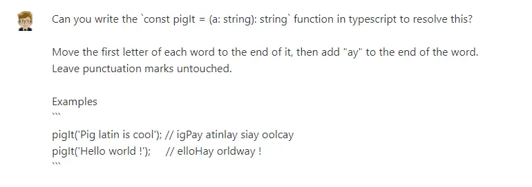
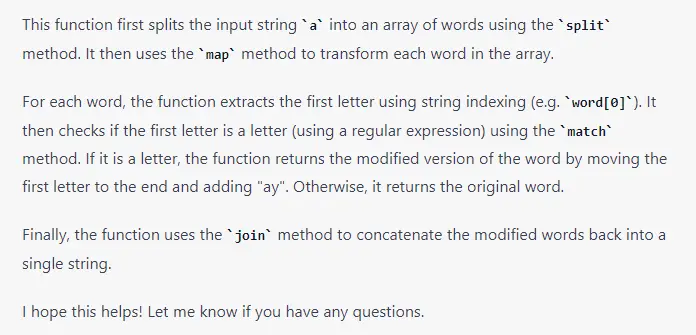
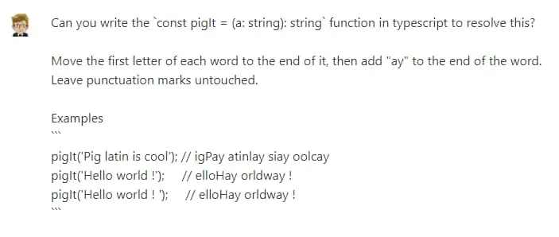
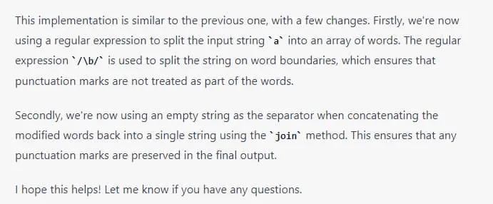

The problem for today's DevAdvent 2022 is about [Pig Latin](https://en.wikipedia.org/wiki/Pig_Latin). But what is Pig Latin? It is a playful language, used among English-speaking children. To me, a native Italian speaker, it is a simplified version of the [Farfallino Alphabet](https://en.wikipedia.org/wiki/Farfallino_alphabet). But beyond the childhood games, the interesting thing about this problem is the need to handle individual words within a sentence. The sentence does not necessarily have to be coherent. But let's start with the text of the problem.

### Understanding the Pig Latin Translation Rules

link to the [Kata](https://www.codewars.com/kata/520b9d2ad5c005041100000f)

Move the first letter of each word to the end of it, then add `ay` to the end of the word. Leave punctuation marks untouched.

Examples

```
pigIt('Pig latin is cool'); // igPay atinlay siay oolcay
pigIt('Hello world !');     // elloHay orldway !
```

### My Solution: Splitting and Reassembling Words for Pig Latin Translation


2. Then I modify each word by moving the first letter to the last position and adding ay
3. Finally, I join the various elements of the array to obtain a text string

In this way I get a (wrong) function similar to this:

```ts
export const pigIt = (a: string): string =>
  a
    .split(" ")
    .map((w) => w.slice(1, w.length) + w[0] + "ay")
    .join(" ");
```

This function transforms every word, including those made up of punctuation only. In the problem's requirements it is specified not to transform punctuation marks. I can therefore use the regex `/\W+/` to check if the word contains non-alphanumeric symbols.

After adding this condition, there is a problem. Although the text of the problem does not explain it, there are some special cases in the tests. One is fairly obscure and causes the function to fail when the sentence ends with a white space. To solve this specific case, I added a second condition, `w == ''`.

I admit I am not satisfied with this workaround, but now the function does its job.

```ts
export const pigIt = (a: string): string =>
  a
    .split(" ")
    .map((w) =>
      !!w.match(/\W+/) || w == "" ? w : w.slice(1, w.length) + w[0] + "ay"
    )
    .join(" ");
```

Fortunately, in the solutions there is someone who found a more elegant way to solve the question.

### Replacing All Words in a Sentence with the Best Solution

 => a.replace(/(\w)(\w+)*/g, "$2$1ay");
```

After seeing it, I realized how naive and off track my solution was. Instead of treating the string as an array, it is smarter to treat it as a... string!

The idea behind this solution is the use of [groups in regular expressions](https://developer.mozilla.org/en-US/docs/Web/JavaScript/Guide/Regular_Expressions/Groups_and_Backreferences). In practice, I use the expression `/(\w)/` to capture the first letter in a group, which is automatically identified with the number `1`.

Then I add a second group `/(\w+)/` that identifies all the subsequent alphabetical letters (the words). This second group becomes number `2`.

Finally, I use this expression together with the String.replace() method. I can reverse the two groups using their names: `$2$1`. And if I add `ay` I get the complete word in pig alphabet.

If I finally add an asterisk (`*`) to the regular expression, I can automatically perform the same operation for all the words in a sentence.

It is really a simple and elegant solution, and I would really have liked to have been able to discover it on my own. But I am happy to have learned something new.

### Comparing Human and AI Approaches to Pig Latin Translation


These days I am testing ChatGPT, an Artificial Intelligence capable of solving various problems. So I tried to ask ChatGPT for the solution to the problem.

This is its response:



```ts
function pigIt(a: string): string {
  return a
    .split(" ")
    .map((word) => {
      const firstLetter = word[0];
      if (firstLetter.match(/[a-zA-Z]/)) {
        return word.slice(1) + firstLetter + "ay";
      } else {
        return word;
      }
    })
    .join(" ");
}
```



But the solution is wrong.

I tried rephrasing the question by adding the borderline case. ChatGPT responded like this:



```ts
function pigIt(a: string): string {
  return a
    .split(/\b/)
    .map((word) => {
      const firstLetter = word[0];
      if (firstLetter.match(/[a-zA-Z]/)) {
        return word.slice(1) + firstLetter + "ay";
      } else {
        return word;
      }
    })
    .join("");
}
```



On the second try, the solution is correct. I don't think it's the best solution, but it's still a correct answer.
