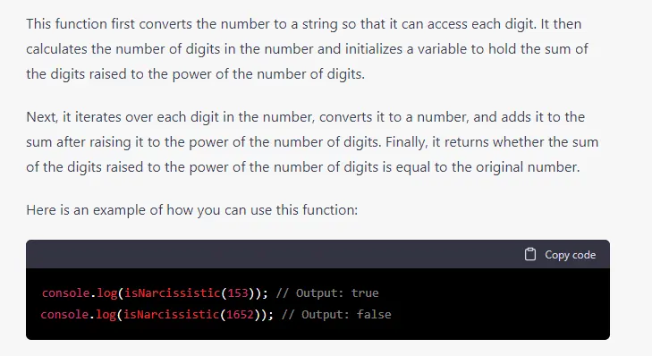

We are approaching Christmas, and therefore the end of DevAdvent. Today's exercise also involves math and the properties of numbers. I must say that I am pleasantly surprised by the variety of math problems that CodeWars offers. It also allows me to discover many new things, for example, [Narcissistic Numbers](https://en.wikipedia.org/wiki/Narcissistic_number). But let's start as usual with the text of the problem.

### The problem: Does my number look big in this?

link to the [Kata](https://www.codewars.com/kata/5287e858c6b5a9678200083c)

A Narcissistic Number (or Armstrong Number) is a positive number which is the sum of its own digits, each raised to the power of the number of digits in a given base. In this Kata, we will restrict ourselves to decimal (base 10).

For example, take 153 (3 digits), which is narcissistic:

```
1^3 + 5^3 + 3^3 = 1 + 125 + 27 = 153
```

and 1652 (4 digits), which isn't:

```
1^4 + 6^4 + 5^4 + 2^4 = 1 + 1296 + 625 + 16 = 1938
```

**The Challenge:**

Your code must return true or false (not 'true' and 'false') depending upon whether the given number is a Narcissistic number in base 10. This may be True and False in your language, e.g. PHP.

Error checking for text strings or other invalid inputs is not required, only valid positive non-zero integers will be passed into the function.

### My solution


The thing I like most about this type of problem is the ability to easily break them down from the mathematical definition. So, I start from Wikipedia:

```
In number theory, a narcissistic number (also known as a pluperfect digital invariant (PPDI), an Armstrong number (after Michael F. Armstrong) or a plus perfect number) in a given number base b is a number that is the sum of its own digits each raised to the power of the number of digits.
```

Therefore, the steps to be taken are:

1. Divide the number into digits
2. Calculate the number of digits in the number
3. Raise each digit to a power
4. Add up the various results

The last step is a simple comparison between the obtained number and the starting number. If the two numbers are identical then the number is a narcissistic number.

Translating all this into JavaScript, I get the function I was looking for:

```ts
export const narcissistic = (n: number): boolean =>
  [...`${n}`].map(Number).reduce((a, x) => a + x ** `${n}`.length, 0) === n;
```

Going through the 5 steps again, to divide the number into digits I use the formula:

```ts
const digits: number[] = [...`${n}`].map(Number);
```

To calculate the number of digits in a number, I can calculate the length of the string for the number itself (provided that the number is positive):

```ts
const exponent: number = `${n}`.length;
```

To calculate the power of a number, I use the [Exponentiation operator](https://developer.mozilla.org/en-US/docs/Web/JavaScript/Reference/Operators/Exponentiation) (`**`)

```ts
const power: number = x ** exponent;
```

Finally, I use the [Array.reduce()](https://developer.mozilla.org/en-US/docs/Web/JavaScript/Reference/Global_Objects/Array/reduce) method to calculate the sum of the powers.

```ts
const sum: number = digits.reduce((a, x) => a + x ** exponent, 0);
```

I can combine the various operations into one, and thus obtain the solution to the problem:

```ts
export const narcissistic = (n: number): boolean =>
  [...`${n}`].map(Number).reduce((a, x) => a + x ** `${n}`.length, 0) === n;
```

Or I can write the same thing in an extended way. The result is longer but also more readable:

```ts
export function narcissistic(n: number): boolean {
  const digits: number[] = [...`${n}`].map(Number);
  const exponent: number = digits.length;
  const pow = (x: number) => x ** exponent;
  const sum: number = digits.reduce((a, x) => a + pow(x), 0);

  const result: boolean = sum === n;
  return result;
}
```

### The AI Solution


I asked ChatGPT (one of the most advanced Artificial Intelligences available) to solve the same problem. This is its solution:


```ts
function isNarcissistic(num: number): boolean {
  // Convert the number to a string so that we can access each digit
  const numStr = num.toString();

  // Calculate the number of digits in the number
  const numDigits = numStr.length;

  // Initialize a variable to hold the sum of the digits raised to the power of the number of digits
  let sum = 0;

  // Iterate over each digit in the number
  for (const digit of numStr) {
    // Convert the digit to a number and raise it to the power of the number of digits
    sum += Math.pow(parseInt(digit, 10), numDigits);
  }

  // Return whether the sum of the digits raised to the power of the number of digits is equal to the original number
  return sum === num;
}
```



The solution is correct, although not very elegant. However, compared to the tests of the past few days, today ChatGPT provided a correct answer on the first attempt.
