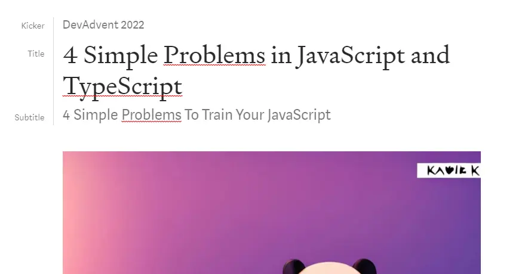
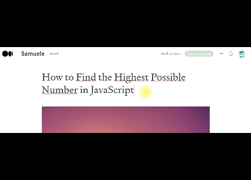
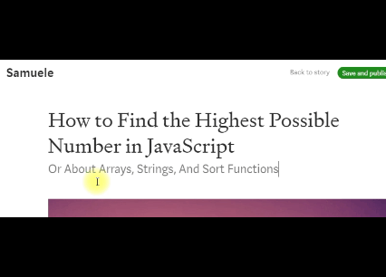

Today I want to bring back some advice I found on Medium regarding... Medium. I know, it's a bit meta, but I think it's worth it. They concern two aspects: how to format title, subtitle and kicker.

But before we begin, I must give credit where credit is due. The information I report here is taken from a posts by [Casey Botticello](https://caseybotticello.medium.com/):

- [Medium Titles, Subtitles, and Kickers](https://medium.com/blogging-guide/medium-titles-subtitles-and-kickers-ce28a5700487)

I also recommend reading these two other articles, also on Medium:

- [Medium Writing Stats Explained](https://medium.com/blogging-guide/medium-writing-stats-explained-4747c913671c)
- [How is Medium Article Read Time Calculated?](https://medium.com/blogging-guide/how-is-medium-article-read-time-calculated-924420338a85)

### Title, subtitle and kicker

That said, let's start with the first thing you see about a post: the title. But besides these there are 2 other important elements in the header of a story: the subtitle and the kicker.



Entering the title is easy. Just write it on the first line of the post and you're done.

As for the subtitle, an additional operation is required. First we write the text just below the title. Then we select the writing and wait for the editor bar to appear. Then click on the smaller `T`.



John defines the kicker like this:

```text
A kicker is a short phrase that precedes the title of the article. Kickers can be used as hooks or to further explain titles and they can be used to present a section or classification of content.
```

Adding a kicker is less intuitive. We need to place the cursor in front of the title. Then press the enter key. In the new line we write the text (short tip) and then we select it. Then click the smaller `T` again in the Medium editor.


